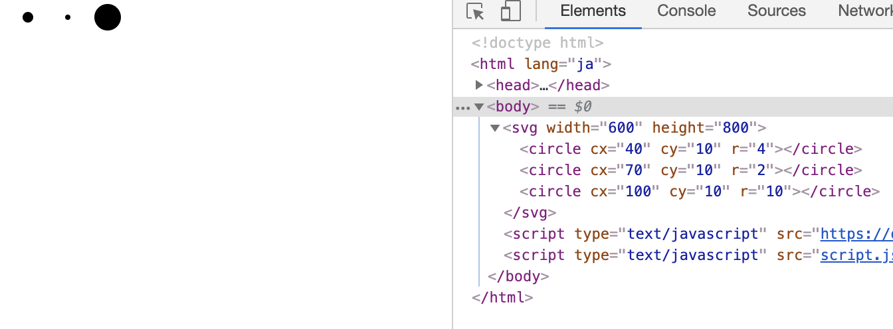
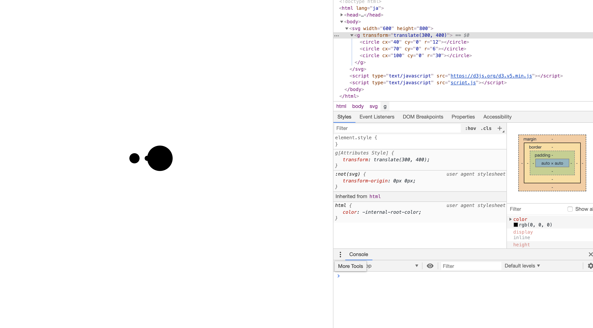
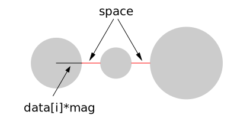
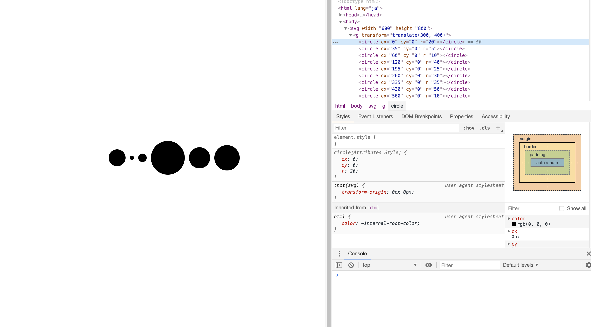
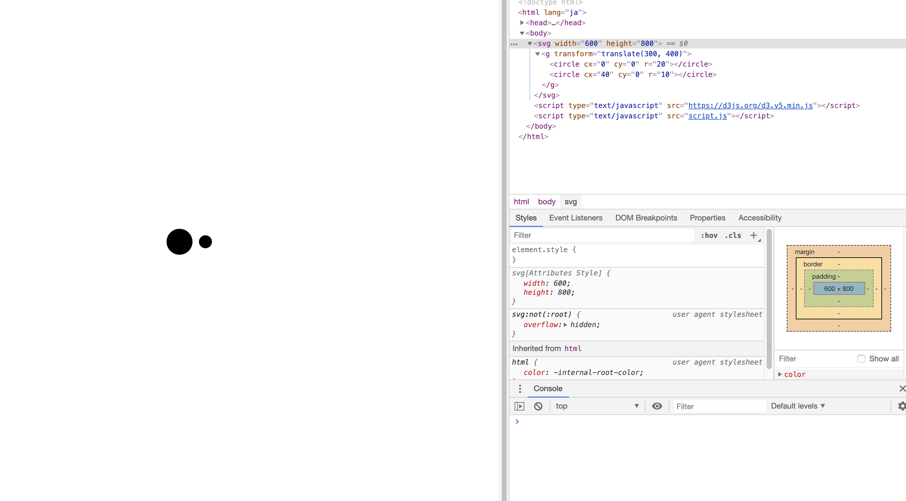

<!-- theme: uncover -->
<link rel="stylesheet" href="../theme/mytheme.css">

# D3js Part1
# Understanding Concept


## お約束 - index.html
```html
<!DOCTYPE html>
<html lang="ja">
  <head>
    <meta charset="utf-8">
    <link rel="stylesheet" href="style.css">
  </head>
  <body>
    <svg>
    </svg>
    <script src="https://d3js.org/d3.v5.min.js"></script>
    <script src="script.js"></script>
  </body>
</html>
```


HTMLをここに載せるときのお約束
- 基本的にはbody部のみ
- 場合によってはscriptタグ省略


## Case 1 - タグ用意

```html
<svg>
  <circle></circle>
  <circle></circle>
  <circle></circle>
</svg>
```

- データ[4, 2, 10]とcircleを結びつけたい
- circleの半径をデータの値にしたい
- circleを横並びにしたい


## script.js 

```js
const [svgWidth, svgHeight] = [600, 800];
const svg = d3.select('svg')
  .attr('width', svgWidth)
  .attr('height', svgHeight);
const data = [4, 2, 10];

svg.selectAll('circle')
  .data(data) 
  .attr('cx', (d, i, node) => 30*i + 40)
  .attr('cy', 10)
  .attr('r', (d, i, node) => d);
```


## 実行結果



<div class="two-column">

- selectでタグ選択
- attrで属性変更
- dataでデータと
  DOMを結ぶ
  - data bind
  - data join

  と言ったりする

```js
const [svgWidth, svgHeight] = [600, 800];
const svg = d3.select('svg')
  .attr('width', svgWidth)
  .attr('height', svgHeight);
const data = [4, 2, 10];

svg.selectAll('circle')
  .data(data) 
  .attr('cx', (d, i, node) => 30*i + 40)
  .attr('cy', 10)
  .attr('r', (d, i, node) => d);
```

</div>


<div style="display:flex; flex-direction: row">

- d:データ
- i: index
- node: DOM配列
- いらなかったら省略可
- 定数指定可

<div>

```js
(d, i, node) => { 関数の中身 }
```

```js
svg.selectAll('circle')
  .data(data) 
  .attr('cx', (d, i) => 30*i + 40)
  .attr('cy', 10)
  .attr('r', d => d);
```

</div>

</div>


## 気持ち

- 小さい
- 真ん中によせたい


## Modified html

```html
<svg>
  <g>
    <circle></circle>
    <circle></circle>
    <circle></circle>
  </g>
</svg>
```


## Modified js

```js
const [svgWidth, svgHeight] = [600, 800];
const svg = d3.select('svg')
  .attr('width', svgWidth)
  .attr('height', svgHeight);
const data = [4, 2, 10];

svg.select('g')
  .attr('transform', `translate(${svgWidth/2}, ${svgHeight/2})`);
svg.selectAll('circle')
  .data(data) 
  .attr('cx', (d, i, node) => 30*i + 40)
  .attr('cy', 0)
  .attr('r', (d, i, node) => 3*d);
```


## 重なる :thinking:




## Why

- cx, cyは「円の中心位置の指定」
  &rArr; 半径は計算してくれない


## Exercise 1.1

データを有らまほしき形に変換する関数を作ろう

```js
const data = [4, 2, 10];
const formatData = (data, space, mag) => {
  // ここを埋めてね
};

svg.select('g')
  .attr('transform', `translate(${svgWidth/2}, ${svgHeight/2})`);
svg.selectAll('circle')
  .data(formatData(data, 10, 5)) 
  .attr('cx', d => d.x)
  .attr('cy', d => d.y)
  .attr('r', d => d.r);
```




## Example

 ```js
 formatData([4, 2, 10], 10, 5);
 /*
 [
   {val: 4, r: 20, x: 0, y: 0},
   {val: 2, r: 10, x: 40, y: 0},
   {val: 10, r: 50, x: 110, y: 0}
 ]
 */
 ```

 - x座標の計算:隣との関係を観察してfor回す


## Solution

```js
const formatData = (data, space, mag) => {
  let now = 0;
  const ret = [];
  for (let i = 0; i < data.length; i++) {
    ret.push({ val: data[i], r: data[i] * mag, x: now, y: 0 });
    if (i < data.length - 1) {
      now += data[i]*mag + space + data[i + 1]*mag;
    }
  }
  return ret;
};
```


## Extended Solution

完全に中央寄せになる

```js
const formatData = (data, space, mag) => {
  let now = 0;
  const ret = data.map((d, i) => {
    const t = { val: d, r: d * mag, x: now, y: 0 };
    if (i < data.length - 1) {
      now += data[i]*mag + space + data[i + 1]*mag;
    }
    return t;
  });
  ret.forEach(d => { d.x -= now/2; });
  return ret;
};
```


## めでたしめでたし


# <!-- fit --> Really?


- データ数が多い時にcircleタグをいちいち追加しますか?
- データ数が少ない時は?


## Case2: タグ少ない

```html
<svg>
  <circle></circle>
  <circle></circle>
  <circle></circle>
</svg>
```

```js
const data = [4, 1, 2, 8, 5, 6, 7, 10, 2];
```


- circleタグに
  - 結ばれたデータたち: さっきと同じように
  - 結ばれなかったデータたち: **新たに作ってあげる**


```js
const data = [4, 1, 2, 8, 5, 6, 7, 10, 2];
const g = svg.select('g')
  .attr('transform', `translate(${svgWidth/2}, ${svgHeight/2})`);
const circle = g.selectAll('circle')
  .data(formatData(data, 10, 5));

circle.attr('cx', d => d.x)
  .attr('cy', d => d.y)
  .attr('r', d => d.r);

const circleEnter = circle.enter()
  .append('circle');
circleEnter.attr('cx', d => d.x)
  .attr('cy', d => d.y)
  .attr('r', d => d.r);
```


<div class="two-column">

- 結ばれたデータ:
  circle
- 結ばれぬデータ:
  circle.enter()
- 若干冗長ですね

```js
const circle = g.selectAll('circle')
  .data(formatData(data, 10, 5));

circle.attr('cx', d => d.x)
  .attr('cy', d => d.y)
  .attr('r', d => d.r);

const circleEnter = circle.enter()
  .append('circle');
circleEnter.attr('cx', d => d.x)
  .attr('cy', d => d.y)
  .attr('r', d => d.r);
```

</div>


- mergeで普通のデータとenterのデータを合流
&rArr; いっぺんに処理可

```js
const circle = g.selectAll('circle')
  .data(formatData(data, 10, 5));

const circleEnter = circle.enter()
  .append('circle');
circleEnter.merge(circle)
  .attr('cx', d => d.x)
  .attr('cy', d => d.y)
  .attr('r', d => d.r);
```



## いい感じ


## Case 3: データが少ない

```html
<svg>
  <circle></circle>
  <circle></circle>
  <circle></circle>
</svg>
```

```js
const data = [4, 2];
```


- データに
  - 結ばれたDOMたち: さっきと同じように
  - 結ばれなかったDOMたち: **消し去る**


```js
const data = [4, 2];
const g = svg.select('g')
  .attr('transform', `translate(${svgWidth/2}, ${svgHeight/2})`);
const circle = g.selectAll('circle')
  .data(formatData(data, 10, 5));

circle.attr('cx', d => d.x)
  .attr('cy', d => d.y)
  .attr('r', d => d.r);

circle.exit().remove();
```


<div class="two-column">

- 結ばれたDOM:
  circle
- 結ばれぬDOM:
  circle.exit()
- remove()で削除

```js
circle.attr('cx', d => d.x)
  .attr('cy', d => d.y)
  .attr('r', d => d.r);

circle.exit().remove();
```

</div>



Make sure a circle tag removed.


## ん?


## タグが足りないとき

- 結ばれたデータ:
  **circle**
- 結ばれぬデータ:
  circle.enter()


## データが足りない時

- 結ばれたDOM:
  **circle**
- 結ばれぬDOM:
  circle.exit()


## circleはDOMなの?
## circleはデータなの?


# <!-- fit --> Neither.


## 込み入った話

- d3.select &rarr; *selection* を返す
- d3.selectAll &rarr; *selections* を返す
- 私たちは *selection(s)* を介してDOMを操作している
  - DOMに子要素を追加
  - DOMの属性，スタイルを変更
  - **DOMとデータを糊付けする**


### *selection(s)*.dataの行く末

- データとDOMが結ばれた: *update selections*
  - *selections* でアクセス
- DOM足りないんだけど?: *enter selections*
  - *selections.enter()* でアクセス
- データ足りないんだけど?: *exit selections*
  - *selections.exit()* でアクセス


### Where is data?

- DOMの中の__data__というプロパティに入っている
  - selectionに入っているわけではない!

- ブラウザのDevelopper Toolで
```js
d3.selectAll('circle')
```
を実行して__data__を探そう


### Inherit

- DOMにデータが結ばれた
  &rArr; その子孫DOMにも引き継がれる
  タイミング: select(All)，appendなどの呼び出し時

これが後々良い性質だと分かる
