## Case 4: 関数化

```html
<svg>
</svg>
```

- update([4, 2, 3,...])と呼び出すと描画されるようにしたい
- 何度も呼び出しできるようにしたい
  &rArr; update/enter/exit全てを考慮


```js
const g = svg.append('g')
  .attr('transform', `translate(${svgWidth/2}, ${svgHeight/2})`);

const update = (data) => {
  const circle = g.selectAll('circle')
    .data(formatData(data, 10, 5));

  const circleEnter = circle.enter()
    .append('circle');
  circleEnter.merge(circle)
    .attr('cx', d => d.x)
    .attr('cy', d => d.y)
    .attr('r', d => d.r);

  circle.exit().remove();
};
```


### Good

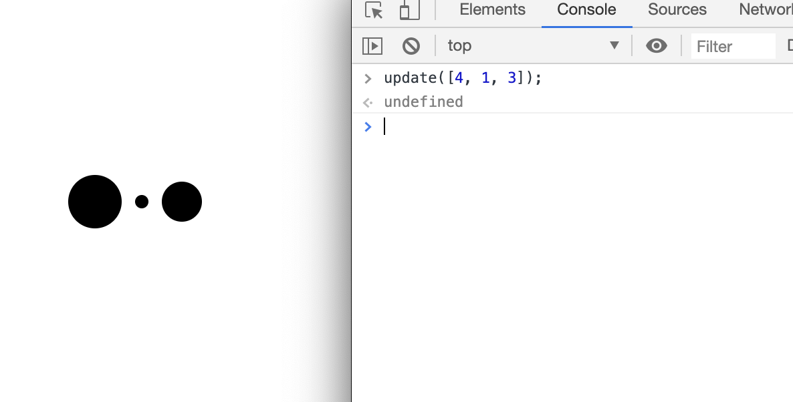

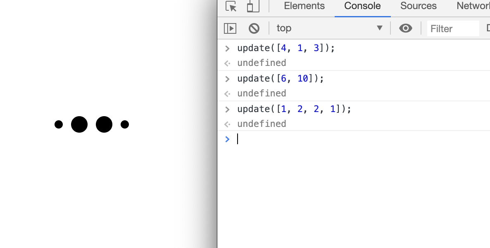


## Case 5: テキストを入れる

- 円の中心に数字を描きたい


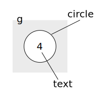

- gタグで括るとtext，circleいっぺんに扱えて嬉しい


```js
const update = (data) => {
  const circleGroup = g.selectAll('g')
    .data(formatData(data, 10, 5));

  const circleGroupEnter = circleGroup.enter()
    .append('g');
  circleGroupEnter.append('circle');
  circleGroupEnter.append('text');
  const circleGroupMerge = circleGroupEnter
    .merge(circleGroup);
  circleGroupMerge
    .attr('transform', d => `translate(${d.x}, ${d.y})`);
  circleGroupMerge.select('circle')
    .attr('fill', '#fff')
    .attr('stroke', '#000')
    .attr('r', d => d.r);
  circleGroupMerge.select('text')
    .attr('text-anchor', 'middle')
    .attr('dominant-baseline', 'central')
    .text(d => d.val);

  circleGroup.exit().remove();
};
```


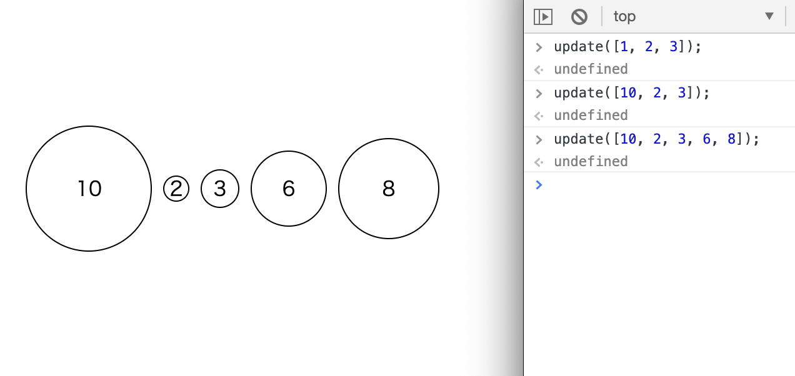


## Case 06: Animation

出現や消滅をカッコよく動かしたい


### d3.transition()

- DOMの属性/スタイル変更が滑らかに行われる

#### 1/3

```js
// 呼び出し500ms後，1000msかけて遷移
const t = d3.transition()
  .delay(500)
  .duration(1000);

const circleGroupMerge = circleGroupEnter
  .merge(circleGroup) 
  .transition(t);
circleGroupMerge
  .attr('transform', d => `translate(${d.x}, ${d.y})`);
circleGroupMerge.select('circle')
  .attr('fill', '#fff')
  .attr('stroke', '#000')
  .attr('r', d => d.r);
circleGroupMerge.select('text')
  .attr('text-anchor', 'middle')
  .attr('dominant-baseline', 'central')
  .text(d => d.val);
const circleGroupExit = circleGroup.exit()
  .transition(t);
circleGroupExit.select('circle')
  .attr('r', 0);
circleGroupExit.remove();
```


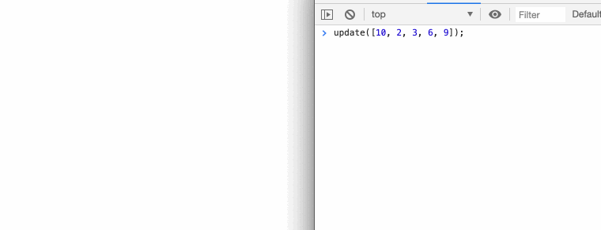


## Case 07: Relative Radius


- 小さくなりすぎ/大きくなりすぎ
 &rArr; 半径の上限/下限を設定したい


### どんな関数?


#### 高校数学

$$
y = \frac{y_M - y_m}{x_M - x_m}(x - x_m) + y_m
$$


#### 関数を返す関数

domainとrangeを設定すると
いい感じの一次関数を返してくれる関数

```js
const scaleGenerator = (dom, ran) => {
  return x => (ran[1]-ran[0])/(dom[1]-dom[0])*(x-dom[0])+ran[0];
};
```


#### 動き

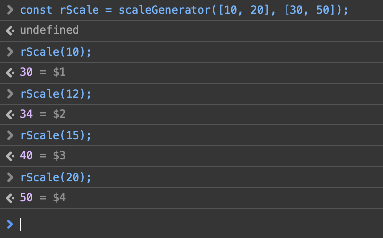


#### Modified formatData

```js
const formatData = (data, space, rScale) => {
  let now = 0;
  const ret = data.map((d, i) => {
    const t = { val: data[i], r: rScale(data[i]), x: now, y: 0 };
    if (i < data.length - 1) {
      now += rScale(data[i]) + space + rScale(data[i + 1]); 
    }
  }
  ret.forEach(d => { d.x -= now/2; });
  return ret;
};
```


#### Modified update

```js
const scaleGenerator = (dom, ran) => {
  return x => (ran[1]-ran[0])/(dom[1]-dom[0])*(x-dom[0])+ran[0];
};
const update = (data) => {
  const rScale = scaleGenerator(d3.extent(data), [10, 50]);
  const circleGroup = g.selectAll('g')
    .data(formatData(data, 10, rScale));
  ...
}
```


### 成功


### 実は車輪の再発明

```js
// Before
const scaleGenerator = (dom, ran) => {
  return x => (ran[1]-ran[0])/(dom[1]-dom[0])*(x-dom[0])+ran[0];
};
const rScale = scaleGenerator(d3.extent(data), [10, 50]);
```


### d3.scaleLinear

次からはこれを使いましょう

```js
// After
const rScale = d3.scaleLinear()
  .domain(d3.extent(data))
  .range([10, 50]);
```

- scaleLinearは線形変換
- scalePow/scaleLog/scaleSqrtなどもあります


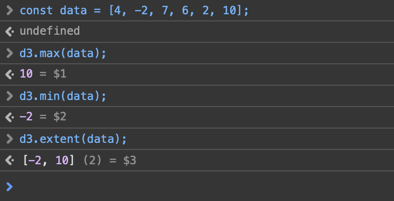

#### 補足: max/min/extent

- d3.extent: データの範囲


- 要素がObject/Array
  &rArr; アロー関数付ける

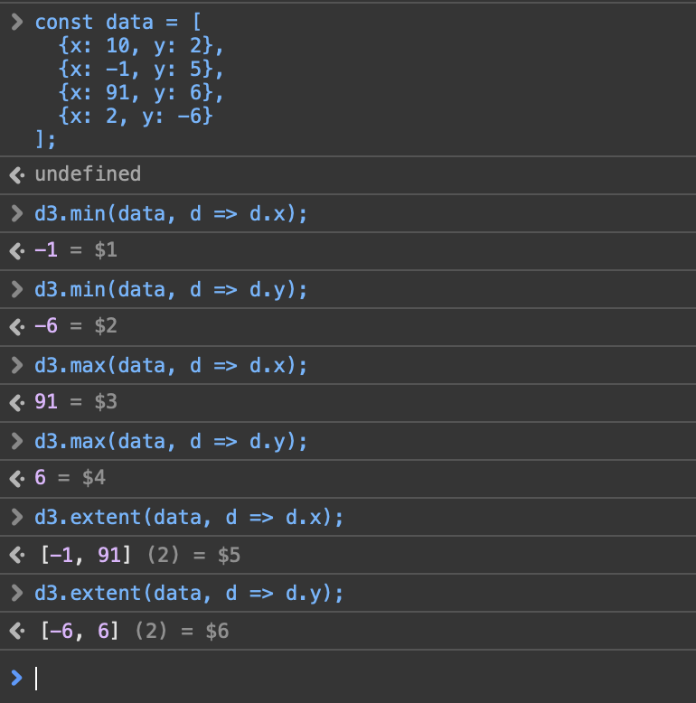


## Case 8-1: Random Color

- 色を完全ランダムにしたい


### d3.randomUniform

一様分布を生成する関数を作成する関数
範囲は右半開区間

```js
// [0, 256)の範囲の一様分布乱数を生成
const rand = d3.randomUniform(0, 256);
circleGroupMerge.select('circle')
  .attr('fill', () => `rgb(${rand()}, ${rand()}, ${rand()})`)
  .attr('stroke', '#000')
  .attr('r', d => d.r);
```


### 若干汚い(ことがある)

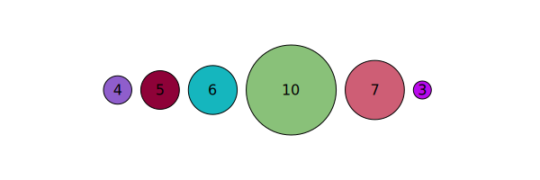

- rgbランダムだと仕方ない
  &rArr; hsvで考えるといいかも


## Case 8-2: Built-in Color

- 用意された色を使う

https://github.com/d3/d3-scale-chromatic


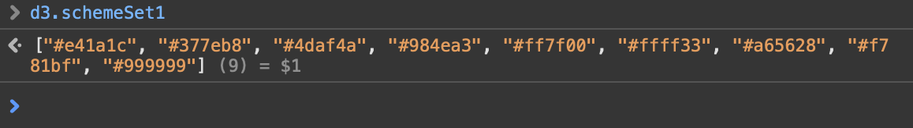


### Modified update

```js
// [0, d3.schemeSet1.length)の範囲の一様分布乱数を生成
const rand = d3.randomUniform(0, d3.schemeSet1.length);
circleGroupMerge.select('circle')
  .attr('fill', () => d3.schemeSet1[Math.floor(rand())])
  .attr('stroke', '#000')
  .attr('r', d => d.r);
```

Math.floorしないと小数が出てしまうので注意


それなりに良い
色数が少ないので被る

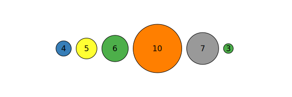


## Case 8-3: Linear Color Scale

値: 小 &hArr; 中 &hArr; 大
色: 水 &hArr; 白 &hArr; 橙
に対応させよう


### d3.scaleLinear再び

domain，rangeに中間の値を設定できる

```js
const colorScale = d3.scaleLinear()
  .domain([0, 10, 20])
  .range(['orangered', 'white', 'skyblue']);
```


### Modified update

```js
const [rmin, rmax] = d3.extent(data);
const colorScale = d3.scaleLinear()
  .domain([rmin, (rmin + rmax)/2, rmax])
  .range(['orangered', 'white', 'skyblue']);
circleGroupMerge.select('circle')
  .attr('fill', d => colorScale(d.val))
  .attr('stroke', '#000')
  .attr('r', d => d.r);
```


