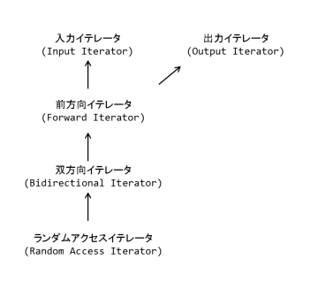

<!-- headingDivider: 3 -->

# もっとSTL

## すばらしいSTLの世界

- STLとラムダ式でコードがすっきりすることがあります
- シーケンス(= 配列とかリストとか，列で表される構造)系の操作が得意

## お約束

```cpp
#include <algorithm>
#include <numeric>
```

## 紹介

[algorithm](https://cpprefjp.github.io/reference/algorithm.html)
[numeric](https://cpprefjp.github.io/reference/numeric.html)
量が多すぎるのですべては紹介できない
気になったら上のページで調べてみるとGood

### algorithm

### シーケンスを変更しない操作
- all\_of: 全ての要素が条件を満たすか?
- any\_of: ある要素が条件を満たすか?
- find\_if: 条件を満たす最初の要素のindexを返す
- count\_if: 条件を満たす要素の個数を数える

### シーケンスを変更する操作
- copy: コピーする関数だがostream\_iteratorと合わせて面白いことができる
- copy\_if: 条件を満たすやつだけコピー
- transform: 世間の言語でいうmap関数 + 2つのシーケンスに対しての二項演算
- replace\_copy\_if: 条件を満たすものを指定された値に置き換える
- fill: 塗りつぶし
- generate: 出力範囲へ関数の結果を書き込む
- unique: おなじみ重複削除
- shuffle: シャッフルする
- partition: 条件を満たす/満たさないで二分する
- reverse: おなじみ

### ソート，二分探索
- lower\_bound: おなじみ
- upper\_bound: おなじみ
- equal\_range: (lower\_bound, upper\_bound)を同時に取得

### ソート済み構造に対する集合演算

std::setとかstd::multisetとかに対して使える関数たち．
これ知らなくて，今まで自前でunionとか作ってた．

- set\_union: $A \cup B$
- set\_intersection: $A \cap B$
- set\_difference: $A - B$
- set\_symmetric\_difference: $A \oplus B$(対称差)
- includes: $A\subset B$か否かを判定

### 最大/最小

- min/max: おなじみ
- min\_element/max\_element: おなじみ
- minmax\_element: (最大のitr, 最小のitr)を返す

### 順列

- next\_permutation: おなじみ
- prev\_permutation: ほとんどお世話にならない

### numeric

- accumulate: 世の中の言語ではreduceとか呼ばれているやつ
- reduce: accumulateの集計順無しver．C++17以降から

- inner\_product: 内積を計算

- partial\_sum: 累積&#x25CB;&#x25CB;の配列を生成してくれる

- adjacent\_difference: 隣接要素間の差を計算
- iota: 公差1の等差数列を生成．APL言語の命令「イオタ」に由来するらしい


## 前知識: イテレータの種類

### 分類



図: 子&rarr;親の向き．子は親を引き継いでいる

- 入力イテレータ: 書き込み専用
- 出力イテレータ: 読み取り専用
- 全方向イテレータ: 一方向にしか進めない．単方向リストとか
- 双方向イテレータ: 進めるし戻れる．双方向リストとか
- ランダムアクセスイテレータ: itr + nとかできる．vectorとか

[画像元](https://cpprefjp.github.io/reference/iterator.html)


### お約束
ostream\_iteratorとかback\_insert\_iteratorを使うとき
```cpp
#include <iterator>
```

### ostream\_iterator

代入演算子がostream&lt;&lt;xに読み替えられる変なイテレータ

```cpp
auto itr = ostream_iterator<int>(cout, "|");
itr = 1; itr++;
itr = 2; itr++;
itr = 4; itr++;
cout << endl;
```

### back\_insert\_iterator

- 代入演算子がv.push\_back(x)に読み替えられる変なイテレータ
- back\_inserter関数を使って生成

```cpp
vector<int> v;
auto itr = back_inserter(v);
itr = 1; itr++;
itr = 2; itr++;
itr = 4; itr++;
for(auto e : v) cout << e << ' ';
cout << endl;
```

### reverse\_iterator

- 逆向き操作を提供してくれるイテレータ
- begin/endの代わりにrbegin/rendを使う
- partial\_sumと組み合わせると逆向きの累積和がとれます
  &rArr;indexでこんがらがる必要がなくなる

```cpp
vecor<int> A = {1, 2, 3, 4};
vector<int> Arevsum;
partial_sum(A.rbegin(), A.rend(), back_inserter(Arevsum));

for(auto e : Arevsum) cout << e << ' ';
cout << endl;
```

## string系の関数など

### to\_string

数値&rarr;文字列の変換
```cpp
string s1 = to_string(1.001);
string s2 = to_string(10);
```

### getline

一行入力してくれる
```cpp
string s;
getline(cin, s);
cout << s << endl;
```

delimiter(区切り文字)を指定することも可能
```cpp
string s, t;
getline(cin, s, ',');
getline(cin, t);
cout << s << endl;
cout << t << endl;
```

### getlineの注意点: cinと併用したい場合
これはsとtに入力してくれる
```cpp
string s, t;
getline(cin, s);
cin >> t;
cout << s << endl
        t << endl;
```

---

これはうまくいかない
```cpp
string s, t;
cin >> t;
getline(cin, s);
cout << s << endl
        t << endl;
```

原因:
cin: 改行文字は読まずに入力バッファに残す
getline: 改行文字も読む

&#x203B;入力バッファ: 入力された文字を貯めておく一時領域

---

解決策: 一文字読み捨てる
cin.ignore()というメンバ関数を使う
```cpp
string s, t;
cin >> t;
cin.ignore();
getline(cin, s);
cout << s << endl
        t << endl;
```

## STL系の関数を無理やり使って問題を解いてみる

あえて無理やり使っているので，かえって読みづらくなっている場合もある
遊びだと思ってね(便利そうだったら真似しよう)

- ABC129 B - Balance
- ABC125 B - Resale
- ABC124 B - Great Ocean View
- ABC070 C - Multiple Clocks
- ABC127 B - Algae

### ABC129 B - Balance

Before:

```cpp
int N; cin >> N;
vector<int> v(N);
for (int i = 0; i < N; i++) cin >> v[i];

int ans = INF;
for (int i = 0; i < N-1; i++) {
  int S1 = 0, S2 = 0;
  for (int j = 0; j < N; j++) {
    if (j <= i) S1 += v[j];
    else S2 += v[j];
  }
  ans = min(ans, abs(S1-S2));
}
cout << ans << endl;
```

---

After: accumulateとmin\_element

```cpp
int N; cin >> N;
vector<int> v(N), u;
for_each(v.begin(), v.end(), [](int& e) { cin >> e; });
for (int i = 0; i < N-1; i++) {
  int S1 = accumulate(v.begin(), v.begin() + i+1, 0);
  int S2 = accumulate(v.begin() + i+1, v.end(), 0);
  u.push_back(abs(S1 - S2));
}
cout << *min_element(u.begin(), u.end()) << endl;
```

### ABC125 B - Resale

Before:
```cpp
int N;
cin >> N;
vector<int> V(N), C(N);
for (int i = 0; i < N; i++) cin >> V[i];
for (int i = 0; i < N; i++) cin >> C[i];
vector<int> D(N);
for (int i = 0; i < N; i++) D[i] = V[i] - C[i];
int ans = 0;
for (int i = 0; i < N; i++) {
  if (D[i] > 0) ans += D[i];
}
cout << ans << endl;
```

---

After: translateとcopy\_ifとback\_inserterとaccumulate
```cpp
int N;
cin >> N;
vector<int> V(N), C(N);
for_each(V.begin(), V.end(), [](int& e) { cin >> e; });
for_each(C.begin(), C.end(), [](int& e) { cin >> e; });

vector<int> diffv, posiv;
auto sub = [](int& v, int& c) { return v - c; };
auto is_positive = [](int& x) { return x > 0; };

transform(V.begin(), V.end(), C.begin(), back_inserter(diffv), sub);
copy_if(diffv.begin(), diffv.end(), back_inserter(posiv), is_positive);
cout << accumulate(posiv.begin(), posiv.end(), 0) << endl;
```
translateには単項演算子版と二項演算子版の両方がある(今回は後者)

### ABC124 B - Great Ocean View

Before
```cpp
bool check(vector<int>& H, int idx)
{
  for (int i = 0; i < idx; i++) {
    if (H[i] > H[idx]) return false;
  }
  return true;
}
 
int main()
{
  int N;
  cin >> N;
  vector<int> H(N);
  int ans = 0;
  for (int i = 0; i < N; i++) cin >> H[i];
  for (int i = 0; i < N; i++) {
    if (check(H, i)) ans++;
  }
  cout << ans << endl;
 
  return 0;
}
```

---

After1(main関数のみ): all\_of
```cpp
int N;
cin >> N;
vector<int> H(N);
for_each(H.begin(), H.end(), [](int& e) { cin >> e; });
int ans = 0;
for (int i = 0; i < N; i++) {
  auto is_leqHi = [&](int& x) { return x <= H[i]; };
  if (all_of(H.begin(), H.begin() + i, is_leqHi)) ans++;
}
cout << ans << endl;
```

- 真偽値を返す関数を述語(predicate)という

---

After2(main関数のみ): partial\_sumとtransformとcount\_ifとback\_inserter
```cpp
int N;
cin >> N;
vector<int> H(N);
for_each(H.begin(), H.end(), [](int& e) { cin >> e; });

vector<int> Hmax;
auto pmax = [](int& acc, int& e) { return max(acc, e); };
partial_sum(H.begin(), H.end(), back_inserter(Hmax), pmax);

vector<int> diffv;
auto sub = [](int& h, int& hm) { return h - hm; };
transform(H.begin(), H.end(), Hmax.begin(), back_inserter(diffv), sub);

auto is_nonenegative = [](int& x) { return x >= 0; };
cout << count_if(diffv.begin(), diffv.end(), is_nonenegative) << endl;
```
for文を一切使っていない点に注目

### ABC070 C - Multiple Clocks

Before(gcd関数は省略):

```cpp
int N; cin >> N;
ll lcm = 1;
for (int i = 0; i < N; i++) {
  ll T; cin >> T;
  lcm = lcm/gcd(lcm, T)*T;
}
cout << lcm << endl;
return 0;
```

---

After: accumulateにlcmを設定
```cpp
int N;
cin >> N;
vector<ll> T(N);
for_each(T.begin(), T.end(), [](ll& e) { cin >> e; });
auto lcm = [](ll acc, ll e) {
  if (e > acc) swap(acc, e);
  return acc / gcd(acc, e) * e;
};
cout << accumulate(T.begin(), T.end(), 1LL, lcm) << endl;
```
初期値を1LLではなく1にするとバグるので注意(コンパイラがaccをintと思い込むのだろうか，オーバーフローする)

### ABC127 B - Algae

Before:

```cpp
ll r, D, x;
cin >> r >> D >> x;
for (int i = 0; i < 10; i++) {
  x = r*x - D;
  cout << x << endl;
}
```

---

After: generateとcopyとostream\_iterator
copyとostream\_iteratorの合わせ技でシーケンスの出力が可能．面白い．

```cpp
int r, D, xt;
cin >> r >> D >> xt;
vector<int> x(10);
generate(x.begin(), x.end(), [&]() {
    xt = r * xt - D;
    return xt;
});
copy(x.begin(), x.end(), ostream_iterator<int>(cout, "\n"));
```

## 関数化の大事さ

- ライブラリ関数のバグ率&lt;自分が書いた同じ処理のバグ率
- 「この部分で何をやっているのか」が分かりやすくなる
- 書く分量が増えることもしばしばあるが，処理の意味が伝わり易くなる
  - 速さ重視の競プロで大事かといわれるとなかなか難しいところ
    &rArr; 問題によりけり

## まとめ

- STLはシーケンス走査に強い
  列を順に舐めていくような操作が得意
