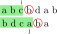
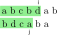
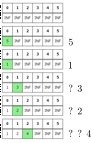

<link rel="stylesheet" href="style.css">

# LCS and LIS

---

## Longest Common Subsequence

For given two sequences $X$ and $Y$, a sequence $Z$ is a common subsequence of $X$ and $Y$ if $Z$ is a subsequence of both $X$ and $Y$. 

Write a program which finds the length of LCS of given two sequences $X$ and $Y$. The sequence consists of alphabetical characters.

Source: [AOJ ALDS1_10_C](http://judge.u-aizu.ac.jp/onlinejudge/description.jsp?id=ALDS1_10_C)

---

### Example

<div class="flex-container">
  
</div>

---

### Preparation: Substring

- Subsequence $\supset$ Substring
- Substring from $i$ to $j$ of $S$: $S [i]S[i+1]\ldots S[j-1]S[j]$
- Substring is continuous.

---

### DP's solution of LCS 

- $\text{Def.}$
  - $dp[i][j]=\text{Length of LCS of } X_{i-1} \text{ and } Y_{j-1}$

Here, $S_i$ indicates the substring of $S$ from $0$ to $i$

- $\text{Init.}$
  - $dp[i][j]=0$
---

- $\text{Trans.}$
  - $dp[i+1][j+1]=dp[i][j]+1 \text{ if } X[i]==Y[j]$
  - $dp[i+1][j+1]=\max(dp[i+1][j],dp[i][j + 1])$

$\text{Ans.}$
$dp[|X|][|Y|]$

---

### Supplement: Image of transition

- $dp[i+1][j+1]=dp[i][j]+1 \text{ if } X[i]==Y[j]$

<div class="flex-container">
  
</div>

---

- $dp[i+1][j+1]=\max(dp[i+1][j],dp[i][j + 1])$

<div class="flex-container">
  
</div>

---

```cpp
for (int i = 0; i < X.size(); i++) {
  for (int j = 0; j < Y.size(); j++) {
    if (X[i] == Y[j]) dp[i + 1][j + 1] = dp[i][j] + 1;
    else dp[i + 1][j + 1] = max(dp[i + 1][j], dp[i][j + 1]);
  }
}
// the answer is dp[X.size()][Y.size()]
```

---

## Longest Increasing Subsequence

Longest Increasing Subsequence

For a given sequence $A=a_0,a_1,\ldots,a_{n−1}$, find the length of the longest increasing subsequnece (LIS) in $A$.

An increasing subsequence of $A$ is defined by a subsequence
$a_{i0},a_{i1},\ldots a_{ik}$ where $0 \le i_0 \lt i_1 \lt \cdots a_{ik} \lt n$ and $a_{i0} \lt a_{i1} \lt \cdots \lt a_{ik}$

Source: [AOJ DPL\_1\_D](http://judge.u-aizu.ac.jp/onlinejudge/description.jsp?id=DPL_1_D)

---

### Example

<div class="flex-container">
  
</div>

- $1 \lt 2 \lt 4$
- $1 \lt 3 \lt 4$ is also correct.

---

### Naive DP solution

- $\text{Def.}$
  - $dp[i] = \text{Length of LCS in } a[0],a[1],\ldots ,a[i]$

The time complexity is $O(n^2)$ (I will skip the detail).

---

### Good solution

- $\text{Def.}$
  - $dp[i]=\text{minimum number of tail of LIS with length }i+1$
- $\text{Init}$
  - $dp[i]=\text{INF}$

---

#### Idea of transition


<div class="flex-container-start">

<div style="padding: 10px 200px 0 0">

- It is good for tail to be small
  because of later choice
- Using binary search
ex. 5 1 3 2 4 (DP table is right.);

</div>



</div>


---

- $\text{Trans.}$
  $dp[k]=a[i]$
  Here, $k$ is the index of the first element such that $dp[k] \ge a[i]$.

We can use lower_bound to get $k$
```cpp
//When dp is a vector
k = lower_bound(dp.begin(), dp.end(), a[i]) - dp.begin();

//When dp is an array
k = lower_bound(dp, dp + n, a[i]) - dp;
```

---

- $\text{Ans.}$
  Maximum of $i+1$ such that $dp[i] \lt \text{INF}$

The time complexity is $O(n\log n)$

---

```cpp
int dp[110000];
for (int i = 0; i < 110000; i++) {
  dp[i] = INF;
}

for (int i = 0; i < n; i++) {
  int idx = lower_bound(dp, dp + n, a[i]) - dp;
  dp[idx] = a[i];
}

int ans;
for (ans = 0; ans < n; ans++) {
  if (dp[ans] >= INF) break;
}
cout << ans << endl;
```
