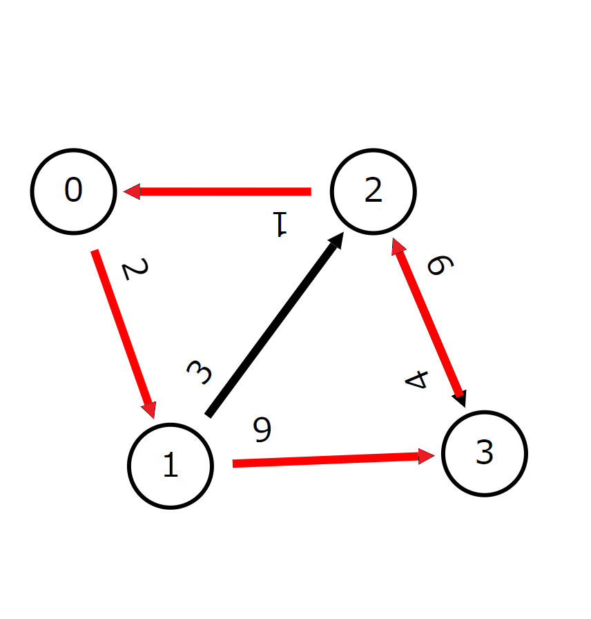

<link rel="stylesheet" href="style.css">

# bitDP

---

## What's this?

- A kind of DP 
- Simply the dp table has **subset** as index

---

## Review

Subset is expressed as bit.
e.g: subset sum
<div class="flex-container">

</div>

---

## Travelling Salesman Problem (TSP)

For a given weighted directed graph $G(V,E)$, find the distance of the shortest route that meets the following criteria:

- It is a closed cycle where it ends at the same point it starts.
- It visits each vertex exactly once.

(The graph which safisfies these condition is called Hamiltonian Cycle).

---

### Input

- $|V|, |E|$: vertex and edge size
- $s_i, t_i, d_i$: a path which links $s_i$ to $t_i$, and has weight $d_i$.

### Constraints
- $2 \le |V| \le 15$
- $0 \le d_i \le 1,000$
- There are no multiedge

Source: [AOJ DPL\_2\_A](http://judge.u-aizu.ac.jp/onlinejudge/description.jsp?id=DPL_2_A)

---

### Example

<div class="flex-container">


<div>

| from | to | weight |
| --- | --- | --- |
| 0 | 1 | 2 |
| 1 | 2 | 3 |
| 1 | 3 | 9 |
| 2 | 0 | 1 |
| 2 | 3 | 6 |
| 3 | 2 | 4 |

</div>
</div>

---

### Naive solution: brute-forth

1. Generate all permutations of vertex list.
2. Check whether the route exists, and sum up the distance it visited.
3. minimum sum of distance.

The time complexity is $O(|V|!)$

---

### DP

- $\text{Def.}$
$$
dp[S][v] = \text{the shortest path 0 to v when it has been visited vertexes }S
$$
- $\text{Init.}$
  - $dp[\empty][0]=0$
  - $\text{others}=\text{INF}$

Note that we can decide the start vertex bacaue of circlation of graph and it is in $\empty$ of dp-init.
The start vertex is enterd in $S$ when the graph is closed as cyclic graph.


---

- $\text{Trans.}$
  $dp[S][v]$ already known,
  If $v$ and $u$ are adjacent,
  - $dp[S \cup u][u] = \min(src, dp[S][v] + d_{vu})$
- $\text{Ans.}$
  $dp[V][0]$

Here, $d_{vu}$ is the weight from vertex $v$ to $u$.

---

- Ofcourse, we cannot use subset as index of array.
- Instead, use **bit**

---

- $\text{Def.}$
$$
dp[S][v] = \text{the shortest path 0 to v when it has been visited vertexes }S
$$
- $\text{Init.}$
  - $dp[0][0]=0$
  - $\text{others}=\text{INF}$
- $\text{Trans.}$
  $dp[S][v]$ already known,
  If $v$ and $u$ are adjacent,
  - $dp[S \mid (1 \lt \lt u)][u] = \min(src, dp[S][v] + d_{vu})$
- $\text{Ans.}$
  - $dp[(1 \lt \lt |V|)-1][0]$

$dp[S][v]$ should be known when iteration from small to large of $S$ and $v$.
So, we can use for-loop!

---

### Supplement: Image of transition

<div class="flex-container-start">
<div style="padding: 50px 50px 0 0;">

- Now:
  - $dp[(0000010110)_2][4]$
- Transition:
  - $dp[(000001\underline{1}110)_2][3]$
  - $dp[(00\underline{1}0010110)_2][7]$

</div>

</div>

---

### Code: Iterative

```cpp
dp[0][0] = 0;
for (int S = 0; S < (1 << V); S++) {
  for (int v = 0; v < V; v++) {
    if (dp[S][v] >= INF) continue;
    for (auto& to : edge[v]) {
      int u = to.first;
      int d = to.second;
      if ((S >> u) & 1) continue;
      dp[S | (1 << u)][u] = min(dp[S | (1 << u)][u], dp[S][v] + d);
    }
  }
}
// the answer is dp[(1 << V) - 1][0].
```

---

### Code: Recursive

- We can change iterative to recursive method, but it is a little hard **as this definition of DP**.
- Easyness to write DP as iterative or recursive depends on a DP definition.

---

- $\text{Def.}$
$$
dp[S][v] = \text{the shortest path \underline{v to goal-vertex} when it has been visited vertexes }S
$$

---

```cpp
int dfs(int S, int v)
{
  if (dp[S][v] >= 0) return dp[S][v];
  int ret = INF;
  for (auto& to : edge[v]) {
    int u = to.first;
    int d = to.second;
    if ((S >> u) & 1) continue;
    ret = min(ret, dfs(S | (1 << u), u) + d);
  }
  return dp[S][v] = ret;
}
```

---

- In generally, if we don't know the direction of transition with iteration, we have no choice but recursive method.

---

### Importance: Constraint

$n=|V|$
The time complexity of TSP is $O(n^22^n)$
n = 18 is barely OK

---

### Summary

- Some constraints is very small!
  &rArr; maybe bitDP
- bitDP has subset as index, which expressed as bit.
- If you cannot iterate because of the direction of the transition, you use recursive method.
