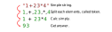
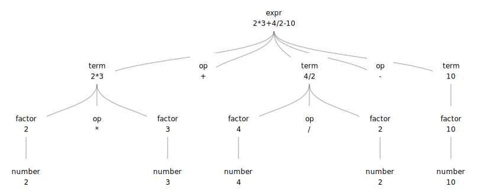
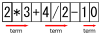
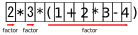
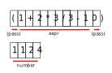

<link rel="stylesheet" href="style.css">

# 構文解析
# Parsing

---

## Contents

1. What is Parser ?
2. Method

This slide is almost based on [構文解析 Howto](https://gist.github.com/draftcode/1357281).

---

Once you learn the method of parse, you will understand that **you only do what problems say** in many problems of parsing.

---

## What is parser?

the process of analysing a string of symbols, either in natural language, computer languages or data structures, conforming to the rules of a formal grammar.

---

### Example

<div class="flex-container">

</div>


- Although the first process is called parser, but in this slide I will call a whole process it.
- Parsing program is called parser.

---

### Parsing on competitive programming

- Top-down parsing is often used on competitive programming.
  - Called Recursive Descent Parsing.
- Usual parsing method saves any tokens as tree, but we don't.

---

### Preparation: Backus-Naur(BNF) form

- Many problem is solved writing BNF.
- BNF is a method to define syntax of languages.
- It has recursive structure.

---

### Example

Definition of expression

$$
\begin{aligned}
\langle \text{expr} \rangle &:=
\langle \text{term} \rangle \mid
\langle \text{expr} \rangle + \langle \text{expr} \rangle \mid
\langle \text{expr} \rangle - \langle \text{expr} \rangle \\

\langle \text{term} \rangle &:=
\langle \text{number} \rangle \mid
\langle \text{term} \rangle \ast \langle \text{term} \rangle \mid
\langle \text{term} \rangle / \langle \text{term} \rangle \\

\langle \text{number} \rangle &:= 0 \mid 1\mid 2\mid 3\mid 4\mid 5\mid 6\mid 7\mid 8\mid 9\mid
\langle \text{number} \rangle \langle \text{number} \rangle
\end{aligned}
$$

---

### More easily

- Strictly speaking, bellow is not rule of BNF. But in this slide I will consider it as BNF, too.
- We don't have to make rule following to BNF completely; **we can solve many problems only making rule like BNF**.

$$
\begin{aligned}
\langle \text{expr} \rangle &:=
\langle \text{term} \rangle\ \  \underline{+\text{ or }-}\ \  \langle \text{term} \rangle\ \  \underline{+ \text{ or } -}\ \  \cdots\\

\langle \text{term} \rangle &:=
\langle \text{number} \rangle\ \  \underline{\ast\text{ or } /}\ \  \langle \text{number} \rangle\ \ \underline{\ast \text{ or } /}\ \ \cdots\\

\langle \text{number} \rangle &:= 
0,1,2,3,4,5,6,7,8,9,10,11,12,\ldots
\end{aligned}
$$

---

## Recursive Structure

<div class="flex-container-start">

</div>


---

### I want to use parensis!

Add the rule of factor.

$$
\begin{aligned}
\langle \text{expr} \rangle &:=
\langle \text{term} \rangle\ \  \underline{+\text{ or }-}\ \  \langle \text{term} \rangle\ \  \underline{+ \text{ or } -}\ \  \cdots\\

\langle \text{term} \rangle &:=
\langle \text{factor} \rangle\ \  \underline{\ast\text{ or } /}\ \  \langle \text{factor} \rangle\ \ \underline{\ast \text{ or } /}\ \ \cdots\\

\langle \text{factor} \rangle &:=
(\langle \text{expr} \rangle) \text{ or } \langle \text{number} \rangle \\

\langle \text{number} \rangle &:= 
0,1,2,3,4,5,6,7,8,9,10,11,12,\ldots
\end{aligned}
$$

---

### After definition of BNF

- You only write following BNF!
- But you need practice.


---

### The spell when parsing 

It is convenient for you to know:
- isdigit(x); 
  returns if x is number, defined in ctype.
- string::const\_iterator;
  All you have to do is to know it is "type of safe pointer for string".

So you write these at first as a spell.
```cpp
#include <iostream>
#include <string>
#include <ctype.h>

using namespace std;
typedef string::const_iterator State;
```

---

### Supplement: string::const\_iterator

<div class="flex-container">

</div>


---

## Case study

Given an expression as a string which satisfies this BNF syntax:

$$
\begin{aligned}
\langle \text{expr} \rangle &:=
\langle \text{term} \rangle\ \  \underline{+\text{ or }-}\ \  \langle \text{term} \rangle\ \  \underline{+ \text{ or } -}\ \  \cdots\\

\langle \text{term} \rangle &:=
\langle \text{factor} \rangle\ \  \underline{\ast\text{ or } /}\ \  \langle \text{factor} \rangle\ \ \underline{\ast \text{ or } /}\ \ \cdots\\

\langle \text{factor} \rangle &:=
(\langle \text{expr} \rangle) \text{ or } \langle \text{number} \rangle \\

\langle \text{number} \rangle &:= 
0,1,2,3,4,5,6,7,8,9,10,11,12,\ldots
\end{aligned}
$$

Write a program to calculate it and output the answer.

---

### Step

1. Write functions named BNF's left value.
   - They always take an argument reference of State.
   - In the case that each mutually call them, you have to write function prototypes.
2. Fill the procedure to parse.

---

### Step1

$$
\begin{aligned}
\langle \text{expr} \rangle &:= \cdots\\
\langle \text{term} \rangle &:= \cdots\\
\langle \text{factor} \rangle &:= \cdots\\
\langle \text{number} \rangle &:= \cdots
\end{aligned}
$$

```cpp
int expr(State& s){

}
int term(State& s){

}
int factor(State& s){

}
int num(State& s){

}
```

---

### Step2


Image concrete example.

$$
\langle \text{expr} \rangle :=
\langle \text{term} \rangle\ \  \underline{+\text{ or }-}\ \  \langle \text{term} \rangle\ \  \underline{+ \text{ or } -}\ \  \cdots
$$

<div class="flex-container">

</div>

---

```cpp
int expr(State& s){
  int ret = term(s);
  while(1){
    char op = *s;
    if (op == '+') {
      s++;
      ret += term(s);
    } else if (op == '-') {
      s++;
      ret -= term(s);
    } else {
      break;
    }
  }
  return ret;
}
```

---

$$
\langle \text{term} \rangle :=
\langle \text{factor} \rangle\ \  \underline{\ast\text{ or } /}\ \  \langle \text{factor} \rangle\ \ \underline{\ast \text{ or } /}\ \ \cdots
$$

<div class="flex-container">

</div>

---

```cpp
int term(State& s) {
  int ret = factor(s);
  while (1) {
    char op = *s;
    if (op == '*') {
      s++;
      ret *= factor(s);
    } else if (op == '/'){
      s++;
      ret /= factor(s);
    } else {
      break;
    }
  }
  return ret;
}
```

---

$$
\langle \text{factor} \rangle :=
(\langle \text{expr} \rangle) \text{ or } \langle \text{number} \rangle
$$

<div class="flex-container">

</div>

---

```cpp
int factor(State& s) {
  if (*s == '(') {
    s++;
    int ret = expr(s);
    s++;
    return ret;
  } else {
    return number(s);
  }
}
```

---

$$
\langle \text{number} \rangle := 
0,1,2,3,4,5,6,7,8,9,10,11,12,\ldots
$$

```cpp
int number(State& s) {
  int ret = 0;
  while(isdigit(*s)) {
    ret *= 10;
    ret += *s - '0';
    s++;
  }
  return ret;
}
```

---

## Add variable - an alphabetical character

```cpp
int vars[i];
// vars[i] := value of variable named i-th alphabet 
```

$$
\begin{aligned}
\langle \text{factor} \rangle &:=
(\langle \text{expr} \rangle) \text{ , } \langle \text{number} \rangle \text{ ,or } \langle \text{var} \rangle\\
\langle \text{var} \rangle &:=
a,b,\ldots,\text{or }z
\end{aligned}
$$

---

```cpp
int factor(State& s) {
  if (*s == '(') {
    s++;
    int ret = expr(s);
    s++;
    return ret;
  } else if(isdigit(*s)){
    return number(s);
  } else {
    return var(s);
  }
}

int var(State& s) {
  int ret = vars[*s - 'a'];
  s++;
  return ret;
}
```

---

## Add varlabl - alphabetical string

```cpp
map<string,int> vars;
// vars[str] := value of variable named str. 
```

$$
\begin{aligned}
\langle \text{factor} \rangle &:=
(\langle \text{expr} \rangle) \text{ , } \langle \text{number} \rangle \text{ ,or } \langle \text{var} \rangle\\
\langle \text{var} \rangle &:=
\text{string made of lower cases}
\end{aligned}
$$

---

```cpp
int factor(State& s) {
  if (*s == '(') {
    s++;
    int ret = expr(s);
    s++;
    return ret;
  } else if(isdigit(*s)){
    return number(s);
  } else {
    return var(s);
  }
}

int var(State& s) {
  string str = "";
  while ('a' <= *s && *s <= 'z') {
    str += *s;
    s++;
  }
  return vars[str];
}
```

---

### How to use

```cpp
int main()
{
  string str;
  cin >> str;
  State s = str.begin();
  cout << expr(s) << endl;
  return 0;
}
```

---

### Can we solve all parsing problems?

- Many grammer around the world is very complex.
  - The method we saw in this slide only solve the class of grammer; [LL(1)](https://ja.wikipedia.org/wiki/LL%E6%B3%95)
- But there are little problems except LL(1) in competitive programming.

---

### Sammary

- Parsing is not difficult.
- But you have to remember the way to parsing.

---

## Reference

[構文解析HowTo](https://gist.github.com/draftcode/1357281)
[Maximum 2012 アルゴリズム講習会](http://dai1741.github.io/maximum-algo-2012/docs/parsing/)
[再帰下降型構文解析(LL(1))](http://www.prefield.com/algorithm/string/parser.html)

---

## Exercise

- [AOJ0109 Smart Calculator](http://judge.u-aizu.ac.jp/onlinejudge/description.jsp?id=0109&lang=jp)
  [English Version](http://judge.u-aizu.ac.jp/onlinejudge/description.jsp?id=0109) 
  It is quite same as the case study in this slide.
- [AOJ1155 How can I satisfy thee? Let me count the ways...](http://judge.u-aizu.ac.jp/onlinejudge/description.jsp?id=1155&lang=jp)
  [English Version](http://judge.u-aizu.ac.jp/onlinejudge/description.jsp?id=1155)
