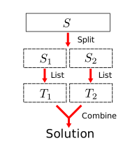
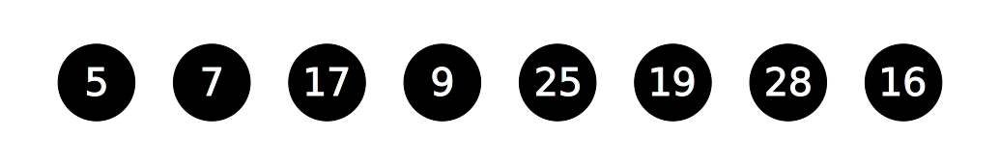
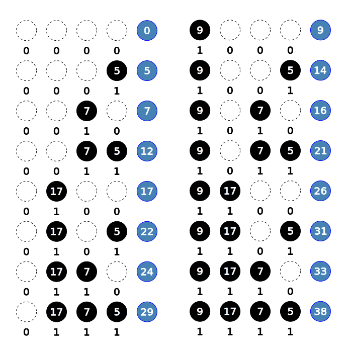
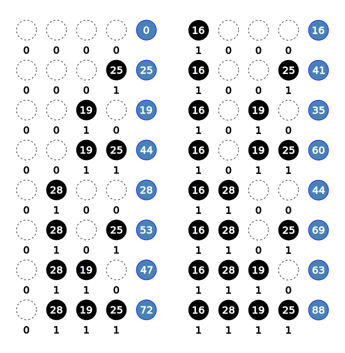
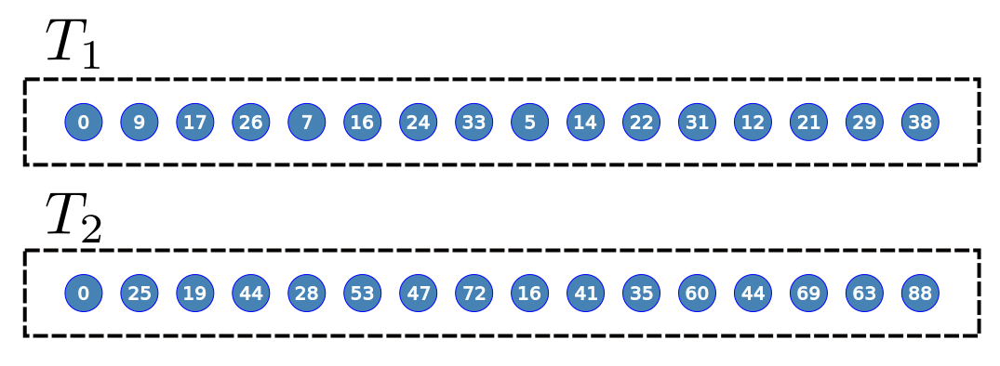
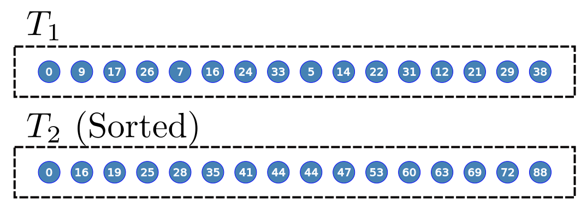

<link rel="stylesheet" href="style.css">

# 半分全列挙
# Split and List

---

## Contents

1. Split and List
2. Subsetsum problem with Split and List
3. Knapsack problem with Split and List
   - Comparation of the type pair
   - lower_bound of the type pair
4. Addition: constructor of vector
5. Exercise

---

# Split and List

---

## Split and List

- The algorithm to split in half, which decrease $O(2^N)$ to $O(2^{\frac{N}{2}})$

- [Source of name](https://link.springer.com/chapter/10.1007%2F978-3-642-16533-7_9)
- [Twitter](https://twitter.com/iwiwi/status/361861277179584514)

---

## Basic method

1. Split in half the set of number: $S_1$ and $S_2$.
2. List the all solutions for each $S_1$ and $S_2$ $\Rightarrow$ $T_1$ and $T_2$.
3. Combine solutions of $x \in T_1$ and $y \in T_2$, with fast-time method.

Source: [Split and list technique for solving hard problems](https://www.slideshare.net/mobile/RohitKumarSingh12/split-and-list-exact-exponential-algorithms)

---

### Image



---

# Subset sum problems with Split and List

---

## Subset sum problems with Split and List

1. Split in half the set of number: $S_1$ and $S_2$.
2. List the all sums of subset in $S_1$, enter them in $T_1$.
3. Do it of all subset in $S_2$, enter them in $T_2$.
4. For each $a$ in $T_1$, determine that $b$ exists in $T_2$ such that $a+b=K$, using binary search.

---

### Image 1/6



---

### Image 2/6

Split to $S_1$ and $S_2$.


---

### Image 3/6

List to $T_1$ from $S_1$



---

### Image 4/6

List to $T_2$ from $S_2$



---

### Image 5/6



---

### Image 6/6

- We want to find $(T_1[i], T_2[j])$ such that $T_1[i] + T_2[j] = K$.
- Sort and binary search.



--- 

### Code 1/3

```cpp
bool subsetSum(vector<int> S, int K)
{
  vector<int> S1, S2;
  // Split to S1 and S2.
  for (int i = 0; i < S.size(); i++) {
    if (i < S.size()/2) S1.push_back(S[i]);
    else S2.push_back(S[i]);
  }
```

---

### Code 2/3

```cpp
  // List from S1 and S2 to T1 and T2.
  vector<int> T1, T2;
  for (int b = 0; b < (1 << S1.size()); b++) {
    int sum = 0;
    for (int i = 0; i < S1.size(); i++) {
      if ((b >> i) & 1) sum += S1[i];
    }
    T1.push_back(sum);
  }
  for (int b = 0; b < (1 << S2.size()); b++) {
    int sum = 0;
    for (int i = 0; i < S2.size(); i++) {
      if ((b >> i) & 1) sum += S2[i];
    }
    T2.push_back(sum);
  }
  sort(T2.begin(), T2.end());
```

---

### Code 3/3

$$
\begin{aligned}
&T_1[i] + T_2[j] = K\\
\Leftrightarrow\ &T_2[j] = K - T_1[i]
\end{aligned}
$$

```cpp
  for (int i = 0; i < T1.size(); i++) {
    auto itr = lower_bound(T2.begin(), T2.end(), K - T1[i]);
    if (itr != T2.end() && T1[i] + *itr == K) return true;
  }

  return false;
}
```

---

### Code: Using map

The type map is made of binary search tree.

```cpp
  ...

  // List from S1 to mp.
  // mp[T] = the number of T.
  map<int, int> mp;
  for (int b = 0; b < (1 << S1.size()); b++) {
    int sum = 0;
    for (int i = 0; i < S1.size(); i++) {
      if ((b >> i) & 1) sum += S1[i];
    }
    mp[sum]++;
  }
  for (int b = 0; b < (1 << S2.size()); b++) {
    int sum = 0;
    for (int i = 0; i < S2.size(); i++) {
      if ((b >> i) & 1) sum += S2[i];
    }
    if (mp.count(K - sum)) return true;
  }
  return false;
}
```

---

# Knapsack Problems with Split and List

---

## Knapsack Problems with Split and List

1. Split in half the set of number: $S_1$ and $S_2$.
2. List the all combination of items in $S_1$, enter them in $T_1$.
3. Do it of all items in $S_2$, enter them in $T_2$.

---

### Code 1/4

```cpp
typedef long long ll;
typedef pair<ll, ll> P;
constexpr ll LLINF = 1100000000000000000LL;

// S[i] := (weight, value)
ll knapsack(vector<P>& S, ll W)
{
  // Split S to S1 and S2
  vector<P> S1, S2;
  for (int i = 0; i < S.size(); i++) {
    if (i < S.size()/2) S1.push_back(S[i]);
    else S2.push_back(S[i]);
  }
```

---

### Code 2/4

```cpp
  // List S1 and S2 to T1 and T2.
  vector<P> T1, T2;
  for (int b = 0; b < (1 << S1.size()); b++) {
    P item(0, 0);
    for (int i = 0; i < S1.size(); i++) {
      if ((b >> i) & 1) {
        item.first  += S1[i].first;
        item.second += S1[i].second;
      }
    }
    T1.push_back(item);
  }
  for (int b = 0; b < (1 << S2.size()); b++) {
    P item(0, 0);
    for (int i = 0; i < S2.size(); i++) {
      if ((b >> i) & 1) {
        item.first  += S2[i].first;
        item.second += S2[i].second;
      }
    }
    T2.push_back(item);
  }
```

---

4. Removing unnecessary thing:


- We can remove item-$j$. (weight is heavier but value smaller).
- After removing them, it satisfies that $w_i \lt w_j \Rightarrow v_i \lt v_j$
  - If sorted, $w_i \lt w_{i+1} \Rightarrow v_i \lt v_{i+1}$

---

### Extract necessary things.

Instead of removing necessary things, we extract necessary things.


---

### Code 3/4

```cpp
  // Extract from T2 to T2p
  sort(T2.begin(), T2.end());
  vector<P> T2p;
  if (!T2.empty()) T2p.push_back(T2[0]);
  for (int i = 1; i < T2.size(); i++) {
    if (T2p.back().second < T2[i].second) {
      T2p.push_back(T2[i]);
    }
  }
```

---

5. For each item $a$ in $T_1$, find that  item $b$ in $T_2$ such that
   $(\text{weight of }a)+(\text{weight of  }b) \ge W$, using binary search.
   The answer is maximum value of combinations by $a$ and $b$.

---

### Code 4/4

$$
\begin{aligned}
& (\text{weight of }T_1[i]) + (\text{weight of }T_2'[j]) \le W\\
\Leftrightarrow\ & (\text{weight of }T_2'[j]) \le W - (\text{weight of }T_1[i])
\end{aligned}
$$

```cpp
  ll ret = -1;
  for (int i = 0; i < T1.size(); i++) {
    if (T1[i].first > W) continue;
    auto itr = lower_bound(T2p.begin(), T2p.end(), make_pair(W - T1[i].first, LLINF)) - 1;
    ret = max(ret, T1[i].second + itr->second);
  }
  return ret;
}
```

---

#### Supplement: comparation of pair

- $(a_1, a_2) \lt (b_1, b_2) \Leftrightarrow a_1 \lt b_1 \lor (a_1 = b_1 \land a_2 \lt b_2)$
- So, $(x, y) \lt (x, \text{INF})$ for all $y$.

---

#### Supplement: lower_bound with pair

- If you want to find the first element $a[i]$ such that $a[i].\text{first} \gt X$: 
```cpp
auto itr = lower_bound(a.begin(), a.end(), make_pair(X, INF));
```

- If you want to find the last element $a[i]$ such that $a[i].\text{first} \le X$: 
```cpp
auto itr = lower_bound(a.begin(), a.end(), make_pair(X, INF)) - 1;
```

---

## Sammary

- Split and List is a method of splitting to two set and listing by them.
- Split and List is allowed to solve in the time complexity $O(2^{\frac{N}{2}})$

---

## Addition: construction of vector

```cpp
  vector<int> S1, S2;
  // Split to S1 and S2.
  for (int i = 0; i < S.size(); i++) {
    if (i < S.size()/2) S1.push_back(S[i]);
    else S2.push_back(S[i]);
  }
```

---

Using constructor:
```cpp
  vector<int> S1(S.begin(), S.begin() - S.size()/2);
  vector<int> S2(S.begin() - S.size()/2, S.end());
```
It is convenient!

---

## Exercise

- [ARC017 C: 無駄なものが嫌いな人](https://atcoder.jp/contests/arc017/tasks/arc017_3)
  - English statement is next page.
  - Hint is next next page.
- [Educational Codeforces Round 32 E. Maximum Subsequence](https://codeforces.com/contest/888/problem/E)

---

## ARC017: People who dislike extra things.

### Statement

I dislike extra thing. It is no use thinking the usual knapsack problem.
I want to put items in the knapsack, whose sum of weight is **exactly** equal to the size of knapsack.
I want you to enumerate the number of how to choose items.

---

### Input:

```txt
N X
w1
w2
:
wN
```

- N: the number of items. $1 \le N \le 32$.
- X: the size of knapsack. $1 \le X \le 10^9$.
- wi: the weight of i-th item. $1 \le w_i \le 5 \times 10^7$.

### Output

Print the number of how to choose items whose sum of weight is equal to $X$.

Sample is [here](https://arc017.contest.atcoder.jp/tasks/arc017_3)

---

### Hint

- This is not knapsack problem, but **subset sum problem**.
- Make a backet (or histgram) by the type of map &lt;long long, long long&gt;.
