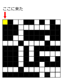
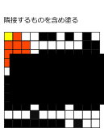
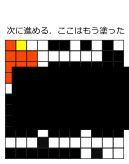
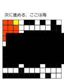
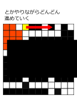

<link rel="stylesheet" href="style.css">

# もっとUnion Find

---

## これをやったよね

[AOJ1160 - How Many Islands?](http://judge.u-aizu.ac.jp/onlinejudge/description.jsp?id=1160&lang=jp)

もしくは類題のこれをやった:
[AOJ1130 - Red and Black](http://judge.u-aizu.ac.jp/onlinejudge/description.jsp?id=1130&lang=jp)

---

### Description

マップの情報から，島がいくつあるのかを数えてね
隣接は8近傍を考えてね

### Input

島の情報が$w\times h$で与えられる．
大陸は$1$，海は$0$で書かれる

### Output

島の個数を出力してね

### Constraint

- $w,h \le 50$

---

### 復習: 色塗りDFS/BFS

- マップを走査
- 塗られていない陸地があったら隣接しているところ含め塗る
  - 隣接しているところを塗っていくのにDFS/BFS

---

#### 動き1/5



---

#### 動き2/5



---

#### 動き3/5



---

#### 動き4/5



---

#### 動き5/5



---

### 走査する部分

<div class="two-column">

<div>

- さっきは赤色で塗ってたけど、
  結局白(= 海)で塗ってしまえば良い
- 周りは海で囲まれているものとする(故に1-index)
  すると端の判定の実装をサボれる

</div>

<div>

```cpp
int mp[60][60];
```

```cpp
int ans = 0;
for (int y = 1; y <= h; y++) {
  for (int x = 1; x <= w; x++) {
    if (mp[y][x] == 1) {
      mp[y][x] = 0;
      dfs or bfsで隣接部分塗る(y, x);
      ans++;
    }
  }
}
cout << ans << endl;
```

</div>
</div>

---

### 復習: 色塗りBFS

```cpp
int dy[] = {-1, -1, 0, 1, 1, 1, 0, -1};
int dx[] = {0, 1, 1, 1, 0, -1, -1, -1};
```

```cpp
void dfs(int y, int x) {
  for (int i = 0; i < 4; i++) {
    int ny = y + dy[i];
    int nx = x + dx[i];
    if (mp[ny][nx] == 1) {
      mp[ny][nx] = 0;
      dfs(ny, nx);
    }
  }
}
```

---

### 復習: 色塗りDFS

```cpp
int dy[] = {-1, -1, 0, 1, 1, 1, 0, -1};
int dx[] = {0, 1, 1, 1, 0, -1, -1, -1};
```

```cpp
void bfs(int y, int x) {
  queue<pair<int, int>> q;
  q.push(make_pair(y, x));
  while (!q.empty()) {
    int y = q.front().first;
    int x = q.front().second;
    q.pop();
    for (int i = 0; i < 4; i++) {
      int ny = y + dy[i];
      int nx = x + dx[i];
      if (mp[ny][nx] == 1) {
        mp[ny][nx] = 0;
        q.push(make_pair(ny, nx));
      }
    }
  }
}
```

---

### Union Findを使おう

「あるマスが他のマスと連結しているか？」と言い換える
&rArr; UnionFind木使いたくなるね!

---

### 実装

周囲8方向で1が隣接していたらuniteする．
実は対称性から4方向でも良いのだがわかりやすさのため8方向のままにしている

<div class="two-column">

<div>

```cpp
UnionFind uf(h, w);
for (int y = 1; y <= h; y++) {
  for (int x = 1; x <= w; x++) {
    for (int i = 0; i < 8; i++) {
      int ny = y + dy[i];
      int nx = x + dx[i];
      if (mp[ny][nx] == mp[y][x]) {
        uf.unite(y, x, ny, nx);
      }
    }
  }
}
```

</div>

<div>

陸地の親をsetに詰めてsizeを出力

```cpp
set<pair<int, int>> st;
for (int y = 1; y <= h; y++) {
  for (int x = 1; x <= w; x++) {
    if (mp[y][x] == 1) {
      st.insert(uf.find(y, x));
    }
  }
}
cout << st.size() << endl;
```

</div>
</div>

いやでもUnionFind木どう実装するねん

---

<div class="mycode" style="text-align: center;">

pair&lt;<span class="azuki">int</span>, <span class="azuki">int</span>&gt; par[60][60];

par[i][j] = 点(i,j)の親は誰か

</div>

---

#### UnionFind木を作る
この前のときは親にサイズを持たせていたけど
今回の場合分かりづらくなるので，parとsizeは分けるね．

<div class="two-column">

<div>

```cpp
#define MP make_pair
#define FI first
#define SE second
#define PB push_back

struct UnionFind {
  pair<int, int> par[60][60];
  int sz[60][60];
  int cnt;
  UnionFind(int h, int w) {
    for (int i = 0; i <= h; i++) {
      for (int j = 0; j <= w; j++) {
        par[i][j] = MP(i, j);
        sz[i][j] = 1;
      }
    }
  }
  pair<int, int> find(int i, int j) {
    if (MP(i, j) == par[i][j]) return par[i][j];
    return par[i][j] = find(par[i][j].FI, par[i][j].SE);
  }
```

</div>

<div>

```cpp
  void unite(int i1, int j1, int i2, int j2) {
    pair<int, int> x = find(i1, j1);
    pair<int, int> y = find(i2, j2);
    if (x == y) return;
    int xsize = sz[x.FI][x.SE];
    int ysize = sz[y.FI][y.SE];
    if (xsize < ysize) {
      par[x.FI][x.SE] = y;
      sz[y.FI][y.SE] += sz[x.FI][x.SE];
    } else {
      par[y.FI][y.SE] = x;
      sz[x.FI][x.SE] += sz[y.FI][y.SE];
    }
  }
  bool same(int i1, int j1, int i2, int j2) {
    return find(i1, j1) == find(i2, j2);                
  }
};
```

</div>

</div>

---

### 補足: こんな実装もあります

<div class="mycode" style="text-align: center;">

map&lt;pair&lt;<span class="azuki">int</span>,<span class="azuki">int</span>&gt;,pair&lt;<span class="azuki">int</span>,<span class="azuki">int</span>&gt;&gt; par;

par[p] = 点pの親は誰か

</div>
細かい実装は任せる

---

### かえって面倒くさくないか?

- UnionFind木をライブラリで持っている場合に限り楽
- DFSやBFSに比べてデバックが用意
  - ただしバグってないUnionFind木を持っている場合に限る

---

この例では4近傍を連結とみなしました

## Animation: DFS

## Animation: BFS

## Animation: UnionFind木
