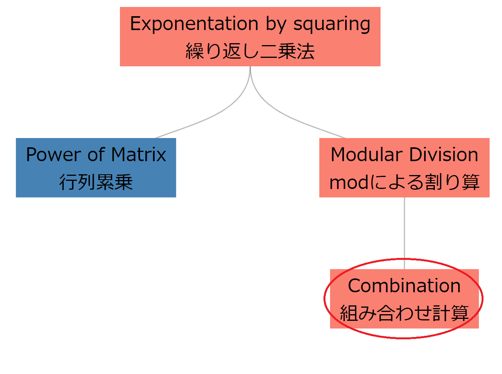

# Combination

---

## Relationships



---

## Contents

1. How to calculate $_nC_r$ with Pascal's triangle
2. How to calculate $_nC_r$ with definition

---

## 1. Combination with Pascal's triangle

$$
_nC_r = _{n-1}C_{r-1} + _{n-1}C_r
$$


---
### Implementation

Many combinational problems ask a number modulo 1000000007

```cpp
#define MOD 1000000007
#define MAX_N 1000
long long comb[MAX_N][MAX_N];
void makeComb()
{
  comb[0][0] = 1;
  for (int i = 1; i < MAX_N; i++) {
    for (int j = 0; j <= i; j++) {
      if (j == 0 || j == i) comb[i][j] = 1;
      else comb[i][j] = (comb[i-1][j-1] + comb[i-1][j]) % MOD;
    }
  }
}
// You can use comb[n][r].
```

---

### Complexity

- Array size to make $_nC_r$: $n \times n$
  &rArr; time complexity to initialize table is $O(n^2)$.
  &rArr; time complexity to answer $_nC_r$ is $O(1)$.
- $n \leq 10^3$ : OK.
- $n = 10^4$ : maybe MLE (Memory Limit Exceeded)

---

## 2. Combination with definition

$$
_nC_r = \frac{n!}{r!(n-r)!}
$$

- $n$ is big
  &rArr; $n!$ and $r!(n-r)!$: overflow.
  &rArr; need modulo operation
- need to (numer % MOD) and (denom % MOD)
  &rArr; usual divition: ❌
  &rArr; need **the division in modular arthmetics**

---


### Implementation

- It is ok to use this code as library.
- If you want to know _moddiv_, please see the slide "mod"

The code is next page.

---

```cpp
#define MAX_N 2000000
long long fact[MAX_N];
void factInit() {
  fact[0] = 1;
  for (int i = 1; i < MAX_N; i++) {
    fact[i] = (i * fact[i - 1]) % MOD;
  }
}
// Combination(binomial coefficients)
long long comb(int n, int r) {
  if (n < r || n < 0 || r < 0) return 0;
  return moddiv(fact[n], (fact[r] * fact[n - r]) % MOD);
}
```

---

### Complexity

- The array size to make $n!$: $n$
  &rArr; time complexity to initialize table is $O(n)$.
- On moddiv(a, b), $b^{p-2}$ is calculated.
  On calculation of $b^{p-2}$, exponentation by squaring is used.
  &rArr; time complexity to answer $_nC_r$ is $O(\log p)$.
- In sammary, time complexity to answer $_nC_r$ $k$ times is $O(n + k \log p)$.

---

## Addition: Permutation

$$
_nP_r = \frac{n!}{(n-r)!}
$$

```cpp
// Permutation
long long perm(int n, int r) {
  if (n < r || n < 0 || r < 0) return 0;
  return moddiv(fact[n], fact[n - r]);
}
```

- Time complexity to answer $_nP_r$ $k$ times is $O(n + k \log p)$.

---

- If you don't have to answer $_nP_r$ many times, bellow is better.
$$
_nP_r = n \cdot (n-1) \cdots (n-r-2) \cdot (n-r-1)
$$
```cpp
long long perm(int n, int r) {
  long long ret = 1;
  for (int i = n; i > n-r; i--) {
    (ret *= i) %= MOD;
  }
  return ret;
}
```

- Time complexity to answer $_nP_r$ one time is $O(n)$.

---

## Addition: Combination with repetitions

$$
_nH_r = _{n+r-1}C_r
$$

- Remember that formula completely: 🙅🏻‍♂️
- Remember as **ball and bar**: 🙆🏻‍♂️

---

### Example

Counting nonnegative integer solutions on linear Diophantine equation.
$$
x_1 + x_2 + \cdots + x_n = r
$$

<div style="text-align: center; font-family: MS Gothic; font-size: 48px;">
〇〇〇|〇〇|〇|||〇| ... |〇
</div>

- $r$ balls
- $n - 1$ bars
&rArr; pattern is $_{n+r-1}C_r$

---

Anyway, I wrote code (but I think you don't have to use it).

```cpp
// Combination with repetitions
// (Homogeneous product, Multiset coefficients)
long long homo(int n, int r) {
  if (n == 0 && r == 0) return 1;
  return comb(n + r - 1, r);
}
```

---

## Verify
This: https://yukicoder.me/problems/no/117

---

## Exercises

- ABC034C: 経路
  Statement: Japanese only but same as Project Eular No.15
  
- ABC110D: Factorization

---

# Appendix

---

## Is it really true?

$$
a = n!, b = r!(n-r)!
$$

Suppose $\pmod p$, 
<link rel="stylesheet" href="../style.css">
<div class="flex-container" style="align-items: flex-start;">

$$
\begin{aligned}
\displaystyle
\frac{a}{b} &\equiv c^{\prime} (\text{reduced})\\
            &\equiv c_1 (\text{mod})
\end{aligned}
$$

$$
 
$$

$$
\begin{aligned}
\displaystyle
\frac{a}{b} &\equiv \frac{a^{\prime}}{b^{\prime}} (\text{mod each})\\
&\equiv a^{\prime}b^{\prime p-2} (\text{moddiv})\\
&\equiv c_2
\end{aligned}
$$

</div>

Then, 
$$
c_1 = c_2
$$
