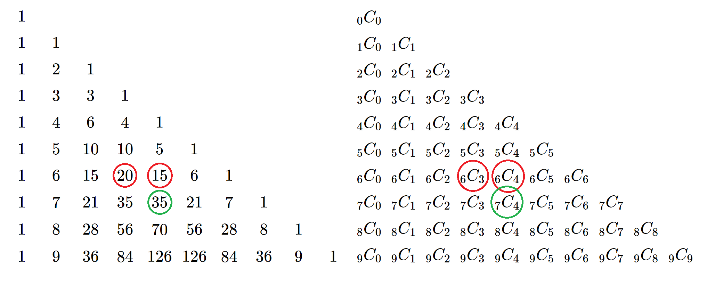
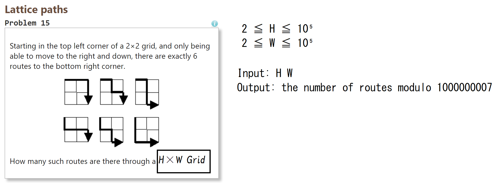

# Combination

---

## Contents

1. How to calculate $_nC_r$ with Pascal's triangle
2. How to calculate $_nC_r$ with definition
3. Addition: $_nP_r$ and $_nH_r$

---

## 1. Combination with Pascal's triangle

$$
_nC_r = _{n-1}C_{r-1} + _{n-1}C_r
$$



---
### Implementation

Many combinational problems ask a number modulo 1000000007

```cpp
#define MOD 1000000007
#define MAX_N 1000
long long comb[MAX_N][MAX_N];
void makeComb()
{
  comb[0][0] = 1;
  for (int i = 1; i < MAX_N; i++) {
    for (int j = 0; j <= i; j++) {
      if (j == 0 || j == i) comb[i][j] = 1;
      else comb[i][j] = (comb[i-1][j-1] + comb[i-1][j]) % MOD;
    }
  }
}
// You can use comb[n][r].
```

---

- Array size to make $_nC_r$: $n \times n$
- $n \leq 10^3$ is OK.
- $n = 10^4$ may cause MLE (Memory Limit Exceeded)

---

## 2. Combination with definition

$$
_nC_r = \frac{n!}{r!(n-r)!}
$$

- If $n$ is big, $n!$ and $r!(n-r)!$ cause overflow.
  So we have to apply the modulo operation.
- But once we apply the mod to numerator and denominator, we cannot do reduction.
  So we have to apply **the division in modular arthmetics**

---

### Implementation

- It is ok to use this code as library.
- If you want to know _moddiv_, please see the slide "mod"

The code is next page.

---

```cpp
#define MAX_N 2000000
long long fact[MAX_N];
void factInit() {
  fact[0] = 1;
  for (int i = 1; i < MAX_N; i++) {
    fact[i] = (i * fact[i - 1]) % MOD;
  }
}
// Combination(binomial coefficients)
long long comb(int n, int r) {
  if (n < r || n < 0 || r < 0) return 0;
  return moddiv(fact[n], (fact[r] * fact[n - r]) % MOD);
}
```
---

## Addition: Permutation

$$
_nP_r = \frac{n!}{(n-r)!}
$$

```cpp
// Permutation
long long perm(int n, int r) {
  if (n < r || n < 0 || r < 0) return 0;
  return moddiv(fact[n], fact[n - r]);
}
```

---

## Addition: Combination with repetitions

$$
_nH_r = _{n+r-1}C_r
$$

- But I think you should not remember that formula.
- You should remember that as **ball and bar**

---

Anyway, I wrote code (but I think you don't have to use it).

```cpp
// Combination with repetitions
// (Homogeneous product, Multiset coefficients)
long long homo(int n, int r) {
  if (n == 0 && r == 0) return 1;
  return comb(n + r - 1, r);
}
```

---

## Verify
This: https://yukicoder.me/problems/no/117

---

## Exercises

- ABC034C: 経路
  Statement: Japanese only but same as Project Eular No.15
  
- ABC110D: Factorization
