<link rel="stylesheet" href="../style.css">

# Dijkstra法

---

## 前提

- priority_queueを知っている


---

## Dijkstra法とは

- 重み付き有向グラフの単一始点最短経路(長)を求めるアルゴリズム
- 単一始点最短経路: スタート地点を1個決め,そこから他の点への最短経路
- 計算量はpriority_queueを利用して$O(|E|log|V|)$

---

## 基本的な考え

- 最短経路最小の点を選んではその値を伝播させていく
- 「小さい方から選んで最適解が得られる」点では貪欲法,  
  「前の情報を利用して次の情報を更新する」点ではDP  
  に見える

---

- スタート位置: Sと略記
- dist[i] := Sからiへの(暫定)最短経路長
1. Sから他の地点への最短経路dist[i]: 初期値はINF
   SからSへの最短経路dist[S]: もちろん0
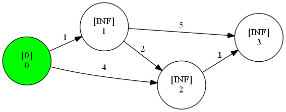

---

2. 最短経路最小の点Xを選び,Xを最短経路として確定．
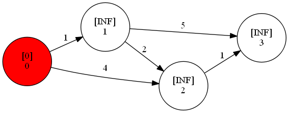

---

3. そこから伸びる任意の点Yをみる
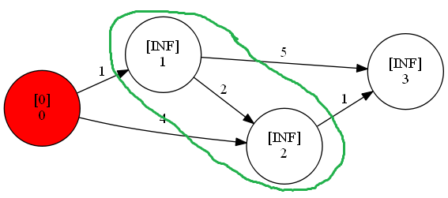

---


X&rarr;Yへ遷移したときそれが最短経路になるなら更新

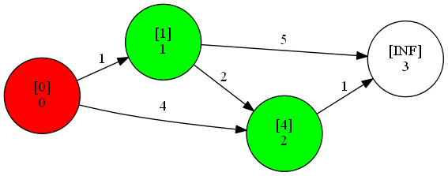


4. 更新できるものが無くなるまで2，3を繰り返す

---

## 例

---

<font color="red">●</font> : 最短経路が確定している
<font color="green">●</font> : 経路の更新が1回以上行われた

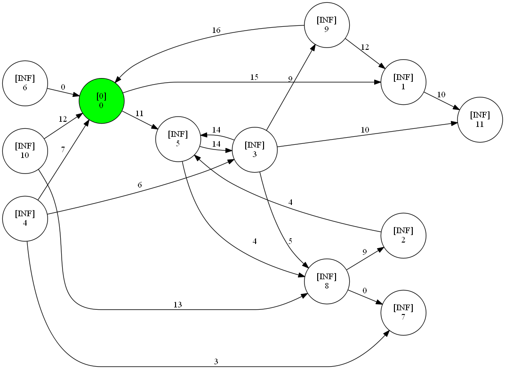

---

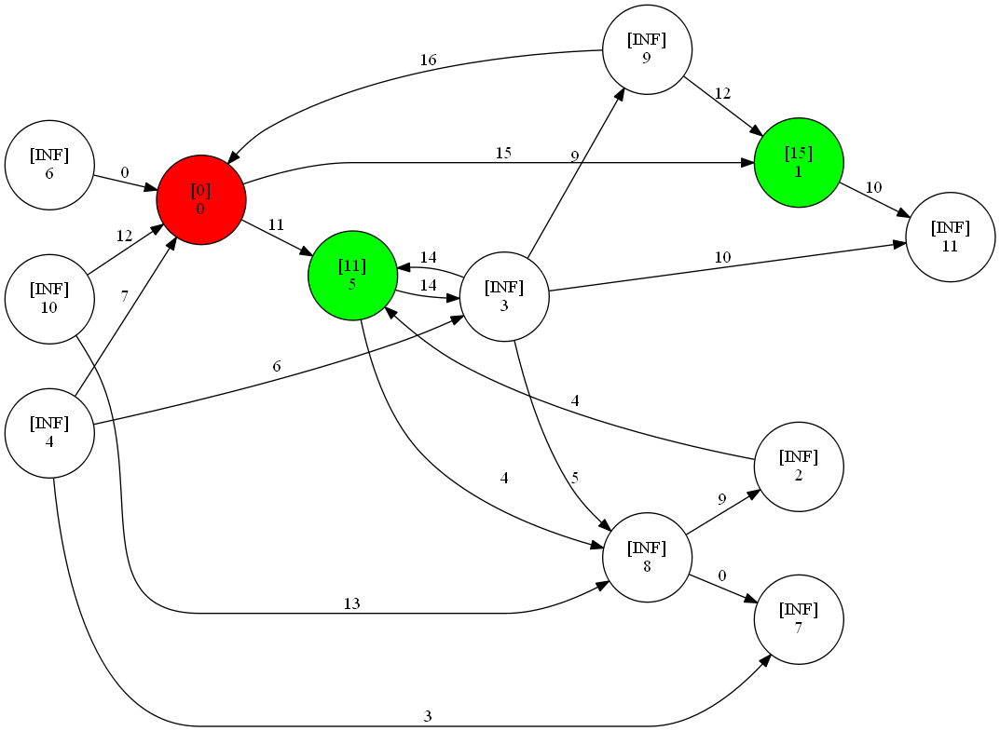

---

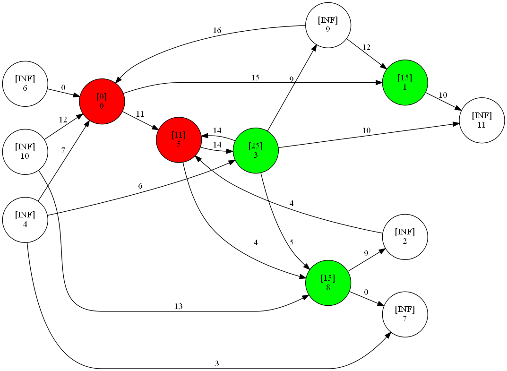

---

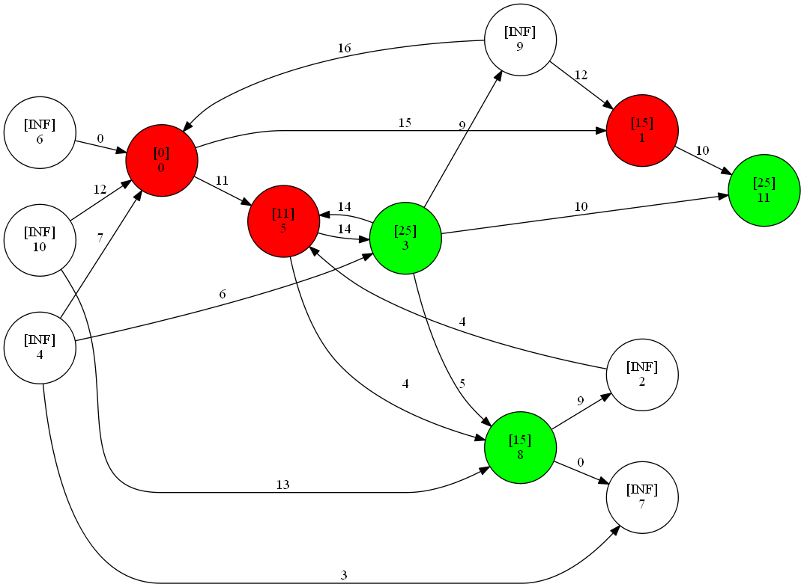

---

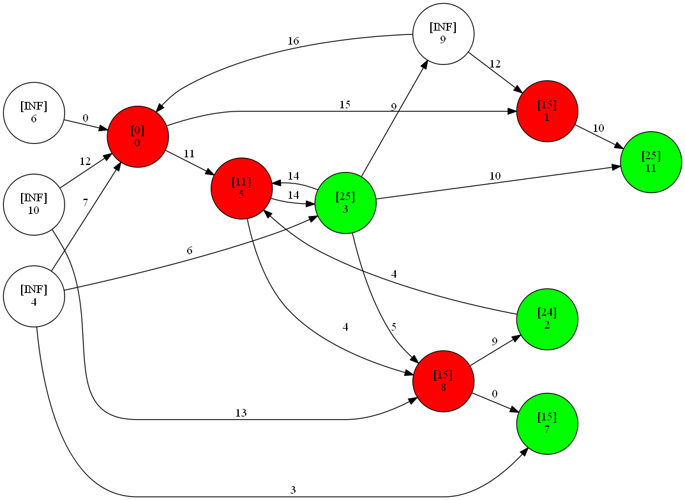

---

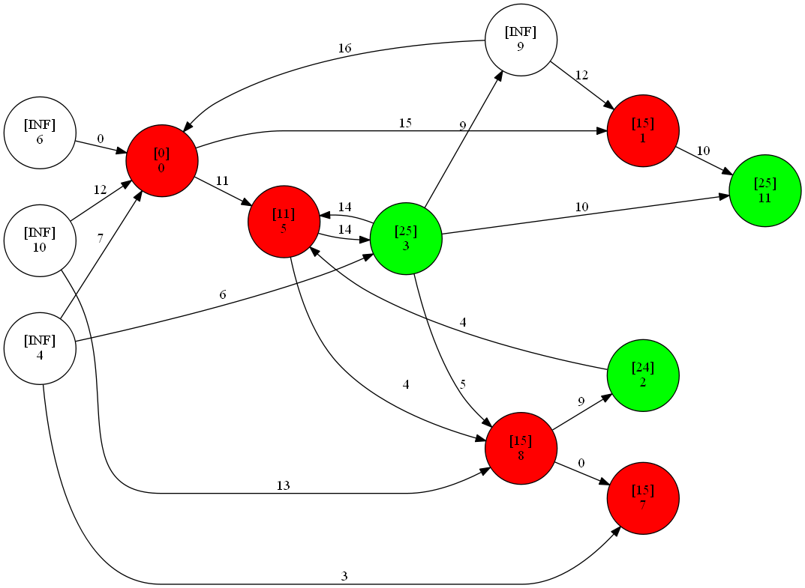

---

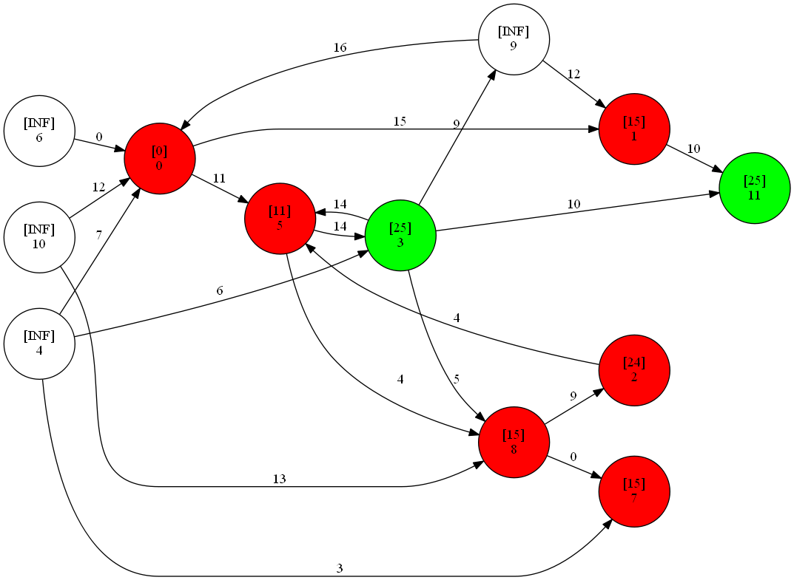

---

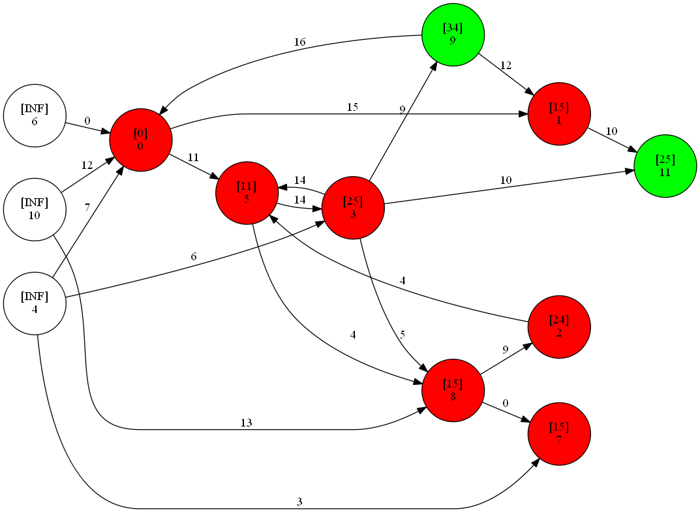

---

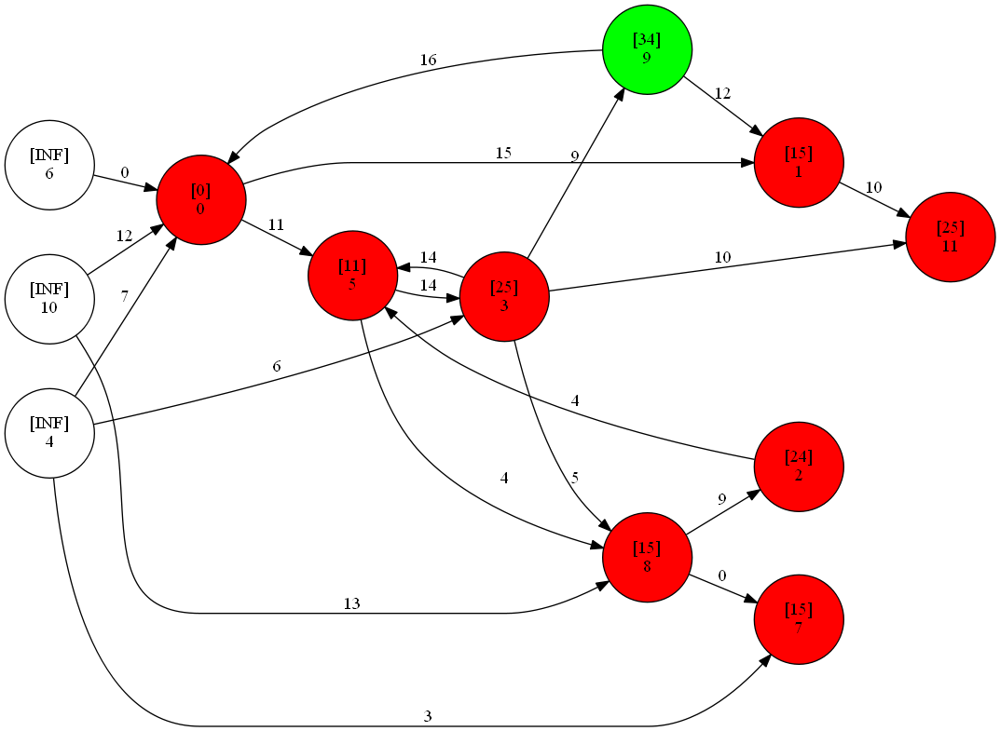

---

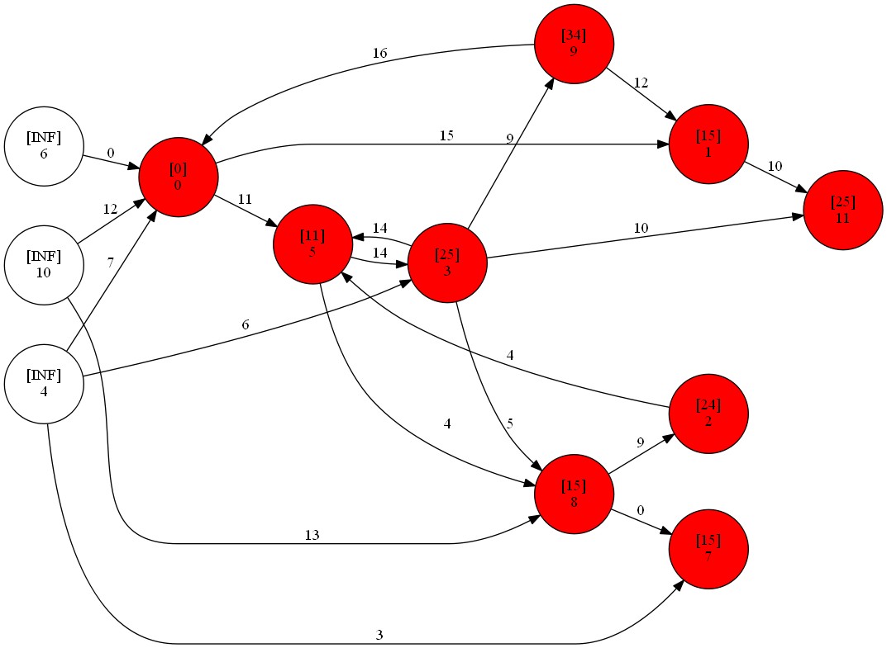

---

## 実装

- 再掲
2. 最短経路最小の点Xを選び,Xを最短経路として確定．
3. Xから伸びる任意の点Yをみる
   X&rarr;Yへ遷移したときそれが最短経路になるなら更新
4. 更新できるものが無くなるまで2.を繰り返す

- 最小のものを取り出す&rArr;priority_queueが使える  
- コストの小さい順に取り出したい  
  &rArr; (コスト,点の番号)の順のpair型で管理
- 更新できるものが無くなる&rArr;queueが空かどうかを判定すればよい

---

## コード

幅優先探索(BFS)と書き方がほとんど同じことに注目
すると，空で書けるようになると思う

---

```cpp
#define NODE 110000 
typedef long long ll;
typedef pair<ll, ll> P;

constexpr ll INF = 110000000000;
```

---

```cpp
vector<vector<P>> edge(NODE); // edge[i] = (点,コスト)
ll dist[NODE];
void dijkstra(int s)
{
  for (int i = 0; i < NODE; i++) {
    dist[i] = INF;
  }
  priority_queue<P, vector<P>, greater<P>> pq;
  pq.push(make_pair(0, s));  // (コスト, 点)の順に注意
  dist[s] = 0;
  while (!pq.empty()) {
    auto tmp = pq.top(); pq.pop();
    int v = tmp.second;
    if (dist[v] < tmp.first) continue;

    for (auto to : edge[v]) {
      int nv = to.first;
      ll cost = to.second;
      if (dist[v] + cost < dist[nv]) {
        dist[nv] = dist[v] + cost;
        pq.push(make_pair(dist[nv], nv));
      }
    }
  }
}
```

---

使い方
```cpp
int main()
{
  // 点0 -> 点1に向けて重み123の辺を張る
  edge[0].push_back(make_pair(1, 123))
  // 点1 -> 点2に向けて重み45の辺を張る
  edge[1].push_back(make_pair(1, 45))
  // スタート地点を0としてDijkstra法をやる
  dijkstra(0)
  // 0->0, 0->1, 0->2 での最短経路を出力
  cout << dist[0] << endl;
  cout << dist[1] << endl;
  cout << dist[2] << endl;
}
```

---
実行結果
<div class="console">
  <p>0</p>
  <p>123</p>
  <p>168</p>
</div>

---

## 応用

- グリッド上のダイクストラとかもあるので,
  空で書けたほうが良い

---

## 注意
- 無向グラフの最短経路を求めたいなら，双方向に辺を張れば良い．
- Dijkstra法は，**負の辺が1つでも含まれていると正しく動作しない**．その場合，Bellman-Ford法やWarshall-Floyed法を検討する．

---

## 経路復元

- 今までは最短経路長のみ求めていたが,  
  最短経路そのものを求めることも可能
- 2種類の方法がある
   - prev[i] := iへの最短経路において,1個前に通った点  
     を定義する
   - distとedgeをうまく照らし合わせる

---

## 演習
