# 最小全域木(Minimum Spanning Tree)

---

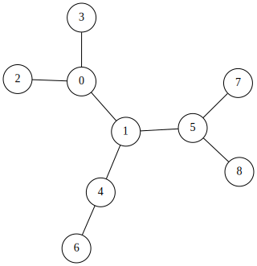

## 最小全域木 is 何

の前にグラフ理論の用語のおさらい

### 木(Tree)
閉路の無いグラフ

---
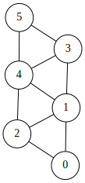
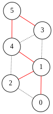
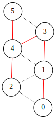

### 全域木(Spanning Tree)
木でありすべての頂点を持つような部分グラフ

---


### 最小全域木(Minimum Spanning Tree)
辺の重みの総和最小の全域木

---

## 最小全域木を求める方法

- プリム法: ダイクストラっぽい方法．
  プログラミング演習IIでやった記憶があるけどみんなはどうなんだろう
- クラスカル法: UnionFind木を利用した方法．

UnionFind木を持ってるならクラスカル法の実装の方が圧倒的に楽
なのでクラスカル法のみ紹介します

---

## クラスカル法

- Greedy: 最小の重みの辺を選ぶ
- それを選んでみても閉路ができないようなら追加する

---

- $i$番目の辺$(v,u)$
- $i$番目の辺を選んで閉路ができる
  &rArr; $v$と$u$は同じ連結成分に属している
  連結成分($\fallingdotseq$同一グループ)判定といえばUnionFind木だね!

---

## Image

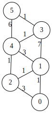
辺の重みの小さい順に調べる:
1 1 1 1 1 3 3 7 6
連結性の判定はUnionFind木

---

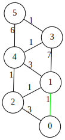

---

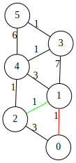

---

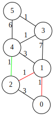

---

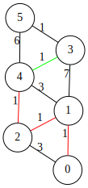

---


---

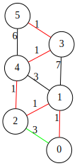

---

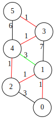

---

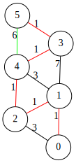

---

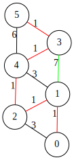

---


---

## Code
```cpp
#define FI first
#define SE second
typedef long long ll;
// edge[i] = (重み, (点, 点))
vector<pair<ll, pair<int, int>>> edge
```
```cpp
ll MST(int V, vector<pair<ll, pair<int, int>>>& edge)
{
  UnionFind uf(V);
  sort(edge.begin(), edge.end());
  ll ret = 0;
  for (auto e : edge) {
    if (!uf.same(e.SE.FI, e.SE.SE)) {
      uf.unite(e.SE.FI, e.SE.SE);
      ret += e.FI;
    }
  }
  return ret;
}
```
