<link rel="stylesheet" href="style.css">

# Segment Tree

---

## 目次

1. Segment Treeの基礎知識 (P.153)
2. RMQでのケーススタディ (P.154,155)
3. POJ2991 Crane (P.156～P.158)
4. 転倒数 (P.162)

---

## Segment Tree とは

- 区間に関するクエリを$O(\log n)$で処理できるデータ構造。
- 通称セグ木

データを区間で管理して...
1. データに何かする
2. 区間$[l,r)$に関するデータの何かを取得

---

## Example

### Range Minimum Query(RMQ)

int型配列$a[0], \ldots a[n - 1]$について
次の2つのクエリをたくさん処理せよ
1. update(i,x): a[i] &larr; x.
2. getmin(l,r): 
 $\min(a[l],a[l+1],\ldots ,a[r-2],a[r-1])$.

---

### Range Sum Query(RSQ)

int型配列$a[0], \ldots a[n - 1]$について
次の2つのクエリをたくさん処理せよ
1. update(i,x): a[i] &larr; x.
2. getsum(l,r): get the value of
 $a[l]+a[l+1]+ \cdots +a[r-2]+a[r-1]$.

---

### RMQ と RSQ

配列の要素数$n$, クエリ数$Q$

- 素朴実装: $O(Qn)$
- でもセグ木なら: $O(Q\log n)$

---

###  2つの共通点

- セグ木は「データ」と「演算」を持つ
  (厳密には「データを包含する集合」と「その集合の要素間で定義される二項演算」)

  e.g
- RMQ: int型のデータと「最小値を求める演算子min」
- RSQ: int型のデータと 「和を求める演算子 + 」

---

## どんなものがセグ木に乗せられる？

- 集合と演算が**モノイド**をなす &rArr; セグ木に乗せられる

---

### モノイドって何？

**結合法則**と**単位元**をもつ「データ」と「演算」の組

Associativity: 
$\hspace{2em} (a \cdot b) \cdot c = a \cdot (b \cdot c)$
Identity element:
$\hspace{2em} e \cdot a = a \cdot e = a$

Source: [Wikipedia](https://en.wikipedia.org/wiki/Monoid)

---

### RMQやRSQでのセグ木は本当にモノイド?

- RMQ int型のデータと「最小値を求める演算子min」
  - 結合法則: $\min(\min(a,b),c) = \min(a,\min(b,c))$
  - 単位元は$\text{INF}$: $\min(\text{INF},a)=\min(a,\text{INF})=a$
  
- RSQ: int型のデータと 「和を求める演算子 + 」
  - 結合法則: $(a+b)+c=a+(b+c)$
  - 単位元は$0$: $0+a=a+0=a$

---

## セグ木で実際にどう処理すればよいの

処理の前にデータの管理方法から

- セグ木は二分木である
- 親ノードが子ノードの情報をまとめてくれている
- 葉に生のデータが入っている

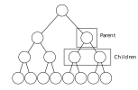

---

### 区間に対するイメージを強める

区間の重なりを考える
&rArr; 下のように表現されることが多い

<div class="flex-container">

<div style="padding-right: 50px;">

例:
- node[0]: 根
- node[1]: node[0]の子
- node[2]: node[0]の子
- node[3]: node[1]の子
- node[4]: node[1]の子
...

</div>

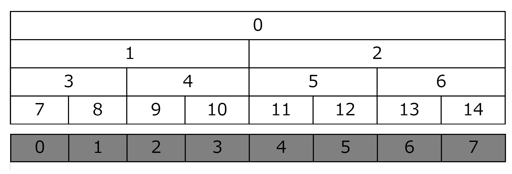

</div>

---

### Example: RMQ

- 生の配列のデータが葉にある
- 親ノードはその子ノードの最小値

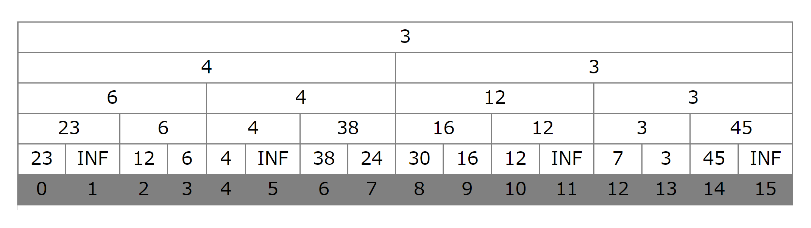

---

### Example: RSQ

- 生の配列のデータが葉にある
- 親ノードはその子ノードの和

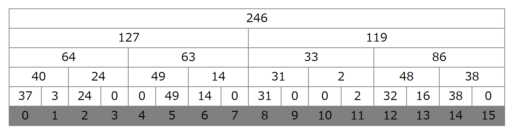

---

### 補足: 二分木の作り方

基本的には配列をで二分木を表現

- 深さ$d$には$2^d$個のノード (根を深さ$0$と表現)
- 葉の数が$n$なら，二分木全体のサイズは$2n-1$
  - 生データは$\textit{node}[n-1]$から$\textit{node}[2n-2]$に入っている

---

### 補足: 二分木の使い方


- $\textit{node}[k]$の子: $\textit{node}[2k+1],\textit{node}[2k+2]$

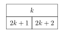

---

- $\textit{node}[k]$の親: $\textit{node}[(k-1)/2]$

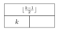

---

# Case study: RMQ

---

- 初期化: 全部単位元で埋める

```cpp
#define INF 1100000000

int n;
vector<int> node;

void init(int sz) {
  n = 1;
  while (n < sz) n *= 2;
  node.resize(2*n - 1, INF);
}
```

---

- 何かの配列で初期化したいならこうする:
  - 葉ノードは$n-1$から始まることに注目

```cpp
void init(int sz, vector<int>& a) {
  n = 1;
  while (n < sz) n *= 2;
  node.resize(2*n - 1, INF);

  for (int i = 0; i < a.size(); i++) {
    node[i+n-1] = a[i];
  }
  for (int i = n-2; i >= 0; i--) {
    node[i] = min(node[2*i + 1], node[2*i + 2]);
  }
}
```

---

- update(i, val):
  $node[i+n-1]$を更新した後，その親を更新し，さらにその親を更新し...

- bottom-upに更新していく方法を用いた
  - 場合によってはtop-downな方法も用いられる(POJのCraneとか)

```cpp
void update(int i, int val) {
  i += n - 1;
  node[i] = val;
  while (i > 0) {
    // Go up to parant
    i = (i - 1) / 2;
    node[i] = min(node[2*i + 1], node[2*i + 2]);
  }
}
```

---

- getmin(l,r):
  区間 \[l,r) がどこにあるのかを根から top-down に求めていく
 - 区間の重なりを見る

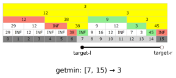

---

#### 区間の重なり

target-l, target-r を $\textit{tl},\textit{tr}$ と書くことにする
 
1. $r \le \textit{tl} \lor \textit{tr} \le l$ : outer.
2. $\textit{tl} \le l \land r \le \textit{tr}$ : inner.
3. $\text{Others}$ : partly overlapped.


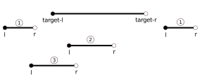

---

1. $r \le \textit{tl} \lor \textit{tr} \le l$
   演算しても意味のない値(単位元)を返してやる
2. $\textit{tl} \le l \land r \le \textit{tr}$
   そのノードの値を返す
3. $\text{Others}$
   $[l, \textit{mid})$ と $[\textit{mid}, r)$ に2分してそれぞれ調べる

---

```cpp
// I want to get min of [tl, tr)
// Now I look at node[k], whose interval is [l, r)
int getmin(int tl, int tr, int k, int l, int r) {
  if (r <= tl || tr <= l) return INF;
  else if (tl <= l && r <= tr) return node[k];
  else {
    int mid = (l + r) / 2;
    int vl = getmin(tl, tr, 2*k + 1, l, mid);
    int vr = getmin(tl, tr, 2*k + 2, mid, r);
    return min(vl, vr);
  }
}
int getmin(int tl, int tr) {
  return getmin(tl, tr, 0, 0, n);
}
```

---

### これらを構造体にまとめる

```cpp
struct SegTree {
  int n;
  vector<int> node;
  SegTree(int sz) {
    n = 1;
    while (n < sz) n *= 2;
    node.resize(n, INF);
  }
  void update(int i, int val) {
    i += n - 1;
    node[i] = val;
    while (i > 0) {
      i = (i - 1) / 2;
      node[i] = min(node[2*i + 1], node[2*i + 2]);
    }
  }
  void getmin(int tl, int tr, int k, int l, int r) {
    if (r <= tl || tr <= l) return INF;
    else (tl <= l && r <= tr) return node[k];
    else {
      int vl = getmin(tl, tr, 2*k + 1, l, (l + r) / 2);
      int vr = getmin(tl, tr, 2*k + 2, (l + r) / 2, r);
      return min(vl, vr);
    }
  }
}
```

---

### 抽象化

```cpp
template<typename T>
struct segtree {
  int n;
  const T ID;
  vector<T> node;
  segtree(int sz, T _ID): ID(_ID) {
    n = 1;
    while (n < sz) n *= 2;
    node.resize(2*n - 1, ID);
  }
  T operate(T a, T b) {
    // Write the operation
  }
  T get(int tl, int tr, int k, int l, int r) {
    if (r <= tl || tr <= l) return ID;
    else if (tl <= l && r <= tr) return node[k];
    else {
      T nl = get(tl, tr, 2*k+1, l, (l+r)/2);
      T nr = get(tl, tr, 2*k+2, (l+r)/2, r);
      return operate(nl, nr);
    }
  }
```

---

```cpp
  T get(int l, int r) {
    return get(l, r, 0, 0, n);
  }

  T update(T target, T val) {
    // Write the update
    // ex: return target + val;
    // ex: return val;
  }

  void set(int i, int x) {
    i += n - 1;
    node[i] = update(node[i], b);
    while (i) {
      i = (i - 1) / 2;
      node[i] = operate(node[2*i + 1], node[2*i + 2]);
    }
  }
};
```

---

### 計算量

- update: 各深さに対して1つのノードしか探索しない &rArr; $O(\log n)$
- getmin: $O(\log n)$なのは感覚的に分かる
  - で終わらすのはまずいので軽く説明します

---

### getminの計算量の軽い説明

主張: 同じ深さで3つ以上のノードが存在することはない
理由: 3つ以上連続していたらどれか2つを親ノードに持ち上げられるから

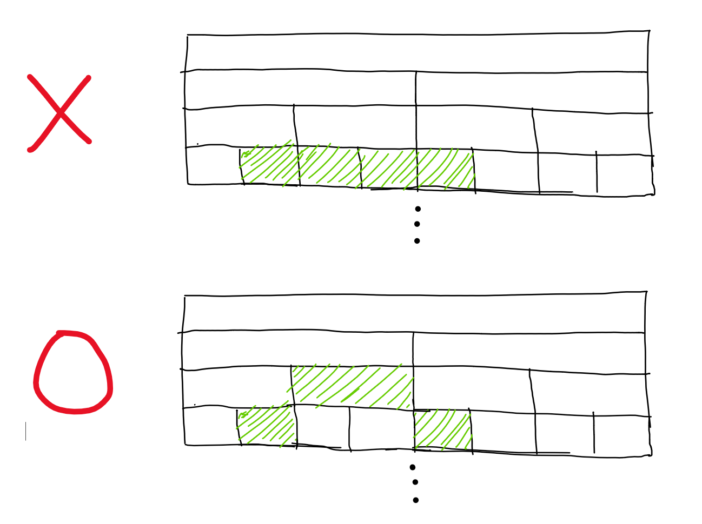

結局各深さで対象区間として選ばれるのは高々2つのノード
&rArr; $O(2\log n) = O(\log n)$

---

## 使い方

```cpp
// RMQ
...
operate(T a, T b) {
  return min(a, b);
}
...
T update(T target, T val) {
  return val;
}
...

SegTree<int> st(N, INF);
```

---


```cpp
// RSQ
...
operate(int a, int b) {
  return a + b;
}
...
T update(T target, T val) {
  return target + val;
}
...

SegTree<int> st(N, 0);
```

---

# POJ 2991 Crane

---

## Statement

クレーンがあります。クレーンは、N個の線分が端点で接続されたものと考えます。
$i$番目の線分の長さは$L_i$です。はじめはすべての線分がまっすぐ接続され、上を向いています。

$C$個のクレーンを動かす命令が来ます。命令は以下の書式で書かれます。
- $S_i\ A_i$ : 線分$S_i$と線分$S_{i+1}$の間の角度を$A_i$度にする
角度は線分$S_i$から反時計回りに$S_{i+1}$を見たときの角度で、最初は180度です。

各命令に対し、それが終わったときのクレーンの先端の座標を出力してください。

---

## Constraint

- $1 \le N \le 10^4$
- $1 \le C \le 10^4$
- $1 \le L_i \le 10^2$
- $1 \le S_i \lt N$
- $0 \le A_i \le 359$

---

## Example

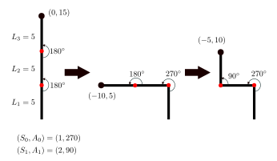

---

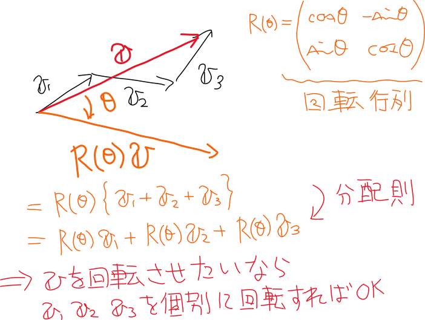

---


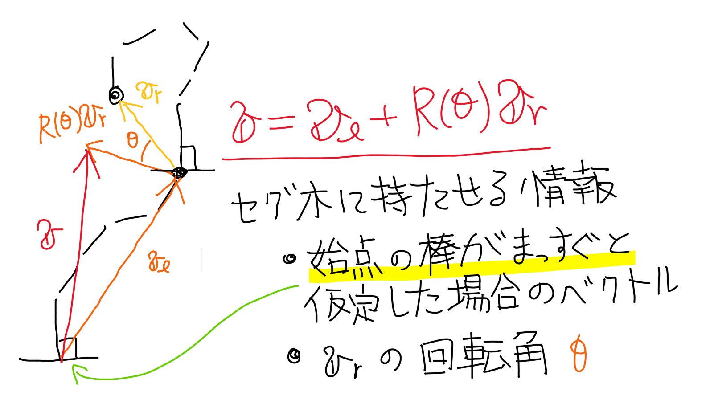

---

- 子のベクトル2つを用いて親のベクトルを作る


---

- 赤丸を軸に回転したいなら赤枠のベクトルを回転


---

- 赤丸を軸に回転したいなら赤枠のベクトルを回転

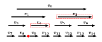

---

- 赤丸を軸に回転したいなら赤枠のベクトルを回転

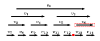

---

- update: 今見ている区間が軸よりRight &rArr; 回転角を更新
  区間の情報が欲しいのでTop Downがやりやすい

---

# 転倒数(反転数)

---

## Statement

数列$\{a_1, a_2, ... , a_n\}$がある。
次の操作を任意の回数行うことができる

- ある$i$を選び、$a_i$と$a_{i+1}$を入れ替える。ただし、$1 \le i \le n$である。
  入れ替えた数列を新たに$\{a_1, a_2, ... , a_n\}$とする。

このとき、数列を昇順に並び変えるために必要な操作回数の最小値を出力せよ

---

## Constraint

- $1 \le n \le 2\times 10^5$
- $0 \le a_i \le 10^9$
- $a_i$はすべて異なる

Source: [AOJ ALDS1_5_D](http://judge.u-aizu.ac.jp/onlinejudge/description.jsp?id=ALDS1_5_D&lang=jp)

---

## Importance

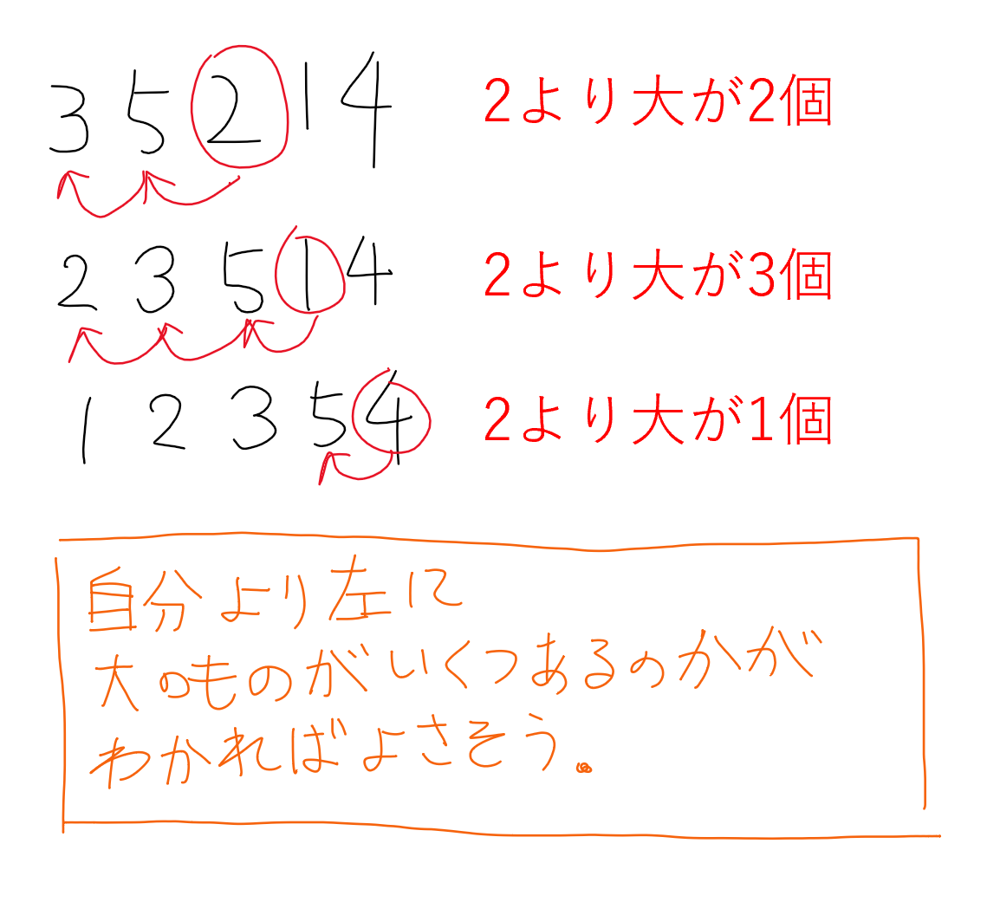

---

## 余事象で見たほうがやりやすい

- $a_1, a_2, ... a_n$と順に見ていく。
- $\textit{num}[x] :=$ 今まで数$x$をいくつ見てきたか？ 
  初めは全部$0$で初期化

- $\textit{num}[0] + \textit{num}[1] + \cdots + \textit{num}[a_i]$ : 自分以下の数がいくつあるか
  これから「今まで見てきた数=$i$」を引いてあげると$a_i$を何回動かせばよいかが出る．

---

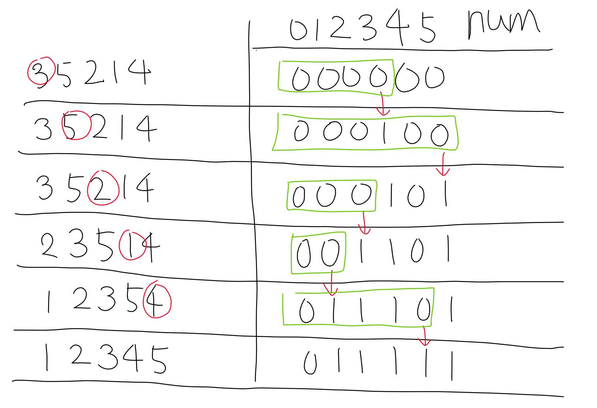

---

というわけで
- $\textit{num}$の1点を決めて1加えたい
- $\textit{num}$のある区間の総和を求めたい

&rArr; これ正にRSQ．セグ木で解ける

---

## 実は

- RSQはオーバーキル
- もっと定数倍軽いデータ構造があります
  &rArr; BIT(Binary Indexed Tree)

---

# 演習

- [ARC008 D タコヤキオイシクナール](https://atcoder.jp/contests/arc008/tasks/arc008_4)
- [CF339D - Xenia and Bit Operations](https://codeforces.com/contest/339/problem/D)
