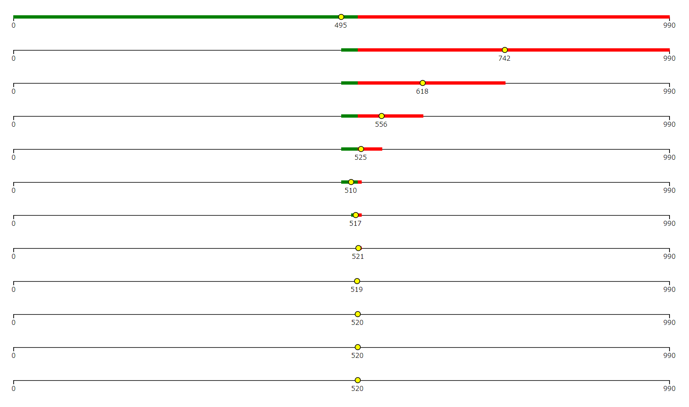
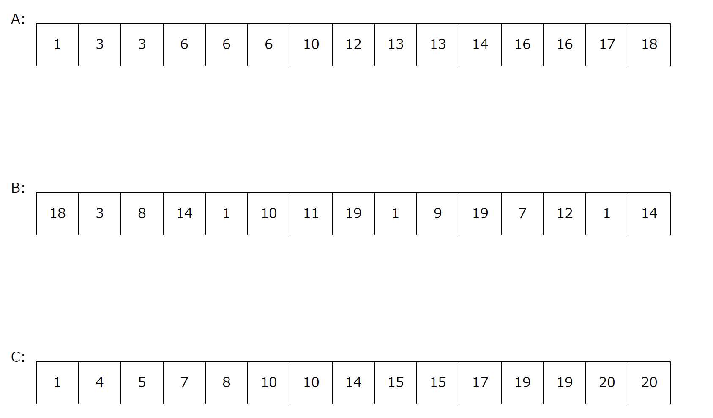
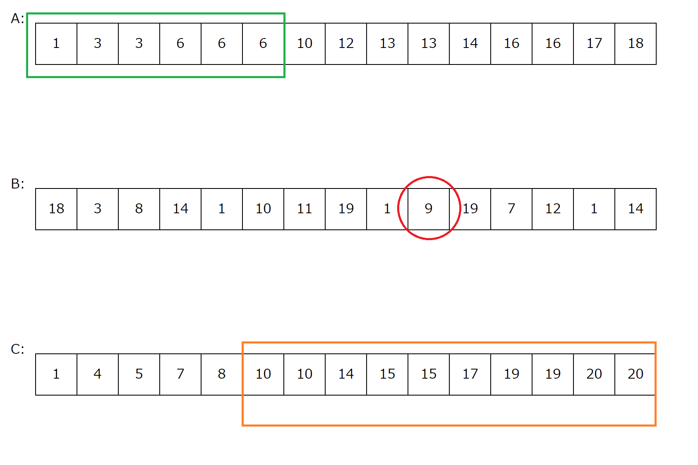
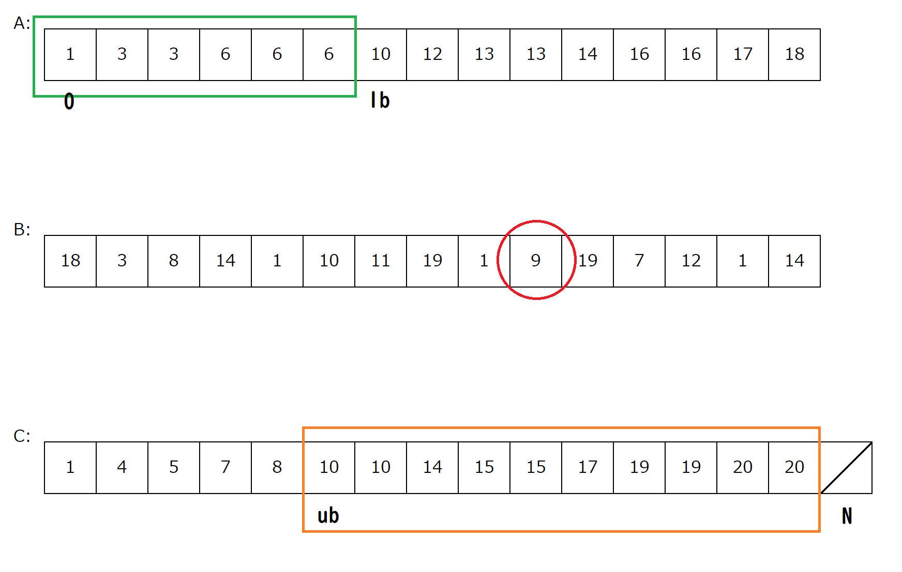

# 二分探索法

---

## 二分探索法とは

- 解の存在範囲を半分に絞っていくことによって  
  計算量を$O(logn)$に抑える探索方法
- **条件を満たす/満たさないの境界がただ一つあれば**利用できるかも

- 方程式の実数解を求めるアルゴリズムは二分法というっぽい
  考え方はほとんど同じ

---

## まずは数当てゲーム

例) 太郎君のTOEICのスコアを当てる(闇)
スコアが520だとする.

---

### 方法1: 0から順に訊く

- 0 &rArr; No
- 1 &rArr; No
- 2 &rArr; No
...
- 520 &rArr; Yes

質問回数: 520回

---

### 方法2: 範囲を半分ずつに絞る
[0, 991)の間にあると仮定
質問: 範囲の半分の位置以上? 未満?

- 495以上 &rArr; [495, 991)の間
- 793未満 &rArr; [495, 793)の間
- 644未満 &rArr; [495, 644)の間
...
- 520以上 &rArr; [520, 522)の間
- 521未満 &rArr; [520, 521)の間

区間内の整数が1つになったので520が答え

---

## 区間が縮んでいく様子

- l: 右端, r: 左端として，区間は[l,r)と書ける
- 以下の事実に注目する
  - lは常に「520以下」
  - rは常に「520より大」

---



---

## 一般化

- **条件を満たす，満たさないの境界がある**  
  <div class="note">&rArr;区間を半分に絞っていくことで境界を探索できる</div>
- 逆にこの条件が無いと二分探索できない


---

## コード

- 変数xについてtrue，falseを返す関数をcheck(x)と置く.
- check(x)にはtrue，falseの切れ目があると仮定

- [l,r)として範囲を徐々に縮めていく

```cpp
int l = (check(x)がtureになるようなx);
int r = (check(x)がfalseになるようなx);
while (r - l > 1) {
  int mid = (l + r) / 2;
  if (check(mid)) l = mid;
  else r = mid;
}
```
check関数が大規模な場合は，このように関数化することがよくある

---

## TOEICスコア当てゲームの実装

```cpp
int score;
cin >> score;

int l = 0， r = 991;
while (r - l > 1) {
  int mid = (l + r) / 2;
  if (mid <= score) l = mid;
  else r = mid;
}
cout << l << endl;
```

---

## 二分探索を書く際に注意すること

- leftの初期値: 常に条件を満たす側  
  rightの初期値: 常に条件を満たさない側  

- なのでもしTOEICのスコアに負の値が存在したら，
  さっきの数当てゲームで初期を[0,991)とするのは不適切

---

## lower_boundとupper_bound

- 「配列中で，〇〇以上の最小のxが知りたい」  
  「配列中で，〇〇より大の最小のxが知りたい」  
  と思うときがよくある &rArr; 二分探索で実現可能

---

- でもC++ではlower_boundとupper_boundという関数が用意されている
  **配列はソートされていないとだめ(単調性が欲しいので)**

---

```cpp
#include <algorithm>

...

// vは昇順ソート済みであると仮定する

// v中でX以上となる最初のイテレータを返す
auto itr1 = lower_bound(v.begin(), v.end(), X); 
// v中でXを超える最初の数のイテレータを返す
auto itr2 = upper_bound(v.begin(), v.end(), X);
```

---

<div class="note">※lower_bound,upper_boundの返り値はイテレータなので，
添え字が欲しい場合は次のようにする</div>

```cpp
#include <algorithm>

...

// vは昇順ソート済みであると仮定する

// v中でX以上となる最初のイテレータを返す
int idx1 = lower_bound(v.begin(), v.end(), X) - v.begin(); 
// v中でXを超える最初の数のイテレータを返す
int idx2 = upper_bound(v.begin(), v.end(), X) - v.begin();
```

詳しくは去年の入門講習会後期第3回参照

---

## 演習

ABC077 C: Snuke Festival

---

## 解答

### 考え方
- **3つのものがあるときは真ん中を固定してみる**
- 他のものが少ない計算量で求められる可能性を検討する

---

- 例としてこれを用意
- A, Cはソートする


---

- Aのほうでは,B[i]未満のものの個数を数えたい
- Cのほうでは,B[i]より大のものの個数を数えたい


---

- lower_bound, upper_boundを使うと求められます


---

### まとめると
- 各B[i]について
- lower_boundで，A中でB[i]以上となる最初の値の位置lbを求める
- upper_boundで，C中でB[i]より大となる最初の値の位置ubを求める
- A中でB[i]未満の個数はlb, C中でB[i]より大の個数は(N-ub)
  &rArr; B[i]固定での場合の数はlb\*(N-ub)通り
- これを各B[i]で求める

---

### 計算量
- A,Cのソート: $O(NlogN)$
- 各B[i]についてA，Cの二分探索: $O(NlogN)$
- 合わせて$O(NlogN)$なので間に合う

---
### 解答
```cpp
typedef long long ll;

int main()
{
  int N; cin >> N;
  vector<int> A(N), B(N), C(N);
  for (int i = 0; i < N; i++) cin >> A[i];
  for (int i = 0; i < N; i++) cin >> B[i];
  for (int i = 0; i < N; i++) cin >> C[i];
  sort(A.begin(), A.end());
  sort(C.begin(), C.end());

  ll ans = 0;
  for (int i = 0; i < N; i++) {
    ll lb = lower_bound(A.begin(), A.end(), B[i]) - A.begin();
    ll ub = upper_bound(C.begin(), C.end(), B[i]) - C.begin();
    ans += lb * (N - ub);
  }
  cout << ans << endl;

  return 0;
}
```
