<style>
img[alt~="center"] {
  display: block;
  margin: 0 auto;
}
</style>
<link rel="stylesheet" href="style.css">

# Greedy Algorithm

---

## Contents

1. Greedy Method
2. Many Problems
3. Greedy Idea

---

## Greedy Algorithm

- Making the locally optimal choice at each stage with the intent of finding a global optimum
  ("Greedy Algorithm", Wikipedia)

---

### Advantage
- Often easy to implement
- Often efficient on time complexity

### Disadvantage
- Often the wrong way.
- Even if it is correct method, often difficult to prove validness.

---

## Famous Problems

- Solution of greedy problems depends on each problems.

Example:
- Coin Changing Problem (Special Case)
- Interval Scheduling

---

### Coin-making Problem (Special Case)

- Japanese: コインの両替問題 (Coin Changing Problem)
- This problem may not be useful in competitive programming because of narrowness of application.

#### Problem Statement 
There are coins: 1yen, 5yen, and 10yen.
Minimize the number of coin used to pay $K$ yen.

---

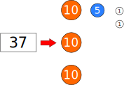

---

#### Solution: Choose maximum yen greedly.

<div class="flex-container" style="align-items: flex-start">
  <div style="padding: 50px 50px 0 0">

- Choose 10yen as many as possible: $N/10$ coins.
  &rArr; Remainder is $N' = N\%10$.
- Choose 5yen as many as possible: $N'/5$ coins.
  &rArr; Remainder is $N'' = N'\%5$.
- Choose 1yen as many as possible: $N''/1$ coins.
  &rArr; Remainder should be $0$.

The answer is $(N/10 + N'/5 + N''/1)$.
</div>

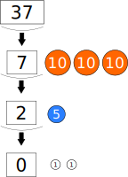

</div>

---

#### Condition to solve by Greedy

- **You don't have to remember this condition.**

Here, $i$-th coin is $c_i$, and coins are sorted in ascending order, and $H(x)$ is defined this:
$$
H(x) = \text{minimum number of coins used to pay $x$ yen}
$$

Then, this is true, we can solve this problem by Greedy:
$$
\begin{aligned}
  & \forall j (1 \le j \le N - 1),\ H(\delta_j)\lt p_j-1 \\
  & (\text{There is a unique $p_j$, $\delta_j$ such that } c_{j+1}=p_jc_j-\delta_j)
\end{aligned}
$$

This problem is a specialization of Unbounded Knapsack Problem (I don't check the proof...)
[硬貨の問題が貪欲法で解けるための条件](https://qiita.com/s417-lama/items/0cdd95fddb2067876896#%E7%A1%AC%E8%B2%A8%E3%81%AE%E5%95%8F%E9%A1%8C%E3%81%A8%E3%81%AF)

---

```cpp
// vc: list of coins, K: coins to pay
int coin_making(vector<int>& vc, int K) {
  sort(vc.begin(), vc.end(), greater<int>());
  int ret = 0;
  for (auto& c : cv) {
    ret += K / c;
    K %= c;
  }
  return ret;
}
```

---

#### General Coin-making Problem

- cannot be solved by Geedy.
- can often be solved by DP.

---

### Interval Scheduling

Problem Statement:
There are $N$ tasks. $i$-th tasks run from $s_i$ to $t_i$.
Task-$i$ and task-$j$ is **disjoint** if two are not overlap as time interval.
Maximize the size of disjoint set of tasks.

---

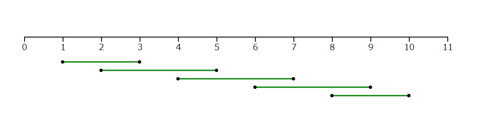

$$
\begin{aligned}
& N = 5\\
& (s_i, t_i) = (1, 3), (2, 5), (4, 7), (6, 9), (8, 10) 
\end{aligned}
$$

---

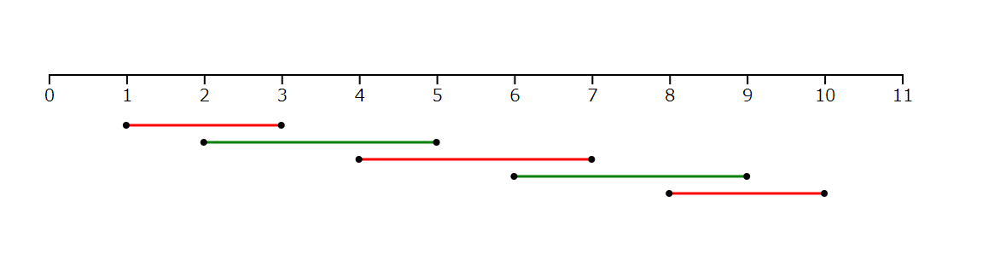

$$
\begin{aligned}
& N = 5\\
& (s_i, t_i) = (1, 3), (2, 5), (4, 7), (6, 9), (8, 10) \\
&\text{ans} = 3
\end{aligned}
$$

---
### Intuition

- If you choose the tasks which has earlier finishing time, tasks you can choose will increase after the step.

---

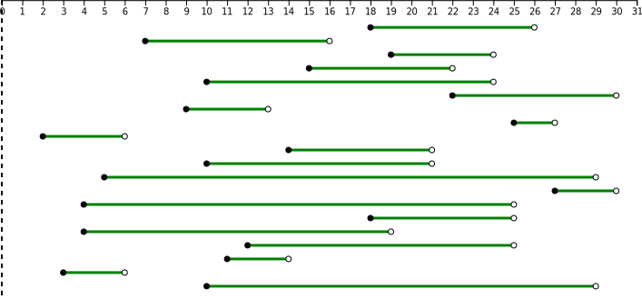

---

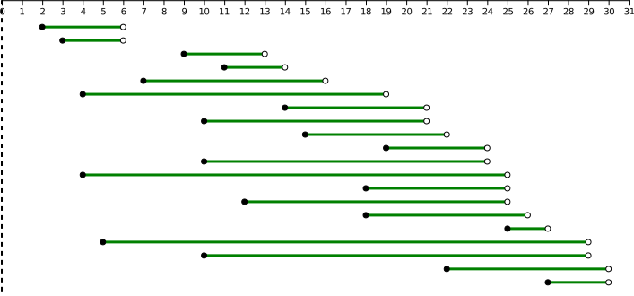

---

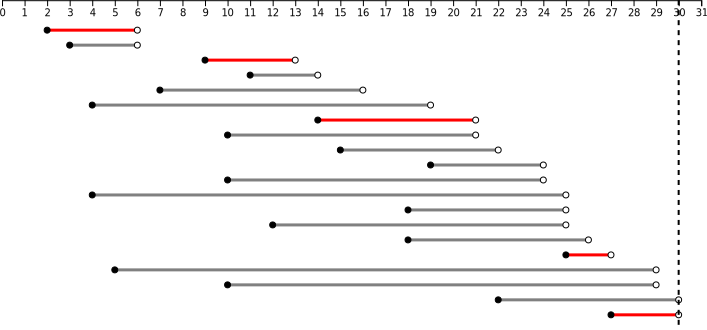

---

- In fact, this idea is true.
- Appendix of this slide describes this proof.

---

```cpp
int interval_scheduling(int N, vector<int>& s, vector<int>& t) {
  vector<pair<int, int>> itv;
  for (int i = 0; i < N; i++) {
    itv.push_back(make_pair(t[i], s[i])); // Note the order: not (s[i], t[i])!
  }
  sort(itv.begin(), itv.end());

  // t: finished time chosen last
  int ans = 0, t = 0;
  for (int i = 0; i < N; i++) {
    if (t <= itv[i].second) {
      ans++;
      t = itv[i].first;
    }
  }
  return ans;
}
```

---

Addition: Meaning of
```cpp
...
  if (t < itv[i].second) {
    ans++;
    t = itv[i].first;
  }
...
```

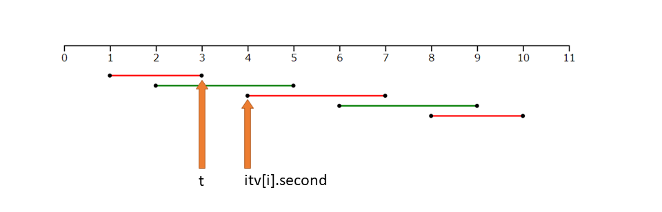

---

## Greedy Idea

- Idea: Problems about lexical order
- Idea: Problems about "Choose 'strict' things for each step"
- Idea: when you think validness of greedy: 
  "Replacement of 'usual thing' for 'optical thing' doesn't get things worse" - said by *drken*:
  More detail describes Appendix of this slide.

---

### Idea: Problems about lexical order

Problems asked a lexicographiclly minimum string is often the idea of greedy:
you choose as lexicographiclly little character as possible.

---

### Idea: Problems about "Choose 'strict' things for each step"

Example:
for each step,
- choose as a small/little thing as possible
- choose as a big/large thing as possible
- choose as a near thing as possible
- choose as a far thing as possible
- choose as lexicographiclly little character as possible.


---


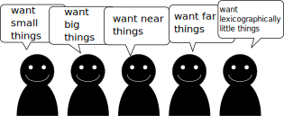
- For that reason, sorting is often good strategy.

---

### Proof of validness

- Some typical problems should be in your mind (e.g. interval scheduling)

---

- In a contest, you shouldn't have to prove the validness strictly.
  You shouldn't spend so much time to prove that the contest is over.


---

- But you should think rough proof.


---

- If you have an idea of greedy method in a contest whitch is difficult to prove, it is good to try to make **counterexample**.
  If you cannot find it, this method may be true.

---

## Famous Greedy Algorithm

This algorithm choose as a small thing as possible
- Dijkstra Algorithm (Shortest Path)
- Prim and Kruskal Algorithm (Minimum Spanning Tree)
- Ford Fulkerson Algorithm (Maximum Flow)

---

# Appendix

---

## Proof of validness of greedy method on Interval Scheduling

- Understanding this proof may not contribute to your growness on competitive programming.
- But it is interesting.

---

### Outline

1. Formal definition of Interval Scheduling
2. Having optimal substructure
3. Includion of the earliest finishing task in the answer.

This proof is based on "Introduction to Algorithms (CLRS)."

---

### Formal definition of Interval Scheduling

Input: Set of intervals: $S_i = \{a_1, a_2, \cdots, a_n\}$

$$
a_i := \text{right-open interval } [s_i, t_i).
$$

$$
a_i \text{ and } a_j \text{ is disjoint } \overset{def}{\Leftrightarrow} f_i \le s_j \lor f_j \le s_i
$$

Output: Maxium size set of mutually disjoint tasks

---

Supplement:
$$
a_i \text{ and } a_j \text{ is disjoint } \overset{def}{\Leftrightarrow} f_i \le s_j \lor f_j \le s_i
$$
In other words, two intervals are not overlapped.


---

### Optimal substructure of the Interval Scheduling

#### What is optimal substructure ?

In computer science, a problem is said to have optimal substructure if an optimal solution can be constructed from optimal solutions of its subproblems.
("Optimal substructure", Wikipedia)

---
Example: Knapsack Problem

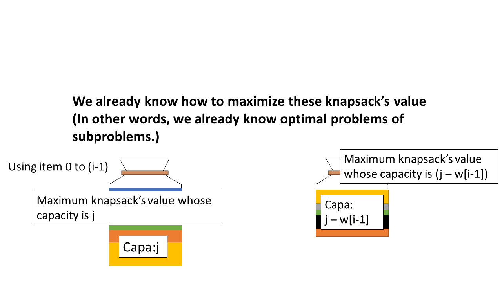

---

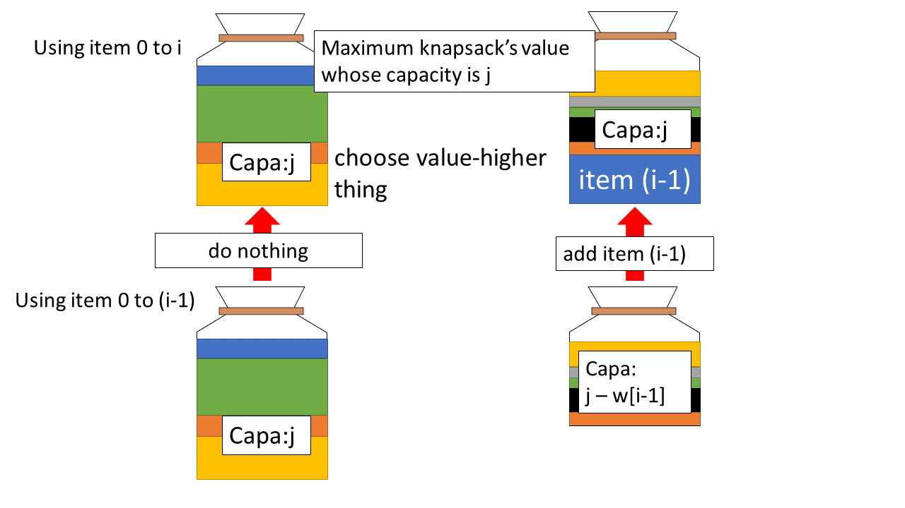

---

#### Optimal substructure of the Interval Scheduling


$$
\begin{aligned}
&\hspace{4em} S_{ij} := \{a_n \mid f_i \le s_n \land f_n \lt s_j\}\\
&\hspace{4em} A_{ij} := \text{the answer of Interval Scheduling for } S_{ij}\\
&\text{then if } a_k \in A_{ij},\\
&\hspace{4em}A_{ik} := A_{ij} \cap S_{ik}\\
&\hspace{4em}A_{kj} := A_{ij} \cap S_{kj}\\
&\hspace{4em}A_{ij} = A_{ik} \cup \{a_k\} \cup A_{kj}\\
&\hspace{4em}\therefore |A_{ij}| = |A_{ik}| + 1 + |A_{kj}|\\
&\text{In other words, } A_{ij} \text{ consists in } A_{ik} \text{ and } A_{kj}.
\end{aligned}
$$

---

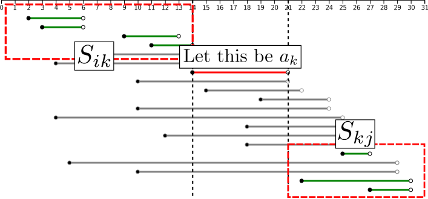

---

$$
\begin{aligned}

&\text{Lem1. } A_{ik} \text{ is the answer of Interval Scheduling for } S_{ik}\\
&\text{Proof: }\\
&\hspace{4em}A_{ik} := A_{ij} \cap S_{ik} \Rightarrow A_{ik} \subset S_{ik}\\
&\text{If we could find } A^\prime_{ik} \text{ such that }  A^\prime_{ik},\subset S_{ik} \land  |A^\prime_{ik}|\gt |A_{ik}|\\
&\text{Note that } A^\prime_{ik} \cap A_{kj} = \emptyset \text{ , then}\\
&\hspace{4em} |A^\prime_{ik}| + 1 + |A_{kj}| \gt |A_{ik}| + 1 + |A_{kj}| = |A_{ij}|\\
&\text{That cntradicts the assumution that } A_{ij} \text{ is an optimal solutions. }

\end{aligned}
$$

We can also prove in the same way that $A_{kj}$ is the answer of Interval Scheduling for $S_{kj}$.

---

3. Includion of the earliest finishing task in the answer.
$$
\begin{aligned}

&\text{Lem2. }\\
&\hspace{4em}S_k := \text{no empty subproblems}\\
&\hspace{4em}a_m := \text{an activity in } S_k \text{ with the earliest finish time}\\
&\hspace{4em}A_k := \text{the answer of Interval Scheduling for } S_k\\
&\text{then, } a_m \in A_k.\\
\end{aligned}
$$

---

$$
\begin{aligned}
&\text{Proof: Let } a_j \text{ be the activity in } A_k \text{ with the earliest finish time. }\\
&\hspace{2em}\text{If } a_j = a_m \text{ , we are done. }\\
&\hspace{2em}\text{If } a_j \neq a_m \text{ , let } a_j \text{ be replaced to } a_m:\\
&\hspace{4em} A^\prime_k = A_k-\{a_j\}\cup\{a_m\}\\
&\hspace{2em} \text{The tasks in } A^\prime_k \text{ are disjoint. }\\
&\hspace{4em} \because A_k \text{ is disjoint},\\
&\hspace{5em}  \text{The definition of } a_j,\\
&\hspace{5em}  f_m \le f_j.\\
&\hspace{2em} |A^\prime_k| = |A_k| \text{, so we substitute } A^\prime_k \text{ for } A_k.\\
&\text{In conclusion, } a_m \in A_k.
\end{aligned}
$$

---

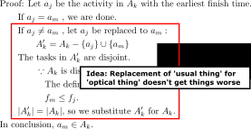

---

### Note

- Idea: "Replacement of 'usual thing' for 'optical thing' doesn't things worse" is said by *drken*:
  Ref: [AtCoder 版！蟻本 (初級編)](https://qiita.com/drken/items/e77685614f3c6bf86f44)
  Ref: [AtCoder AGC 029 B - Powers of two (600 点)](http://drken1215.hatenablog.com/entry/2018/12/16/021900)

---

## Excercise

- AGC001A - BBQ Easy
- ABC076C - Dubious Document 2
- ABC103D - Islands War

---

### Answer

### AGC001A
- You should choose two minimum numbers from $\{L_1, L_2, \cdots, L_{2N}\}$ and make pair.
  Because minimum number has an effect on score.
- In sammary, let's sort $\{L_i\}$ and make pair in asceding order.

---

```cpp
#include <iostream>
#include <vector>
#include <algorithm>

using namespace std;

int main()
{
  int N; cin >> N;
  vector<int> L(2*N);
  for (int i = 0; i < 2*N; i++) cin >> L[i];
  sort(L.begin(), L.end());
  int ans = 0;
  for (int i = 0; i < 2*N; i += 2) {
    ans += L[i];
  }
  cout << ans << endl;
  return 0;
}
```

---

### ABC076C
- You want to place 'a' at as much left as possible.
- Searching substring $T$ in $S$ from back to front.
- Making small function makes your implement easy.
- If you want to search from back, reverse makes your implement easy.

---

```cpp
#include <iostream>
#include <algorithm>
#include <string>

using namespace std;

bool check(string& S, string& T, int idx)
{
  for (int i = 0; i < T.size(); i++) {
    if (i + idx >= S.size()) return false;
    if (S[i + idx] != T[i] && S[i + idx] != '?') return false;
  }
  return true;
}

int main()
{
  string S, T;
  cin >> S >> T;
  reverse(S.begin(), S.end());
  reverse(T.begin(), T.end());

  for (int i = 0; i < S.size(); i++) {
    if (check(S, T, i)) {
      for (int j = 0; j < T.size(); j++) {
        S[i + j] = T[j];
      }
      for (int i = 0; i < S.size(); i++) {
        if (S[i] == '?') S[i] = 'a';
      }
      reverse(S.begin(), S.end());
      cout << S << endl;
      return 0;
    }
  }
  cout << "UNRESTORABLE" << endl;

  return 0;
}
```

---

### ABC103D

Reduction to Interval Scheduling

- It is no use choosing two intervals which are mutually overlapped.
  If you remove one interval, another interval need not be removed.
  So, you only choose mutually disjoint intervals.
- If a interval is not overlapped of all other intervals, it should be chosen.
  &rArr; It looks Interval Scheduling...

---

- Here, the intervals are sored in the accending order on $b_i$.
  Let $A$ be an answer of Interval Scheduling.
- If an element in $A$ is removed, a request told in problem statement is not satisfied.
- If an element not in $A$ is added, it is overlapped to some intervals in $A$.
- If a interval is $(a_i, b_i)$, you only remove the bridge which links $(b_i-1)$ to $b_i$.
- So, $|A|$ is problem's answer.

---

Example: Dotted line shows positions of removing bridge.
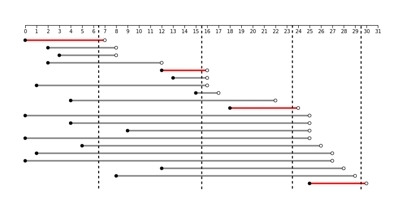

---

```cpp
#include <iostream>
#include <vector>
#include <algorithm>

using namespace std;

int interval_scheduling(int N, vector<int>& vs, vector<int>& vt) {
  vector<pair<int, int>> itv;
  for (int i = 0; i < N; i++) {
    itv.push_back(make_pair(vt[i], vs[i]));
  }
  sort(itv.begin(), itv.end());

  int ans = 0, t = 0;
  for (int i = 0; i < N; i++) {
    if (t <= itv[i].second) {
      ans++;
      t = itv[i].first;
    }
  }
  return ans;
}

int main()
{
  int N, M; cin >> N >> M;
  vector<int> s(M), t(M);
  for (int i = 0; i < M; i++) cin >> s[i] >> t[i];
  cout << interval_scheduling(M, s, t) << endl;
  return 0;
}
```
