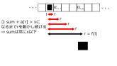
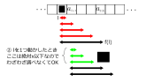
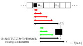
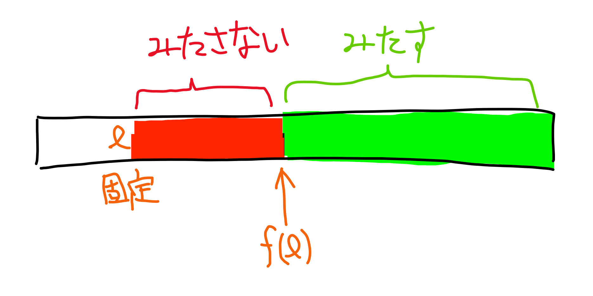

<link rel="stylesheet" href="style.css">

# 尺取り法

---
## 尺取り法 is 何

- 海外では two pointers とか呼ばれているらしい
  - 2つの変数lとrを使ってループを書くことから
  - lとrの動きが尺取り虫っぽい
- ある条件を満たす区間についての問題を線形の時間計算量で解く


---

## どんな時に考えるべきか

- ある条件を満たす区間について考えたくなったら
  - 区間の長さの最大値
  - 区間の長さの最小値
  - 区間の個数
- ただ広義単調増加の性質が必要(後で説明する)

---

## Case study : AOJ DSL_3_C

---

### Description
The Number of Windows
$N$要素の数列$a_1, a_2, \ldots,a_N$と$Q$個のクエリ$x_1, x_2, \ldots x_Q$が与えられます．
各クエリ$x_i$に対して，次の条件を満たす区間$[l,r]$の個数を数えてね
条件: $1 \le l \le r \le N$ かつ $a_l + a_{l+1} \cdots  a_{r - 1} + a_r \le x_i$

### Constraints
- $1 \le N \le 10^5$
- $1 \le Q \le 500$
- $1 \le a_i \le 10^9$
- $1 \le x_i \le 10^{14}$

---

### Input
次の形式で与えられる．

$N$ $Q$  
$a_1 a_2 \cdots a_N$  
$x_1 x_2 \cdots x_Q$  

### Output
条件を満たす区間の個数を数えてね

---


### Sample Input

```txt
6 5
1 2 3 4 5 6
6 9 12 21 15
```

### Sample Output

```txt
9
12
15
21
18
```

---


### 観察: 区間の切れ目

$l$を固定して考えてみると

$$
\begin{aligned}
a_l + a_{l+1} + &\cdots + a_{r-1} + a_r \le x_i\\
&\Downarrow\\
a_l + a_{l-1} + &\cdots + a_{r-1} \le x_i
\end{aligned}
$$

条件を満たす区間は連続しているみたい．
なので満たす/満たさないの切れ目を探してみよう

---


とりあえず$r = l,l+1,\ldots$と探索してみて，
初めて和が$x$を超えるような$r$:
$$
a_l + \cdots + a_r > x_i
$$
を求めてみる．すると，
$$
a_l + \cdots + a_{r'} \le x_i
$$

となる区間$[l,r']$の個数は$(r - l)$となる．
&rArr;各$l$に対して$x$を超える最初の$r$を求めればよさそう

---


```cpp
typedef long long ll;
```

```cpp
// for each query as x
ll ans = 0;
for (ll l = 0; l < N; l++) {
  ll r, sum = 0;
  for (r = l; r < N; r++) {
    sum += a[r];
    if (sum > x) break;
  }
  ans += r - l;
}
cout << ans << endl;
```

---

### 計算量

- 各クエリに対して: $O(Q)$
- 各$l$に対して: $O(N)$
- $\mathrm{sum} > x$となるまで$r$を動かし続ける: $O(N)$

&rArr; $O(QN^2)$: 勿論 <span class="state-label tle">TLE</span>
$\because N \le 10^5$ and $Q \le 500$

---


### 重要な観察: 広義単調増加

$f(l) = a_l + \cdots + a_r > x_i$となる最初の$r$

とすると，$f(l)$は広義単調増加関数になる: $f(l) \le f(l + 1)$

---



---



---



---


$\mathrm{sum}=$ 条件を満たす区間 $[l, r)$の和
$\mathrm{sum}$が条件を満たす側なのか満たさない側なのかちゃんと意識して詰める．
そうしないとバグらせ太郎に成り下がります．
(while文の条件に注意 sum <= xではない)
(for文最後に注意，lを動かすための準備)

```cpp
int r = 0, sum = 0;
for (l = 0; l < N; l++) {
  while (r < N && sum + a[r] <= x) {
    sum += a[r];
    r++;
  }
  ans += r - l;

  if (r == l) r++;
  else sum -= a[l];
}
```

---

## 時間計算量

- 各クエリに対して: $O(Q)$
- 尺取り: $O(N)$

&rArr; $O(QN)$: <span class="state-label ac">AC</span>


---


## Demo

- $O(N)$を感じよ
- 確かに尺取り虫っぽい


(pdfファイルだと動かないかも)

---

## 補足
<div class="two-column">

<div>


「条件を満たす」とか「満たさない」とか，何かに似てない?  
&rArr; 二分探索
実際累積和に対してにぶたんすると今回の例題も解ける．間に合うが$O(QN\log N)$なので少し遅い

</div>

```cpp
// asum: aの累積和
for (int l = 0; l < N; l++) {
  int r = upper_bound(asum.begin(), asum.end(), x)
  ans += r - l;
}
cout << ans << endl;
```

</div>

---

## もう一問やってみる: POJ 3061: Subsequence

---

### Description
長さ$N$の数列$a_1, \ldots , a_N$と整数$S$が与えられる．次の条件を満たす区間$[l,r]$のうち，長さ最小のものを求めてね．
条件: $a_l + a_{l+1} + \cdots + a_r \ge S$

### Constraints

- $10 < N < 10^5$
- $S < 10^8$
- $a_i \le 10^4$

---

### Input
$N$ $S$  
$a_1 a_2 \ldots a_N$  

### Output
条件を満たす長さ最小の区間について，その長さを出力してね

---


### Sample Input

```txt
10 15
5 1 3 5 10 7 4 9 2 8
```

### Sample Output

```txt
2
```

---

### 考察

$l$を固定して$r$を高速に求めることを考えてみる．
&rArr;「累積和を作ってにぶたん」はできそう．実際それでできる．<span class="state-label ac">AC</span>

---

### 尺取り法かも?と思って考察

$l$を固定してみる．
$f(l)$を条件を満たす最小の$r$とする:
$$
a_l + a_{l + 1} + \cdots + a_r \ge S
$$

---



### 観察(1)

$f(l)$は条件を満たす/満たさないの境界になってる．
- $r$が$f(l)$以上 &rArr; 常に満たす
- $r$が$f(l)$未満 &rArr; 常に満たさない

---

### 観察(2)

$f(l) \le f(l + 1)$．
だって$f(l)$は和が$S$以上になるぎりぎりの$r$だったから:
$$
\begin{aligned}
a_l + a_{l + 1} + &\cdots + a_r \ge S\\
&\Downarrow\\
a_{l + 1} + &\cdots + a_r < S\\
\end{aligned}
$$

---

$\mathrm{sum} =$ 条件を満たす最小の区間$[l,r)$の和
whileの条件がさっきと微妙に違う(バグらせ太郎のスライドを思い出して)
&rArr;$r$のループ終了後は必ず$\mathrm{sum} \ge S$となっている
$r$が端に着くともう$\mathrm{sum} \ge S$となることはないのでbreakしちゃう(バグらせ太郎のスラry)
```cpp
ll ans = INF;
ll r = 0, sum = 0;
for (ll l = 0; l < N; l++) {
  while (r < N && sum < S) {
    sum += a[r];
    r++;
  }
  if (r >= N) break;
  ans = min(ans, r - l);
  if (r == l) r++;
  else sum -= a[l];
}
cout << ans << endl;
```


---

## まとめ

- 尺取り法はある条件を満たす区間についての問題を解くための方法
  - 区間の長さの最大/最小/数え上げ
- $l$を固定して$r=f(l)$を求めたときに
  - f(l)は条件を満たす/満たさないの境界
  - f(l)は広義単調増加
  
  という性質が尺取り法を可能にする

---

## 実装の気持ち
- $l$と$r$を動かす
  - $l$はふつうにforループ
  - $r$は条件の境界まで動かす
- 停止後の状態が条件を満たすのか満たさないのかちゃんと考えないとバグらせ太郎になる
- だいたいこんなテンプレ

```cpp
for (int l = 0; l < N; l++) {
  while (r < N && (状態に関する条件式)) {
    状態を更新
    r++;
  }
  なんか答えに関する更新処理
  lを1つ進める前になんかする
}
```

---

## 演習

- [ABC038C - 単調増加](https://beta.atcoder.jp/contests/abc038/tasks/abc038_c)
- [ARC022B - 細長いお菓子](https://beta.atcoder.jp/contests/arc022/tasks/arc022_2)
- [ABC098D - Xor Sum2](https://beta.atcoder.jp/contests/abc098/tasks/arc098_b)

終わった人向け
- [ABC017D - サプリメント](https://beta.atcoder.jp/contests/abc017/tasks/abc017_4)

---


## 参考文献

[しゃくとり法 (尺取り法) の解説と、それを用いる問題のまとめ - Qiita](https://qiita.com/drken/items/ecd1a472d3a0e7db8dce)
