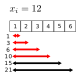
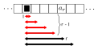
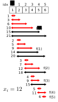
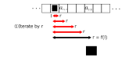
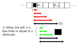
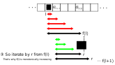
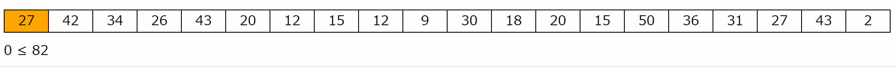

# Two Pointers (尺取り法)

---
## What is two pointets method?

- Called "Measure warm method", in Japanese community.
- Solve a problem about interval which satisfies a condition with two pointers in fast-time.


---

## When sould we consider it?

- Want to think about a **interval** which satisfies a condition.
  - the maximum length of interval
  - the minimum length of interval
  - the number of interval

---

## Case study : AOJ DSL_3_C

---

### Description
The Number of Windows
For a given array $a_1, a_2, a_3,\cdots,a_N$ of $N$ elements and $Q$ integers $x_i$ as queries, for each query, print the number of combinations of two integers $(l,r)$ which satisfies the condition: $1 \le l \le r \le N$ and $a_l + a_{l+1} .  .  .  a_{r - 1} + a_r \le x_i$

### Constraints
- $1 \le N \le 10^5$
- $1 \le Q \le 500$
- $1 \le a_i \le 10^9$
- $1 \le x_i \le 10^14$

---

### Input
The input is given in the following format.

$N$ $Q$  
$a_1 a_2 \cdots a_N$  
$x_1 x_2 \cdots x_Q$  

### Output
For each query, print the number of combinations in a line.

---


### Sample Input

```txt
6 5
1 2 3 4 5 6
6 9 12 21 15
```

### Sample Output

```txt
9
12
15
21
18
```

---



### Observation: Continuity

If $l$ is fixed: 

$$
\begin{aligned}
a_l + a_{l+1} + &\cdots + a_{r-1} + a_r \le x_i\\
&\Downarrow\\
a_l + a_{l-1} + &\cdots + a_{r-1} \le x_i
\end{aligned}
$$

---



So let's get the minimum of $r$ such that  
$$
a_l + \cdots + a_r > x_i
$$

Then the number of $(l, r')$ such that  
$$
a_l + \cdots + a_{r'} \le x_i
$$
is $(r - l)$.

&rArr; Get the number $r$ for each $l$ !

---


```cpp
typedef long long ll;
```

```cpp
// for each query as x
ll ans = 0;
for (ll l = 0; l < N; l++) {
  ll r, sum = 0;
  for (r = l; r < N; r++) {
    sum += x;
    if (sum > x) break;
  }
  ans += r - l;
}
cout << ans << endl;
```

---

### Time complexity

- for each query: $O(Q)$
- for each $l$: $O(N)$
- search until $\mathrm{sum} > x$: $O(N)$

&rArr; $O(QN^2)$: TLE
$\because N \le 10^5$ and $Q \le 500$

---



### Key Idea: monotonically increasing (広義単調増加)

$f(l) =$ the minimum of $r$ such that  
$$
a_l + \cdots + a_r > x_i
$$

Then $f(l)$ is monotonically increasing: $f(l) \le f(l + 1)$

---



---



---



---


$\mathrm{sum} =$ the sum in $[l, r)$

```cpp
int r = 0, sum = 0;
for (l = 0; l < N; l++) {
  while (r < N && sum + a[r] <= x) {
    sum += a[r];
    r++;
  }
  ans += r - l;

  if (r == l) r++;
  else sum -= a[l];
}
```

- Note the last process in the for loop.
- Note the condition of the while loop.
  (not sum <= x but sum + a[r] <= x)

---

## Time Complexity

- for each query: $O(Q)$
- search by the two pointer $l$ and $r$: $O(N)$

&rArr; $O(QN)$: Good!

---


## Demo

Feel $O(N)$!



(gif animation does not work on pdf file)

---

## Summary

- Two pointers' method solves a problem about interval which satisfies a condition.
  - the maximum, the minimum, and, the number
- The characteristic of monotonically increasing allows us to do it.
