<link rel="stylesheet" href="../style.css">

# Union Find Tree(素集合データ構造)

## Union Find Treeとは

- 単にUnion Findと呼ばれることも
- グループ分けを管理するデータ構造
- 素集合: 重なりの無い(互いに素な)集合たち.

- 次の操作がほぼ定数時間で行える
  - **グループを併合する(Unite)**
    ※併合はできても分割できない
  - **ある要素とある要素が同じグループか(Same)**
- **グラフの連結に関する問題を扱うときによく使う**

## まずはこの問題を考えてみる
- ABC062A: Grouping
- 問題:
  x,yが与えられるのでx,yが同じグループかどうか判定せよ
  - {1, 3, 5, 7, 8, 10, 12}は同じグループ
   - {4, 6, 9, 11}は同じグループ
   - {2}は同じグループ

これは(どうせA問題なので)制約的に間に合うでしょう，
ということで実はいけます:

1. グループの名前をそれぞれ0,1,2と決める.
   - グループ0: {1, 3, 5, 7, 8, 10, 12}
   - グループ1: {4, 6, 9, 11}
   - グループ2: {2}
2. xがどのグループに属しているか判定
3. yがどのグループに属しているか判定
4. グループ名が同じかどうか比較


愚直解は次のようになります．

```cpp
vector<vector<int>> g {
    {1, 3, 5, 7, 8, 10, 12},
    {4, 6, 9, 11},
    {2}
};
int find(int x)
{
  for (int i = 0; i < 3; i++) {
    for (int j = 0; j < g[i].size(); j++) {
      if (g[i][j] == x) return i;
    }
  }
}
int main()
{
  int x, y;
  cin >> x >> y;
  if (find(x) == find(y)) cout << "Yes" << endl;
  else cout << "No" << endl;
}
```
vectorの文法については，「initializer list」を利用した記法を利用しています．
C++11以降に追加された記法で，初期化が簡単に書けるようになりますね．

## 別の見方(1)

グループの代表の人間を決めて，それをグループのIDみたいに扱ってみよう，という考え方

- グループのリーダー(親)をなんでもいいので一人決める.
- 「〇〇さんの親は××」という情報を入れた配列を作る
- 親が一致していれば同じグループだと分かる.

代表は何でもいいのですが，とりあえず以下のように決めてみます．

(例):
- {1, 3, 5, 7, 8, 10, 12} の親は1
- {4, 6, 9, 11} の親は4
- {2} の親は2
と決める

|node| 1 | 2 | 3 | 4 | 5 | 6 | 7 | 8 | 9 | 10 | 11 | 12 |
|-| - | - | - | - | - | - | - | - | - | -- | -- | -- |
|parent| 1 | 2 | 1 | 4 | 1 | 4 | 1 | 1 | 4 | 1 | 4 | 1 |

i番目の親をpar[i]で書きます．
すると,par[x]とpar[y]が同じであれば同じグループと分かるので，
以下のようなコードが書けます．

```cpp
int main()
{
  vector<int> par{0, 1, 2, 1, 4, 1, 4, 1, 1, 4, 1, 4, 1};
  int x, y;
  cin >> x >> y;
  if (par[x] == par[y]) cout << "Yes" << endl;
  else cout << "No" << endl;
}
```

## 別の見方(2)

さっきはグループの親を1人だけ決め，その下はすべて子，という関係を作りました．
グループかどうかを判定するだけなら，もう少し条件を緩めることもできます．
親をどんどん辿って最後に行き着く「先祖」が一致していれば
グループに属していると分かります．

例えば，aはbの親であることをa&larr;bと書くとして，

<div style="text-align:center;">
  <p>1&larr;3&larr;5&larr;7&larr;8&larr;10&larr;12</p>
</div>

という関係があったとすると，
- 12の先祖は1
- 7の先祖は1
だから，12と7は同じグループと分かる．

## 今までの話をグラフの言葉で

一般に親子関係はグラフで表現できます．
具体的には，(親)&larr;(子)で辺を張ったグラフで表現できます．
以下の親子関係は，ABC062Aでのグループの親子関係の一例です．

<div class="flex-container">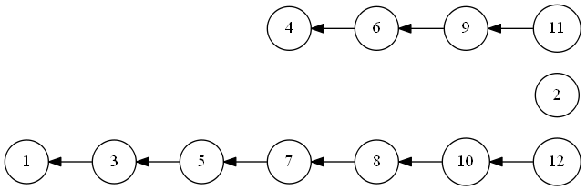</div>

とにかく親子関係ができていればよいので，以下のようにグループ関係を構成することもできる．

こんな感じの親子関係でもよい
(厳密にはこれは有向木の辺を逆向きに張ったverであるが,ここでは単に**木**と略記する.)

<div class="flex-container">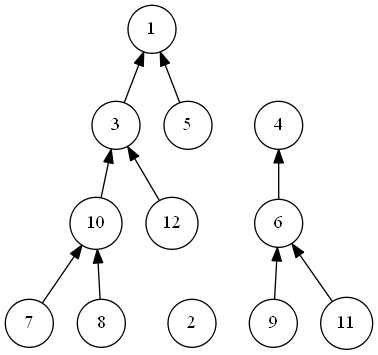</div>

先ほど
```
親をどんどん辿って最後に行き着く「先祖」が一致していれば
グループに属していると分かります．
```
と述べましたが，グラフでいうと「先祖」とは**根**のことです．

まとめると
- グループは(親)&rarr;(子)で有向辺をつないだ木で表される
- グループのリーダー(祖先)とは,木の根のことである

となります．
以下，グラフの言葉を利用してUnionFind木を説明していきます．

## Union Find Treeに戻る

UnionFind木についておさらいしてくと，以下のような「グループ分け」の機能を持つデータ構造です
- **グループを併合する(Unite)**
  ※併合はできても分割できない
- **ある要素とある要素が同じグループか(Same)**

各グループを，親子関係を表したグラフで表現します．
すると，上で述べた操作は以下のように言い換えられます．

- xのグループとyのグループを併合(Unite)
  <div class="note">&rArr; xが属する木の根,yが属する木の根を求め,根同士に辺を張る</div>
- xとyが同じグループか(Same) : 
  <div class="note">&rArr; xが属する木の根,yが属する木の根を求め,それらが一致しているかどうか判定</div>

これを実現するために，
- xが属する木の根は何か(Find)

という関数を用意しましょう．

## Union Find Treeの機能を図で

以下説明のために，「xに属するグループの根」のことを「xの根」と略記します．

### Union Find Treeの初期状態
初めはみんな別々のグループで，自分自身がその根となっています．

<div class="flex-container">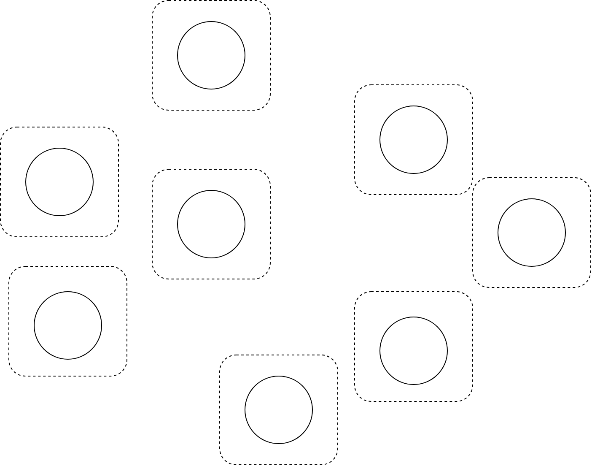</div>

### Find
xの根を見つけます．
<div class="flex-container">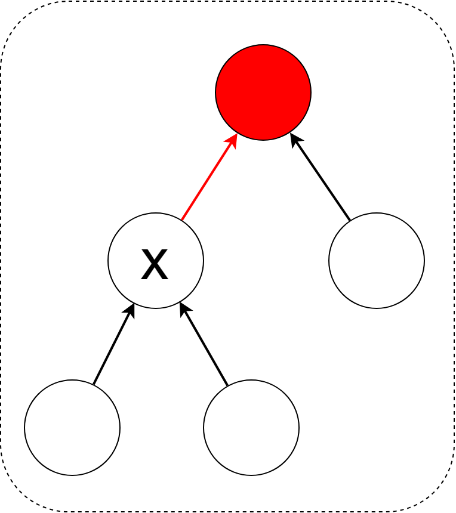</div>

### Same
xの根，yの根を見つけます．二つの根が一致していたらtrue，そうでなければfalseを返します．
<div class="flex-container">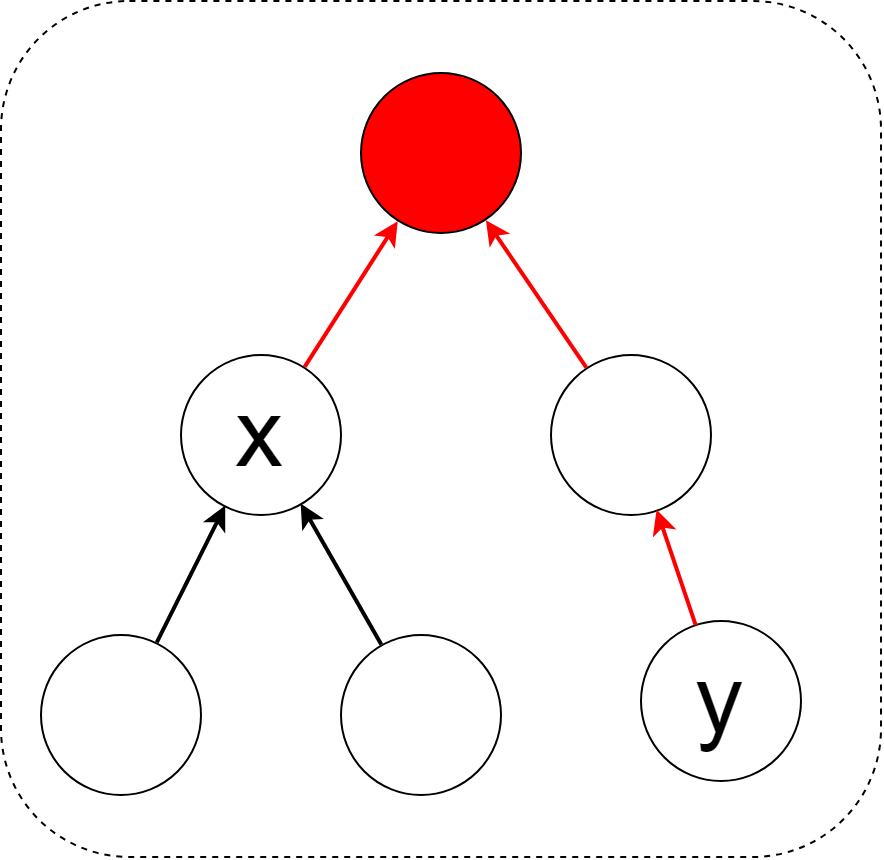</div>

---

### Unite
xの根とyの根の間に辺を張ることによって，グループを併合します．
<div class="flex-container">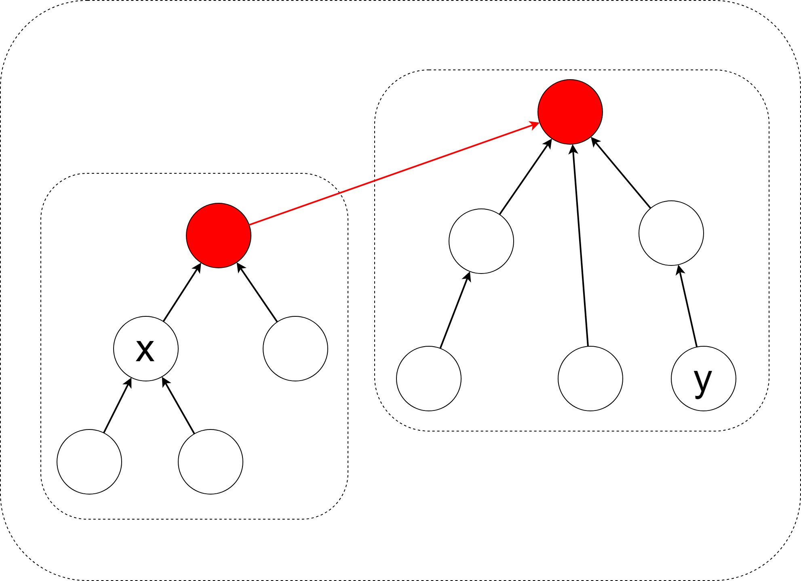</div>

---

## 実装

- 実装(1)(2)(3)の順で行い,徐々に計算量を改善する形で説明します.

### 実装(1)

- xの親を求める配列を用意する
- 初期化関数を用意する
- 初めは自分自身が親である

#### 初期化

それぞれ自分自身が根のグループとして初期化しておきます．
```cpp
int par[110000]; //問題に応じてサイズを変える
void init(int n)
{
  for (int i = 0; i <= n; i++) {
    par[i] = i;
  }
}
```

#### find(x)
xの親は何か,その親は何か,...と再帰関数で潜っていけばよいです．

```cpp
int find(int x)
{
  if (par[x] == x) return x;
  return find(par[x]);
}
```

#### same(x, y)
find(x) == find(y)を判定するだけです．

```cpp
bool same(int x, int y)
{
  return find(x) == find(y);
}
```

#### unite(x, y)
find(x)とfind(y)の親子関係を決めます．
x,yどちらを親にするかは次の実装(2)で考えることにして，
とりあえず適当にyを根にしてしまいます．

```cpp
void unite(int x, int y)
{
  x = find(x);
  y = find(y);
  par[x] = y;
}
```

#### 実装(1)の計算量

計算量は$O(|V|)$くらいになります．
最悪なのは全ての点が一直線につながったケースです．

<div class="flex-container">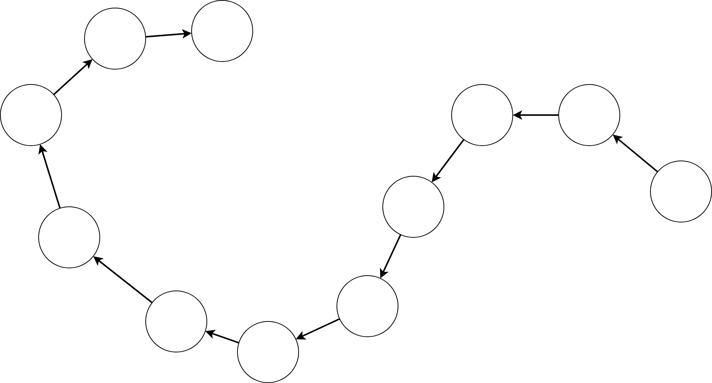</div>

もう少し速くしたいところです．

### 実装(2)
何がまずいのかというと，点が根から遠いと辿るのに時間がかかるのがまずいのです．
できるだけ点は根に近い方が良いですね．

<div class="flex-container">
<figure><figcaption style="text-align:center;">悪いケース</figcaption></figure>
<figure>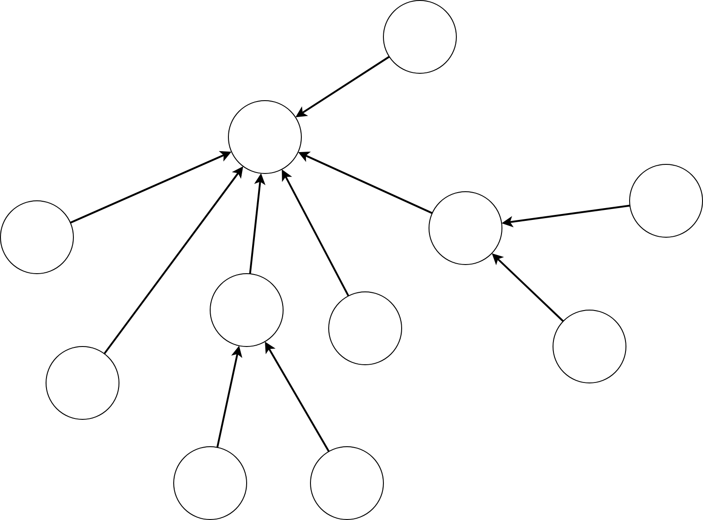<figcaption style="text-align:center;">良いケース</figcaption></figure>
</div>

なのでfind関数呼び出し時に,辿った点をすべて根に張り直して
なるべく点を根に近くしましょう(これを**経路圧縮**と言います．)

#### find(x)の改善

returnの部分に注目しますと，関数で返ってきた値を新たな親更新しています．
こうすることで，呼び出し時に通った辺をすべて根につなぎなおしています．

```cpp
int find(int x)
{
  if (par[x] == x) return x;
  return par[x] = find(par[x]); // 返ってきた値を代入して返す
}
```

#### 実装(2)の計算量

この工夫で,**平均時間計算量**$O(log|V|)$であることが知られています．
これだけでも十分なことが多いのですが，実はもっと速くできます

## 実装(3)

実装(1)のUnite関数を実装したとき，辺をどちらに張るのかまでは考えていませんでした．
木のサイズ(点の数)の大きなほうから小さな方へつなげば，偏りが少なくなりそうです．

<div class="flex-container">
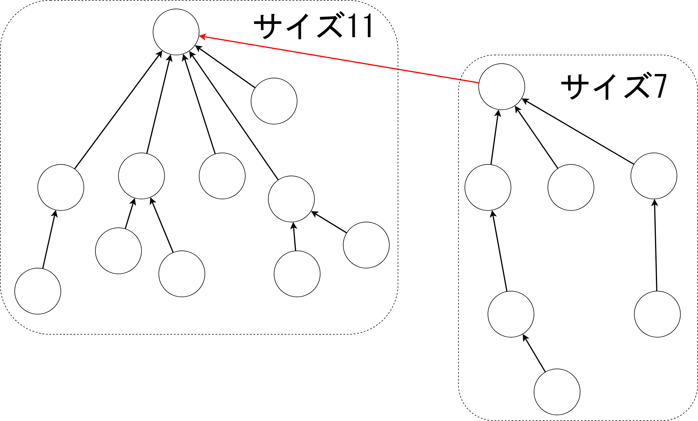
</div>

実はこれで計算量が改善することが知られています．
では木のサイズをどう管理しましょうか．

根の親は根自身でした．
少しテクニカルな気がしますが，ここにサイズの情報を付加しましょう．
par[i]が表すのがサイズなのか親なのかは符号で判断するように実装しましょう．
つまり，サイズは負,親は正として扱います．


<div style="display:flex; flex-direction:column; align-items:center;">
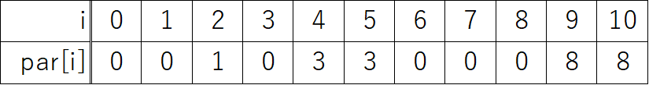
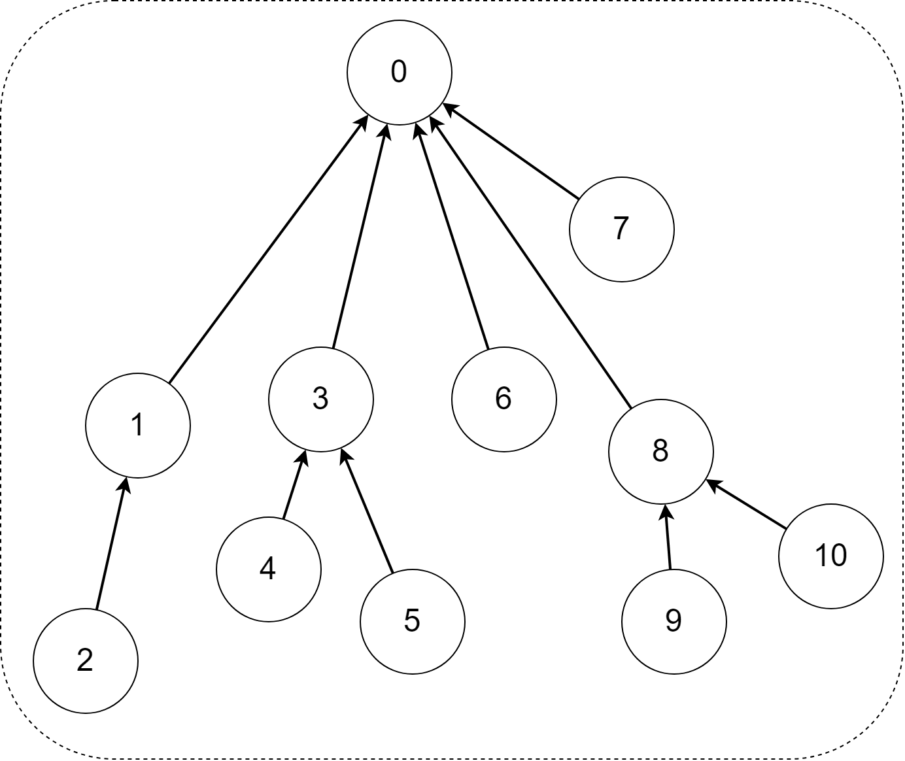
</div>

#### 初期化関数
最初は自身が根,サイズは1なので,初期値に-1を設定しておきます．

```cpp
int par[110000];
void init(int n)
{
  for (int i = 0; i < n; i++) {
    par[i] = -1;
  }
}
```

#### find関数
par[i]が負なら親，そうでないなら再帰をします．

```cpp
int find(int x)
{
  if (par[x] < 0) return x;
  return par[x] = find(par[x]);
}
```

#### unite関数
辺のサイズを調べ，大きい方に小さいほうをくっつけましょう．

```cpp
int unite(int x, int y)
{
  x = find(x);
  y = find(y);
  if (par[x] > par[y]) swap(x, y);
  par[x] += par[y]; // (xを含む木のサイズ) += (yを含む木のサイズ)
  par[y] = x;       // yの親をxに設定
}
```

#### size関数
グラフのサイズを取得する関数sizeも作っておくと役立つことがあるので，作っておきます．

```cpp
int ufsize(int x)
{
  return -par[find(x)];
}
```

#### 実装(3)の計算量

実装(2)と実装(3)の工夫を合わせると，
平均時間計算量は$O(\alpha(n))$となることが知られています．
$\alpha(n)$とはアッカーマン関数$Ack(n,n)$の逆関数です．
アッカーマン関数は小さな変数で値がすごく大きくなる数で，
それの逆関数なので，**ほぼ定数時間**だと思ってよいです．すごいですね．


## 実装まとめ

```cpp
int par[110000];
void init(int n) {
  for (int i = 0; i < n; i++) {
    par[i] = -1;
  }
}
int find(int x) {
  if (par[x] < 0) return x;
  return par[x] = find(par[x]);
}
int unite(int x, int y) {
  x = find(x);
  y = find(y);
  if (par[x] > par[y]) swap(x, y);
  par[x] += par[y]; 
  par[y] = x; 
}
bool same(int x, int y) {
  return find(x) == find(y);
}
int ufsize(int x) {
  return -par[find(x)];
}
```

## これを構造体にまとめる

次のやつをライブラリとして持ってると良いです

```cpp
struct UnionFind {
  vector<int> par;
  
  UnionFind(int n): par(n, -1) { }
  int find(int x) {
    if (par[x] < 0) return x;
    else return par[x] = find(par[x]);
  }
  void unite(int x, int y) {
    x = find(x), y = find(y);
    if (x == y) return;
    if (par[x] > par[y]) swap(x, y);
    par[x] += par[y];
    par[y] = x;
  }
  bool same(int x, int y) {
    return find(x) == find(y);
  }
  int size(int x) {
    return -par[find(x)];
  }
};
```

## 使い方

```cpp
int main()
{
  UnionFind uf(100); // 要素数100
  uf.unite(1, 2); // 1が属すグループと2が属すグループをくっつける
  uf.unite(1, 5); // 1が属すグループと5が属すグループをくっつける
  uf.unite(2, 3); // 2が属すグループと3が属すグループをくっつける
  
  // この時点で{1,2,3,5}が同じグループ
  
  // 1と3は同じグループ -> true(= 1)が返ってくる
  cout << uf.(1, 3) << endl;
  // 2と5は同じグループ -> true(= 1)が返ってくる
  cout << uf.(2, 5) << endl;
  // 1と90は同じグループでない -> false(= 0)が返ってくる
  cout << uf.(1, 90) << endl;
  // 1が属するグループのサイズである4が返ってくる
  cout << uf.size(2) << endl;
}
```

実行結果
<div class="console">
  <p>1</p>
  <p>1</p>
  <p>0</p>
  <p>4</p>
</div>

## その他の実装方法

- 今回は「サイズの大きい方に小さい方をくっつける」実装 
  「木の深さ(**ランク**という)の大きい方に小さい方をくっつける」実装方法もある (蟻本の実装がそれ)
- 他にも色々な実装方法があるので気になる人は英語Wikipedia「Disjoint-set data structure」を参照
- 問題によってはUnion Findに様々な情報を乗せて応用することがある.  
  グリッドの場合は(x,y)を頂点番号としてpairで管理したりする

## Union Find木の可視化(おまけ)

- 計算量改善の工夫のおかげで,多くの点が根に繋がる  
  &rArr; Union Findは「うにオンファインド」である.
- デモします

## 応用

頂点同士の細かいつながりは気にせず,  
あくまでグラフの連結成分についてみていきたいときに使われることが多い気がします．

## 演習

- ATC001B: Union Find
  (勉強のためできれば自前で実装してほしい)
  (どうしても分からなければ僕のやつをコピペして使い方だけは覚えましょう)
- ABC097D: Equals
- ARC032B: 道路工事


## 解答

- ATC001B: やるだけ
- ABC097D: グラフ描いて考察,つながっているとどうなのか
- ARC032B: 実はDFS/BFSでも解ける

## やっておくとよい問題

- ABC120D: Dacayed Bridges
