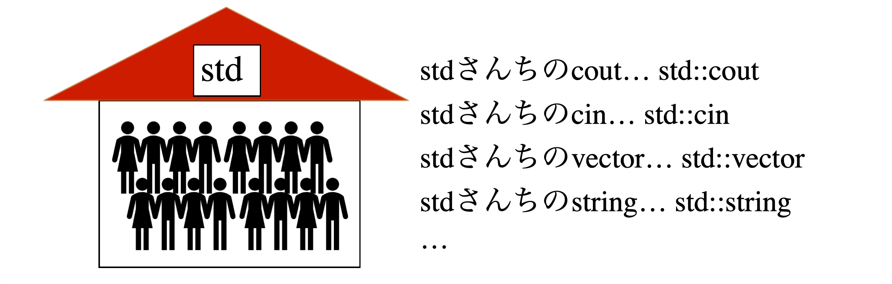
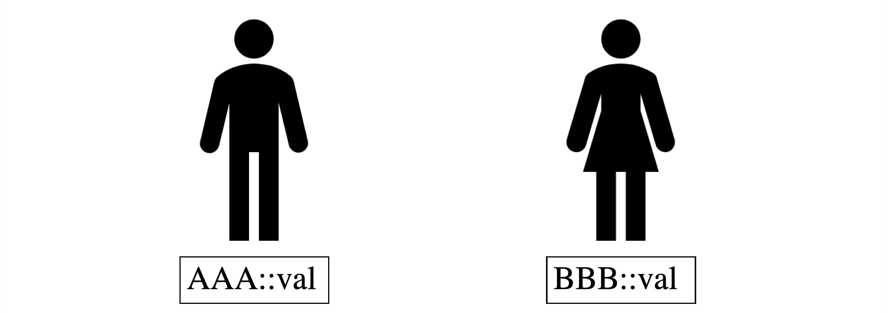

<link rel="stylesheet" href="style.css">

# 他言語を学んだことがある人向けのC++(競プロ)入門 (前半)

## はじめに

このチュートリアルは、他のプログラミング言語を学んだことがある人向けに書かれています。プログラミング完全初心者では理解が難しいかもしれません。

また、このチュートリアルは競技プログラミングサークルの資料として書かれたものです。ですので、実用上のC++としての使い方からは異なる部分があるかもしれません(例: `using namespace std`)

C++を実際に利用する環境として、g++をコマンドラインで実行する状況を想定します。g++のインストール方法については他のサイトを参照してください。

## 基本と出力

### 何もしないプログラム

以下は何もしないプログラムです。実行しても何も反応せず、プログラムは終了します。

```cpp
# include <iostream>

int main () {
  // ここに色々書いていきます。
  return 0;
}
```

- `#include <iostream>`によって、入出力系の様々な関数たちを読み込みます。
- `int maim() { ... }`のまとまりを`main`関数と呼びます。プログラムは`main`関数から処理を始めます。
- `main`関数内で`return 0;`と書くことで、プログラムは終了します。
- 文末には必ずセミコロン`;`を書きます。ただし後に説明するブロック(`{}`で括られた領域)の終わりにはセミコロンをつけなくても良いです。
- コメントは`// コメント`または`/* コメント */`の形で書きます。前者は一行ごとのコメントで、後者は複数行にまたがったコメントです。
- 一文の最後には必ずセミコロンを付けます。

### 出力

以下は、おなじみ`Hello, World`を出力するプログラムです。

```cpp
# include <iostream>

int main () {
  std::cout << "Hello, World!" << std::endl;
  return 0;
}
```

- `std::cout`は出力ストリームオブジェクトと呼ばれるものです。ここでは詳しく述べませんが、「出力を行うための窓口」のような印象を持っておけば十分です。`<<`演算子を利用して、`std::cout`に情報を流しています。流した情報は画面上に出力されます。
- いくつかの文字や数値をつなげて出力することもできます。以下は、`Hello, World 6 Taro`と出力します。
  ```cpp
  std::cout << "Hello, World " << (1 + 2 + 3) << ' ' << "Taro" << std:endl;
  ```
- 文字列はダブルクォーテーション`"`でくくって表現します。
- `std::endl`は改行を意味するオブジェクトです。

<div class="note">
<h4>&lt;&lt;は左シフト演算子では?</h4>
<p>その質問はもっともです。しかし<code>std::cout</code>と<code>"Hello, World"</code>をシフト演算子するにも、なのをどうしろというのでしょう。そもそもシフト演算子というのは整数値と自然数同士の演算です。</p>
<p>C++では、型によって演算の処理方法を定義できます。<code>2<<3</code>と<code>std::cout<<"Hello"</code>では処理が異なります。この仕組みを「演算子オーバーロード」と呼びます。実際に私たちもオリジナルの演算子を定義することができますが、詳しい話は割愛します。</p>
</div>

#### stdとは

`std::`という表現は何でしょうか。これは名前空間と呼ばれるものです。

名前空間は、人における苗字と同じようなものです。例えば以下は山本さんちの家族構成です。苗字が山本なので、山本太郎さんと佐藤太郎さんは別の名前とみなされます。


この山本にあたるのが`std::`です。C++には、`std`という苗字を持った関数や変数がたくさんあります。



名前空間のおかげで、例えば`AAA::val`と`BBB::val`は別の値として区別されます。同名の変数や関数が存在できるための工夫が、この名前空間なのです。



### stdを省く

C++では多くの関数や変数やクラスが`std`の名前空間に属しています。速さが一つの重要点である競技プログラミングにおいては、`std::`をいちいち書くのが面倒です。そこで、次のように`using namespace std;`と書くことによって、`std::`を省略することができます。

```cpp
#include <iostream>

using namespace std;

int main() {
  cout << "Hello, World" << endl;
  return 0;
}
```

`using namespace std;`を指定すると、このプログラムの名前空間は`std::`という指定なしで、`std`名前空間だと認識されるようになります。

実用上、いくつかの理由により`using namespace std;`を利用することは推奨されていません。理由については他のサイトを参照してもらうことにして、とにかく**利用するのは競技プログラミングだけにしましょう**。


## 変数/演算/型

### 変数

まずは変数の説明をします。変数は値を保存しておくための箱のようなものです。以下は、変数`a,b,val`を用意して、適当な計算を行った後に各変数の値を表示するプログラムです。

```cpp
#include <iostream>

using namespace std;

int main() {
  int a, b; // 1. 変数宣言
  int val = 100; // 2. 変数の初期化

  a = 2; // 3. 変数の代入
  b = val + a; // 4. 変数同士の計算

  // 5. 出力
  cout << "a = " << a << endl
       << "b = " << b << endl
       << "val = " << val << endl;

  return 0;
}
```

1. 使いたい変数は必ず事前に宣言されていなければなりません。変数の宣言は次のように書きます。カンマで区切って複数の変数が宣言可能です。
   ```cpp
   型 変数名;
   ```
   型については後で説明します。
2. 変数の初期化はこのように書きます。
   ```cpp
   型 変数名 = 値;
   ```
3. 変数の代入は次のように書きます。
   ```cpp
   変数名 = 値
   ```
4. 変数の値にアクセスするには、単にその変数名を書けば良いだけです。
   以下では、`val`の値が`100`、`a`の値が`2`なので、`b`には`102`が代入されます。
   ```cpp
   b = val + a; // 4. 変数同士の計算
   ```
5. 変数の値を出力しています。一行ですべて書くと見辛いので、適度に改行しています。

### 型

型とは、簡単にいうと値の種類のことです。変数を宣言するときは、それにどんな種類の値を入れるのかをあらかじめ決めておかなければいけません。C++にはたくさんの型がありますが、とりあえずそのごく一部をここで紹介します。

| 型名 | 値の種類 | 備考 |
|----|----|----|
| int | 32bit整数値 | 正負合わせて2<sup>32</sup>通りの値の表現が可能 |
| long | 64bit整数値 | 正負合わせて2<sup>64</sup>通りの値の表現が可能。競プロでは値が10<sup>9</sup>を超えそうなときにこっちを使う |
| double | 小数付きの値 | |
| char | 文字 | 文字列ではないので注意。シングルクォーテーション`'`でくくって表現 |
| bool | 真偽 | `true`または`false`で値を表現する |

例えば次のような文は、「整数型の変数`a,b`を宣言する」と読めます。

```cpp
int a, b;
```

文字列については後で扱います。

### 演算子

演算子もたくさんありますが、とりあえず以下のものを紹介します。

| 演算子 | 意味 | 備考 |
| ---- | ---- | ---- |
| a + b | 足し算 | |
| a - b | 引き算 | |
| a * b | 掛け算 | |
| a / b | 割り算 | 整数値の場合は切り捨て |
| a % b | 剰余算 | aをbで割った余り」を表す |
| &lt;&lt; | 左シフト | |
| &gt;&gt; | 右シフト | |

### 複合代入演算子

`a = a + 2`は「aに2を加えたものをaに代入する」という意味です。このようなパターンはよく使われるので、C++では`a += 2`と省略して書くことができます。このような演算子は代入とある演算子が合体していることから、複合代入演算子と呼ばれます。複合代入演算子には以下の種類があります。

| 演算子 | 意味 | 備考 |
| ---- | ---- | ---- |
| a += b | a = a + b | |
| a -= b | a = a - b | |
| a *= b | a = a * b | |
| a /= b | a = a / b | |
| a &lt;&lt;= b | a = a &lt;&lt; b | |
| a &gt;&gt;= b | a = a &gt;&gt; b | |

### インクリメント/デクリメント演算子

`a = a + 1`や`a = a - 1`のように、1を加えたり引いたりするケースがたくさんあるので、これを`a++`、`a--`と書けます。この演算子をそれぞれインクリメント演算子、デクリメント演算子と呼びます。

| 演算子 | 意味 | 備考 |
| ---- | ---- | ---- |
| a++ | インクリメント | aに1を加える。++aという書き方もあるが違いについては割愛|
| a\-\- | デクリメント | aから1を引く。--aという書き方もあるが違いについては割愛|

## 入力

cinを用いて入力します。以下は、`a`と`b`を空白区切り(もしくは改行区切り)で入力して、その和を出力するプログラムです。

```cpp
#include <iostream>

using namespace std;

int main() {
  int a, b;
  cin >> a >> b;
  cout << (a + b) << endl;
  return 0;
}
```

`cout`では`<<`をつなげて書いていましたが、`cin`では`>>`をつなげて書きます。`cin`は「入力の窓口」と捉えると、その`>>`という向きのイメージがつかめるかもしれません。キーボードで入力された数値は`cin`から出てきて、`>>`演算子によって情報が流されて、順に`a`、`b`に入っていきます。

<div class="note">
<h4>空白区切りか改行区切りか</h4>
<p>cinにおける入力では、空白区切りと改行区切りの区別がありません。例えば<a href="https://atcoder.jp/contests/practice/tasks/practice_1" target="_blank">AtCoder practice contest A</a>のような入力形式においても、改行やスペースの違いを気にすることなく、<code>cin >> a >> b >> c >> s</code>と書けます。</p>
<p>他の言語(例えばPython)だと、改行とスペースの区切りが別に扱われることがあるので、入力形式によって適切に対応する必要があります。</p>
</div>

## 制御構文: if/while/for

### if(-else)文

条件分岐を行う文です。以下は入力された整数値が偶数か奇数かを判定するプログラムです。

```cpp
#include <iostream>

int main() {
  int x;
  cin >> x;
  if (x % 2 == 0) {
    cout << "Even" << endl;
  } else {
    cout << "Odd" << endl;
  }
  return 0;
}
```

`if`文は次のような書式で書きます。もし処理が一文で済むなら`{}`でくくる必要はありません。

```cpp
if (条件) {
  // 真だった場合の処理
} else {
  // 偽だった場合の処理
}
```

偽だった場合の処理が必要なければ、`else`を省いて次のように書けます。

```cpp
if (条件) {
  // 真だった場合の処理
}
```

「条件1がダメなら条件2を調べて、そうでなければ条件3を調べる」というように書きたい場合は、`if`と`else`を組み合わせて以下のように書きます。

```cpp
if (条件1) {
  // 真だった場合の処理1
} else if (条件2) {
  // 真だった場合の処理2
} else if (条件3) {
  // 真だった場合の処理3
} else {
  // 偽だった場合の処理
}
```

#### 条件演算子

条件式でよく使われる演算子です。以下で紹介しますが、意味は数学でやっている不等号や等号と同じ意味なのでだいたいわかると思います。

| 演算子 | 意味 | 備考 |
| ---- | ---- | ---- |
| a == b | aとbは等しい | |
| a != b | aとbは等しくない | |
| a > b | aはbより大きい | | 
| a < b | aはbより小さい | | 
| a >= b | aはb以上 | | 
| a <= b | aはb以下 | | 

#### 関係演算子

こちらも条件式でよく使われるものです。いくつかの条件式を組み合わせる際に用いられます。

| 演算子 | 意味 | 備考 |
| ---- | ---- | ---- |
| !a | aでない | |
| a && b | aかつb | |
| a \|\| b | aまたはb | |

例えば、「`a`が10以上の偶数なら`Hello`と出力する」という処理は次のように書けます。

```cpp
if (a >= 10 && a % 2 == 0) {
  cout << "Hello" << endl;
}
```

### while文

ある条件を満たしている間同じ処理を繰り返したい場合は、`while`文を用います。以下は、`Hello[数字]`という文字列を10回出力するプログラムです。

```cpp
# include <iostream>

using namespace std;

int main() {
  int i = 0;
  while (i < 10) {
    cout << "Hello" << i << endl;
    i++;
  }
  return 0;
}
```

`while`文は次のような書式で書きます。
```cpp
while (継続条件) {
  // 処理
}
```
継続条件を見たいしている間、`{}`で括られた中の処理を行います。

例では、まず初めに`i`を0にセットしています。その後、`while`のループが一周するたびに`i`に1が加えられます。`i`はループを回るたびに`1,2,...`と増えていって、`i`が`10`になった時に、`while`の継続条件に反します。この時ループを抜けることになります。

```cpp
int i = 0;
while (i < 10) {
  cout << "Hello" << i << endl;
  i++;
}
```

### for文

先ほどの例では、`i`はいわゆるカウンタのような役割を持っていました。このように、カウンタを回して一定回数ループを行う、という処理はよく行われます。それを簡潔に書くために、`for`文が用意されています。先ほどの例をfor文で書き直すと、以下のようになります。


```cpp
# include <iostream>

using namespace std;

int main() {
  for (int i = 0; i < 10; i++) {
    cout << "Hello" << i << endl;
  }
  return 0;
}
```

for文は以下のような書式で書きます。

```cpp
for ([1.初期化式]; [2.継続条件]; [3.更新式]) {
  // 処理
}
```

1. 変数の代入文を書いたり、初期化文を書いたりします。
2. `while`文同様、継続条件を書きます。
3. ループを一周したときに実行される文をここに書きます。

ループは入れ子にできます。例えば掛け算九九の表を出力するには次のように書きます。

```cpp
#include <iostream>
#include <iomanip>

using namespace std;

int main() {
  for (int i = 1; i <= 9; i++) {
    for (int j = 1; j <= 9; j++) {
      cout << setw(2) << i*j << ' ';
    }
    cout << endl;
  }
  return 0;
}
```

- `setw(2)`をcoutに挟むと、桁を2桁に揃えてくれます。`setw`を利用するためには、`#include <iomanip>`の宣言が必要になります。

### break文

ループ中に処理をやめて、ループを抜けたい時がたまにあります。そのような場合には`break`を用います。
以下は、0が入力されるまでループを続けるプログラムです。

```cpp
#include <iostream>

using namespace std;

int main() {
  while (1) {
    int x;
    cin >> x;
    if (x == 0) break;
  }
  return 0;
}
```

### continue文

ループ中に処理をスキップして、もう一度ループの先頭から始めたい時がたまにあります。そのような場合には`continue`を用います。以下は、10回数値を入力してその和を出力しますが、負数の場合は足さないプログラムです。

```cpp
#include <iostream>

using namespace std;

int main() {
  int sum = 0;
  for (int i = 0; i < 10; i++) {
    int x;
    cin >> x;
    if (x < 0) continue;
    sum += x;
  }
  cout << sum << endl;
  return 0;
}
```

ただしこの例はわざわざ`continue`を使わなくても書けます。例えば次のように。

```cpp
for (int i = 0; i < 10; i++) {
  int x;
  cin >> x;
  if (x >= 0) sum += x;
}
```

## 配列

変数は箱、と表現しました。配列は箱が沢山並んだものです。箱には番号が付けられていて、これは「添字(もしくはインデックス)」と呼ばれます。番号は0から始まります。以下は、長さ5の配列を用意して、その中に値を入れるだけのプログラムです。

```cpp
# include <iostream>

using namespace std;

int main() {
  int a[5];
  a[0] = 0;
  a[1] = 1;
  a[2] = a[0] + a[1];
  a[3] = a[1] + a[2];
  a[4] = a[2] + a[3];
  for (int i = 0; i < 5; i++) {
    cout << a[i] << ' ';
  }
  return 0;
}
```

- 配列の宣言は以下のように行います。
  ```cpp
  型 配列名[長さ] 
  ```
- 配列の初期化は以下のように行います。
  ```cpp
  型 配列名[長さ] = { 値, 値, ... }; // (1)
  型 配列名[] = { 値, 値, ... }; // (2)
  ```
  (1)の場合、省略された初期値は0で埋められます。
  (2)の場合、配列の長さを指定していません。この場合、`{}`内の値の個数が配列の長さとなります。
- 配列のアクセスは添字を用いて、`配列名[添字]`のように行います。

この配列は固定長です。つまり、宣言時にあらかじめ配列の長さを指定してあげる必要がります。可変長の配列を扱いたい場合のために`std::vector`が用意されていますが、これについては後半で説明します。

## 文字と文字列

「文字型の配列」は文字列の一種です。文字型とは`char`型のことですので、例えば`Hello`という文字列は次のように表現できそうです。

```cpp
char str[] = "Hello";
```

この時、strの長さはどうなっているでしょうか? 実は5ではなく、6です。

上の文を配列の初期化と同じように書き直すと、次のようになります。

```cpp
char str[] = { 'H', 'e', 'l', 'l', 'o', '\0' };
```

最後の`'\0'`はヌル文字(終端文字)と呼ばれ、これは文字列の終端を表します。例えば`cout`で文字列を出力する時、プログラムは`'\0'`が見つかった時に文字列が終了したと判断します。

例えば、以下のように`Hello`と`World`の間に`\0`を挿入すると、プログラムは`Hello`までしか出力しません。

```cpp
#include <iostream>

using namespace std;

int main() {
  char str[] = "Hello\0World";
  cout << str << endl;
  return 0;
}
```

また以下のように、文字列の最後にヌル文字を入れなかった場合、文字列処理の際にプログラムが文字列の終端を見つけられず、意図しない動作を起こす場合があるので注意が必要です。

```cpp
char str[] = { 'H', 'e', 'l', 'l', 'o' };
```

文字列を入力する場合は、char型の配列の長さを多めにとっておいて、`cin`で普通に入力します。この場合、ヌル文字は文字列末尾に勝手に挿入されます。

```cpp
char str[1000];
cin >> str;
```

もっとも、`char`型の配列として文字列を扱うよりも、`std::string`を用いて文字列を扱った方が便利なので、この使用頻度は少ないでしょう。`std::string`については後半で説明します。

<div class="note">
<h4>文字列の他の表現方法</h4>
<p><code>char *</code>として文字列を表現する方法がありますが、これについてはここでは扱いません。また、<code>std::string</code>を用いた文字列の表現方法については後半で扱います。</p>
</div>

### 文字コード

コンピュータのあらゆるデータは、内部では数値(厳密には2進数の信号)として扱われます。ということは、文字も何かしらの数値とした扱われているはずです。文字と数値の対応関係のことを文字コードと呼びます。様々な文字コード表があり、例えばUTF-8やShift-JISなどがあります。

競技プログラミングにおいては、ほとんどの場合アルファベットや数字などを文字列として扱います。このような文字はASCIIコードに従います。

試しに`a,b,c`の文字を数値として出力させてみましょう。

```cpp
#include <iostream>

using namespace std;

int main() {
  int a = 'a';
  int b = 'b';
  int c = 'c';
  cout << a << ' ' << b << ' ' << c << endl;
  return 0;
}
```

`97 98 99`と出力されます。つまり、`a`は`97`、`b`は`98`、`c`は`99`として、コンピュータでは扱われているのです。

この事実が何の役に立つのでしょうか。例えば、「ある文字がアルファベットで何番目か」を調べることができます。ASCIIコードでは、アルファベットは数値において連続しているからです。以下は、英小文字を入力して、それがアルファベットで何番目かを出力するプログラムです。

```cpp
#include <iostream>

using namespace std;

int main() {
  char c;
  cin >> c;
  cout << c << " is " << (int)(c - 'a') << " th  alphabet." << endl;
  return 0;
}
```

`(int)(c - 'a')`における`(int)`はキャスト演算子です。これは文字を無理やり整数値に変換するために用いています。

## 関数

いくつかの処理をまとめたい時は関数を用います。以下で、`add`は、整数`x,y`を引数にとり、その和を返す関数です。

```cpp
# include <iostream>

using namespace std;

// 1.
int add(int x, int y) {
  return x + y; // 2.
}

int main() {
  int a, b;
  cin >> a >> b;
  cout << add(a, b) << endl; // 3.
  return 0;
}
```

1. 関数は以下のように宣言します。
   ```cpp
   戻り値の型 関数名(型1 引数1, 型2 引数2, ...) {
    // 処理
   }
   ```
   関数を呼び出すと、何か値を返します。今回の例の場合は、「引数`x,y`をとって値`x+y`返す」という関数です。このように返す値のことを「返り値」「戻り値」と呼びます。戻り値を返す必要がない場合は、型に`void`を指定します。
2. 値を返す際には`return 値;`と書きます。
3. 関数を呼び出す際には`関数名(引数)`と書きます。

## スコープとメモリ

スコープとは変数が宣言されてから破棄されるまでの範囲のことです。いわゆる変数の寿命のことです。C++において、多くの場合変数のスコープは「変数の宣言されて地点からブロックの終わりまで」です(メモリの動的確保の場合は話が変わってきますが、ここではその話はしません)。ブロックとは、波括弧の始まりから終わりの領域のことです。

```cpp
{ // ブロックの始まり
  ...
  int a = 10; // 変数aの誕生
  int b = 20; // 変数bの誕生
  ...
} // ブロックの終わり(変数a, bの消滅)
```

スコープはできるだけ小さくする方が良いです。なぜなら、変数の寿命が短ければ短いほど、「どの変数がどんな値に変わっているのか」を把握しやすくなり、プログラムのバグを減らすことができるからです。

### メモリ

変数は値を保存しておくための箱、と表現しました。コンピュータの内部では、実際にはメモリ上に値が書き込まれます。

変数宣言が行われた時、コンピュータはその変数の型に応じて、適切な領域をメモリ上に確保します。代入が行われたととき、確保された領域に値が書き込まれます。変数が寿命を迎えた時、メモリ上に確保されていた領域は解放されます。

### グローバル変数

関数の外側で宣言された変数はグローバル変数と呼ばれます。これはどの関数からでも自由に値を読み書きできます。グローバル変数は、スコープが最も広いです。従って、これを大量に宣言することは、しばしばバグの温床になります。

実用上、グローバル変数を宣言することはよろしくありません。しかし競技プログラミングのように短いコードを手早く書く場合は、変数をグローバルに宣言することはよくあります。

## 関数のさらなる例

### 桁和を求める関数

4257の各桁を足すと4+2+5+7=18です。このような処理をしてくれる関数は次のように書けます。

`n % 10`は`n`を10で割ったあまりなので、これで`n`の1の位が求められます。`n /= 10`は`n`を10で割って切り捨てるので、桁を一桁右にずらします。`n`が0になるまで、`n`の1の位を加えては`n`を10で割り続けます。`sum`に1の位を足し込んであげて、最後にそれを返します。

```cpp
int sum_digit(int n) {
  int sum = 0;
  while (n > 0) {
    sum += n % 10;
    n /= 10;
  }
  return sum;  
}
```

### 再帰関数の例

再帰関数とは自分自身を呼び出すような関数のことです。ここではその一例として、フィボナッチ数列を求める関数を書いてみましょう。

フィボナッチ数列とは、以下の漸化式で与えられる数列です。
- $ a_0 = 0 $
- $ a_1 = 1 $
- $ a_n = a_{n-1} + a_{n-2} (n \ge 2) $

フィボナッチ数列の第n項を求める関数は次のようになります。`fib`の中で`fib`を呼び出しているのが、再帰関数の特徴です。

```cpp
int fib(int n) {
  if (n == 0) return 0;
  if (n == 1) return 1;
  return fib(n-1) + fib(n-2)
}
```

例えば`f(4)`を考えてみましょう。次のように呼び出され、計算が行われます。

```txt
f(4)
-> f(3) + f(2)
-> (f(2) + f(1)) + f(2)
-> ((f(1) + f(0)) + f(1)) + f(2)
-> ((1 + f(0)) + f(1)) + f(2)
-> ((1 + 0) + f(1)) + f(2)
-> (1 + f(1)) + f(2)
-> (1 + 1) + f(2)
-> 2 + f(2)
-> 2 + (f(1) + f(0))
-> 2 + (1 + f(0))
-> 2 + (1 + 0)
-> 2 + 1
-> 3
```

<div class="note">
<h4>フィボナッチ数列の高速化</h4>
<p>実はこの関数は、処理速度が非常に遅いです。なぜなら、上で見たような再帰の展開が行われるからです。</p>
<p><code>f(4)</code>を求めるために、<code>f(2)</code>を何度も計算しているように見えます。<code>f(2)</code>の計算何度も行わないためには、その計算結果をどこかにメモしておけば良いです。この考え方は動的計画法(DP)と呼ばれます。フィボナッチ数列は次のように配列にメモしてループで書き直すことができます。</p>

int fib(int n) {
  int dp[100];
  dp[0] = 0;
  dp[1] = 1;
  for (int i = 2; i <= n; i++) {
    dp[i] = dp[i-1] + dp[i-2];
  }
  return dp[n];
}
  <!-- -->
</div>

<div class="note">
<h4>配列を引数にとる関数</h4>
<p>配列を引数にとる関数は簡単に作れますが、ここでは説明しません。なぜならそのためには、ポインタの説明をしなけらばならないからです。しかし競技プログラミングではポインタを利用するプログラムはあまり書きません。</p>
<p>配列を引数にとる代わりに、配列をグローバル変数として宣言したり、<code>std::vector</code>の参照を引数に取らせたりします。後者については後半で説明します。</p>
</div>

## 構造体(とクラスの話)

いくつかのデータをまとめた新しい型を定義したいときがたまにあります。このようなときは構造体を用います。

以下は、`Point`という新しい構造体を作成し、それを元に変数`p`を作るプログラムです。構造体`Point`は、xy平面上の点を表します。

```cpp
#include <iostream>

using namespace std;

// 1.
struct Point {
  int x, y;
};

int main() {
  Point p = { 0, 1 }; // 2.
  // 3.
  cout << '(' << p.x << ',' << p.y << ')' << endl;
  return 0;
}
```

1. 構造体は次のように宣言します。構造体を構成する変数はメンバ変数と呼ばれます。この場合、最後のセミコロンは必要です。
   ```cpp
   struct 構造体名 {
     型1 メンバ変数1;
     型2 メンバ変数2;
     型3 メンバ変数3;
     ...
   };
   ```
2. 構造体は普通の変数の型のような扱いを受けます。構造体を用いた変数を宣言する場合、以下のように用います。
   ```cpp
   構造体名 構造体変数名;
   構造体名 構造体変数名 = { 値1, 値2, 値3, ... }; // 初期化を用いる場合
   ```
   また、後で紹介するコンストラクタを用いて初期化することも可能です。
3. 構造体変数の各要素にアクセスするためには、は次のようにドット演算子`.`を用います。
   ```cpp
   構造体変数名.メンバ変数名
   ```

### メンバ関数

構造体のメンバには関数を指定できます。以下は、前の項で説明したプログラムに、新たに以下の関数を加えます。
- 原点からの距離を返す関数`getDist`
- 点の座標を出力する関数`display`

```cpp
#include <iostream>
#include <cmath>

using namespace std;

struct Point {
  int x, y;
  // 1.
  int getDist() {
    return sqrt(x*x + y*y);
  }
  void display() {
    cout << '(' << x << ',' << y << ')' << endl;
  }
};

int main() {
  Point p = { 0, 1 };
  // 2.
  p.display();
  cout << "Distance from Origin: " << p.getDist() << endl;
  return 0;
}
```

sqrtという関数は平方根を計算します。これを使うためには`#include <cmath>`の宣言が必要です。

1. 構造体の要素として宣言された関数はメンバ関数と呼ばれます。
2. メンバ変数と同じようにドット演算子を用いてアクセスします。

### コンストラクタ

コンストラクタとは、構造体変数を宣言した際に最初に呼ばれる関数です。以下は、変数`p`が宣言された時に、`Initialized (点の座標)`と出力するプログラムです。

```cpp
#include <iostream>
#include <cmath>

using namespace std;

struct Point {
  int x, y;
  // 1.
  Point(int x0, int y0): x(x0), y(y0) {
    cout << "Initialized ";
    display();
  }
  int getDist() {
    return sqrt(x*x + y*y);
  }
  void display() {
    cout << '(' << x << ',' << y << ')' << endl;
  }
};

int main() {
  // 2.
  Point p(0, 1);
  cout << "Distance from Origin: " << p.getDist() << endl;
  return 0;
}
```

1. コンストラクタは以下の書式で宣言します。コンストラクタは必ず構造体の名前と同じでなければいけません。
   ```cpp
   構造体名(引数): メンバ変数(初期値) {
     // 処理 
   }
   ```
   メンバ変数の初期化が必要ない場合は、`:`から`{`手前までの記述を省略できます。
   ```cpp
   構造体名(引数) {
     // 処理 
   }
   ```
2. コンストラクタを用いた構造体の初期化は以下の書式で行います。
   ```cpp
   構造体名 構造体変数(引数);
   ```

### オーバーロード

オーバーロードとは、同名の関数を多重定義することです。ここでは試しに、コンストラクタをオーバーロードしてみましょう。以下は、もしコンストラクタ引数が指定されなかった場合は点(0,0)で初期化され、引数が指定された場合はその座標で値を初期化するプログラムです。

```cpp
#include <iostream>
#include <cmath>

using namespace std;

struct Point {
  int x, y;
  // 1-1.
  Point(): x(0), y(0) {
    cout << "Initialized ";
    display();
  }
  // 1-2.
  Point(int x0, int y0): x(x0), y(y0) {
    cout << "Initialized ";
    display();
  }
  int getDist() {
    return sqrt(x*x + y*y);
  }
  void display() {
    cout << '(' << x << ',' << y << ')' << endl;
  }
};

int main() {
  Point p0; // 2.
  Point p1(0, 1); // 2.
  return 0;
}
```

1. 同名の関数`Point`を宣言しています。引数なしの場合は1-1、ありの場合は1-2が実行されます。
2. `p0`は引数を指定していないため、1-1のコンストラクタが呼ばれます。`p1`は引数を指定しているため、1-2のコンストラクタが呼ばれます。

### その他教えていない概念、およびクラスについて

構造体の他にクラスと呼ばれているものがあります。クラスでは、`struct`ではなく`class`として宣言します。少なくともC++において、クラスと構造体に本質的な違いはありません。唯一異なるのはアクセス修飾子の扱いです(詳しい話はここでは割愛します)。クラスや構造体について、ここで教えたことだけでは本当は足りません。しかし競技プログラミングのためのC++入門記事としては、とりあえずここまでで良いと個人的には思います。

<div class="note">
<h4>C言語における構造体の扱い</h4>
<p>C++の前身であるC言語では、構造体の扱いが微妙に異なります。もしC言語を触る機会があったときには、以下の2点に注意しましょう。</p>
<ul>
  <li>構造体変数を宣言する時は、<code>struct 構造体名 構造体変数名</code>と書く。<code>struct</code>を書く必要がある。もし書きたくない場合は、<code>typedef</code>を利用する。</li>
  <li>メンバ関数は宣言できない。構造体の要素として入れられるのは関数のみ。</li>
  <li>コンストラクタは宣言できない</li>
  <li>継承はできない。</li>
</ul>
</div>

## 参照

変数は値を入れる箱でしたが、参照とは変数を指し示すための概念です。以下は、変数`b`を変数`a`への参照とするプログラムです。

```cpp
#include <iostream>

using namespace std;

int main() {
  int a = 10;
  int &b = a; // 1.

  // 2.
  cout << "(a, b) = (" << a << ',' << b << ')' << endl;

  // 3.
  b = 20;
  cout << "(a, b) = (" << a << ',' << b << ')' << endl;

  return 0;
}
```

1. 参照の宣言は以下のように行います。
  ```cpp
  型 &参照名 = 変数名
  ```
2. `b`は`a`の参照なので、`a`と`b`の値は同じです。
3. `b = 20`とすると、`b`が指している`a`の値が`20`になります。従って、`a`も`b`も値`20`になります。

### 関数の引数に参照を指定する

以下は、`a`を`b`で割った商と余り`q, r`を求めるプログラムです。`q, r`は値としては返さず、引数に参照として指定しています。

```cpp
#include <iostream>

using namespace std;

// 1.
void getDiv(int a, int b, int &q, int &r) {
  q = a / b;
  r = a % b;
}

int main() {
  int a, b;
  cin >> a >> b;
  
  int x, y;
  // 2.
  getDiv(a, b, x, y);
  cout << x << ' ' << y << endl;

  return 0;
}
```

1. `q`と`r`の前に`&`をつけているのがポイントです。`&`をつけないと値を渡すだけですが、つけると参照となります。関数には値ではなく、変数の参照を渡していることになります。
2. `q`が`x`への参照、`r`が`y`への参照となります。関数呼び出し後、`x`の値には`a/b`、`y`の値には`a%b`の値が入ります。

## 後半へ

[後半はこちら](./index2.html)
