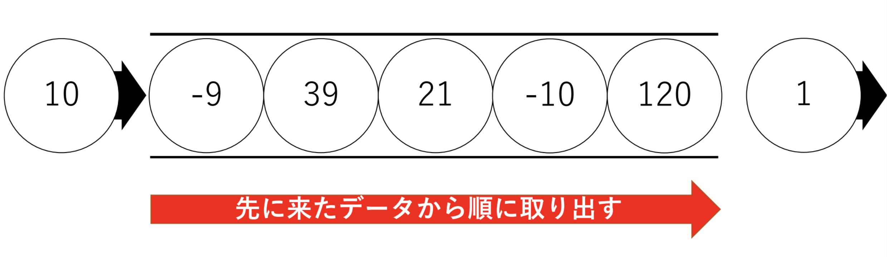

<link rel="stylesheet" href="style.css">

# 他言語を学んだことがある人向けのC++(競プロ)入門 (後半)

後半は、C++が用意している便利なライブラリを紹介します。

## std::vector

`std::vector`は可変長配列のクラスです。配列とは違い、要素を追加したり削除したりできます。使用には`#include <vector>`の宣言が必要です。

### 宣言

色々ありますが、とりあえず次の4つの宣言方法を覚えておきましょう。`using namespace std;`を書いていれば、`std::vector`ではなく`vector`と書くことで宣言できます。

```cpp
vector<int> v(20); // 長さ20のint型のvectorで初期化
vector<char> u(10, 'a'); // 長さ10のchar型vectorの全要素を'a'で埋める
vector<int> w(v); // vの要素をコピーしてwとする
vector<double> x; // 要素数0のdouble型のvector
vector<int> y = {1, 2, 3, 4} // 配列と同じ初期化方法(あまり使わない)
```

### push_back / pop_back

要素を配列の末尾に追加/削除するメンバ関数です。

```cpp
vector<int> v(20);
v.push_back(123); // vに123という要素を末尾に追加(要素数が1増加)
v.pop_back(); // vの末尾の要素を削除(要素数が1減少)
```

### resize

配列のサイズを変更するメンバ関数です。

```cpp
vector<int> v(20);
v.resize(10); // 要素数を20から10に縮める
```

### size

配列のサイズを返すメンバ関数です。

```cpp
vector<int> v;
cout << v.size() << endl; // 0を返す
v.push_back(1);
v.push_back(10);
v.push_back(12);
cout << v.size() << endl; // 3を返す
```

### front/back

配列の先頭要素、末尾要素を返すメンバ関数です。

```cpp
vector<int> v;
v.push_back(1);
v.push_back(10);
v.push_back(12);
cout << v.front() << ' ' << v.back() << endl; // "1 12"と出力
```

### 大小比較

実は`vector`同士で`==, <, >, <=, >=, !=`などの演算子が使用できます。「辞書式順序」による比較が行われます。

その他便利なメンバ関数がたくさんあります。詳しくは<a href="https://cpprefjp.github.io/reference/vector/vector.html">vector - cpprefjp</a>を参照してください。

### vectorを引数にとる関数

次のような問題を考えてみましょう。以下の形式で数値が入力された時、`v0,v1,...v(N-1)`の操作を求める関数を作ってみましょう。

```txt
N
v0 v1 ... v(N-1)
```

解答例は以下のようになります。入力された整数値`N`に対して、その値で`vector`を初期化しています。`getSum`によって配列の総和を求めています。

```cpp
#include <iostream>
#include <vector>

using namespace std;

int getSum(vector<int> &v) {
  int sum = 0;
  for (int i = 0; i < v.size(); i++) {
    sum += v[i];
  }
  return sum;
}

int main() {
  int N;
  cin >> N;
  vector<int> v(N);
  for (int i = 0; i < N; i++) {
    cin >> v[i];
  }
  cout << getSum(v) << endl;
  return 0;
}
```

<div class="note">
<h4>参照として渡している理由</h4>
<p>関数<code>getSum</code>は、<code>vector</code>を参照として渡しています。別に値として渡しても良い気がします。</p>
<p>もし<code>vector</code>を値として渡した場合、<code>v</code>の全要素が引数にコピーされる処理が行われます。配列のサイズが大きい場合は、処理速度が遅くなります。参照として渡すことで、コピーが行われるのを防いでいます。</p>
</div>

## std::string

文字列を便利に扱うためのクラスです。使用には`#include <string>`の宣言が必要です。

### 宣言

`std::vector`と同じ書式で宣言が可能です。それに加え以下の書き方が可能です。

```cpp
string str = "Hello, World" // 与えられた文字列で初期化
```

### アクセス

配列のように、添字を用いてアクセスできます。

```cpp
string str = "Hello";
cout << str[1] << endl;
```

### 文字列連結

`string`同士を連結するための演算子`+`が用意されています。

```cpp
string a = "Hello, ";
string b = "World";
string c = a + b;
```

その複合代入演算子`+=`もあります。

```cpp
string a = "Hello, ";
a += "World";
```

### substr

部分文字列を取得するメンバ関数です。
```cpp
string a = "Hello";
string b = a.substr(2, 3); // a[2]から初めて3要素、つまり"llo"を返す
string c = a.substr(1); // a[1]から初めて最後の要素まで、つまり"ello"を返す
```

### 大小比較

`string`同士で`==, <, >, <=, >=, !=`などの演算子が使用できます。 「辞書式順序」による比較が行われます。この性質は文字列を含んだ配列を辞書順に並び替えたい、などのケースに有用です。

その他便利なメンバ関数がたくさんあります。詳しくは<a href="https://cpprefjp.github.io/reference/string/basic_string.html">basic_string - cpprefjp</a>を参照してください。

## std::queue

`std::queue`はキューを扱うためのクラスです。利用には`#include <queue>`の宣言が必要です。

### キューとは

キューは「先に入れたものを先に取り出す」ことに特化したデータ構造です。

キューはしばしばレジの待ち行列に例えられます。レジは、ほぼ必ず先に並んでいた人から処理されます。後に並んだ人は後に処理されます。


これと同様に、データを取り出すときは、最も最初に入れられたデータから先に取り出されます。これがキューの特徴です。



こんな単純なデータ構造が何の役に立つのでしょうか。競技プログラミングでは「幅優先探索」をいう手法をプログラムするときに利用されます。

### 宣言

とりあえず次の宣言方法だけ覚えておけば十分です。

```cpp
queue<int> q; // int型の値を入れるためのキューを宣言
```

### push/pop

値を入れる時は`push`、値を取り出す時は`pop`を用います。

```cpp
queue<int> q;
q.push(10); // 10が入れられる
q.push(12); // 12が入れられる
q.push(52); // 52が入れられる
q.pop(); // 10が取り出される
q.pop(); // 12が取り出される
q.pop(); // 52が取り出される
```

### front

キューの先頭要素を見たい時は`front`を用います。

```cpp
queue<int> q;
q.push(10); // 10が入れられる
q.push(12); // 12が入れられる
q.push(52); // 52が入れられる
q.pop(); // 10が取り出される
cout << q.front() << endl; // 12が出力される
```

### empty

キューが空か否かを真偽値で返します。以下のように、「キューが空になるまでループ」というプログラムをよく書きます。

```cpp
queue<int> q;
q.push(10);
q.push(12);
q.push(52);
q.push(13);
q.push(22);
while (! q.empty()) {
  cout << q.front() << endl;
  q.pop();
}
```


## std::priority_queue

`std::piority_queue`は優先度付きキューを扱うためのクラスです。利用するためには`#include <queue>`の宣言が必要です。

### 優先度付きキュー

キューは「最初に入った要素を先に取り出す」というルールでしたが、優先度付きキューは「優先度の最も高いものを先に取り出す」というルールに従います。より具体的には、「値の中で最も大きいもの(もしくは小さいもの)を取り出す」という処理を高速に行います。

これは、「大きい(もしくは小さい)ものを出し入れしていく処理」をプログラムする際に利用します。例えばダイクストラ法の実装で用います。

### 宣言

とりあえず以下の2つの宣言方法だけ覚えておけば十分です。2つめの宣言方法がごついですが、文法の詳細については割愛します。

```cpp
priority_queue<int> pq0; // int型の値を大きい順に取り出すpriority_queue
priority_queue<int, vector<int>, greater<int>> pq1; // int型の値を小さい順に取り出すpriority_queue
```

### push/pop/empty

`push`、`pop`、`empty`の使い方は`std::queue`と同様です。

### top

`queue`でいう`front`です。最も優先順位の高い要素を返します。

以下のプログラムは、`1,4,10,-1,14`の順に値を`pq`に`push`しています。しかし取り出される順は大きい順のため、`14,10,4,1,-1`の順に出力されます。

```cpp
priority_queue<int> pq;
pq.push(1);
pq.push(4);
pq.push(10);
pq.push(-1);
pq.push(14);
while (! pq.empty()) {
  cout << pq.top() << endl;
  pq.pop();
}
```

## std::set

`std::set`は集合を扱うためのクラスです。ここでいう集合とは数学における集合を指します。つまり、「重複した要素を持たない」という特徴があります。

利用するためには、`#include <set>`を宣言する必要があります。

### 宣言

とりあえず以下の書式だけ覚えておけば十分です。

```cpp
set<int> st; // int型の要素を入れる集合
```

### insert/erase

値を集合に挿入/削除します。

```cpp
set<int> st;
st.insert(11); // 11を追加
st.insert(21); // 21を追加
st.insert(11); // 11を追加(既に追加されているため意味はない)
st.erase(11); // 11を削除
st.erase(0); // 0は存在しないため意味はない
```

### count

要素の個数を返します。集合に含まれている場合は1、含まれていない場合は0を返します。
要素が含まれているか否かを調べるために用います。

```cpp
set<int> st;
st.insert(11);
st.insert(21);
cout << st.count(11) << endl; // 1を出力
cout << st.count(0) << endl; // 0を出力。
```

### size

`std::vector`にもありましたが、集合の要素数を返します。

他にも便利なメンバ関数があります。詳しくは<a href="https://cpprefjp.github.io/reference/set/set.html">std::set - cpprefjp</a>を参照してください。

## std::map

`std::map`は連想配列を扱うためのクラスです。連想配列とは、「添字に数字以外が指定できる配列」だと思っておけば十分です。例えば`mp["Hello"] = 10`みたいなことができます。連想配列においては、添字のことを「キー」と呼びます。

利用するためには`#include <map>`の宣言が必要です。

### 宣言

とりあえず以下の書式を覚えておけば十分です。

```cpp
map<string, int> mp; // キーがstring、値がintのmapを宣言
```

### 使い方

配列みたいに使います。

```cpp
map<string, int> mp;
mp["Hello"] = 100;
mp["Taro"] = 21;
```

`map<int, int>`はただの配列では?と思うかもしれませんが、その内部構造は大きく違います。

```cpp
map<int, int> mp; // 1.
mp[0] = 2 // 2.
mp[10] = 3 // 2.
mp[12] = 1 // 2.
mp[-1] = 5 // 3.
```

1. はじめに宣言された時、`mp`が持つ要素の数は0です。
2. 要素は、添字を用いてアクセスされた時に初めて作られます。`mp[0] = 2`という文が実行された時に初めて、キー0、値2の要素が作成されます。要素を削除したい場合は`erase`メンバ関数を用いますが、あまり利用しません。
3. int型なので勿論負数も指定できます。

## iterator

さて今まで様々なデータ構造とその使い方を見てきました。これらのデータの要素を順に見てきたい時がたまにあります。`vector`でも`string`でも`map`でも**同じように**ループするために仕組みが備わっていて、それを「イテレータ」と呼びます。たとえデータ構造が異なっていても、同じようにデータを扱うことができる、というのは非常に重要です。データの扱い方を共通に行えるようにする枠組みを持っておくことは、プログラミングをやりやすくします。

### iteratorを用いてループを行ってみる

以下は、`vector`の添字を用いてループを行うプログラムです。

```cpp
vector<int> v = {1, 4, 5, 6, 3};
for (int i = 0; i < v.size(); i++) {
  cout << v[i] << endl;
}
```

これをiteratorを用いて書くと次のようになります。

```cpp
vector<int> v = {1, 4, 5, 6, 3};
for (auto itr = v.begin(); itr != v.end(); itr++) {
  cout << *itr << endl;
}
```

- autoとは型を自動で判別する機能です。本当は`vector<int>::iterator`という型なのですが、長いので`auto`を用いました。
- itrは要素の位置を表しています。
- 先頭位置は`begin`、終端位置は`end`メンバ関数で取得します。
- itr++で要素の位置を1つ先に進めます。
- *itrで要素にアクセスします。

これは`vector`に限ったことではありません。例えば次のように`set`でも書けます。`set`をiteratorを用いて走査したとき、値が小さい順にアクセスされます。これは`set`の内部構造に起因するものなのですが、詳しい話は割愛します。

```cpp
set<int> st;
st.insert(10);
st.insert(21);
st.insert(33);
st.insert(1);
st.insert(0);
for (auto itr = st.begin(); itr != st.end(); itr++) {
  cout << *itr << endl;
}
```

他にも、`queue`でも`priority_queue`でも、同じように`begin`、`end`メンバ関数を利用してループを書くことが可能です。

`map`については注意が必要です。`itr->first`でキー、`itr->second`で値にアクセスします。キーの小さい順に走査されますが、これは`map`の内部構造に起因するものです。詳しい話については割愛します。

```cpp
map<string, int> mp;
mp["Hello"] = 123;
mp["World"] = 21;
mp["Taro"] = 52;
for (auto itr = mp.begin(); itr != mp.end(); itr++) {
  cout << itr->first << ' ' << itr->second << endl;
}
```

### range-based for文

iteratorを使ったループ文は若干冗長です。もう少し短くするループ文として、「range-based for文」と呼ばれるものがあります。具体的には、以下のように利用します。

```cpp
vector<int> v = {1, 4, 5, 6, 3};
for (auto e : v) {
  cout << e << endl;
}
```
- `for (auto e : v) { ... }`とは、「`v`の中の要素を`e`とし、全ての`v`の要素に対して`{ ... }`の処理を繰り返す」という意味です。

例えば`set`でも同じように書けます。

```cpp
set<int> st;
st.insert(10);
st.insert(21);
st.insert(33);
st.insert(1);
st.insert(0);
for (auto e : st) {
  cout << e << endl;
}
```

`map`の場合は`e.first`、`e.second`でそれぞれキー、値にアクセスできます。

```cpp
map<string, int> mp;
mp["Hello"] = 123;
mp["World"] = 21;
mp["Taro"] = 52;
for (auto e : mp) {
  cout << e.first << ' ' << e.second << endl;
}
```

## std::pair

`std::pair`は順序対を管理するためのクラスです。例えば点の座標を`(int, int)`の順序対で表現できますし、他にも`(名前, 歳)`だって立派な順序対です。

### 宣言

とりあえず以下の書式を覚えておけば良いです。
```cpp
pair<int, int> p0; // (int, int)の順序対
pair<int, int> p1(0, 1); // (0, 1)で初期化
pair<int, int> p2 = make_pair(0, 1); // make_pair関数で初期化
```
pair型の配列という形で宣言することがよくあります。
```cpp
vector<pair<int, int>> v; // (int, int)の要素を持つvector
v.push_back(make_pair(0, 1)) // こんな感じで要素を追加することがよくある
```

### 使い方

`first`で第一要素、`second`で第二要素にアクセスします。

```cpp
pair<string, int> p = make_pair("Hello", 10);
cout << p.first << ' ' << p.second << endl;
```

### 大小比較

`pair`は大小比較が可能です。まず第一要素を比較します。もしも第一要素が等しければ、第二要素を比較します。

- `(1, 2) < (2, 2)`です。なぜなら、第一要素を比較して`1 < 2`だからです。
- `(1, 3) > (1, 2)`です。なぜなら、第一要素は等しいですが、第二要素を比較して`3 > 2`だからです。

## algorithmたち

`#include <algorithm>`を宣言すると利用できるようになる便利な関数たちを紹介します。

### sort

配列のソートを行います。以下の書式で書きます。第1引数にソートの始端、第2引数に配列の終端のイテレータを指定します。

```cpp
vector<int> v = {3, 2, 1, 5, 6};
sort(v.begin(), v.end()); // vは{1, 2, 3, 5, 6}となる
```

デフォルトは昇順ソートとなりますが、もし降順ソートを行いたい場合は以下のように書きます。

```cpp
vector<int> v = {3, 2, 1, 5, 6};
sort(v.begin(), v.end(), greater<int>()); // vは{6, 5, 3, 2, 1}となる
```

### reverse

配列の並びを逆順にします。書式は`sort`の場合と同様です。

```cpp
vector<int> v = {3, 2, 1, 5, 6};
reverse(v.begin(), v.end()); // vは{6, 5, 1, 2, 3}となる
```

### unique

ソート済み配列に対して、重複要素を取り除いた要素を配列の先頭に集め、その終端のイテレータを返す関数です。

これは`erase`と一緒に用いることで、重複した部分を削除することができます。必ずソートしなければならないことに注意しましょう。
```
vector<int> v = {1, 2, 1, 1, 3, 2, 3, 2, 2};
sort(v.begin(), v.end());
v.erase(unique(v.begin(), v.end()), v.end()); // vは{1,2,3}となる
```

### lower_bound/upper_bound

lower_boundは二分探索法を用いて、ソート済みの配列の中から`x`以上となる要素のうち最小のもののイテレータを求めます。

```cpp
vector<int> v = {1, 2, 4, 2, 1, 3 ,5};
sort(v.begin(), v.end()); // vは{1,1,2,2,3,4,5}となる
auto itr = lower_bound(v.begin(), v.end(), 4); // 4以上となる要素のうち最小のものの位置を求める
```

配列のように添字を持つようなデータ構造において、イテレータから添字を計算できます。これは単に`v.begin()`で引き算するだけです。

```cpp
int idx = lower_bound(v.begin(), v.end(), 4) - v.begin();
```

upper_boundは二分探索法を用いて、ソート済みの配列の中から`x`より大きい要素のうち最小のものの位置を求めます。

### find

findは普通に探索する関数です。`lower_bound/upper_bound`のようにソート済みである必要はありませんが、処理速度はそれらに比べ遅いです。

### next_permutation

配列`v`の次の順列を生成する関数です。次のように、`v`をあらかじめソートしておいた後、`do-while`文を用いて`v`の全順列を生成することをたまにやります。

`do-while`文とは、必ず1回はループを行う`while`文だと思っておけば十分です。`next_permutation`の関数が「次の順列が存在する場合はtrue、そうでない場合はfalseを返す」という性質があるため、`while`文でやってしまうと1つだけ数え漏れが出てしまいます。なので`do-while`文を使っています。

```cpp
vector<int> v = {1, 2, 4, 5, 3};
sort(v.begin(), v.end());
do {
  for (auto e : v) {
    cout << e << ' ';
  }
  cout << endl;
} while (next_permutation(v.begin(), v.end()));
```

## 最後に

競プロで使いそうなC++の知識を書きましたが、以下の点に注意してください

- これがC++の全てではないです。テンプレートや演算子オーバーロード、`constexpr`など奥深い概念がたくさんありますので、ぜひ各自で学んでみてください
- 今回はあくまで「競プロで使うであろう道具の紹介」をしたのであって、実際に競プロでどんな形で使われるのかはあまり書けていないです。他の人の競プロ関連のページを漁ったり、他人のソースコードを読んで見るなどして各自で学んでみてください。
