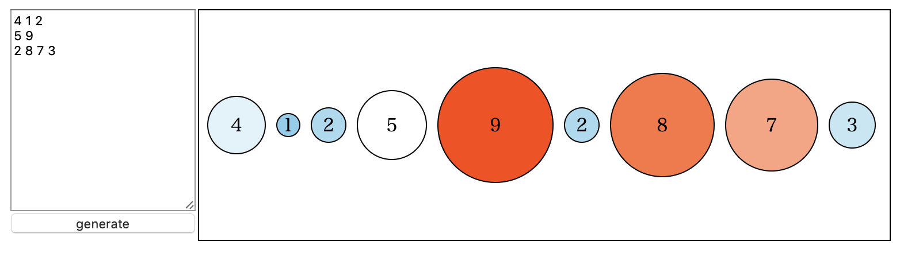

<!-- theme: uncover -->

<link rel="stylesheet" href="../theme/mytheme.css">


## Case 9: Click

- クリックされたボールは1増加させたい


### Two Kinds of Method

1. クリック
   &rArr; 該当データを探して1+して再bind
2. クリック
   &rArr; DOMに結ばれたデータの値を直接1+してattr再設定

何れにしても実装は少しめんどい


### Common Comcept: *selection*.on

```js
circleGroupMerge.on('click', (d, i) => {
  /* d: クリックされた要素のデータ */
})
```


#### 1st Method

```js
circleGroupMerge.on('click', (d, i) => {
  data[idx]++ // idx: dがdata配列で何番目か
  /* 更新処理 */
})
```

#### 2st Method

```js
circleGroupMerge.on('click', (d, i) => {
  d++; // dを直接書き換える
  /* 更新処理 */
})
```


### 1st Method

- bindされたデータが元のデータ配列の
  何番目なのかを知りたい
  &rArr; indexを持たせる


#### Modified formatData

idx追加

```js
const formatData = (data, space, rScale) => {
  let now = 0;
  const ret = data.map((d, i) => {
    const t = { 
      idx: i, val: data[i], r: rScale(data[i]),
      x: now, y: 0
    };
    if (i < data.length - 1) {
      now += rScale(data[i]) + space + rScale(data[i + 1]); 
    }
  }
  ret.forEach(d => { d.x -= now/2; });
  return ret;
};
```


#### Modified update()

transition付きにはonclickが設定できないので
circleGroupMergeとtransitionを分離する
それに伴う変更もする

```js
const circleGroupMerge = circleGroupEnter
  .merge(circleGroup);
const circleGroupTrans = circleGroupMerge.transition(t);
circleGroupTrans
  .attr('transform', d => `translate(${d.x}, ${d.y})`);

const [rmin, rmax] = d3.extent(data, d => d.val);
const colorScale = d3.scaleLinear()
  .domain([rmin, (rmin + rmax)/2, rmax])
  .range(['orangered', 'white', 'skyblue']);
circleGroupTrans.select('circle')
  .attr('fill', d => colorScale(d.val))
  .attr('stroke', '#000')
  .attr('r', d => rScale(d.val));
circleGroupTrans.select('text')
  .attr('text-anchor', 'middle')
  .attr('dominant-baseline', 'central')
  .text(d => d.val);
```


#### Added *selection*.on in update()

```js
circleGroupMerge.on('click', d => {
  data[d.idx]++;
  update(data);
});
```


### 2nd Method

- forceSimulationは内部的にこれをやってる(と思う)


これだとうまくいかない

```js
circleGroupMerge.on('click', d => {
  d.val++;
  update(data);
});
```

- DOMのデータは1+
- dataは無変更

&rArr; update(data)で変更が無かったことに


- **データを追加/削除する処理**
- **circleの状態を変更する処理**

を分けたくなってくる


### あまり良くない解決策(&#8757;冗長)

```js
circleGroupMerge.on('click', d => {
  d++;
  circleGroupMerge
    .attr('transform', d => `translate(${d.x}, ${d.y})`);
  circleGroupMerge.select('circle')
    .attr('fill', d => colorScale(d.val))
    .attr('stroke', '#000')
    .attr('r', d => rScale(d.val));
  circleGroupMerge.select('text')
    .attr('text-anchor', 'middle')
    .attr('dominant-baseline', 'central')
    .text(d => d.val);
  circleGroupMerge.select('text')
    .attr('text-anchor', 'middle')
    .attr('dominant-baseline', 'central')
    .text(d => d.val);
});
```


#### これは設計を見直さなければならない予感...


#### 機能分離

- formatData: データを有らまほしき形に変換する
- calcPosition: 円の中心位置を決定する
- adjustCirclesByData: データの追加/削除を担う
- decorateCircles: データのattr/style変更を担う
- update: primitiveデータ用のインターフェース

今までのコードを大幅に変更します


#### formatData

```js
const formatData = (data) => {
  const ret = [];
  for (let i = 0; i < data.length; i++) {
    ret.push({
      val: data[i],
      x: 0,
      y: 0
    });
  }
  return ret;
};
```


#### calcPosition

```js
const calcPosition = (data, space, rScale) => {
  let now = 0;
  data.forEach((d, i) => {
    d.x = now;
    if (i < data.length - 1) {
      now += rScale(data[i].val) + space + rScale(data[i+1].val);
    }
  });
  data = data.forEach(d => { d.x -= now/2; });
  return data;
};
```


#### adjustCirclesByData

クリックした時，該当データを直接書き換え
```js
const adjustCirclesByData = (data) => {
  const circleGroup = g.selectAll('g.circle')
    .data(data);
  const circleGroupEnter = circleGroup.enter()
    .append('g')
    .classed('circle', true);
  circleGroupEnter.append('circle');
  circleGroupEnter.append('text');

  const circleGroupMerge = circleGroupEnter
    .merge(circleGroup);
  decorateCircles(circleGroupMerge);

  const circleGroupExit = circleGroup.exit()
    .transition()
    .delay(500)
    .duration(1000);
  circleGroupExit.select('circle')
    .attr('r', 0);
  circleGroupExit.remove();

  circleGroupMerge.on('click', d => {
      d.val++;
      decorateCircles(circleGroupMerge);
    });
};
```


#### decorateCircles 1/2

*selection* を引数にとるちょっと奇妙な関数

```js
const decorateCircles = (circleGroup) => {
  const data = circleGroup.data();
  const rScale = d3.scaleLinear()
    .domain(d3.extent(data, d => d.val))
    .range([10, 50]);
  calcPosition(data, 10, rScale);
  const [rmin, rmax] = d3.extent(data, d => d.val);
  const colorScale = d3.scaleLinear()
    .domain([rmin, (rmin + rmax)/2, rmax])
    .range(['skyblue', 'white', 'orangered']);
  const circleGroupTrans = circleGroup
    .transition()
    .delay(500)
    .duration(1000);

  circleGroupTrans
    .attr('transform', d => `translate(${d.x}, ${d.y})`);
  circleGroupTrans.select('circle')
    .attr('fill', d => colorScale(d.val))
    .attr('stroke', '#000')
    .attr('r', d => rScale(d.val));
  circleGroupTrans.select('text')
    .attr('text-anchor', 'middle')
    .attr('dominant-baseline', 'central')
    .text(d => d.val);
  circleGroupTrans.select('text')
    .attr('text-anchor', 'middle')
    .attr('dominant-baseline', 'central')
    .text(d => d.val);
};
```


#### update

formatDataでデータを適当な形に変換したものに対して
adjustCirclesByDataを適用する

```js
const update = (data) => {
  adjustCirclesByData(formatData(data));
};
```


### Caution

- D3.jsはデータ可視化のためのライブラリ
- 今回の例みたいに
  「インタラクティブにデータを書き換える」
  ことは本来の使い方ではないことを心に留める


### Other Applications

1. データ書き換え以外のインタラクティブ要素
   ex) マウスを乗せると座標が表示される
2. **データの動きを見たい**


#### 1st Method

- 実装楽
- 用意すべきデータが2stに比べ多い


#### 2nd Method

- 差分だけ更新
  &rArr; 用意すべきデータが1stに比べ少ない
- データの持たせ方が難しい時がある


## Case 10: Input Area


- 入力エリアをちゃんと作ろう
- 練習として複数行入力に対応できるようにする


### index.html

```html
<div class="main-container">
  <div class="menu">
  </div>
  <div class="main">
    <svg>
    </svg>
  </div>
</div>
```


### style.css

```css
.main-container {
  display: flex;
  flex-direction: row;
}
.menu {
  display: flex;
  flex-direction: column;
}
svg {
  border: 1px solid #000;
}
```


### Added script.js

- textarea.property('value')でテキストエリアの内容を取得
- d3.merge([1], [2, 3], [4, 5]) &rarr; [1, 2, 3, 4, 5]
- Nubmer(d)でdを数値に変換

```js
const menu = d3.select('.menu');
const textarea = menu.append('textarea')
  .style('height', `${svgHeight - 30}px`);
const genButton = menu.append('input')
  .attr('height', '30px')
  .attr('type', 'button')
  .attr('value', 'generate');

genButton.on('click', () => {
  const input = textarea.property('value')
    .split('\n')
    .map(d => d.split(' '));
  const data = d3.merge(input)
    .map(d => Number(d));
  update(data);
});
```


## まとめ


### Case 1&#126;3: *selection*の基本概念を理解

- update/enter/exitを感じよ
- *selection*，DOM，データの絆を感じよ


### Case 4: 関数化
### Case 5&#126;8: 装飾
5. テキスト入れる
6. アニメーション
7. 半径のスケール調整
8. 色


### Case 9: インタラクティブ
### Case 10: 入力エリア作り
