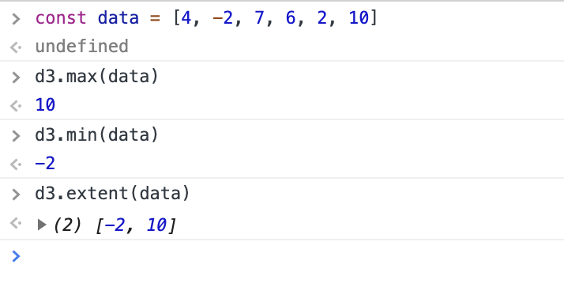
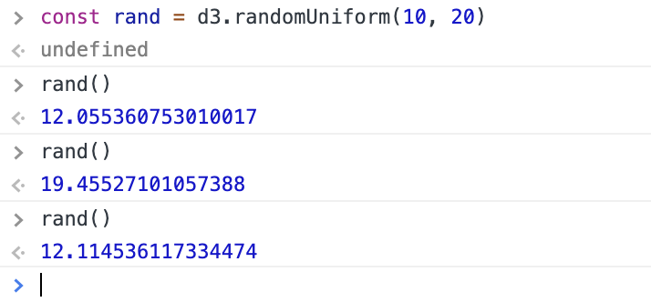
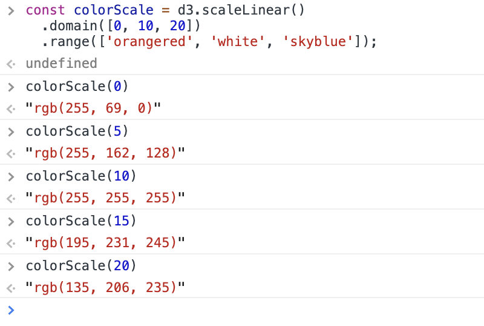
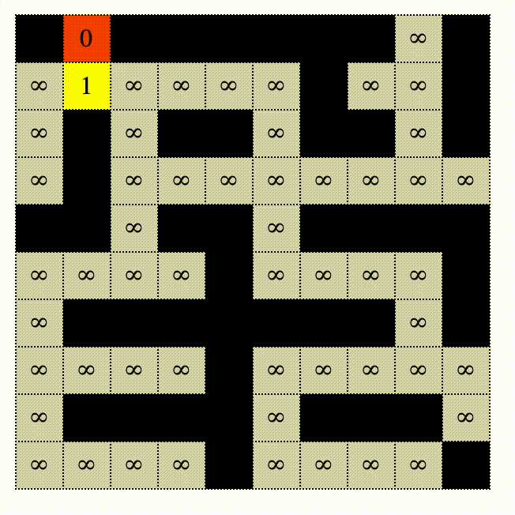
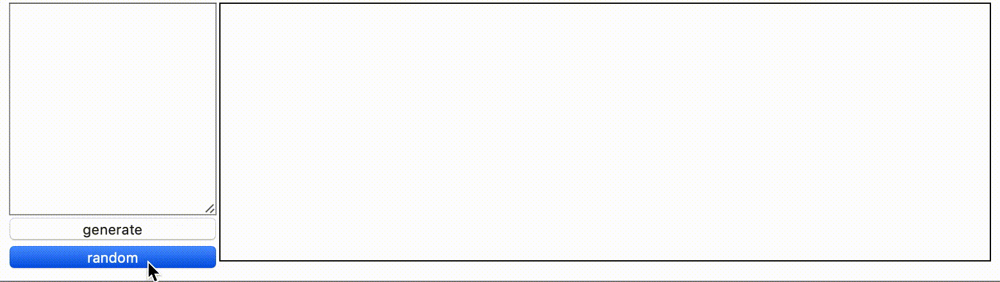

<header>
  <div id="nav-drawer">
  <input id="nav-input" type="checkbox" class="nav-unshown">
  <label id="nav-open" for="nav-input"><span></span></label>
  <label class="nav-unshown" id="nav-close" for="nav-input"></label>
  <div id="nav-content"></div>
  </div>
</header>

<script>
$(() => {
  const aside = $('aside').clone(true);
  aside.appendTo('#nav-content');

  console.log(aside.find('a[href^="#"]'));

  var windowWidth = $(window).width();
  var headerHight = 100; // ヘッダーの高さを入れる
  aside.find('a[href^="#"]').click(function() {
    $('#nav-input').prop('checked', false);
    var speed = 1000;
    var href= $(this).attr("href");
    var target = $(href == "#" || href == "" ? 'html' : href);
    var position = target.offset().top-headerHight;
    $('body,html').animate({scrollTop:position}, speed, 'swing');
    return false;
  });
});
</script>

# D3js Part1 - Understanding Concept

本チュートリアルでは、「配列に入った数値データを円として可視化する」というケースを想定して、D3.jsの基本を学んでいきます。

## お約束

まずは基本形を見せます。index.htmlを作成し、以下のように書いてください。

```html
<!DOCTYPE html>
<html lang="ja">
  <head>
    <meta charset="utf-8">
    <link rel="stylesheet" href="style.css">
  </head>
  <body>
    <!-- ここに色々書いていきます -->
    <script src="https://d3js.org/d3.v5.min.js"></script>
    <script src="script.js"></script>
  </body>
</html>
```

ありふれたhtmlファイルなので詳細については省略しますが、以下の文

```html
<script src="https://d3js.org/d3.v5.min.js"></script>
```

については補足しておきます。この文によって、インターネットからd3.jsのファイルを読み込んでいます。


## Case 01: タグ用意

index.htmlに以下のsvgタグとcircleタグを追加しておきます。

```html
...
<body>
    <svg>
      <circle></circle>
      <circle></circle>
      <circle></circle>
    </svg>
    <script src="https://d3js.org/d3.v5.min.js"></script>
    <script src="script.js"></script>
</body>
...
```

まずは簡単に、以下のケースを考えてみましょう。
- データ[4, 2, 10]とcircleを結びつけたい
- circleの半径をデータの値にしたい
- circleを横並びにしたい

実現は簡単です。script.jsを作成し、以下のように書きましょう。

```js
const [svgWidth, svgHeight] = [600, 800];
const svg = d3.select('svg')
  .attr('width', svgWidth)
  .attr('height', svgHeight);
const data = [4, 2, 10];

svg.selectAll('circle')
  .data(data) 
  .attr('cx', (d, i, node) => 30*i + 40)
  .attr('cy', 10)
  .attr('r', (d, i, node) => d);
```

index.htmlを開くと、次のように表示されます。


画面右側はDevelopper Toolでの出力です。Google Chromeだと、WindowsならF12、Macならcommand + option + iキーで開くことができます。
circleタグにcx、cy、r属性が追加されていることがわかります。

### 説明

一つづつ見ていきましょう。

```js
const [svgWidth, svgHeight] = [600, 800];
```

は、後で利用するためのsvgWidth、svgHeightを設定しています。
JavaScriptの機能である「分割代入」を利用しています。

```js
const svg = d3.select('svg')
  .attr('width', svgWidth)
  .attr('height', svgHeight);
```

HTMLタグ(厳密にはその**DOM**)を選択するにはselectメソッドを使います。さらに返ってきた値に対してattrメソッドを利用することで、htmlタグの属性を変更することができます。
ここでは、svgタグを選択してそのwidthをsvgWidthに、heightをsvgHeightを設定しています。

```js
const data = [4, 2, 10];
```

これは[4,2,10]という配列を用意しているだけですね。

```js
svg.selectAll('circle')
```

によって、circleタグ全てを選択することを意味します。選択したcircleに対して、

```js
svg.selectAll('circle')
  .data(data) 
```

とします。dataメソッドによって、用意された配列dataとcircleタグを結びつけます。data配列とは

```js
const data = [4, 2, 10];
```

であったわけですから、一つのcircleタグには4、一つのcircleタグには2、一つのciecleタグには10という値が結びつけられます。
この結びつける操作のことを「data bind」や「data join」と呼びます。

さて、dataメソッドによってciecleタグとデータが結びつきました。結びついたデータを用いて半径や位置を変更してみましょう。

```js
svg.selectAll('circle')
  .data(data) 
  .attr('cx', (d, i, node) => 30*i + 40)
  .attr('cy', 10)
  .attr('r', (d, i, node) => d);
```

attrメソッドには定数を指定することも可能です。しかし結びついたデータを用いて属性をいじるためには関数を指定してあげます。
例えば次の行

```js
  .attr('cx', (d, i, node) => 30*i + 40)
```

では、cx属性を変更しています。第二引数では無名関数を指定していますが、この引数は以下のようになっています。

```txt
(結びついたデータ, 何番目のDOMか, DOMの配列) => { 関数の内容 }
```

今回の文については、

- 1つ目のcircleのx座標は40
- 2つ目のcircleのx座標は70
- 3つ目のcircleのx座標は100

と配置されます。

```js
  .attr('r', (d, i, node) => d);
```

については、

- 1つ目のcircleの半径は4
- 2つ目のcircleの半径は2
- 3つ目のcircleの半径は10

となります。

ちなみに、いらない引数は次のように省略できます。ただし「1番目の引数はデータ、2番目の引数はDOMの番号、3番目の引数はDOMの配列」であるという順番は守る必要があります。

```js
svg.selectAll('circle')
  .data(data) 
  .attr('cx', (d, i) => 30*i + 40)
  .attr('cy', 10)
  .attr('r', d => d);
```


### 気持ち

表示してみてわかると思いますが、円は非常に小さいです。しかも位置は左上なので、真ん中に寄せたいです。


### Modify

circleタグをgタグで括ります。これは、後で中央寄せするための準備です。

```html
...
<body>
  <svg>
    <g>
      <circle></circle>
      <circle></circle>
      <circle></circle>
    </g>
  </svg>
  <script src="https://d3js.org/d3.v5.min.js"></script>
  <script src="script.js"></script>
</body>
...
```

script.jsを次のようにします。

```js
const [svgWidth, svgHeight] = [600, 800];
const svg = d3.select('svg')
  .attr('width', svgWidth)
  .attr('height', svgHeight);
const data = [4, 2, 10];

svg.select('g')
  .attr('transform', `translate(${svgWidth/2}, ${svgHeight/2})`);
svg.selectAll('circle')
  .data(data) 
  .attr('cx', (d, i) => 30*i + 40)
  .attr('cy', 0)
  .attr('r', d => 3*d);
```

追加箇所は次の文です。

```js
svg.select('g')
  .attr('transform', `translate(${svgWidth/2}, ${svgHeight/2})`);
```

gタグにtransform属性を付けています。これはgタグそのものの移動や回転、拡大縮小を行うための属性です。translate(x, y)と書くことによって、gタグの位置を座標(x,y)にずらしています。こうすることで、円の集まりそのものを画像中心に移動させています。

また、円の半径が小さいので、とりあえず次のように「元データの3倍を半径」としてみます。

```js
  .attr('r', d => 3*d);
```

円の半径は確かに中央寄せなのですが、円同士が重なってしまうようです。何故でしょう &#x1f914;


理由は非常に単純です。円の位置を指定するための属性cx, cyはあくまで「円の中心位置の指定」です。現状、位置は単にデータの番号について等間隔に配置しているため、円の半径までは考慮していません。

ということで、円の半径を考慮して位置を計算したくなります。ここでは、「**配列のデータを入力すると、画面出力のための位置、半径などのデータを返す**」関数を作ってみましょう。そんな関数formatDataは、次のように使います。このような関数を定義することによるメリットについては、後ほど説明します。

```js
const data = [4, 2, 10];
const formatData = (data, space, mag) => {
  // ここを埋めてね
};

svg.select('g')
  .attr('transform', `translate(${svgWidth/2}, ${svgHeight/2})`);
svg.selectAll('circle')
  .data(formatData(data, 10, 5)) 
  .attr('cx', d => d.x)
  .attr('cy', d => d.y)
  .attr('r', d => d.r);
```

こんな感じの図にしましょう。


## Example

 ```js
 formatData([4, 2, 10], 10, 5);
 /*
 [
   {val: 4, r: 20, x: 0, y: 0},
   {val: 2, r: 10, x: 40, y: 0},
   {val: 10, r: 50, x: 110, y: 0}
 ]
 */
 ```

## Solution

```js
const formatData = (data, space, mag) => {
  let now = 0;
  const ret = [];
  for (let i = 0; i < data.length; i++) {
    ret.push({ val: data[i], r: data[i] * mag, x: now, y: 0 });
    if (i < data.length - 1) {
      now += data[i]*mag + space + data[i + 1]*mag;
    }
  }
  return ret;
};
```


## Extended Solution

完全に中央寄せになる

```js
const formatData = (data, space, mag) => {
  let now = 0;
  const ret = data.map((d, i) => {
    const t = { val: d, r: d * mag, x: now, y: 0 };
    if (i < data.length - 1) {
      now += data[i]*mag + space + data[i + 1]*mag;
    }
    return t;
  });
  ret.forEach(d => { d.x -= now/2; });
  return ret;
};
```

さて、なぜこんな関数formatDataを作ったのでしょうか。単に位置を記録するだけなら、配列を別途用意して次のようにも書けそうです。

```js
const data = [4, 2, 10];

const mag = 3;
const x = [];
let now = 0;
for (let i = 0; i < data.length; i++) {
  x.push(now);
  if (i < data.length - 1) {
    now += data[i]*mag + space + data[i + 1]*mag;
  }
}

svg.select('g')
  .attr('transform', `translate(${svgWidth/2}, ${svgHeight/2})`);
svg.selectAll('circle')
  .data(data) 
  .attr('cx', (d, i) => x[i])
  .attr('cy', 0)
  .attr('r', mag * d)
```

しかしこのように書くと、magやxを他のデータに対して使いたい場合に、再利用が面倒です。
formatDataという関数でひとくくりにしてまとめることによって、
「データを出力用データに変換する」という処理を他のデータに再利用できます。位置や半径に少し変更をしたいという場合に、「formatDataという関数を編集すれば良いんだ」ということが分かりやすいと思います。

また、元データを{x座標, y座標, 半径}に変換してあげて、元データではなく変換後のデータを直接DOMと結びつけています。
こうすると、結ばれたデータ自身が位置情報、半径を持っているため、
```js
svg.selectAll('circle')
  .data(formatData(data, 10, 5)) 
  .attr('cx', d => d.x)
  .attr('cy', d => d.y)
  .attr('r', d => d.r);
```
のように、データのプロパティにアクセスすることで円の半径や位置を変更できます。

このように、「元データを都合の良いデータに変換する」というような**データの前処理**は、
今後どんどん使っていきますので心に留めておきましょう。

さて、めでたく位置は中央寄せになりましたし、円同士の重なりは無くなりました。


**しかし、これで本当にめでたいですか?**

今回の場合、**たまたま**circleタグがちょうど3つ用意されていました。
しかし以下のケースを想定しましょう。

- データ数が多い時にcircleタグをいちいち追加しますか?
- データ数が少ない時は?


## Case 02: タグ少ない

htmlファイルについては何も変更はありません。

```html
...
<svg>
  <g>
    <circle></circle>
    <circle></circle>
    <circle></circle>
  </g>
</svg>
...
```

しかし用意されているデータが次のように多かった場合を考えましょう。

```js
const data = [4, 1, 2, 8, 5, 6, 7, 10, 2];
```

すでにあるcircleタグはそのまま使って、足りないcircleは追加してあげる必要があります。データ目線からだと次のように処理をする必要があります。

- 結ばれたデータたち: さっきと同じように
- 結ばれなかったデータたち: **新たに作ってあげる**

実際のコードは以下のようになります。

```js
const data = [4, 1, 2, 8, 5, 6, 7, 10, 2];
const g = svg.select('g')
  .attr('transform', `translate(${svgWidth/2}, ${svgHeight/2})`);
const circle = g.selectAll('circle')
  .data(formatData(data, 10, 5));

// formatDataは省略

circle.attr('cx', d => d.x)
  .attr('cy', d => d.y)
  .attr('r', d => d.r);

const circleEnter = circle.enter()
  .append('circle');
circleEnter.attr('cx', d => d.x)
  .attr('cy', d => d.y)
  .attr('r', d => d.r);
```

何やらcircleEnterというものが追加されました。これが「結ばれなかったデータたち」です。
```js
circle.enter()
```
というもので、「結ばれなかったデータたち」にアクセスしています(厳密には「結ばれなかったデータ」という表現は誤りなのですが、これについての訂正はCase03の後で行います)。
さらに、
```js
const circleEnter = circle.enter()
  .append('circle');
```
によって、結ばれなかったデータに対して結び手circleを新たに追加してやります。これでめでたくデータに対応したcircleタグができたわけです。その後の処理は普通に座標、半径を設定しているだけです。

ところで、次の2つの文が似ていることに気づくと思います。
```js
circle.attr('cx', d => d.x)
  .attr('cy', d => d.y)
  .attr('r', d => d.r);
```
```js
circleEnter.attr('cx', d => d.x)
  .attr('cy', d => d.y)
  .attr('r', d => d.r);
```
これを実はこれを一括で書く方法があります。mergeメソッドを用いて、普通のデータとenterのデータを併合することができます。
これにより、重複部分を省くことができます。

```js
...

const circle = g.selectAll('circle')
  .data(formatData(data, 10, 5));

const circleEnter = circle.enter()
  .append('circle');
circleEnter.merge(circle)
  .attr('cx', d => d.x)
  .attr('cy', d => d.y)
  .attr('r', d => d.r);
```


いい感じですね。


## Case 03: データ少ない

相変わらずのhtmlファイルです。

```html
...
<svg>
  <g>
    <circle></circle>
    <circle></circle>
    <circle></circle>
  </g>
</svg>
...
```

しかしデータは2つしかありません。1つcircleタグが余計です。

```js
const data = [4, 2];
```

データと結びついたタグはそのまま使って、余ったcircleは削除してあげる必要があります。つまり、

- 結ばれたDOMたち: さっきと同じように
- 結ばれなかったDOMたち: **消し去る**

ということを書いたコードが以下のようになります。

```js
const data = [4, 2];
const g = svg.select('g')
  .attr('transform', `translate(${svgWidth/2}, ${svgHeight/2})`);
const circle = g.selectAll('circle')
  .data(formatData(data, 10, 5));

circle.attr('cx', d => d.x)
  .attr('cy', d => d.y)
  .attr('r', d => d.r);

circle.exit().remove();
```

データに結ばれなかったDOMは
```js
circle.exit()
```
で得られます(厳密には「結ばれなかったDOM」という表現は誤りなのですが、これについての訂正はCase03の後で行います)。
removeメソッドを使うとこれを削除することができます。


## 込み入った話

今までの話で、

- circle.enter()ではDOMに結びつかなかったデータ得られる
- circle.exit()ではデータに結びつかなかったDOMが得られる

と表現してきました。
厳密には、この表現は間違いです。**circle.enter()やcircle.exit()の返り値は、DOMでもデータでもありません。**

## *selection(s)* オブジェクト

例えば、
```js
const svg = d3.select('svg');
```
が返す値は、*selection*と呼ばれるオブジェクトです。この*selection*を介して、私たちはDOMの属性を操作したり、
DOMに子要素を追加/削除したり、データとDOMを結びつけたりしています。

selectで指定する引数は、cssのセレクタと同じ文法です。なので、例えば以下のように書けば、
contentをクラスとして持つDOMの*selection*を返します。

```js
d3.select('.content')
```

さらに、「svgを選択して、さらにその下のcircleを選択したい」という場合は、次のように書きます。

```js
d3.select('svg')
  .select('circle');

// 次のように変数に一度格納することをよくやります
const svg = d3.select('svg');
const circle = svg.select('circle');
```

また、selectは一つの*selection*を返しましたが、selectAllは*selections*を返します。これは*selection*を複数集めた、配列に似たオブジェクトです。
```js
d3.selectAll('circle')
```

### *selections*.dataの行く末

すでにCase01から見ていきましたが、データとDOMを結びつけるためには、*selections*.dataメソッドを用います。
ただし、結びつける対象のDOMが必要なので、先にselectAllで選択しておきます。

```js
svg.selectAll('circle')
  .data([4, 2, 3]);
```

データとDOMが結びつくわけですが、Case01〜Case03で見た通り、タグが足りなかったりデータが足りなかったりするケースが存在します。
それに応じて、enterメソッドやexitメソッドでそれぞれの*selection*にアクセスするわけです。
enterやexitでアクセスされる*selections*には名前がついており、それぞれ*enter selections*、*exit selections*などと呼ばれます。
以上をまとめると、こんな感じで分類されます。

- データとDOMが結ばれた: *update selections*
  - *selections* でアクセス
- DOM足りないんだけど?: *enter selections*
  - *selections.enter()* でアクセス
- データ足りないんだけど?: *exit selections*
  - *selections.exit()* でアクセス

これを今まで見せてきた例に照らし合わせると、
```js
const circle = d3.selectAll('circle')
  .data(data)
```
において、circleが*update selections*を表しており、
```js
const circleEnter = circle.enter()
```
において、circle.enter()が*enter selections*を表しており、
```js
circle.exit().remove()
```
において、circle.exit()が*exit selections*を表しています。

### *selection*.datum

結ぶデータとDOMが1ペアしかないことが確実なら、datumというメソッドを利用します。
selectAllほど使用頻度は多くありません。

```js
// 例1: 1つのcircleを選択して1つの値を結びつける
// ただしcircleが必ず存在している必要がある
// 半径を結びつけた値に設定する
d3.select('circle')
  .datum(4)
  .attr('r', d => d);

// 例2: appendでcircleを追加して1つの値を結びつける
// 半径を結びつけた値に設定する
d3.select('svg')
  .append('circle')
  .datum(4)
  .attr('r', d => d);
```

### データはどこ?

*selections.data*メソッドで結びついたデータはどんな形で保管されているのでしょうか。
実は、**DOMの中の__data__というプロパティ**に入っています。*selections*に入っているわけではありません。

ブラウザのDevelopper Toolで
```js
d3.selectAll('circle')
```
を実行して__data__を探してみましょう。

これによって出力されたものが、*selections*オブジェクトの中身です。
_groups、NodeListと辿るとcircleがいくつか見られます。これがcircleのDOMです。


0番目のcircleをクリックすると、DOMが持っている大量のプロパティが見られます。
下の方を見てみると、__data__が発見できます。


しかしこれに直接アクセスすることは決してありません。「データを可視化する」という目的において、DOMに結ばれたデータにわざわざアクセス
することはほとんどないと思います。万が一入っているデータにアクセスしたい場合は、__data__に直接アクセスするのではなく、
*selection*.datum()もしくは*selections*.data()を引数なしで呼び出します。

```js
d3.selectAll('circle')
  .data()
```


### データは引き継がれる

あるDOMにデータが結び付けられたとしましょう。すると、その子孫DOMにもデータが引き継がれます。
引き継ぎのタイミングは、appendやselect/selectAllが呼び出された場合です。これは非常に良い性質です。
例を示しましょう。以下は、「円の中心にテキストを出力する例」です。

```js
const svg = d3.select('svg')
const g = svg.append('g')
  .attr('transform', `translate(${svgWidth/2}, ${svgHeight/2})`)
  .datum({r: 10, name: "Hello"});
g.append('circle')
  .attr('fill', '#fff')
  .attr('stroke', '#000')
  .attr('r', d => d.r);
g.append('text')
  .text(d => d.name);
```

実行結果はこんな感じです。文字が中央に寄っていないのが嫌ですが、これについてはCase05で解決します。

<svg xmlns="http://www.w3.org/2000/svg" xmlns:xlink="http://www.w3.org/1999/xlink" width="200px" height="200px">
<g transform="translate(100, 100)"><circle fill="#fff" stroke="#000" r="10"></circle><text>Hello</text></g>
</svg>

gタグの中にcircleタグとtextタグを入れ込み、gに{r: 10, name: "Hello"}という値を結びつけています。
その後appendを用いてcircleとtextを追加しています。この際に、gに結びつけた{r: 10, name: "Hello"}という
値はcircleとtextにも引き継がれます。

circleは{r: 10, name: "Hello"}を持っているから
```js
g.append('circle')
  ...
  .attr('r', d => d.r);
```
のようにして、rのを設定できるし、同様にして
```js
g.append('text')
  .text(d => d.name);
```
のようにして、textタグのテキストを設定できるのです。

補足: メソッド名から何となく想像がつくと思いますが、textメソッドを用いると、タグ内部のテキストを設定できます。


### もっと詳しく知りたい方へ

D3.js開発者が書いている <a href="https://bost.ocks.org/mike/selection/" target="_blank">How Selections Work</a>を読みましょう。

## Case 04: 関数化

今までcircleタグを書いていましたが、Case02、Case03で見たように、実際にデータ数が3個であるは限りません。
なのでcircleタグを最初から書くのをやめてしまいましょう。

```html
...
<svg>
</svg>
...
```

次のような機能を追加したいと思います。

- update([4, 2, 3,...])と呼び出すと描画されるようにしたい
- 何度も呼び出しできるようにしたい、つまり、update関数は何度も呼び出される可能性がある  

2つ目の要求を満たすためには、update/enter/exit全てを考慮しなければならないことがわかります。
ということで書いてみると次のようになります。データを結びつけた後に、update/enter/exitの
処理を行う、という操作を行っています。これはある種の書き方のパターンとして覚えても良いかもしれません。

参考: <a href="https://bl.ocks.org/mbostock/3808218" target="_blank">General Update Pattern, I</a>

```js
const g = svg.append('g')
  .attr('transform', `translate(${svgWidth/2}, ${svgHeight/2})`);

const update = (data) => {
  // データを結びつける
  const circle = g.selectAll('circle')
    .data(formatData(data, 10, 5));

  // データと結びついたDOMを更新(update selection)
  circle.attr('cx', d => d.x)
    .attr('cy', d => d.y)
    .attr('r', d => d.r);

  // 足りなかったcircleは追加(enter selection)
  const circleEnter = circle.enter()
    .append('circle');
  circleEnter.attr('cx', d => d.x)
    .attr('cy', d => d.y)
    .attr('r', d => d.r);

  // 多すぎたcircleは削除(exit selection)
  circle.exit().remove();
};
```

もしenterとupdateで設定することが同じなら、
Case02で紹介したmergeを使って、以下のように書く量を少し減らせます。

```js
const g = svg.append('g')
  .attr('transform', `translate(${svgWidth/2}, ${svgHeight/2})`);

const update = (data) => {
  // データを結びつける
  const circle = g.selectAll('circle')
    .data(formatData(data, 10, 5));

  // 足りなかったcircleは追加(enter selection)
  const circleEnter = circle.enter()
    .append('circle');

  // update/enterをいっぺんに処理
  circleEnter.merge(circle)
    .attr('cx', d => d.x)
    .attr('cy', d => d.y)
    .attr('r', d => d.r);

  // 多すぎたcircleは削除(exit selection)
  circle.exit().remove();
};
```

Developper Toolのコンソール上で、update関数を次のように入力すると、それに応じた個数と半径の円が出力されます。


## Case 05: テキストを入れる

今度は、円の中心にデータの値が描かれるようにしてみましょう。
円とテキストを1つのグループとして扱いたいので、以下のようにgタグでくくってやります。


それに応じてコード修正します。

```js
const update = (data) => {
  const circleGroup = g.selectAll('g')
    .data(formatData(data, 10, 5));

  // 足りなかった分gタグを追加
  const circleGroupEnter = circleGroup.enter()
    .append('g');

  // それぞれのgタグについて、circleタグとtextタグを追加
  circleGroupEnter.append('circle');
  circleGroupEnter.append('text');

  // update/exitをいっぺんに処理する
  const circleGroupMerge = circleGroupEnter
    .merge(circleGroup);
  circleGroupMerge
    .attr('transform', d => `translate(${d.x}, ${d.y})`);
  circleGroupMerge.select('circle')
    .attr('fill', '#fff')
    .attr('stroke', '#000')
    .attr('r', d => d.r);
  circleGroupMerge.select('text')
    .attr('text-anchor', 'middle')
    .attr('dominant-baseline', 'central')
    .text(d => d.val);

  circleGroup.exit().remove();
};
```

これはsvgの知識ですが、次のような属性の設定を行うと、テキストが中央寄せになります。
```js
  circleGroupMerge.select('text')
    .attr('text-anchor', 'middle')
    .attr('dominant-baseline', 'central')
```


## Case 06: Animation

「配列の値を円として可視化する」という意味では、十分な可視化が達成されました。
これ以降はもう少し見栄えに関する部分をいじっていきながら、d3.jsの機能に触れていきたいと思います。

では早速、出現や消滅をカッコよく動かしてみましょう。

### d3.transition()

DOMの属性やスタイル変更をアニメーションするためには、d3.transition()、もしくは*selection(s)*.transition()を用います。

例えば「円を(0,0)から(100, 120)」に移動させるといった場合、次のように書きます。
transitionを呼び出した後に変化後の属性やスタイルを設定することでアニメーションが行われます。

```js
const svg = d3.select('svg');
const circle = svg.append('circle')
  .attr('r', 10)
  .attr('cx', 0)  // 変化前のx座標
  .attr('cy', 0); // 変化前のy座標
circle.transition()
  .attr('cx', 100)  // 変化後のx座標
  .attr('cy', 120); // 変化後のy座標
```

遅延時間やアニメーション時間を設定したい場合は、transitionに続けてdelayやdurationを設定します。
また、複数のDOMを同期して動かしたい場合は、d3.transitionを変数として設定しておいて、
*selection(s)*.transitionの引数にそれを指定します。

例えば、
- 2つの円を500ms待機後、1000msかけて同時に動かしたい
- 1つ目の円は(0,0)から(100,120)に移動
- 2つ目の円は(0,0)から(150, 200)に移動

```js
const svg = d3.select('svg');
const circle1 = svg.append('circle')
  .attr('r', 10)
  .attr('cx', 0) 
  .attr('cy', 0);
const circle2 = svg.append('circle')
  .attr('r', 10)
  .attr('cx', 0) 
  .attr('cy', 0);

const t = d3.transition()
  .delay(500)
  .duration(1000);
circle1.transition(t)
  .attr('cx', 100) 
  .attr('cy', 120);
circle2.transition(t)
  .attr('cx', 150) 
  .attr('cy', 200);
```

ちなみにアニメーションは位置だけでなくて色や形に対しても行われます。

さて前置きはここまでにして、早速update関数を修正しましょう。

```js
const update = (data) => {
  const circleGroup = g.selectAll('g')
    .data(formatData(data, 10, 5));

  // 足りなかった分gタグを追加
  const circleGroupEnter = circleGroup.enter()
    .append('g');

  // それぞれのgタグについて、circleタグとtextタグを追加
  circleGroupEnter.append('circle');
  circleGroupEnter.append('text');

  const t = d3.transition()
    .delay(500)
    .duration(1000);

  // updateとenterに関するアニメーション
  const circleGroupMerge = circleGroupEnter
    .merge(circleGroup) 
    .transition(t);
  circleGroupMerge
    .attr('transform', d => `translate(${d.x}, ${d.y})`);
  circleGroupMerge.select('circle')
    .attr('fill', '#fff')
    .attr('stroke', '#000')
    .attr('r', d => d.r);
  circleGroupMerge.select('text')
    .attr('text-anchor', 'middle')
    .attr('dominant-baseline', 'central')
    .text(d => d.val);

  // exitについては、半径を0にしてから消滅するようなアニメーションをする
  const circleGroupExit = circleGroup.exit()
    .transition(t);
  circleGroupExit.select('circle')
    .attr('r', 0);
  circleGroupExit.remove();
};
```

実行結果は次のようになります。


ちなみに今回はexitについて、「半径を0にしてから消滅」というアニメーションを行いましたが、
そうではなくて「だんだんと透明になって消滅」というアニメーションを行いたい場合は次のように書きます。
cssにopacityというスタイルがあるのでそれを利用します。

```js
  // exitについては、だんだんと透明になって消滅するようなアニメーションをする
  const circleGroupExit = circleGroup.exit()
    .transition(t);
  circleGroupExit.style('opacity', 0);
  circleGroupExit.remove();
```

補足: 名前からなんとなく想像はつくと思いますが、
attrはタグの属性(attribute)を設定するメソッドで、styleはタグのcssスタイルを設定するメソッドです。


## Case 07: Relative Radius

以下の図は、update([1, 30])を実行した結果です。半径を1は小さすぎだし、30は大きすぎな気がします。
そこで、半径に下限/上限を設定してあげて、小さくなりすぎない/大きくなりすぎないようにしましょう。


データを適切な半径へと拡大縮小する関数を考えましょう。
現れるデータの最大値、最小値が分かっているとして、それを$x_m, x_M$とします。
データを半径に変換する関数を作成するわけですが、半径の下限、上限をそれぞれ$y_m, y_M$とします。
半径とデータの関係ですが、「データが大きいほど半径も大きい」とします。これを満たす関数で簡単なのは一次関数です。
以上から、下図のような関数が考えられます。


これは高校数学でお馴染みで、こんな直線の式になります。

\\[
y = \frac{y_M - y_m}{x_M - x_m}(x - x_m) + y_m
\\]


### 関数を返す関数

以上の軽い考察を基にして、
domainとrangeを設定すると
適切な一次関数を返してくれる関数を作ります。

```js
const scaleGenerator = (dom, ran) => {
  return x => (ran[1]-ran[0])/(dom[1]-dom[0])*(x-dom[0])+ran[0];
};
```

### 動き

[10, 20]の範囲を線形に拡大縮小して、[30,50]の範囲に直す関数、ともみられます。
端点10、20はそれぞれ30、50に変換されます。


### formatDataの修正

Case01で書いたformatDataを修正します。引数magの代わりに、関数rScaleを指定します。

```js
const formatData = (data, space, rScale) => {
  let now = 0;
  const ret = data.map((d, i) => {
    const t = { val: data[i], r: rScale(data[i]), x: now, y: 0 };
    if (i < data.length - 1) {
      now += rScale(data[i]) + space + rScale(data[i + 1]); 
    }
    return t;
  }
  ret.forEach(d => { d.x -= now/2; });
  return ret;
};
```


### updateの修正

formatDataの修正に伴って、updateも修正します。
とりあえず半径の範囲は[10,50]で固定しました。

(d3.extentについては後で補足します)

```js
const scaleGenerator = (dom, ran) => {
  return x => (ran[1]-ran[0])/(dom[1]-dom[0])*(x-dom[0])+ran[0];
};
const update = (data) => {
  const rScale = scaleGenerator(d3.extent(data), [10, 50]);
  const circleGroup = g.selectAll('g')
    .data(formatData(data, 10, rScale));
  ...
}
```


### d3.scaleLinear

実は次のscaleGeneratorというのは**車輪の再発明**です。

```js
// Before
const scaleGenerator = (dom, ran) => {
  return x => (ran[1]-ran[0])/(dom[1]-dom[0])*(x-dom[0])+ran[0];
};
const rScale = scaleGenerator(d3.extent(data), [10, 50]);
```

d3.jsには同じ機能を持った関数scaleLinearがあります。使い方は下記のようにします。
次からはこれを使いましょう。

scaleLinearには今回作ったscaleGeneratorより優れている点があるのですが、詳しくはCase08-3で説明します。

```js
// After
const rScale = d3.scaleLinear()
  .domain(d3.extent(data))
  .range([10, 50]);
```

今回は一次関数を用いてデータを拡大縮小しました。他にも、scalePos/scaleLog/scaleSqrtなどを用いて、一次関数以外の変換も可能です。

### 補足: max/min/extent

d3.jsには便利な関数max/min/extentが用意されています。max/minはそれぞれデータの最大値を返します。
extentはデータの範囲を[最小値,最大値]の形式で返します。



要素がObject/Arrayだった場合は、次のように第2引数に関数を書くことで、何に対しての最大値/最小なのかを指定できます。


他にも便利な配列操作系関数が用意されています。どんなものがあるかは<a href="https://github.com/d3/d3-array" target="_blank">d3/d3-array</a>
を参考にしてください。

## Case 08: Color

今度は色をつけてみましょう。以下の3つのケースについて説明していきます。
1. 色をランダムにする
2. 初めから用意せれた色を用いる
3. データの大きさに応じた色にする

## Case 08-1: Random Color

色をランダムにしましょう。fill属性などにおける色指定ではrgbを指定できるので、
rbgにおける3つの値それぞれにおいて0から255までの整数値についての乱数を作成することを考えます。

### d3.randomUniform

一様分布を生成する関数を作成する関数にd3.randomUniformというものがあります。
範囲は右半開区間で指定して、例えば[10, 20)の範囲の乱数を生成する関数は次のように書けます。

```js
const rand = d3.randomUniform(0, 20);
```

実際に乱数を生成するときはrand()を呼び出します。



randonUniformで生成される乱数は実数値です。今回はrgbが整数値である必要があるので、整数値に丸めなければいけません。
そこで、randomUniformをラッピングして、乱数生成器randomIntを作成します。

```js
const randomInt = (m, M) => {
  const randUniform = d3.randomUniform(m, M);
  return () => Math.floor(randUniform());
};
```


```js
const update = (date) => {
  ...
  const randomInt = (m, M) => {
    const randUniform = d3.randomUniform(m, M);
    return () => Math.floor(randUniform());
  };

  const rand = randomInt(0, 256);
  circleGroupMerge.select('circle')
    .attr('fill', () => `rgb(${rand()}, ${rand()}, ${rand()})`)
    .attr('stroke', '#000')
    .attr('r', d => d.r);
  ...
}
```

実は、randomIntは車輪の再発明です。
d3-randomのscriptファイルを読み込めば、これと同等の機能を持つ関数d3.randomIntが利用できます。
また、今回一様分布乱数を利用しましたが、他にも正規分布や二項分布の乱数も用意されています。
詳しくは<a href="https://github.com/d3/d3-random">d3-random</a>のページを参照してください。

### 若干汚い(ことがある)

実行してみると、汚い色が現れることがよくあります。


rgb値それぞれについて乱数を設定すると、どうしても汚い色が現れます。
hslで考えれば色の鮮やかさを固定できるので、hslを利用して色を設定してみましょう。

```js
const update = (data) => {
  ...
  const rand = d3.randomUniform(0, 2 * Math.PI);
  circleGroupMerge.select('circle')
    .attr('fill', () => `hsl(${rand()}rad, 100%, 50%)`)
    .attr('stroke', '#000')
    .attr('r', d => rScale(d.val));
  ...
};
```


## Case 08-2: Color Scheme

あらかじめ用意された色セットを使ってみましょう。どんなものがあるかは
<a href="https://github.com/d3/d3-scale-chromatic" target="_blank">d3-scale-chromatic</a>
を参考にしてください。
さて、その中の1つであるd3.schemeSet1を見てみると、どうやら色の配列のようです。


この色セットから色をランダムに選ぶようにしてみましょう。

```js
const update = (date) => {
  ...
  const randomInt = (m, M) => {
    const randUniform = d3.randomUniform(m, M);
    return () => Math.floor(randUniform());
  };

  const rand = randomInt(0, d3.schemeSet1.length);
  circleGroupMerge.select('circle')
    .attr('fill', () => d3.schemeSet1[rand()])
    .attr('stroke', '#000')
    .attr('r', d => d.r);
  ...
};
```


グラデーションのColor Schemeもあります。
詳しくは<a href="https://github.com/d3/d3-scale-chromatic" target="_blank">d3-scale-chromatic</a>
を参考にしてください。


## Case 08-3: Linear Color Scale

値に応じて色が決まるようにしましょう。具体的には、

- 値: 小 &hArr; 中 &hArr; 大
- 色: 水 &hArr; 白 &hArr; 橙

のように対応させることを考えます。

### d3.scaleLinear再び

驚くべきことに、値と色を対応させる目的でscaleLinearが使えます。
さらに、domain/rangeに中間の値を設定することができます。

```js
const colorScale = d3.scaleLinear()
  .domain([0, 10, 20])
  .range(['orangered', 'white', 'skyblue']);
```



これを利用してupdate関数を修正します。

```js
const update = (data) => {
  ...
  const [rmin, rmax] = d3.extent(data);
  const colorScale = d3.scaleLinear()
    .domain([rmin, (rmin + rmax)/2, rmax])
    .range(['orangered', 'white', 'skyblue']);
  circleGroupMerge.select('circle')
    .attr('fill', d => colorScale(d.val))
    .attr('stroke', '#000')
    .attr('r', d => d.r);
  ...
};
```


## Case 09: Click

今度は、「クリックされたボールは1増加させる」という処理を考えてみましょう。
ただここでは、1増加させたらそれに同期して元データも1増加させることを考えます。

### 2つの方法

これを実現するには、2つの方法がありそうです。ここでは、以下のように名前をつけたいと思います。

1. Rebind - データを再度結びつけ直す
2. Update Directly - DOMに結ばれたデータの値を直接変更

### Common Comcept: *selection*.on

どちらの方法にしても、*selection*.onメソッドを用います。第一引数にイベント名を指定し、第二引数にイベント発生時の処理を書きます。
例えば、「circleがクリックされたらアラートを出す」という処理は以下のように書けます。

```js
const svg = d3.select('svg');
const circle = svg.append('circle')
  .datum("Hello")
  .attr('cx', 10)
  .attr('cy', 10)
  .attr('r', 10)
  .on('click', d => {
    alert(d);
  });
```


### 1st Method: Rebind

結びついたデータが元のデータ配列の何番目なのかを知りたいので、dataに自分の番号を持たせましょう。
その番号を通じて、データの値を変更します。
「番号は次のコールバック関数のiを用いれば良いじゃないか」と思われるかもしれません。
```js
...
.on('click', (d, i) => { ... });
```
今回のケースではこれでも正しく動きますが、一般に元データの順番と結びつけられたデータの順番が一緒とは限りません。
dataメソッドにキーを指定してデータを結びつける方法があるからです。
これについては
<a href="https://github.com/d3/d3-selection/blob/v1.4.0/README.md#selection_data" target="_blank">
How Selections WorkのThe Key to Enligntenment</a>
や
<a href="https://bl.ocks.org/mbostock/3808221" target="_blank">Genera Update Pattern, II</a>
<a href="https://github.com/d3/d3-selection/blob/v1.4.0/README.md#selection_data" target="_blank">selection.data</a>
に解説を委ねるとして、とにかく番号をdataにもたせます。formatDataを以下のように修正しましょう。

```js
const formatData = (data, space, rScale) => {
  let now = 0;
  const ret = data.map((d, i) => {
    const t = { 
      idx: i, val: data[i], r: rScale(data[i]),
      x: now, y: 0
    };
    if (i < data.length - 1) {
      now += rScale(data[i]) + space + rScale(data[i + 1]); 
    }
  }
  ret.forEach(d => { d.x -= now/2; });
  return ret;
};
```

次に、update関数の修正をします。
transition付きにはonclickが設定できないので
circleGroupMergeとtransitionを、新たにcircleGroupTransitionとして分離します。

```js
const update = (data) => {
  ...
  const circleGroupMerge = circleGroupEnter
    .merge(circleGroup);
  const circleGroupTrans = circleGroupMerge.transition(t);
  circleGroupTrans
    .attr('transform', d => `translate(${d.x}, ${d.y})`);

  const [rmin, rmax] = d3.extent(data, d => d.val);
  const colorScale = d3.scaleLinear()
    .domain([rmin, (rmin + rmax)/2, rmax])
    .range(['orangered', 'white', 'skyblue']);
  circleGroupTrans.select('circle')
    .attr('fill', d => colorScale(d.val))
    .attr('stroke', '#000')
    .attr('r', d => d.r);
  circleGroupTrans.select('text')
    .attr('text-anchor', 'middle')
    .attr('dominant-baseline', 'central')
    .text(d => d.val);

  // クリックされた場合、dataを変更してupdate関数を呼び出す
  circleGroupMerge.on('click', d => {
    data[d.idx]++;
    update(data);
  });
  ...
};
```

### 2nd Method: Update Directly

1st Mathodと同じように、次のように書いてもうまくいきません。

```js
circleGroupMerge.on('click', d => {
  d.val++;
  update(data);
});
```

確かにDOMに結びつけられたデータは1加えられるのですが、dataそのものは無変更です。
結局、update(data)によって、変更したデータは無かったことになってしまいます。

そうすると、

- **データを追加/削除する処理**
- **circleの状態を変更する処理**

を分けたくなってきます。
次にように、コールバック関数の中で属性の変更をすることができなくもないのですが、
少し冗長です。

```js
circleGroupMerge.on('click', d => {
  d.val++;
  circleGroupMerge
    .attr('transform', d => `translate(${d.x}, ${d.y})`);
  circleGroupMerge.select('circle')
    .attr('fill', d => colorScale(d.val))
    .attr('stroke', '#000')
    .attr('r', d => rScale(d.val));
  circleGroupMerge.select('text')
    .attr('text-anchor', 'middle')
    .attr('dominant-baseline', 'central')
    .text(d => d.val);
  circleGroupMerge.select('text')
    .attr('text-anchor', 'middle')
    .attr('dominant-baseline', 'central')
    .text(d => d.val);
});
```

そこで、大胆にがらっとコードを書き換えることを考えます。

#### 機能分離

次のように関数を設計します。

- formatData: データに位置や半径の情報を付加する
- calcCircleInfo: 位置や半径の情報を更新する
- adjustCirclesByData: データに応じてDOMの個数を調整する
- decorateCircles: データのattr/style変更をする
- update: update(普通の配列)としてアクセスするための関数

#### formatData

位置や半径の実際の値についてはcalcCircleInfoで決定するとして、とりあえずテンプレだけ作って返す関数です。

```js
const formatData = (data) => {
  const ret = [];
  for (let i = 0; i < data.length; i++) {
    ret.push({
      val: data[i],
      x: 0,
      y: 0,
      r: 0
    });
  }
  return ret;
};
```


#### calcCircleInfo

位置や半径を更新します。

```js
const calcCircleInfo = (data, space, rScale) => {
  let now = 0;
  data.forEach((d, i) => {
    d.x = now;
    d.r = rScale(d.val);
    if (i < data.length - 1) {
      now += rScale(data[i].val) + space + rScale(data[i+1].val);
    }
  });
  data = data.forEach(d => { d.x -= now/2; });
  return data;
};
```

#### adjustCirclesByData

とりあえずDOMの個数の追加/削除だけを行い、位置、色、半径などの設定はdecorateCirclesに処理を投げます。

```js
const adjustCirclesByData = (data) => {
  const circleGroup = g.selectAll('g')
    .data(data);
  const circleGroupEnter = circleGroup.enter()
    .append('g')
  circleGroupEnter.append('circle');
  circleGroupEnter.append('text');

  const circleGroupMerge = circleGroupEnter
    .merge(circleGroup);
  decorateCircles(circleGroupMerge);

  const circleGroupExit = circleGroup.exit()
    .transition()
    .delay(500)
    .duration(1000);
  circleGroupExit.select('circle')
    .attr('r', 0);
  circleGroupExit.remove();

  circleGroupMerge.on('click', d => {
      d.val++;
      decorateCircles(circleGroupMerge);
    });
};
```

#### decorateCircles

*selection* を引数にとる少し奇妙な関数です。*selection*に対応するDOMの属性を変更します。

```js
const decorateCircles = (circleGroup) => {
  const data = circleGroup.data();
  const rScale = d3.scaleLinear()
    .domain(d3.extent(data, d => d.val))
    .range([10, 50]);
  calcCircleInfo(data, 10, rScale);
  const [rmin, rmax] = d3.extent(data, d => d.val);
  const colorScale = d3.scaleLinear()
    .domain([rmin, (rmin + rmax)/2, rmax])
    .range(['skyblue', 'white', 'orangered']);
  const circleGroupTrans = circleGroup
    .transition()
    .delay(500)
    .duration(1000);

  circleGroupTrans
    .attr('transform', d => `translate(${d.x}, ${d.y})`);
  circleGroupTrans.select('circle')
    .attr('fill', d => colorScale(d.val))
    .attr('stroke', '#000')
    .attr('r', d => d.r);
  circleGroupTrans.select('text')
    .attr('text-anchor', 'middle')
    .attr('dominant-baseline', 'central')
    .text(d => d.val);
};
```

#### update

formatDataでデータを適当な形に変換したものに対して
adjustCirclesByDataを適用します。

```js
const update = (data) => {
  adjustCirclesByData(formatData(data));
};
```

これでなんとかうまくいきます。


### 注意

このように、データを可視化して、インタラクティブに触れることができるようになりました。
ただし、D3.jsはデータ可視化のためのライブラリなので、「データを書き換える」ということは本来の使い方でないことを心に留めておきましょう。


### Interactive Process

*selection*.onを用いたインタラクティブ処理の応用例としては、次の二つの処理に分かれると思います。

1. データ書き換え以外のインタラクティブ要素  
   ex) マウスを乗せると座標が表示される
2. **データの動きを見たい**

今後のチュートリアルで扱うのは主に2です。
例えば、「迷路を探索する様子を見たい」という要求に応えるようにするためには、
マップとその探索情報を少しずつ進めながら可視化する必要があります。



これは、紹介した2つの方法どちらでも実現することが可能です。
2つの特徴を以下に挙げます。

#### 1st Method: Rebind

- 実装楽
- 用意すべきデータが2stに比べ多い

#### 2nd Method: Update Directly

- 差分だけ更新
  &rArr; 用意すべきデータが1stに比べ少ない
- データの持たせ方が難しい時がある


## Case 10: Input Area

下図のように、入力エリアを作ってみましょう。
入力形式は自由に決めて良いですが、ここでは以下のような制約とします。
- スペース区切りで数字が入力される
- 複数行入力も受け付ける


### index.html

divでくくって、その中にメニューとメインコンテンツを配置するようなレイアウトにします。

```html
...
<div class="main-container">
  <div class="menu">
  </div>
  <div class="main">
    <svg>
    </svg>
  </div>
</div>
...
```


### style.css

flexレイアウトを用いることで、横並びのレイアウトにします。

```css
.main-container {
  display: flex;
  flex-direction: row;
}
.menu {
  display: flex;
  flex-direction: column;
}
svg {
  border: 1px solid #000;
}
```

### script.js

以下のように追加します。

```js
...

const menu = d3.select('.menu');
const textarea = menu.append('textarea')
  .style('height', `${svgHeight - 30}px`);
const genButton = menu.append('input')
  .attr('height', '30px')
  .attr('type', 'button')
  .attr('value', 'generate');

genButton.on('click', () => {
  const input = textarea.property('value')
    .split('\n')
    .map(d => d.split(' '));
  const data = d3.merge(input)
    .map(d => Number(d));
  update(data);
});
```

なにやら見慣れないメソッドがありますが、以下の点に注目してください。

- textarea.property('value')でテキストエリアの内容を取得
- d3.merge([1], [2, 3], [4, 5]) &rarr; [1, 2, 3, 4, 5]
- Nubmer(d)でdを数値に変換

### Case 11: Random Numbers

入力エリアでいちいち入力するのが面倒かと思うかもしれません。
ランダムに数列を生成してくれる機能を作りましょう。

今回は、「0から9までの乱数を7個生成する」ことにします。
script.jsに以下の文を追加します。

```js
const randButton = menu.append('input')
  .attr('height', '30px')
  .attr('type', 'button')
  .attr('value', 'random');

randButton.on('click', () => {
  const randomInt = (m, M) => {
    const randomUniform = d3.randomUniform(m, M);
    return () => Math.floor(randomUniform());
  }
  const rand = randomInt(0, 10);
  const data = [...Array(7)].map(() => rand());
  update(data);
});
```




## まとめ

### Case 1&#126;3: *selection*の基本概念を理解

- update/enter/exitを感じよ
- *selection*，DOM，データの絆を感じよ

### Case 4: 関数化
### Case 5&#126;8: 装飾
5. テキスト入れる
6. アニメーション
7. 半径のスケール調整
8. 色

### Case 9: インタラクティブ
### Case 10: 入力エリア作り
### Case 11: 乱数ボタン作り
