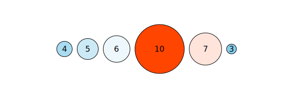

# D3js Part1 - Understanding Concept


## お約束

まずは基本形を見せます。index.htmlを作成し、以下のように書いてください。

```html
<!DOCTYPE html>
<html lang="ja">
  <head>
    <meta charset="utf-8">
    <link rel="stylesheet" href="style.css">
  </head>
  <body>
    <!-- ここに色々書いていきます -->
    <script src="https://d3js.org/d3.v5.min.js"></script>
    <script src="script.js"></script>
  </body>
</html>
```

ありふれたhtmlファイルなので詳細については省略しますが、以下の文

```html
<script src="https://d3js.org/d3.v5.min.js"></script>
```

については補足しておきます。この文によって、インターネットからd3.jsのファイルを読み込んでいます。


## Case 01: タグ用意

index.htmlに以下のsvgタグとcircleタグを追加しておきます。

```html
...
<body>
    <svg>
      <circle></circle>
      <circle></circle>
      <circle></circle>
    </svg>
    <script src="https://d3js.org/d3.v5.min.js"></script>
    <script src="script.js"></script>
</body>
...
```

まずは簡単に、以下のケースを考えてみましょう。
- データ[4, 2, 10]とcircleを結びつけたい
- circleの半径をデータの値にしたい
- circleを横並びにしたい

実現は簡単です。script.jsを作成し、以下のように書きましょう。

```js
const [svgWidth, svgHeight] = [600, 800];
const svg = d3.select('svg')
  .attr('width', svgWidth)
  .attr('height', svgHeight);
const data = [4, 2, 10];

svg.selectAll('circle')
  .data(data) 
  .attr('cx', (d, i, node) => 30*i + 40)
  .attr('cy', 10)
  .attr('r', (d, i, node) => d);
```

index.htmlを開くと、次のように表示されます。


### 説明

一つづつ見ていきましょう。

```js
const [svgWidth, svgHeight] = [600, 800];
```

は、後で利用するためのsvgWidth、svgHeightを設定しています。
JavaScriptの機能である「分割代入」を利用しています。

```js
const svg = d3.select('svg')
  .attr('width', svgWidth)
  .attr('height', svgHeight);
```

HTMLタグ(厳密にはその**DOM**)を選択するにはselectメソッドを使います。さらに返ってきた値に対してattrメソッドを利用することで、htmlタグの属性を変更することができます。
ここでは、svgタグを選択してそのwidthをsvgWidthに、heightをsvgHeightを設定しています。

```js
const data = [4, 2, 10];
```

これは[4,2,10]という配列を用意しているだけですね。

```js
svg.selectAll('circle')
```

によって、circleタグ全てを選択することを意味します。選択したcircleに対して、

```js
svg.selectAll('circle')
  .data(data) 
```

とします。dataメソッドによって、用意された配列dataとcircleタグを結びつけます。data配列とは

```js
const data = [4, 2, 10];
```

であったわけですから、一つのcircleタグには4、一つのcircleタグには2、一つのciecleタグには10という値が結びつけられます。
この結びつける操作のことを「data bind」や「data join」と呼びます。

さて、dataメソッドによってciecleタグとデータが結びつきました。結びついたデータを用いて半径や位置を変更してみましょう。

```js
svg.selectAll('circle')
  .data(data) 
  .attr('cx', (d, i, node) => 30*i + 40)
  .attr('cy', 10)
  .attr('r', (d, i, node) => d);
```

attrメソッドには定数を指定することも可能です。しかし結びついたデータを用いて属性をいじるためには関数を指定してあげます。
例えば次の行

```js
  .attr('cx', (d, i, node) => 30*i + 40)
```

では、cx属性を変更しています。第二引数では無名関数を指定していますが、この引数は以下のようになっています。

```txt
(結びついたデータ, 何番目のDOMか, DOMの配列) => { 関数の内容 }
```

今回の文については、

- 1つ目のcircleのx座標は40
- 2つ目のcircleのx座標は70
- 3つ目のcircleのx座標は100

と配置されます。

```js
  .attr('r', (d, i, node) => d);
```

については、

- 1つ目のcircleの半径は4
- 2つ目のcircleの半径は2
- 3つ目のcircleの半径は10

となります。

ちなみに、いらない引数は次のように省略できます。ただし「1番目の引数はデータ、2番目の引数はDOMの番号、3番目の引数はDOMの配列」であるという順番は守る必要があります。

```js
svg.selectAll('circle')
  .data(data) 
  .attr('cx', (d, i) => 30*i + 40)
  .attr('cy', 10)
  .attr('r', d => d);
```


### 気持ち

表示してみてわかると思いますが、円は非常に小さいです。しかも位置は左上なので、真ん中に寄せたいです。


### Modify

circleタグをgタグで括ります。これは、後で中央寄せするための準備です。

```html
...
<body>
  <svg>
    <g>
      <circle></circle>
      <circle></circle>
      <circle></circle>
    </g>
  </svg>
  <script src="https://d3js.org/d3.v5.min.js"></script>
  <script src="script.js"></script>
</body>
...
```

script.jsを次のようにします。

```js
const [svgWidth, svgHeight] = [600, 800];
const svg = d3.select('svg')
  .attr('width', svgWidth)
  .attr('height', svgHeight);
const data = [4, 2, 10];

svg.select('g')
  .attr('transform', `translate(${svgWidth/2}, ${svgHeight/2})`);
svg.selectAll('circle')
  .data(data) 
  .attr('cx', (d, i) => 30*i + 40)
  .attr('cy', 0)
  .attr('r', d => 3*d);
```

追加箇所は次の文です。

```js
svg.select('g')
  .attr('transform', `translate(${svgWidth/2}, ${svgHeight/2})`);
```

gタグにtransform属性を付けています。これはgタグそのものの移動や回転、拡大縮小を行うための属性です。translate(x, y)と書くことによって、gタグの位置を座標(x,y)にずらしています。こうすることで、円の集まりそのものを画像中心に移動させています。

また、円の半径が小さいので、とりあえず次のように「元データの3倍を半径」としてみます。

```js
  .attr('r', d => 3*d);
```

円の半径は確かに中央寄せなのですが、円同士が重なってしまうようです。何故でしょう &#x1f914;


理由は非常に単純です。円の位置を指定するための属性cx, cyはあくまで「円の中心位置の指定」です。現状、位置は単にデータの番号について等間隔に配置しているため、円の半径までは考慮していません。

ということで、円の半径を考慮して位置を計算したくなります。ここでは、「**配列のデータを入力すると、画面出力のための位置、半径などのデータを返す**」関数を作ってみましょう。そんな関数formatDataは、次のように使います。このような関数を定義することによるメリットについては、後ほど説明します。

```js
const data = [4, 2, 10];
const formatData = (data, space, mag) => {
  // ここを埋めてね
};

svg.select('g')
  .attr('transform', `translate(${svgWidth/2}, ${svgHeight/2})`);
svg.selectAll('circle')
  .data(formatData(data, 10, 5)) 
  .attr('cx', d => d.x)
  .attr('cy', d => d.y)
  .attr('r', d => d.r);
```

こんな感じの図にしましょう。


## Example

 ```js
 formatData([4, 2, 10], 10, 5);
 /*
 [
   {val: 4, r: 20, x: 0, y: 0},
   {val: 2, r: 10, x: 40, y: 0},
   {val: 10, r: 50, x: 110, y: 0}
 ]
 */
 ```

## Solution

```js
const formatData = (data, space, mag) => {
  let now = 0;
  const ret = [];
  for (let i = 0; i < data.length; i++) {
    ret.push({ val: data[i], r: data[i] * mag, x: now, y: 0 });
    if (i < data.length - 1) {
      now += data[i]*mag + space + data[i + 1]*mag;
    }
  }
  return ret;
};
```


## Extended Solution

完全に中央寄せになる

```js
const formatData = (data, space, mag) => {
  let now = 0;
  const ret = data.map((d, i) => {
    const t = { val: d, r: d * mag, x: now, y: 0 };
    if (i < data.length - 1) {
      now += data[i]*mag + space + data[i + 1]*mag;
    }
    return t;
  });
  ret.forEach(d => { d.x -= now/2; });
  return ret;
};
```

さて、なぜこんな関数formatDataを作ったのでしょうか。単に位置を記録するだけなら、配列を別途用意して次のようにも書けそうです。

```js
const data = [4, 2, 10];

const mag = 3;
const x = [];
let now = 0;
for (let i = 0; i < data.length - 1; i++) {
  x.push(now);
  now += data[i]*mag + space + data[i + 1]*mag;
}

svg.select('g')
  .attr('transform', `translate(${svgWidth/2}, ${svgHeight/2})`);
svg.selectAll('circle')
  .data(data) 
  .attr('cx', (d, i) => x[i])
  .attr('cy', 0)
  .attr('r', mag * d)
```

しかしこのように書くと、magやxを他のデータに対して使いたい場合に、再利用が面倒です。
formatDataという関数でひとくくりにしてまとめることによって、
「データを出力用データに変換する」という処理を他のデータに再利用できます。位置や半径に少し変更をしたいという場合に、「formatDataという関数を編集すれば良いんだ」ということが分かりやすいと思います。

また、元データを{x座標, y座標, 半径}に変換してあげて、元データではなく変換後のデータを直接DOMと結びつけています。
こうすると、結ばれたデータ自身が位置情報、半径を持っているため、
```js
svg.selectAll('circle')
  .data(formatData(data, 10, 5)) 
  .attr('cx', d => d.x)
  .attr('cy', d => d.y)
  .attr('r', d => d.r);
```
のように、データのプロパティにアクセスすることで円の半径や位置を変更できます。

このように、「元データを都合の良いデータに変換する」というような**データの前処理**は、
今後どんどん使っていきますので心に留めておきましょう。

さて、めでたく位置は中央寄せになりましたし、円同士の重なりは無くなりました。


**しかし、これで本当にめでたいですか?**

今回の場合、**たまたま**circleタグがちょうど3つ用意されていました。
しかし以下のケースを想定しましょう。

- データ数が多い時にcircleタグをいちいち追加しますか?
- データ数が少ない時は?


## Case 02: タグ少ない

htmlファイルについては何も変更はありません。

```html
...
<svg>
  <g>
    <circle></circle>
    <circle></circle>
    <circle></circle>
  <g>
</svg>
...
```

しかし用意されているデータが次のように多かった場合を考えましょう。

```js
const data = [4, 1, 2, 8, 5, 6, 7, 10, 2];
```

すでにあるcircleタグはそのまま使って、足りないcircleは追加してあげる必要があります。データ目線からだと次のように処理をする必要があります。

- 結ばれたデータたち: さっきと同じように
- 結ばれなかったデータたち: **新たに作ってあげる**

実際のコードは以下のようになります。

```js
const data = [4, 1, 2, 8, 5, 6, 7, 10, 2];
const g = svg.select('g')
  .attr('transform', `translate(${svgWidth/2}, ${svgHeight/2})`);
const circle = g.selectAll('circle')
  .data(formatData(data, 10, 5));

// formatDataは省略

circle.attr('cx', d => d.x)
  .attr('cy', d => d.y)
  .attr('r', d => d.r);

const circleEnter = circle.enter()
  .append('circle');
circleEnter.attr('cx', d => d.x)
  .attr('cy', d => d.y)
  .attr('r', d => d.r);
```

何やらcircleEnterというものが追加されました。これが「結ばれなかったデータたち」です。
```js
circle.enter()
```
というもので、「結ばれなかったデータたち」にアクセスしています。
さらに、
```js
const circleEnter = circle.enter()
  .append('circle');
```
によって、結ばれなかったデータに対して結び手circleを新たに追加してやります。これでめでたくデータに対応したcircleタグができたわけです。その後の処理は普通に座標、半径を設定しているだけです。

ところで、次の2つの文が似ていることに気づくと思います。
```js
circle.attr('cx', d => d.x)
  .attr('cy', d => d.y)
  .attr('r', d => d.r);
```
```js
circleEnter.attr('cx', d => d.x)
  .attr('cy', d => d.y)
  .attr('r', d => d.r);
```
これを実はこれを一括で書く方法があります。mergeメソッドを用いて、普通のデータとenterのデータを併合することができます。
これにより、重複部分を省くことができます。

```js
...

const circle = g.selectAll('circle')
  .data(formatData(data, 10, 5));

const circleEnter = circle.enter()
  .append('circle');
circleEnter.merge(circle)
  .attr('cx', d => d.x)
  .attr('cy', d => d.y)
  .attr('r', d => d.r);
```


いい感じですね。


## Case 03: データ少ない

相変わらずのhtmlファイルです。

```html
...
<svg>
  <g>
    <circle></circle>
    <circle></circle>
    <circle></circle>
  </g>
</svg>
...
```

しかしデータは2つしかありません。1つcircleタグが余計です。

```js
const data = [4, 2];
```

データと結びついたタグはそのまま使って、余ったcircleは削除してあげる必要があります。つまり、

- 結ばれたDOMたち: さっきと同じように
- 結ばれなかったDOMたち: **消し去る**

ということを書いたコードが以下のようになります。

```js
const data = [4, 2];
const g = svg.select('g')
  .attr('transform', `translate(${svgWidth/2}, ${svgHeight/2})`);
const circle = g.selectAll('circle')
  .data(formatData(data, 10, 5));

circle.attr('cx', d => d.x)
  .attr('cy', d => d.y)
  .attr('r', d => d.r);

circle.exit().remove();
```

データに結ばれなかったDOMは
```js
circle.exit()
```
で得られます。removeメソッドを使うとこれを削除することができます。


## 込み入った話

今までの話で、

- circle.enter()ではDOMに結びつかなかったデータ得られる
- circle.exit()ではデータに結びつかなかったDOMが得られる

と表現してきました。
厳密には、この表現は間違いです。**circle.enter()やcircle.exit()の返り値は、DOMでもデータでもありません。**

## *selection(s)* オブジェクト

例えば、
```js
const svg = d3.select('svg')
```
が返す値は、*selection*と呼ばれるオブジェクトです。この*selection*を介して、私たちはDOMの属性を操作したり、
DOMに子要素を追加/削除したり、データとDOMを結びつけたりしています。

また、
```js
svg.selectAll('circle')
```
が返す値は*selections*オブジェクトで、これは*selection*の配列みたいなものです。

### *selection(s)*.dataの行く末

こんな感じで分類されます。

- データとDOMが結ばれた: *update selections*
  - *selections* でアクセス
- DOM足りないんだけど?: *enter selections*
  - *selections.enter()* でアクセス
- データ足りないんだけど?: *exit selections*
  - *selections.exit()* でアクセス

これを今まで見せてきた例に照らし合わせると、
```js
const circle = d3.selectAll('circle')
  .data(data)
```
において、circleが*update selections*を表しており、
```js
const circleEnter = circle.enter()
```
において、circle.enter()が*enter selections*を表しており、
```js
circle.exit().remove()
```
において、circle.exit()が*exit selections*を表しています。

### データはどこ?

- DOMの中の__data__というプロパティに入っている
  - selectionに入っているわけではない!

- ブラウザのDevelopper Toolで
```js
d3.selectAll('circle')
```
を実行して__data__を探そう


### Inherit

- DOMにデータが結ばれた
  &rArr; その子孫DOMにも引き継がれる
  タイミング: select(All)，appendなどの呼び出し時

これが後々良い性質だと分かる

## Case 04: 関数化

```html
<svg>
</svg>
```

- update([4, 2, 3,...])と呼び出すと描画されるようにしたい
- 何度も呼び出しできるようにしたい
  &rArr; update/enter/exit全てを考慮


```js
const g = svg.append('g')
  .attr('transform', `translate(${svgWidth/2}, ${svgHeight/2})`);

const update = (data) => {
  const circle = g.selectAll('circle')
    .data(formatData(data, 10, 5));

  const circleEnter = circle.enter()
    .append('circle');
  circleEnter.merge(circle)
    .attr('cx', d => d.x)
    .attr('cy', d => d.y)
    .attr('r', d => d.r);

  circle.exit().remove();
};
```


### Good


## Case 05: テキストを入れる

- 円の中心に数字を描きたい


- gタグで括るとtext，circleいっぺんに扱えて嬉しい


```js
const update = (data) => {
  const circleGroup = g.selectAll('g')
    .data(formatData(data, 10, 5));

  const circleGroupEnter = circleGroup.enter()
    .append('g');
  circleGroupEnter.append('circle');
  circleGroupEnter.append('text');
  const circleGroupMerge = circleGroupEnter
    .merge(circleGroup);
  circleGroupMerge
    .attr('transform', d => `translate(${d.x}, ${d.y})`);
  circleGroupMerge.select('circle')
    .attr('fill', '#fff')
    .attr('stroke', '#000')
    .attr('r', d => d.r);
  circleGroupMerge.select('text')
    .attr('text-anchor', 'middle')
    .attr('dominant-baseline', 'central')
    .text(d => d.val);

  circleGroup.exit().remove();
};
```


## Case 06: Animation

出現や消滅をカッコよく動かしたい


### d3.transition()

- DOMの属性/スタイル変更が滑らかに行われる

#### 1/3

```js
// 呼び出し500ms後，1000msかけて遷移
const t = d3.transition()
  .delay(500)
  .duration(1000);

const circleGroupMerge = circleGroupEnter
  .merge(circleGroup) 
  .transition(t);
circleGroupMerge
  .attr('transform', d => `translate(${d.x}, ${d.y})`);
circleGroupMerge.select('circle')
  .attr('fill', '#fff')
  .attr('stroke', '#000')
  .attr('r', d => d.r);
circleGroupMerge.select('text')
  .attr('text-anchor', 'middle')
  .attr('dominant-baseline', 'central')
  .text(d => d.val);
const circleGroupExit = circleGroup.exit()
  .transition(t);
circleGroupExit.select('circle')
  .attr('r', 0);
circleGroupExit.remove();
```


## Case 07: Relative Radius


- 小さくなりすぎ/大きくなりすぎ
 &rArr; 半径の上限/下限を設定したい


### どんな関数?


#### 高校数学

$$
y = \frac{y_M - y_m}{x_M - x_m}(x - x_m) + y_m
$$


#### 関数を返す関数

domainとrangeを設定すると
いい感じの一次関数を返してくれる関数

```js
const scaleGenerator = (dom, ran) => {
  return x => (ran[1]-ran[0])/(dom[1]-dom[0])*(x-dom[0])+ran[0];
};
```


#### 動き


#### Modified formatData

```js
const formatData = (data, space, rScale) => {
  let now = 0;
  const ret = data.map((d, i) => {
    const t = { val: data[i], r: rScale(data[i]), x: now, y: 0 };
    if (i < data.length - 1) {
      now += rScale(data[i]) + space + rScale(data[i + 1]); 
    }
  }
  ret.forEach(d => { d.x -= now/2; });
  return ret;
};
```


#### Modified update

```js
const scaleGenerator = (dom, ran) => {
  return x => (ran[1]-ran[0])/(dom[1]-dom[0])*(x-dom[0])+ran[0];
};
const update = (data) => {
  const rScale = scaleGenerator(d3.extent(data), [10, 50]);
  const circleGroup = g.selectAll('g')
    .data(formatData(data, 10, rScale));
  ...
}
```


### 成功


### 実は車輪の再発明

```js
// Before
const scaleGenerator = (dom, ran) => {
  return x => (ran[1]-ran[0])/(dom[1]-dom[0])*(x-dom[0])+ran[0];
};
const rScale = scaleGenerator(d3.extent(data), [10, 50]);
```


### d3.scaleLinear

次からはこれを使いましょう

```js
// After
const rScale = d3.scaleLinear()
  .domain(d3.extent(data))
  .range([10, 50]);
```

- scaleLinearは線形変換
- scalePow/scaleLog/scaleSqrtなどもあります


#### 補足: max/min/extent

- d3.extent: データの範囲


- 要素がObject/Array
  &rArr; アロー関数付ける


## Case 08-1: Random Color

- 色を完全ランダムにしたい


### d3.randomUniform

一様分布を生成する関数を作成する関数
範囲は右半開区間

```js
// [0, 256)の範囲の一様分布乱数を生成
const rand = d3.randomUniform(0, 256);
circleGroupMerge.select('circle')
  .attr('fill', () => `rgb(${rand()}, ${rand()}, ${rand()})`)
  .attr('stroke', '#000')
  .attr('r', d => d.r);
```


### 若干汚い(ことがある)


- rgbランダムだと仕方ない
  &rArr; hsvで考えるといいかも


## Case 08-2: Built-in Color

- 用意された色を使う

https://github.com/d3/d3-scale-chromatic


### Modified update

```js
// [0, d3.schemeSet1.length)の範囲の一様分布乱数を生成
const rand = d3.randomUniform(0, d3.schemeSet1.length);
circleGroupMerge.select('circle')
  .attr('fill', () => d3.schemeSet1[Math.floor(rand())])
  .attr('stroke', '#000')
  .attr('r', d => d.r);
```

Math.floorしないと小数が出てしまうので注意


それなりに良い
色数が少ないので被る


## Case 08-3: Linear Color Scale

値: 小 &hArr; 中 &hArr; 大
色: 水 &hArr; 白 &hArr; 橙
に対応させよう


### d3.scaleLinear再び

domain，rangeに中間の値を設定できる

```js
const colorScale = d3.scaleLinear()
  .domain([0, 10, 20])
  .range(['orangered', 'white', 'skyblue']);
```


### Modified update

```js
const [rmin, rmax] = d3.extent(data);
const colorScale = d3.scaleLinear()
  .domain([rmin, (rmin + rmax)/2, rmax])
  .range(['orangered', 'white', 'skyblue']);
circleGroupMerge.select('circle')
  .attr('fill', d => colorScale(d.val))
  .attr('stroke', '#000')
  .attr('r', d => d.r);
```





## Case 09: Click

- クリックされたボールは1増加させたい


### Two Kinds of Method

1. クリック
   &rArr; 該当データを探して1+して再bind
2. クリック
   &rArr; DOMに結ばれたデータの値を直接1+してattr再設定

何れにしても実装は少しめんどい


### Common Comcept: *selection*.on

```js
circleGroupMerge.on('click', (d, i) => {
  /* d: クリックされた要素のデータ */
})
```


#### 1st Method

```js
circleGroupMerge.on('click', (d, i) => {
  data[idx]++ // idx: dがdata配列で何番目か
  /* 更新処理 */
})
```

#### 2st Method

```js
circleGroupMerge.on('click', (d, i) => {
  d++; // dを直接書き換える
  /* 更新処理 */
})
```


### 1st Method

- bindされたデータが元のデータ配列の
  何番目なのかを知りたい
  &rArr; indexを持たせる


#### Modified formatData

idx追加

```js
const formatData = (data, space, rScale) => {
  let now = 0;
  const ret = data.map((d, i) => {
    const t = { 
      idx: i, val: data[i], r: rScale(data[i]),
      x: now, y: 0
    };
    if (i < data.length - 1) {
      now += rScale(data[i]) + space + rScale(data[i + 1]); 
    }
  }
  ret.forEach(d => { d.x -= now/2; });
  return ret;
};
```


#### Modified update()

transition付きにはonclickが設定できないので
circleGroupMergeとtransitionを分離する
それに伴う変更もする

```js
const circleGroupMerge = circleGroupEnter
  .merge(circleGroup);
const circleGroupTrans = circleGroupMerge.transition(t);
circleGroupTrans
  .attr('transform', d => `translate(${d.x}, ${d.y})`);

const [rmin, rmax] = d3.extent(data, d => d.val);
const colorScale = d3.scaleLinear()
  .domain([rmin, (rmin + rmax)/2, rmax])
  .range(['orangered', 'white', 'skyblue']);
circleGroupTrans.select('circle')
  .attr('fill', d => colorScale(d.val))
  .attr('stroke', '#000')
  .attr('r', d => rScale(d.val));
circleGroupTrans.select('text')
  .attr('text-anchor', 'middle')
  .attr('dominant-baseline', 'central')
  .text(d => d.val);
```


#### Added *selection*.on in update()

```js
circleGroupMerge.on('click', d => {
  data[d.idx]++;
  update(data);
});
```


### 2nd Method

- forceSimulationは内部的にこれをやってる(と思う)


これだとうまくいかない

```js
circleGroupMerge.on('click', d => {
  d.val++;
  update(data);
});
```

- DOMのデータは1+
- dataは無変更

&rArr; update(data)で変更が無かったことに


- **データを追加/削除する処理**
- **circleの状態を変更する処理**

を分けたくなってくる


### あまり良くない解決策(&#8757;冗長)

```js
circleGroupMerge.on('click', d => {
  d++;
  circleGroupMerge
    .attr('transform', d => `translate(${d.x}, ${d.y})`);
  circleGroupMerge.select('circle')
    .attr('fill', d => colorScale(d.val))
    .attr('stroke', '#000')
    .attr('r', d => rScale(d.val));
  circleGroupMerge.select('text')
    .attr('text-anchor', 'middle')
    .attr('dominant-baseline', 'central')
    .text(d => d.val);
  circleGroupMerge.select('text')
    .attr('text-anchor', 'middle')
    .attr('dominant-baseline', 'central')
    .text(d => d.val);
});
```


#### これは設計を見直さなければならない予感...


#### 機能分離

- formatData: データを有らまほしき形に変換する
- calcPosition: 円の中心位置を決定する
- adjustCirclesByData: データの追加/削除を担う
- decorateCircles: データのattr/style変更を担う
- update: primitiveデータ用のインターフェース

今までのコードを大幅に変更します


#### formatData

```js
const formatData = (data) => {
  const ret = [];
  for (let i = 0; i < data.length; i++) {
    ret.push({
      val: data[i],
      x: 0,
      y: 0
    });
  }
  return ret;
};
```


#### calcPosition

```js
const calcPosition = (data, space, rScale) => {
  let now = 0;
  data.forEach((d, i) => {
    d.x = now;
    if (i < data.length - 1) {
      now += rScale(data[i].val) + space + rScale(data[i+1].val);
    }
  });
  data = data.forEach(d => { d.x -= now/2; });
  return data;
};
```


#### adjustCirclesByData

クリックした時，該当データを直接書き換え
```js
const adjustCirclesByData = (data) => {
  const circleGroup = g.selectAll('g.circle')
    .data(data);
  const circleGroupEnter = circleGroup.enter()
    .append('g')
    .classed('circle', true);
  circleGroupEnter.append('circle');
  circleGroupEnter.append('text');

  const circleGroupMerge = circleGroupEnter
    .merge(circleGroup);
  decorateCircles(circleGroupMerge);

  const circleGroupExit = circleGroup.exit()
    .transition()
    .delay(500)
    .duration(1000);
  circleGroupExit.select('circle')
    .attr('r', 0);
  circleGroupExit.remove();

  circleGroupMerge.on('click', d => {
      d.val++;
      decorateCircles(circleGroupMerge);
    });
};
```


#### decorateCircles 1/2

*selection* を引数にとるちょっと奇妙な関数

```js
const decorateCircles = (circleGroup) => {
  const data = circleGroup.data();
  const rScale = d3.scaleLinear()
    .domain(d3.extent(data, d => d.val))
    .range([10, 50]);
  calcPosition(data, 10, rScale);
  const [rmin, rmax] = d3.extent(data, d => d.val);
  const colorScale = d3.scaleLinear()
    .domain([rmin, (rmin + rmax)/2, rmax])
    .range(['skyblue', 'white', 'orangered']);
  const circleGroupTrans = circleGroup
    .transition()
    .delay(500)
    .duration(1000);

  circleGroupTrans
    .attr('transform', d => `translate(${d.x}, ${d.y})`);
  circleGroupTrans.select('circle')
    .attr('fill', d => colorScale(d.val))
    .attr('stroke', '#000')
    .attr('r', d => rScale(d.val));
  circleGroupTrans.select('text')
    .attr('text-anchor', 'middle')
    .attr('dominant-baseline', 'central')
    .text(d => d.val);
  circleGroupTrans.select('text')
    .attr('text-anchor', 'middle')
    .attr('dominant-baseline', 'central')
    .text(d => d.val);
};
```


#### update

formatDataでデータを適当な形に変換したものに対して
adjustCirclesByDataを適用する

```js
const update = (data) => {
  adjustCirclesByData(formatData(data));
};
```


### Caution

- D3.jsはデータ可視化のためのライブラリ
- 今回の例みたいに
  「インタラクティブにデータを書き換える」
  ことは本来の使い方ではないことを心に留める


### Other Applications

1. データ書き換え以外のインタラクティブ要素
   ex) マウスを乗せると座標が表示される
2. **データの動きを見たい**


#### 1st Method

- 実装楽
- 用意すべきデータが2stに比べ多い


#### 2nd Method

- 差分だけ更新
  &rArr; 用意すべきデータが1stに比べ少ない
- データの持たせ方が難しい時がある


## Case 10: Input Area


- 入力エリアをちゃんと作ろう
- 練習として複数行入力に対応できるようにする


### index.html

```html
<div class="main-container">
  <div class="menu">
  </div>
  <div class="main">
    <svg>
    </svg>
  </div>
</div>
```


### style.css

```css
.main-container {
  display: flex;
  flex-direction: row;
}
.menu {
  display: flex;
  flex-direction: column;
}
svg {
  border: 1px solid #000;
}
```


### Added script.js

- textarea.property('value')でテキストエリアの内容を取得
- d3.merge([1], [2, 3], [4, 5]) &rarr; [1, 2, 3, 4, 5]
- Nubmer(d)でdを数値に変換

```js
const menu = d3.select('.menu');
const textarea = menu.append('textarea')
  .style('height', `${svgHeight - 30}px`);
const genButton = menu.append('input')
  .attr('height', '30px')
  .attr('type', 'button')
  .attr('value', 'generate');

genButton.on('click', () => {
  const input = textarea.property('value')
    .split('\n')
    .map(d => d.split(' '));
  const data = d3.merge(input)
    .map(d => Number(d));
  update(data);
});
```


## まとめ


### Case 1&#126;3: *selection*の基本概念を理解

- update/enter/exitを感じよ
- *selection*，DOM，データの絆を感じよ


### Case 4: 関数化
### Case 5&#126;8: 装飾
5. テキスト入れる
6. アニメーション
7. 半径のスケール調整
8. 色


### Case 9: インタラクティブ
### Case 10: 入力エリア作り

