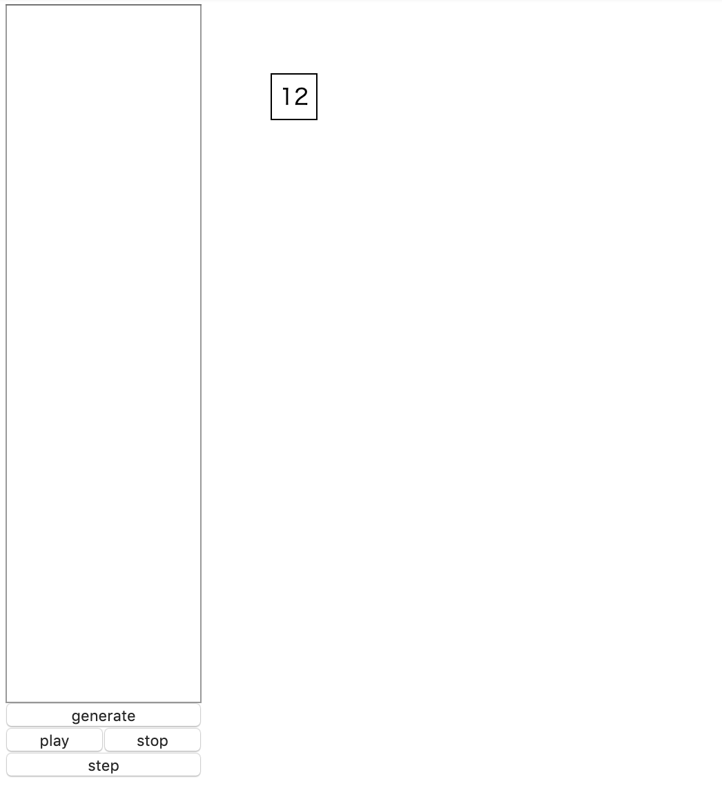
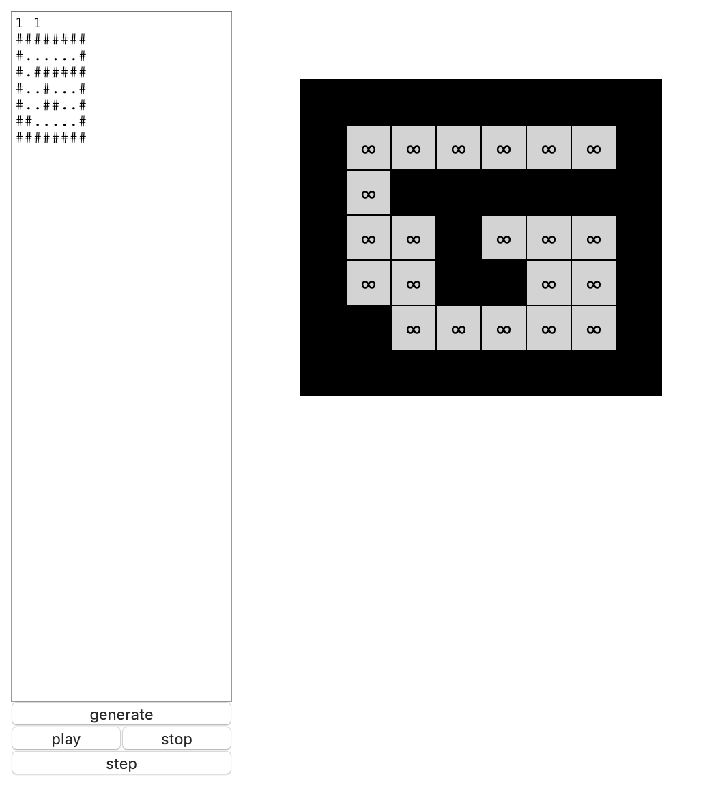
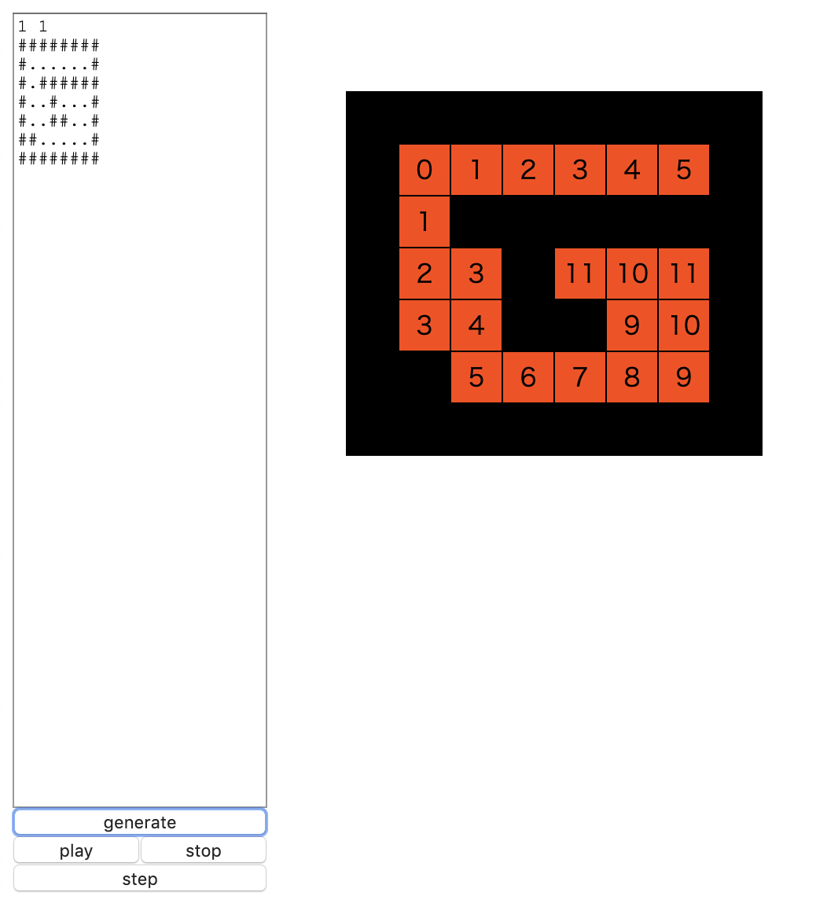
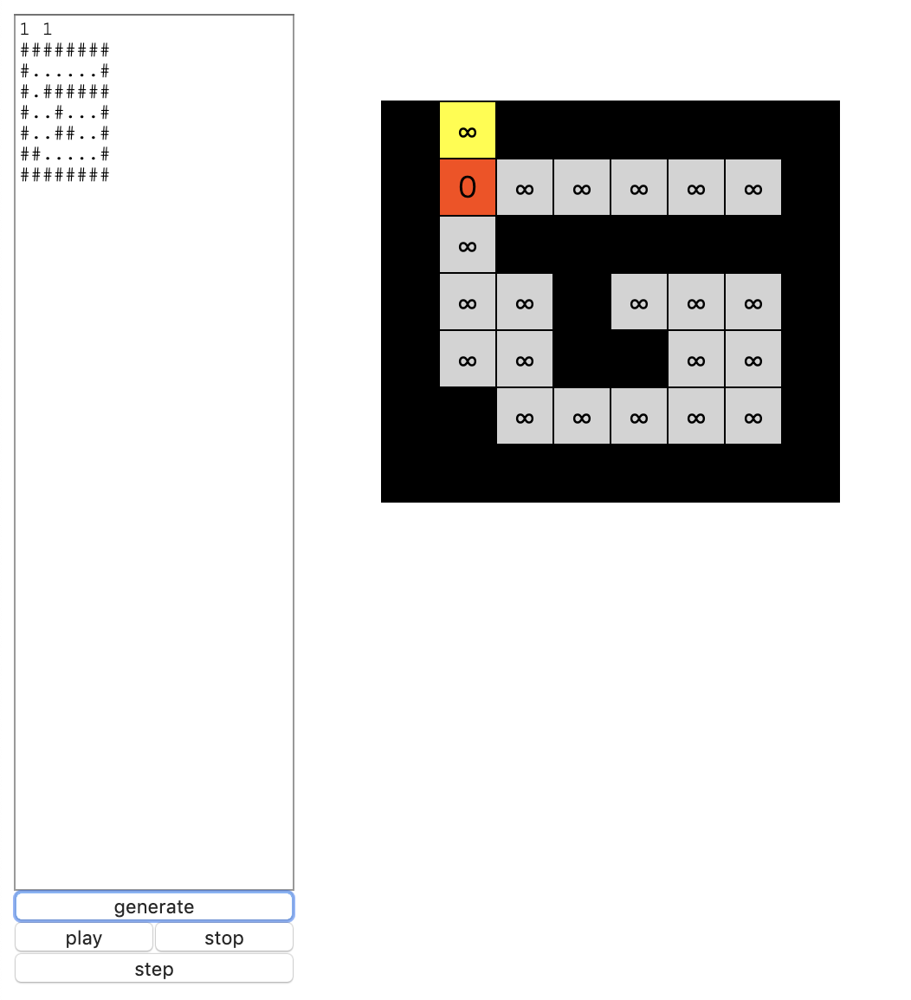
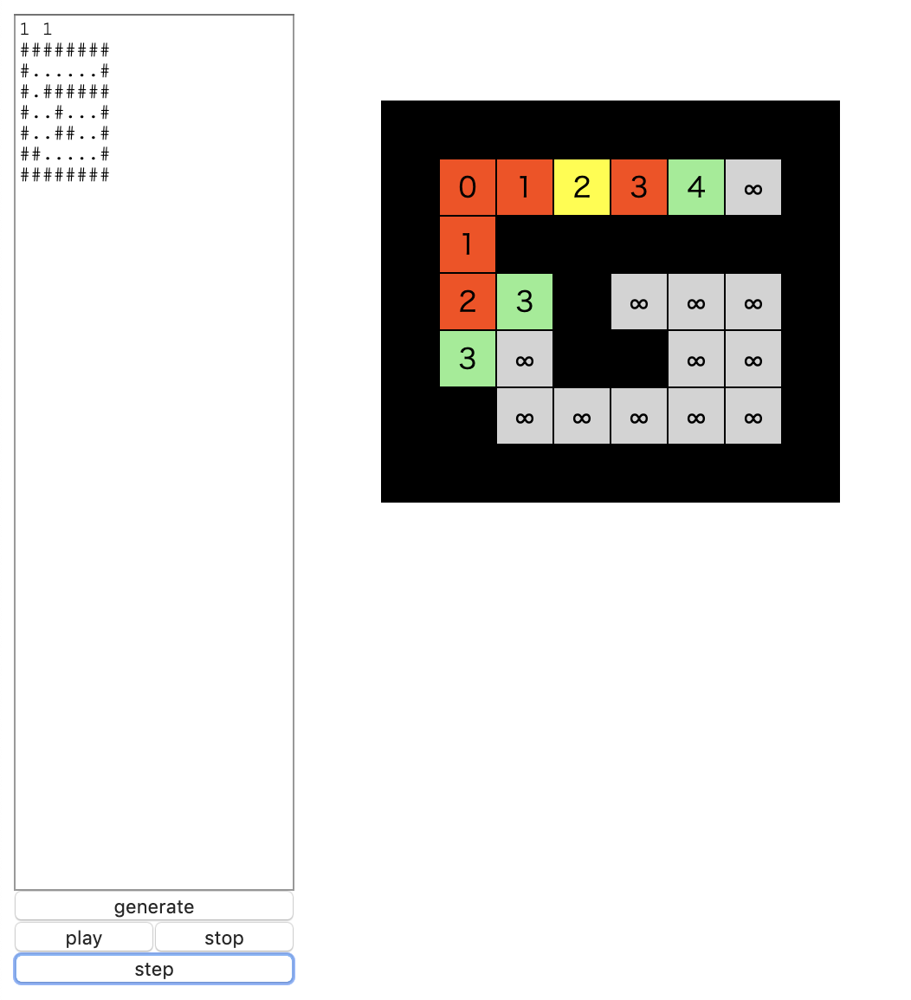
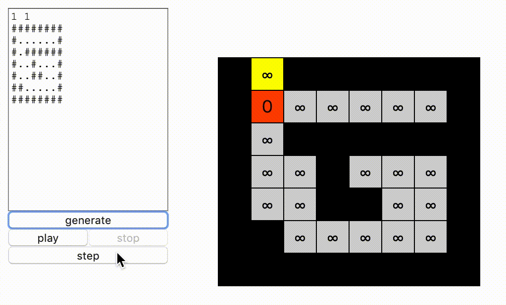

# D3.js Part2 - A Little Complex Example

このチュートリアルをやることで、**大切なのはD3.jsの描画ではなく、その前段階のデータの表現方法なんだ**ということが分かる&hellip;はずです。
実際、この文章の大半はD3.js以外の項目で構成されています。

## どんなものを作る?

**迷路を幅優先探索し、スタートから各地点の最短経路を表示するプログラムを作成します。**
その際に、以下のことが行えるようにします。

- 迷路のマップデータを視覚化する
- テキストエリアから迷路のマップデータを読み込めるようにする
- 迷路を探索する動きが目に見えるようにする

## テンプレ作成

入力部分と出力部分を作ります。次の機能を用意しましょう。

- 操作メニューと出力部分に分かれている
- 操作メニューには以下のものを用意する
  - 入力用のtextarea
  - 迷路探索を開始するボタン
  - アニメーション再生/停止ボタン
  - 1ステップずつアニメーションを進めるためのボタン
- 出力部分には迷路の様子を表示し、迷路の1マスはテーブルセルで表現する

index.htmlを作成し、内容は以下のようにします。
実際にテーブルセルがどんな風に表示されるのかを確かめるために、サンプルとして1マスのテーブルセルを定義しています。
このセルはD3.jsでDOMを操作する際に上書きされるので、あっても問題ありません。

```html
<!DOCTYPE html>
<html lang="ja">
  <head>
    <meta charset="utf-8">
    <link rel="stylesheet" href="style.css">
    <title>Maze Solver</title>
  </head>
  <body>
    <div class="main-container">
      <div class="menu">
        <textarea></textarea>
        <input id="gen_btn" type="button" value="generate">
        <div class="player">
          <input id="play_btn" type="button" value="play">
          <input id="stop_btn" type="button" value="stop">
        </div>
        <input id="step_btn" type="button" value="step">
      </div>
      <div class="main">
        <table>
          <tr><td>12</td></tr>
        </table>
      </div>
    </div>
    <script src="https://d3js.org/d3.v5.min.js"></script>
    <script src="script.js"></script>
  </body>
</html>
```

style.cssを作成し、内容な以下のようにします。
メニューを左に配置し、出力部分を右に配置するようにします。
またtableの幅を正方形に固定します。

```css
@charset "utf-8";

.main-container {
  display: flex;
  flex-direction: row;
}

.menu {
  display: flex;
  flex-direction: column;
}

.main {
  margin: 50px 0 0 50px;
}

table {
  table-layout: fixed;
  border-collapse: collapse;
}
td {
  width: 30px;
  height: 30px;
  border: 1px solid #000;
  text-align: center;
}

.player {
  display: flex;
  flex-direction: row;
}

#play_btn {
  width: 50%;
}
#stop_btn {
  width: 50%;
}

textarea {
  resize: none;
  height: 500px;
  font-family: "Courier New", Consolas, monospace;
}
```

index.htmlを開くと、以下のように表示されます。




## 迷路のデータ表現

後で仕様変更が起こると色々面倒なので、ここで迷路をどんなデータで保存するかを考えておきます。


### アルゴリズムの視点から見た際のデータ構造

迷路の幅優先探索では以下の情報を保持します。

- マップデータ: 文字列の配列
- 訪問予定のマスを入れたQueue: Queue
- スタートからの暫定最短経路長: 数値の2次元配列、未訪問の場合は十分大きな値

### 出力視点から見た際のデータ構造

次のマスを視覚的に見えるようにしたいです。
これらの情報を色、数字で表現すると、視覚的にわかりやすそうです。

- 未発見のマス: 灰色
- 発見済みで未訪問のマス: 緑色
- 訪問済みのマス、さらにスタート地点からの最短経路長: 赤
- 今探索している地点: 黄色
- 壁: 黒


概念的には、各マスが次のようなObjectを持っているように設計します。
textプロパティには、未訪問の場合&#x221e;、それ以外は数字を設定します。

```js
{ text: 文字, color: 色 }
```

### データ変換器

アルゴリズムに適したデータから、出力系用のデータに変換する関数を作ります。
script.jsに以下の記述を追加します。

マップの壁は文字`#`とみなします。

```js
const formatData = (mp, queue, dist, pos) => {
  const [H, W] = [mp.length, mp[0].length];
  const ret = [];
  for (let i = 0; i < H; i++) {
    ret.push([]);
    for (let j = 0; j < W; j++) {
      const obj = { };
      if (dist[i][j] === Infinity) {
        obj.text = '∞';
      } else {
        obj.text = String(dist[i][j]);
      }

      if (i == pos[0] && j == pos[1]) {
        obj.color = 'yellow';
      } else if (mp[i][j] === '#') {
        obj.color = 'black';
      } else if (dist[i][j] === Infinity) {
        obj.color = 'lightgray';
      } else {
        obj.color = 'orangered';
      }
      ret[i].push(obj);
    }
  }
  /*for (const p of queue.toArray()) {
    const [i, j] = p;
    ret[i][j].color = 'lightgreen';
  }*/
  return ret;
}
```

**まだQueueを作っていないことに注意してください**。
JavaScriptにはQueueがライブラリとして存在しません。なのでこれは後で自作します。
ちなみにコード中に現れるqueue.toArrayは、Queueを配列に変換するメソッドという気持ちで書いてます。

ただし次の項のために動かせるようにしておきたいので、最後のQueueに関する部分だけコメントアウトしました。
最終的にはコメントアウトを外します。

## 出力系の作成

何はともあれ出力用データの形は決まっているので、とりあえず出力系だけ作っておきましょう。
script.jsに以下の記述を追加します。
迷路の出力用データを引数にとり、それを元にテーブルセルを用意して、background-colorプロパティで色を変えています。

```js
const update = (data) => {
  const table = d3.select('table');
  const tr = table.selectAll('tr')
    .data(data);
  tr.exit().remove();
  const td = tr.enter()
    .append('tr')
    .merge(tr)
    .selectAll('td')
    .data(d => d);
  td.exit().remove();
  td.enter()
    .append('td')
    .merge(td)
    .text(d => d.text)
    .style('background-color', d => d.color);
}
```

#### dataメソッドの補足

D3.jsの基本についてはPart01でやりました。唯一紹介していないのは次の文です。
dataメソッドにコールバック関数を指定しています。

```js
const tr = table.selectAll('tr')
  .data(data);
...
const td = tr.enter()
  ...
  .data(d => d);
```
`data`とは`[[...], [...], [...], ... ,[...]]`という二次元配列でした。
はじめの`data(data)`によって、それぞれのtr要素には一次元配列`[...]`が結びつけられます。
さらに次の`data(d => d)`によって、td要素には一次元配列の各要素が結びつけられます。

#### 入力部分作成

さて次はテストのために、入力部分を作りましょう。
入力形式は次のようにします。
- 1行目はスタート地点の座標を`y x`の順で指定する(ただしこれは0-indexedとする)
- 2行目以降は迷路の情報を入力する

script.jsに以下の記述を追加します。
textareaからマップデータを読み込んで、これをmpとします。
distについてはまだ未実装ですが、テストのためにとりあえず全てInfinityで初期化しておきます。

formatDataにdistとmpを投げると、出力用のデータが完成します。queueはまだ未実装なので、
undefinedを指定しておきます。探索地点も未実装なので、適当に`[-1, -1]`を指定します。

```js
d3.select('#gen_btn')
  .on('click', () => {
    const input = d3.select('textarea')
      .property('value')
      .split('\n');
    const start = input[0].split(' ')
      .map(d => Number(d));
    const mp = input.slice(1);

    const [H, W] = [mp.length, mp[0].length];
    const dist = Array.from(new Array(H), () => new Array(W).fill(Infinity));

    const data = formatData(mp, undefined, dist, [-1, -1]);
    update(data);
  });
```

<a href="https://atcoder.jp/contests/abc007/tasks/abc007_3" target="_blank">ABC007C - 幅優先探索</a>
に迷路のサンプルがあるので、これを利用して試しに出力してみます。
textareaに迷路データをコピペしてきて、1行目にスタート地点の座標(1,1)を入力して、
generateボタンを押すと迷路が描画されます。いい感じですね。



#### テストケース準備

いちいちABCのサイトからコピペしてくるのは面倒なので、最初からtextareaに入力されている状態にしましょう。
script.jsに以下の記述を追加します。

テンプレートリテラルを利用すると、複数行入力で`\n`を使う必要がありません。シングルクォートではなくバッククォート
であることに注意しましょう。

```js
const testcase = 
`1 1
########
#......#
#.######
#..#...#
#..##..#
##.....#
########`;
d3.select('textarea')
  .property('value', testcase);
```

index.htmlを開きなおすと、最初からtextareaに入力されています。


## 迷路のBFSの実装

マップとスタート地点を引数にとって迷路を解く関数です。
ひとまず何も考えず解きます。Queueのメソッド名は次のようにします。

- Queue.empty(): キューが空かどうかを判定する
- Queue.enqueue(): キューに値を入れる
- Queue.dequeue(): キューから値を取り出してその値を返す

script.jsに以下の記述を追加します。
返却値はdistですが、これは後で変更します。

```js
const solveMaze = (mp, sy, sx) => {
  const dy = [-1, 0, 1, 0];
  const dx = [0, 1, 0, -1];

  const [H, W] = [mp.length, mp[0].length];
  const dist = Array.from(new Array(H), () => new Array(W).fill(Infinity));
  const q = new Queue();
  dist[sy][sx] = 0;
  q.enqueue([sy, sx]);

  while (!q.empty()) {
    const [y, x] = q.dequeue();
    for (let i = 0; i < 4; i++) {
      const [ny, nx] = [y + dy[i], x + dx[i]];
      if (ny < 0 || ny >= H) continue;
      if (nx < 0 || nx >= W) continue;
      if (mp[ny][nx] === '#') continue;
      if (dist[ny][nx] > dist[y][x] + 1) {
        dist[ny][nx] = dist[y][x] + 1;
        q.enqueue([ny, nx]);
      }
    }
  }

  return dist;
}
```

### Queue実装

テストのためにQueueを作っておきます。**新たにQueue.jsを作成します**。
ここでは単にArrayをラッピングしてQueueっぽく使えるようにしたクラスとして定義します。
copyメソッドはqueue自身のコピーを返す関数です。

```js
class Queue {
  constructor() {
    this.buf = [];
  }
  enqueue(datum) {
    this.buf.push(datum);
  }
  dequeue() {
    return this.buf.shift(); 
  }
  empty() {
    return this.buf.length === 0;
  }
  toArray() {
    return this.buf;
  }
  copy() {
    const ret = new Queue();
    ret.buf = this.buf.slice();
    return ret;
  }
}
```

<div class="note">
  <h4>このQueueの計算量</h4>
  <p>enqueueは最悪時間計算量O(1)で行えますが、
  dequeueはO(n)です。ArrayのshiftメソッドがO(n)であることが原因です。</p>
  <p>計算量を改善したQueueの実装方法についてはこのチュートリアルの最後に説明します。</p>
</div>

index.htmlにscriptタグを追加します。srcにはQueue.jsを指定します。
```html
<!DOCTYPE html>
<html lang="ja">
  <head>
    ...
  </head>
  <body>
    ...
    <script src="https://d3js.org/d3.v5.min.js"></script>
    <script src="Queue.js"></script>
    <script src="script.js"></script>
  </body>
</html>
```

### 入力部分の修正

script.jsを修正します。
`d3.select('#gen_btn')`のonメソッド内部において、distの一文を変更します。

```js
d3.select('#gen_btn')
  .on('click', () => {
    const input = d3.select('textarea')
      .property('value')
      .split('\n');
    const start = input[0].split(' ')
      .map(d => Number(d));
    const mp = input.slice(1);

    const dist = solveMaze(mp, start[0], start[1]);

    const data = formatData(mp, undefined, dist, [-1, -1]);
    update(data);
  });
```


さてこれで実行してみましょう。generateボタンを押すと、スタート地点から各マスへの最短経路長が出力されます。
素晴らしい。




## 探索履歴 - MazeHistories

アニメーションを行うためには、探索履歴を保持しておく必要があります。
探索履歴は、その時点でのキューと、最短経路長と、探索位置を持っています。

履歴を管理するためのクラスMazeHistoriesを作成します。
マップの情報はどの履歴についても変わらないので、MazeHistories自体が持つことにします。

**新たにMazeHistories.js**を作成し、以下の内容を記述します。

push関数は、与えられたqueueとdistとposのデータを履歴として保存する関数です。
queueとdistについてはコピーをとっています(コピーを取らずに直接代入すると、Objectの参照云々の理由でまずいです)。

```js
class MazeHistories {
  constructor(mp) {
    this.data = [];
    this.mp = mp;
  }
  push(_queue, _dist, pos) {
    const queue = _queue.copy();
    const dist = _dist.map(arr => arr.slice());
    this.data.push({ queue, dist, pos });
  }
}
```

index.htmlにscriptタグを追加します。src属性にはMazeHistories.jsを指定します。
```html
<!DOCTYPE html>
<html lang="ja">
  <head>
  ...
  </head>
  <body>
    ...
    <script src="https://d3js.org/d3.v5.min.js"></script>
    <script src="Queue.js"></script>
    <script src="MazeHistories.js"></script>
    <script src="script.js"></script>
  </body>
</html>
```

## MazeHistoryとsolveMaze関数の連携

solveMaze関数の返却値を、迷路の探索履歴にします。
履歴を保存する処理はBFS処理の途中に追加します。

```js
const solveMaze = (mp, sy, sx) => {
  const ret = new MazeHistories(mp); // 追加

  const dy = [-1, 0, 1, 0];
  const dx = [0, 1, 0, -1];

  const [H, W] = [mp.length, mp[0].length];
  const dist = Array.from(new Array(H), () => new Array(W).fill(Infinity));
  const q = new Queue();
  dist[sy][sx] = 0;
  q.enqueue([sy, sx]);

  while (!q.empty()) {
    const [y, x] = q.dequeue();
    for (let i = 0; i < 4; i++) {
      const [ny, nx] = [y + dy[i], x + dx[i]];
      if (ny < 0 || ny >= H) continue;
      if (nx < 0 || nx >= W) continue;

      ret.push(q, dist, [ny, nx]); // 追加
      if (mp[ny][nx] === '#') continue;
      if (dist[ny][nx] > dist[y][x] + 1) {
        dist[ny][nx] = dist[y][x] + 1;
        q.enqueue([ny, nx]);
      }
    }
  }

  return ret; // 変更
}
```

### 入力部分の変更

返却値を変えたので、それに伴いgenerateボタンが押された処理を修正します。
distを受け取っていた代わりにhistoriesを受け取ります。

```js
d3.select('#gen_btn')
  .on('click', () => {
    const input = d3.select('textarea')
      .property('value')
      .split('\n');
    const start = input[0].split(' ')
      .map(d => Number(d));
    const mp = input.slice(1);

    const histories = solveMaze(mp, start[0], start[1]);

    // テストとして最初の状態を出力する
    const {queue, dist, pos} = histories.data[0];
    const data = formatData(mp, queue, dist, pos);
    update(data);
  });
```

### formatDataの修正

formatData関数のコメントアウトを外します。

```js
const formatData = (mp, queue, dist, pos) => {
  ...
  for (const p of queue.toArray()) {
    const [i, j] = p;
    ret[i][j].color = 'lightgreen';
  }
  return ret;
}
```

さてindex.htmlを開きなおし、generateボタンを押すと以下のようになります。
これは探索の最初の状態で、スタート地点上から探索していることが伺えます。



## MazeHistoriesIteratorの作成

ステップ実行やplay/stop処理をやりやすくするために、迷路探索履歴のイテレータを作ります。
今回作るMazeHistoriesIteratorには次の機能を持たせます。

- next(): 履歴を次に進めるメソッド
- hasNext(): 次の履歴が存在するか否かを判定するメソッド
- toFormatted(): 今現在の履歴を元に出力用のデータを返すメソッド

出力系に変換する関数はコンストラクタの引数として指定するように設計します。

MazeHistories.jsに以下の記述を追加します。

```js
class MazeHistoriesIterator {
  constructor(mazeHistories, format) {
    this.histories = mazeHistories;
    this.format = format;
    this.cnt = 0;
  }
  hasNext() {
    return this.cnt < this.histories.data.length;
  }
  next() {
    this.cnt++;
  }
  toFormatted() {
    const mp = this.histories.mp;
    const {queue, dist, pos} = this.histories.data[this.cnt];
    return this.format(mp, queue, dist, pos);
  }
}
```

### 入力部分の変更

solveMazeの返却値をMazeHistoriesIteratorで包みます。第2引数には変換器を指定します。
このイテレータはitrという変数に入れておきます。stepボタンやstart/stopボタンで使うことになるので、
グローバル空間に宣言しています。

また、今まで一旦`data`に入れてから`update(data)`としていたものを、直接`update(itr.toFormatted())`と
呼び出すことでコード量を減らしています。

```js
let itr;
d3.select('#gen_btn')
  .on('click', () => {
    const input = d3.select('textarea')
      .property('value')
      .split('\n');
    const start = input[0].split(' ')
      .map(d => Number(d));
    const mp = input.slice(1);

    itr = new MazeHistoriesIterator(solveMaze(mp, start[0], start[1]), formatData);
    update(itr.toFormatted());
  });
```

### stepボタンの実装

イテレータさえ実装されていれば非常に簡単です。
script.jsの末尾に以下の記述を追加します。

```js
d3.select('#step_btn')
  .on('click', () => {
    if (itr.hasNext()) {
      update(itr.toFormatted());
      itr.next();
    }
  });
```

index.htmlを開き直して、generateボタンを押した後、stepボタンを何度か押してみましょう。
迷路の探索がステップ実行されます。



### genボタンが押される前にstep/start/stopが押されるのを防ぐ

generateボタンが押される前は、itrの中身は空です。
この状態でstepボタンが押されるとエラーが起きます。
これを防ぐために、generateボタンが押される前はstepボタンが押されないようにしましょう。
start/stopボタンも同じようにします。

index.htmlのinput要素にdisabled属性を追加します。これは、ボタンが押されないようにする属性です。

```html
<!DOCTYPE html>
<html lang="ja">
  <head>
  ...
  </head>
  <body>
  ...
      <div class="menu">
        <textarea></textarea>
        <input id="gen_btn" type="button" value="generate">
        <div class="player">
          <input id="play_btn" type="button" value="play" disabled>
          <input id="stop_btn" type="button" value="stop" disabled>
        </div>
        <input id="step_btn" type="button" value="step" disabled>
      </div>
  ...
  </body>
</html>
```

generateボタンが押された処理において、以下の2文を追加します。
これはdisabled属性をオフにする処理で、generateボタンが押された際にstepボタンとplayボタンを
押せるようにします。

```js
d3.select('#gen_btn')
  .on('click', () => {
    ...
    d3.select('#step_btn').property('disabled', false);
    d3.select('#play_btn').property('disabled', false);
  });
```

## start/stopボタンの実装 - d3.interval

アニメーションをするには、一定時間ごとに`itr.next()`して`update(itr.formatData())`を呼び出せば良さそうです。
一定時間ごとに何か処理するための関数として、d3.interval関数が利用できます。

script.jsの末尾に以下の記述を追加します。

playボタンが押された時にタイマーを作動させ、stopボタンが押された時にタイマーを停止させます。
またdisabled属性を変化させることで、タイマーが多重起動することを防止しています。

```js
let timer;
d3.select('#play_btn')
  .on('click', () => {
  d3.select('#play_btn').property('disabled', true);
  d3.select('#stop_btn').property('disabled', false);
  timer = d3.interval(() => {
    if (itr.hasNext()) {
      update(itr.toFormatted());
      itr.next();
    } else {
      timer.stop();
    }
  }, 200);
});

d3.select('#stop_btn')
  .on('click', () => {
  timer.stop();
  d3.select('#play_btn').property('disabled', false);
  d3.select('#stop_btn').property('disabled', true);
});
```

### d3.interval

一定時間ごとに、第1引数で指定されたコールバック関数を実行します。第2引数には時間間隔をミリ秒単位で指定します。
返却値はD3.jsが用意したタイマーオブジェクトです。このstopメソッドを呼び出すことでタイマーは停止します。

## 完成

index.htmlを開き直して、generateボタンを押した後に、playボタンを押してみましょう。
これで目的は達成されました!



(動画サイズの関係でtextareaのheightを縮めています)。

## (おまけ) Queueの実装

enqueueもdequeueも高速で処理できるQueueの実装方法として、次の2つが考えられます。

1. リングバッファを用いて実装する
2. 連結リストを用いて実装する
3. スタックを2つ用いて実装する

1はPart4で実装します。なので2と3を紹介します。

### 連結リストを用いたキューの実装

最悪時間計算量はenqueueもdequeue共にO(1)です。
toArray、copyはO(N)です。

単方向リストを実装します。リストの要素であるListNodeを定義します。
ListNodeはデータdatumと次のノードへの参照nextを持っています。

```js
class ListNode {
  constructor(datum) {
    this.datum = datum;
    this.next = null;
  }
}
```

headとtailを持たせるありきたりの単方向リストです。

- enqueue: 新たなnodeを作成し、それをリストの末尾に追加し、新たなtailとします。
  ただしもしQueueが空だったら、nodeをheadにします。
- dequeue: 先頭のノードを取り外し、そのdatumを返します。
- toArray: リストを捜査して、そのデータを配列に変換して返します。
- copy: リストを捜査して、新たなキューにデータを入れてそれを返します。

```js
class Queue {
  constructor() {
    this.tail = null;
    this.head = null;
  }
  enqueue(e) {
    const node = new ListNode(e);
    if (this.head == null) {
      this.head = node;
      this.tail = this.head
    } else {
      this.tail.next = node;
      this.tail = node;
    }
  }
  dequeue() {
    const node = this.head;
    this.head = this.head.next;
    return node.datum;
  }
  empty() {
    return this.head === null;
  }
  toArray() {
    const ret = [];
    for (let node = this.head; node !== null; node = node.next) {
      ret.push(node.datum);
    }
    return ret;
  }
  copy() {
    const ret = new Queue();
    for (let node = this.head; node !== null; node = node.next) {
      ret.enqueue(node.datum);
    }
    return ret;
  }
}
```

### スタックを用いたキューの実装

スタックを2つ用意し、それぞれinStack、outStackとします。
次のように上手い操作を行うと、スタックをキューとして扱えます。面白いですね。

- enqueue: inStackに値をpushする
- dequeue: outStackから値をpopする。ただし、outStackが空だった場合はinStackの要素をpopしてpushする

#### 計算量について

キューに入っているデータの個数がNであったとすると、最悪時間計算量はO(N)です。
しかし平均時間計算量はO(1)です。

なぜなら、データの個数がNの時、inStack、outStackに存在するデータの個数として考えられる場合の数は
(0,N), (1, N-1), &hellip; (N,0)のN通りですが、
そのうちNステップの操作が必要になるのはoutStackが空の時だけであり、
それ以外の(N-1)通りの場合は1ステップで済むからです。つまり、平均ステップ数はその期待値であり

$$
(N - 1) \cdot \frac{1}{N} \cdot 1 + \frac{1}{N} \cdot N = 2 - \frac{1}{N} = O(1)
$$

より、平均時間計算量がO(1)になることが示せました。

#### 実装

Arrayのpush/popメソッドはO(1)で行えるので、これをスタックと見なせます。せっかくArrayのメソッドが使えるので、
dequeueの処理を以下の記述に読み替えます。処理の本質は変わっていません。

- dequeue: outStackから値をpopする。
  ただし、outStackが空だった場合、inStackをreverseしたものに差し替える。

toArrayとcopyについては次のように実装します。
- toArray: inStackをreverseしたものを、outStackの末尾にくっつけた配列を返す
- copy: inStackとoutStackのデータをコピーした新しいQueueを返す

```js
class Queue {
  constructor() {
    this.inStack = [];
    this.outStack = [];
  }
  enqueue(datum) {
    this.inStack.push(datum);    
  }
  dequeue() {
    if (this.outStack.length === 0) {
      this.outStack = this.inStack.reverse();
      this.inStack = [];
    }
    return this.outStack.pop();
  }
  empty() {
    return this.inStack.length === 0 && this.outStack.length === 0;
  }
  toArray() {
    const ret = this.outStack.concat(this.inStack.reverse());  
    return ret;
  }
  copy() {
    const ret = new Queue();
    ret.inStack = this.inStack.slice();
    ret.outStack = this.outStack.slice();
    return ret;
  }
}
```

## まとめ

本チュートリアルでは、迷路探索の可視化を行いました。
D3.jsが活躍したのはほんの一部で、それ以外の部分の実装が大変だったと思います。

