# Part03 - Line Chart

このチュートリアルでは折れ線グラフを作りながら、d3.lineとd3.axisの使い方を学びます。

## 折れ線グラフに必要な要素

次の3つです。

- 点
- 点と点を繋ぐ線分
- 軸

## テンプレ作成

index.htmlを作成し、内容を以下の通りにします。
描画のためのsvgタグを配置します。

```html
<!DOCTYPE html>
<html lang="ja">
  <head>
    <meta charset="utf-8">
    <link rel="stylesheet" href="style.css">
    <title>Maze Solver</title>
  </head>
  <body>
    <svg></svg>
    <script src="https://d3js.org/d3.v5.min.js"></script>
    <script src="script.js"></script>
  </body>
</html>
```

style.cssを作成し、内容を以下の通りにします。
svg領域が見えるように、border属性を付与します。

```css
@charset "utf-8";

svg {
  margin: 50px 50px;
  border: 1px dotted #000;
}
```

script.jsを作成し、内容を以下の通りにします。
svg領域のwidthとheightを設定します。

```js
const [svgWidth, svgHeight] = [800, 600];
const svg = d3.select('svg')
  .attr('width', svgWidth)
  .attr('height', svgHeight);
```

この時点でindex.htmlを開くと、点線の枠のみが表示されています。

## 点のデータの持ち方

Part01の時は`{ x: x座標, y: y座標, r: 半径}`のように座標情報をObjectで持たせていました。
しかし今回はxy座標のみしか保持しないので、もっと簡単に`[x座標, y座標]`のように配列で持たせることにします。

`[[x0, y0], [x1, y1], ..., [xn, yn]]`の形で持たせます。
サンプルとして以下の点の情報を用意します。
script.jsに以下の内容を追加します。

```js
const testcase = [[0, 0], [1, 10], [2, 5], [3, 7], [4, 2], [5, 1]];
```

## 基本1: 点を配置する

点はcircleとして描画しましょう。
script.jsに以下の内容を追加します。

```js
const update = (data) => {
  const circle = svg.selectAll('circle')
    .data(data);
  circle.exit().remove();
  circle.enter()
    .append('circle')
    .merge(circle)
    .attr('fill', 'black')
    .attr('stroke', 'none')
    .attr('r', 3)
    .attr('cx', d => d[0])
    .attr('cy', d => d[1]);
};
```

index.htmlを開き直し、DevToolsのConsole上でupdate(testcase)を実行すると、点が描画されます。

左上に点が密集しています。それもそのはずで、(cx, cy)はピクセル単位で描画されます。
データの座標をそのまま(cx, cy)として設定してしまったら、近いのも当然です。

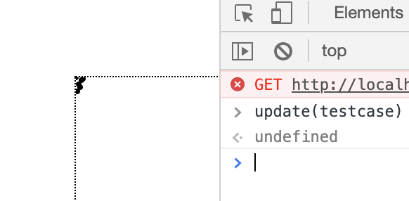

### Scaleの設定

Part01のCase07でやったd3.scaleLinearを利用して、この問題を解決しましょう。

x座標、y座標それぞれについて、スケールを変更する関数を作ります
domainとrangeですが、ここでは画面幅いっぱいに配置されるようにしたいので、次のように書くのが良いのでしょうか。

```js
const xScale = d3.scaleLinear()
  .domain(d3.extent(data, d => d[0]))
  .range([0, svgWidth]);
const yScale = d3.scaleLinear()
  .domain(d3.extent(data, d => d[0]))
  .range([0, svgHeight]);
```

試しにこれでやってみましょう。script.jsのupdate関数を次のように変更します。
xScaleとyScaleを追加し、(cx, cy)の設定を変えています。

```js
const update = (data) => {
  const xScale = d3.scaleLinear()
    .domain(d3.extent(data, d => d[0]))
    .range([0, svgWidth]);
  const yScale = d3.scaleLinear()
    .domain(d3.extent(data, d => d[1]))
    .range([0, svgHeight]);

  const circle = svg.selectAll('circle')
    .data(data);
  circle.enter()
    .append('circle')
    .merge(circle)
    .attr('fill', 'black')
    .attr('stroke', 'none')
    .attr('r', 3)
    .attr('cx', d => xScale(d[0]))
    .attr('cy', d => yScale(d[1]));
};
```

index.htmlを開き直し、Console上でupdate(data)を実行すると、以下のように出力されます。

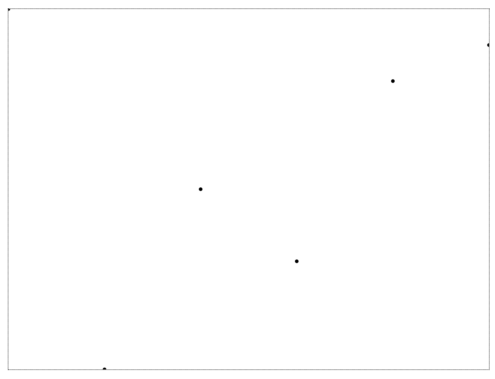

少しだけ違和感があります。それは、テストケースのはじめの座標(0,0)が左上にあることです。
これは当然で、svgの座標系は原点が左上、x座標は右方向に伸び、y座標は下方向に伸びるからです。

数学でよく使われている「x座標右、y座標上」の座標系にするには、yScaleを以下のように修正します。
rangeメソッドの0とsvgHeightの順番を逆にするだけです。

```js
const update = (data) => {
  const xScale = d3.scaleLinear()
    .domain(d3.extent(data, d => d[0]))
    .range([0, svgWidth]);
  const yScale = d3.scaleLinear()
    .domain(d3.extent(data, d => d[1]))
    .range([svgHeight, 0]);

  const circle = svg.selectAll('circle')
    .data(data);
  circle.enter()
    .append('circle')
    .merge(circle)
    .attr('fill', 'black')
    .attr('stroke', 'none')
    .attr('r', 3)
    .attr('cx', d => xScale(d[0]))
    .attr('cy', d => yScale(d[1]));
};
```
index.htmlを開き直し、Console上でupdate(data)を実行すると、以下のように出力されます。
いい感じです。

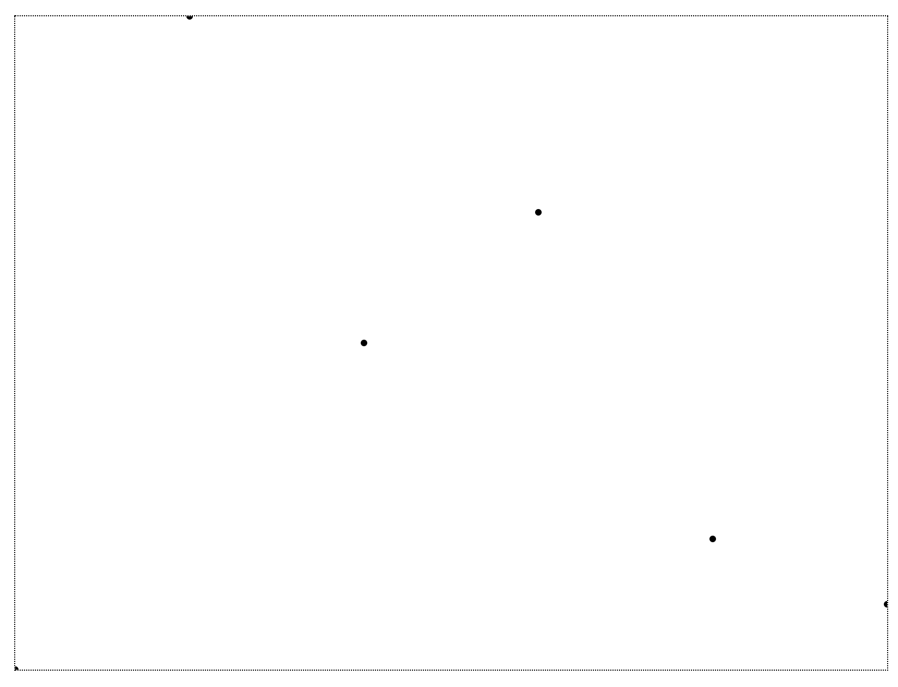

## 基本2: 折れ線を配置する

折れ線はpath要素で行いましょう。
path要素は後で使い回すので、グローバルに宣言しておきます。
script.jsにおいて、svg変数宣言直後に以下の記述を追加します。

```js
const [svgWidth, svgHeight] = [800, 600];
const svg = d3.select('svg')
  .attr('width', svgWidth)
  .attr('height', svgHeight);
const path = svg.append('path')
  .attr('stroke', '#000')
  .attr('fill', 'none');
```

次のように、いちいち各点の座標を調べてd属性を作成することは確かに可能です。
実際、update関数に次の記述を追加すれば、折れ線が描画されます。

```js
let d = '';
for (let i = 0; i < data.length; i++) {
  const [x, y] = [xScale(data[i][0]), yScale(data[i][1])];
  if (i === 0) d += `M${x},${y} L`;
  else d += `${x},${y} `;
}
path.attr('d', d);
```

しかしもっと良い方法があります。

### d3.line

d3.lineは、折れ線を作るための関数を生成する関数です。
xメソッドにはデータのx座標、yメソッドにはデータのy座標を伝えます。
以下では、各要素は0番目にx座標、1番目にy座標が入っているので`d => d[0], d=>d[1]`と指定しています。

d3.lineで生成された関数に対し、引数をデータの集合として呼び出すと、それに折れ線を描くためのd属性を返します。
この値をpathに指定してあげれば、折れ線が描画されるわけですね。

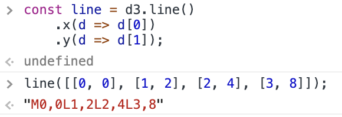

ということで、script.jsのupdate関数末尾に以下の記述を追加します。
x/yメソッドにおいて、データをxScale/yScaleで包むことに注意してください。

```js
const update = (data) => {
  ...
  const line = d3.line()
    .x(d => xScale(d[0]))
    .y(d => yScale(d[1]));
  path.datum(data)
    .attr('d', line);
};
```

index.htmlを開き直し、Console上でupdate(testcase)を実行すると、折れ線グラフが描画されます。

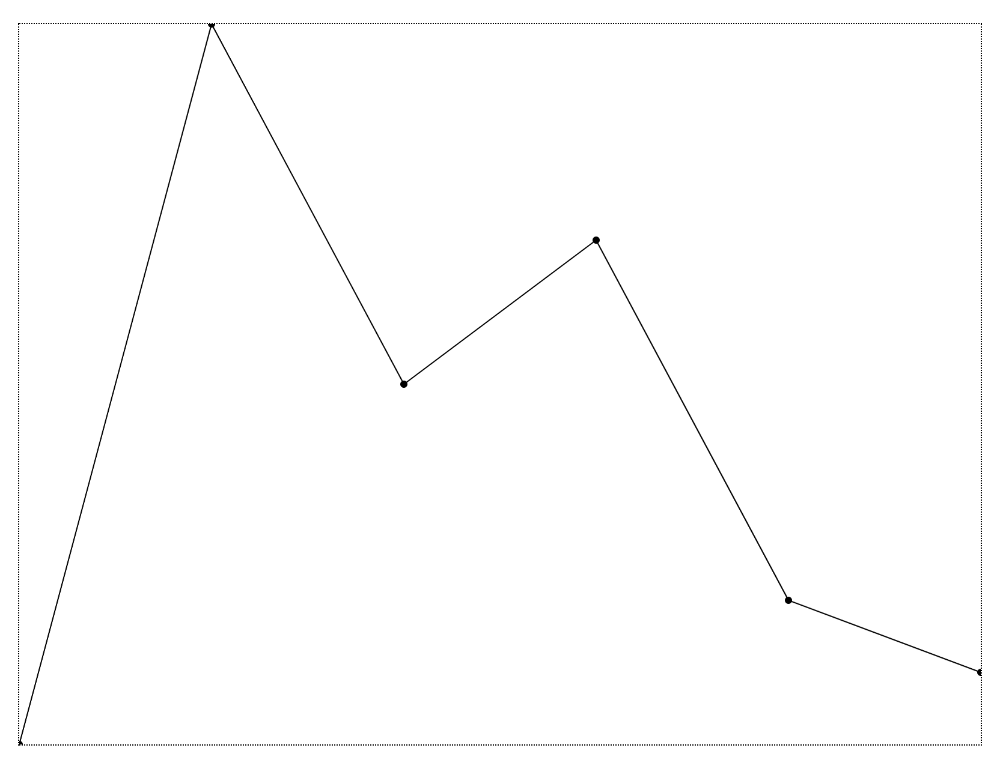

## 基本3: 軸を配置する

折れ線はなんとか自分で作れそうでしたが、軸を自分で作るのはさすがに大変そうです。
なのでD3.jsがあらかじめ用意している機能を利用しましょう。

### d3.axis

軸をいい感じに描画してくれる関数を生成する関数です。

d3.axisTop/d3.axisRight/d3.axisBottom/d3.axisLeftの4種類があり、
それぞれ目盛りが配置される向きを表しています。

以下は、適当にScaleを設定して、svg上に軸を描画する例です。
d3.axisBottomのscaleメソッドにScale関数を指定しています。
こうして出来上がったaxisという関数にselectionを引数にして呼び出すと、
selectionの内部に、軸を描くためのpath要素が配置されます。ここではsvgをselectionに指定しているので、
svg内部に軸が配置されます。

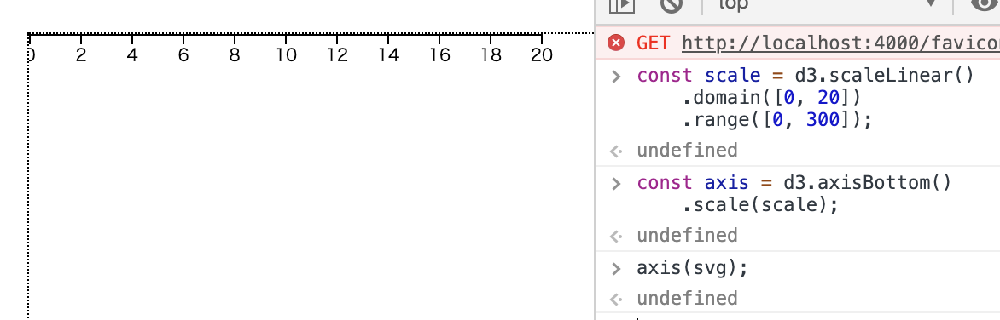

#### selection.call

上記では`axis(svg)`と呼び出していましたが、これは`svg.call(axis)`とも書けます。
axisを呼び出す書き方としてはこれが一般的です。
なぜなら、例えば「g要素をとりあえずtransformで動かしてから、axisを呼び出して軸を描画」という処理を
ドット記法でつなげて書けることで、可読性が上がるからです。

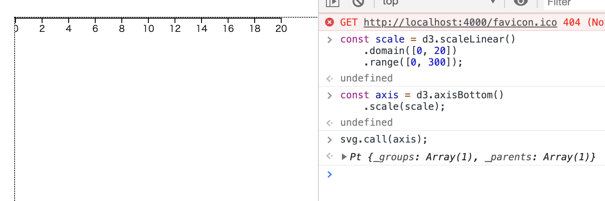

それでは早速書いていきましょう。
x軸、y軸を描画するためのg要素を前もって作っておきます。
script.jsにおいて、path変数の直後に以下の2文を追加します。

```js
...
const path = svg.append('path')
  .attr('stroke', '#000')
  .attr('fill', 'none');
const xAxisGroup = svg.append('g');
const yAxisGroup = svg.append('g');
```

update関数の末尾に次の記述を追加します。

```js
const update = (data) => {
  ...
  const xAxis = d3.axisBottom()
    .scale(xScale);
  xAxisGroup.call(xAxis);

  const yAxis = d3.axisLeft()
    .scale(yScale);
  yAxisGroup.call(yAxis);
};
```

さてindex.htmlを開き直し、Console上でupdate(testcase)を実行すると、軸が描画されます。
ただy軸がおかしい気がします。

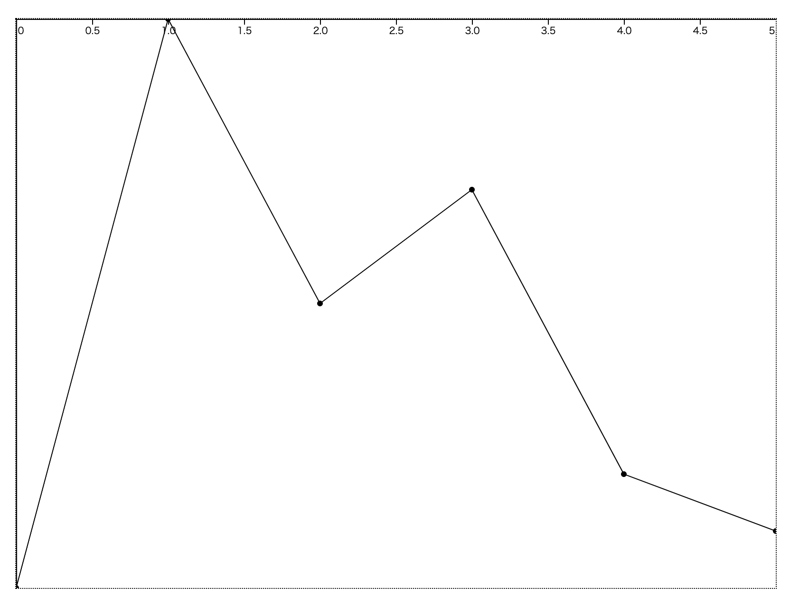

実はy軸の目盛りはsvg領域の外側に行ってしまい見えません。軸をずらす必要があります。
また、数学における普通のxy軸の場合、x軸は下にあります。しかし下に移動すると同様の理由で目盛りがsvg領域の外側にはみ出てしまいます。

これを解決するために、svg領域内部に余白を持たせることにしましょう。

### paddingの設定

paddingは、ここでは適当に「上下左右20px」とします。
script.jsのyAxisGroupの直後に、以下の一文を追加します。

```js
...
const yAxisGroup = svg.append('g');
const pad = 20;
```

さらにupdate関数の先頭を以下のように修正します。
update関数のxScale、yScaleのrangeをpad分だけ縮めています。

```js
udpate = (data) => {
  const xScale = d3.scaleLinear()
    .domain(d3.extent(data, d => d[0]))
    .range([pad, svgWidth-pad]);
  const yScale = d3.scaleLinear()
    .domain(d3.extent(data, d => d[1]))
    .range([svgHeight-pad, pad]);
  ...
};
```

xAxix/yAxisの部分を以下のように修正します。
axisGroupにtransform属性を追加し、padに合わせて軸をずらしています。

```js
udpate = (data) => {
  ...
  const xAxis = d3.axisBottom()
    .scale(xScale);
  xAxisGroup.attr('transform', `translate(0, ${svgHeight-pad})`)
    .call(xAxis);

  const yAxis = d3.axisLeft()
    .scale(yScale);
  yAxisGroup.attr('transform', `translate(${pad}, 0)`)
    .call(yAxis);
};
```

さてindex.htmlを開き直し、Console上でupdate(testcase)を実行すると、綺麗に軸が描画されます。これでほぼ完成です!。

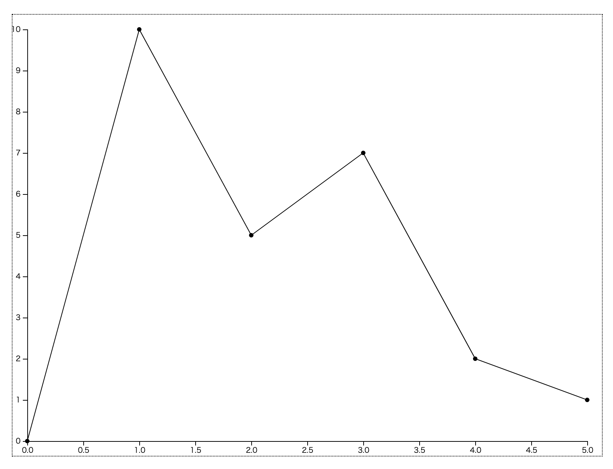

これ以降は、グラフの装飾や関数描画などの、発展的な要素を説明していきます。

## 発展1: 原点で交差したい

### 原点が常に現れるようにする

ある入力においては、原点が現れないケースがあります。

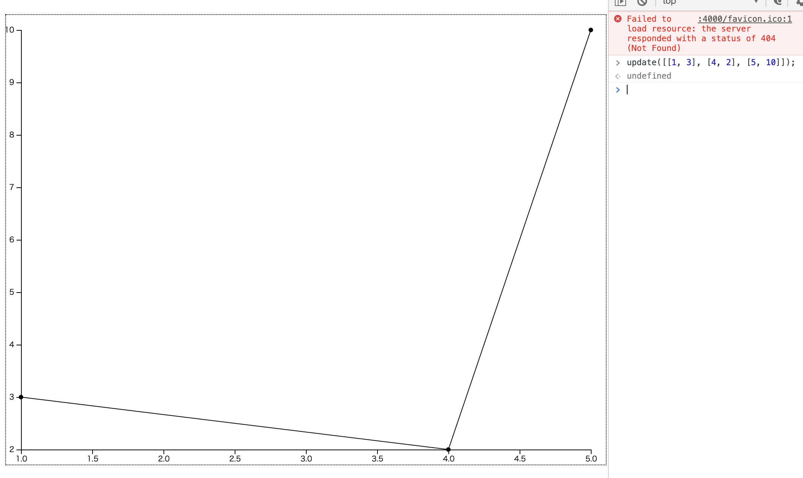

原点が常に現れるようにする方法は簡単です。xScaleとyScaleをちょこっといじるだけで解決します。

script.jsにおいて、update関数の先頭を以下のように修正します。
スプレッド構文を利用して、「dataと点(0, 0)を合わせた配列」を`[...data, [0, 0]]`と表現しています。

```js
  conat dataWithO = [...data, [0, 0]];
  const xScale = d3.scaleLinear()
    .domain(d3.extent(dataWithO, d => d[0]))
    .range([pad, svgWidth-pad]);
  const yScale = d3.scaleLinear()
    .domain(d3.extent(dataWithO, d => d[1]))
    .range([svgHeight-pad, pad]);
```

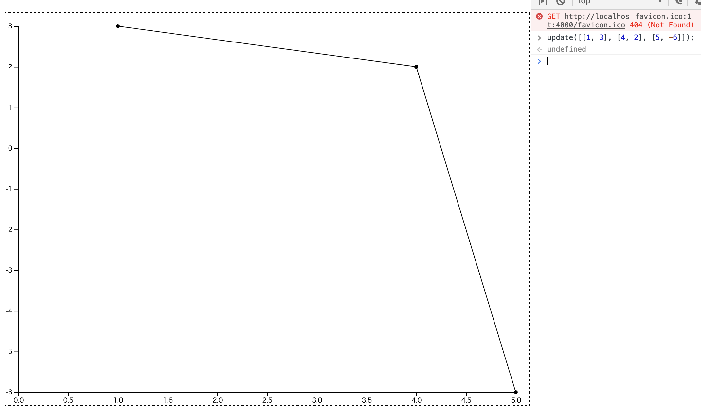

### xy軸が原点で交差するようにする

やっぱりxy軸は原点で交差して欲しいですよね。

script.jsにおいて、update関数のaxis部分を以下のように修正します。
transform属性のx座標、y座標をScaleで書き直しています。
`xScale(0), yScale(0)`でそれぞれ0の値の位置が得られるので、これを利用して
原点と同じ位置に軸のx座標が来るようにしています。

```js
const xAxis = d3.axisBottom()
  .scale(xScale);
xAxisGroup.attr('transform', `translate(0, ${yScale(0)})`)
  .call(xAxis);

const yAxis = d3.axisLeft()
  .scale(yScale);
yAxisGroup.attr('transform', `translate(${xScale(0)}, 0)`)
  .call(yAxis);
```


## 発展2: 目盛りを調整する

目盛りも色々調整できます。

### 任意の目盛り - tickValues

「原点と&plusmn;1以外はいらない!」という人はこんな感じでxAxis/yAxisを修正します。
tickValueというメソッドに指定した数字のみが目盛りとして描画されます。

```js
const xAxis = d3.axisBottom()
  .scale(xScale)
  .tickValues([-1, 0, 1]);
...
const yAxis = d3.axisLeft()
  .scale(yScale)
  .tickValues([-1, 0, 1]);
```

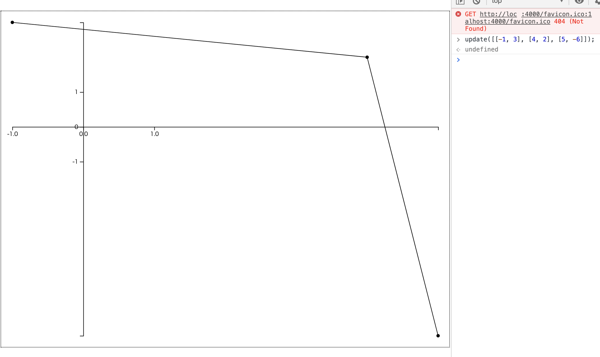

### 目盛り個数指定 - ticks

ticksメソッドでできます。ticksメソッドにはこれ以外の使い方がありますが、
詳細は<a href="https://github.com/d3/d3-axis#axis_ticks">ticksのリファレンス</a>にお任せします。

以下のように記述すると、メモリの個数が5つになります。

```js
const xAxis = d3.axisBottom()
  .scale(xScale)
  .ticks(5);
...
const yAxis = d3.axisLeft()
  .scale(yScale)
  .ticks(5);
```

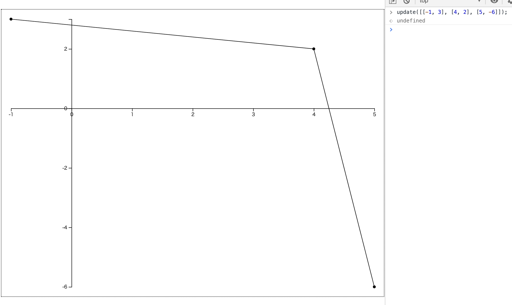

もしも「0から5まで0.3刻みにしたいんだけど、目盛りの個数が幾つなのか知りたい」という場合には、
d3.tickStepという関数が使えます。

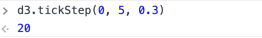

### 目盛りの書式変更 - tickFormat

「データを0.5刻みで表示し、&#x25ef;.5という表示ではなく分数表記にする」というケースを考えてみましょう。

まずはtickStepをticksの引数に指定し、強制的に0.5刻みにします。
tickFormatメソッドを利用すると、各データの書式を変更できます。
もしもデータdが整数ならそのまま表示し、そうでなければ2*d/2の表記で出力するように設定しています。

```js
...
const [xMax, xMin] = d3.extent(dataWithO, d => d[0]);
const xAxis = d3.axisBottom()
  .scale(xScale)
  .ticks(d3.tickStep(xMax, xMin, 0.5))
  .tickFormat(d => {
    if (d === Math.floor(d)) return `${d}`
    else return `${2*d}/2`
  });
...
const [yMax, yMin] = d3.extent(dataWithO, d => d[1]);
const yAxis = d3.axisLeft()
  .scale(yScale)
  .ticks(d3.tickStep(yMax, yMin, 0.5))
  .tickFormat(d => {
    if (d === Math.floor(d)) return `${d}`
    else return `${2*d}/2`
  });
```

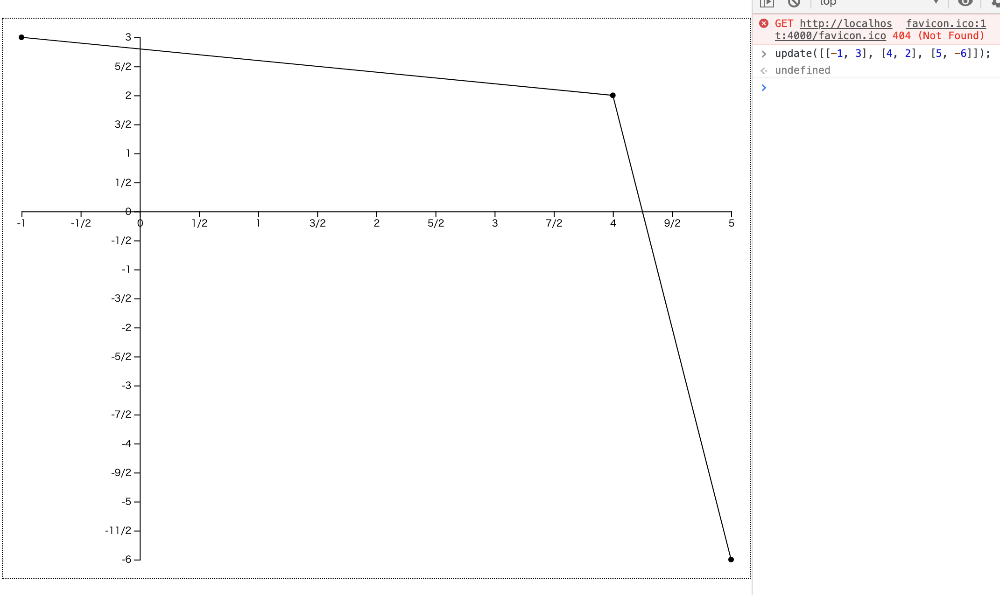

<div class="note">
  <h4>スプレッド構文の利用</h4>
  <p>以下の文がありました。</p>
const [xMax, xMin] = d3.extent(dataWithO, d => d[0]);
const xAxis = d3.axisBottom()
  .scale(xScale)
  .ticks(d3.tickStep(xMax, xMin, 0.5))
  <p>これをスプレッド構文を利用して書くと次のようになります。スプレッド構文は関数の引数に対しても利用できます。
  xMax、xMinという変数を宣言する必要が無くなった代わりに、若干可読性が下がります。</p>
const xAxis = d3.axisBottom()
  .scale(xScale)
  .ticks(d3.tickStep(...d3.extent(dataWithO, d => d[0]), 0.5))
</div>

### 目盛り回転

例えばx軸について、隣り合う数字同士が重なってしまったとき、目盛りを90度回転させたくなります。
これはx軸のtext要素にrotate属性を付与すれば解決します。

axisBottomが呼ばれた後に以下の文を付け足します。
実際には、単にrotateを付けただけだと、文字が軸に重なってしまいます。そこで、dx/dy属性を利用して微調整します。

```js
xAxisGroup.selectAll('.tick text')
  .attr('dx', '-1.5em')
  .attr('dy', '-0.5em')
  .attr('transform', 'rotate(-90)');
```

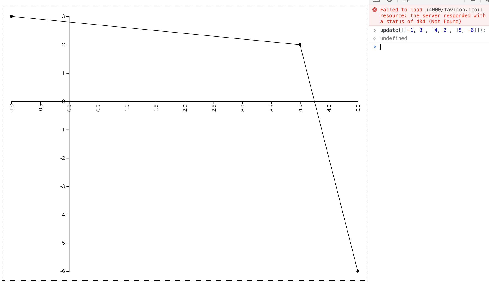

色々いじってきましたが、目盛りについてははじめの状態に戻しておきます。

## 発展3: 関数の可視化

あらゆる1変数関数を描画したくなりませんか?
ということで、「ある定義域と刻み、1変数関数を指定すると、その関数が通る点の列を返す関数」を作りましょう。

script.jsに以下の内容を追加します。

```js
const generatePoints = (start, end, step, f) =>
  d3.range(start, end, step)
    .map(d => [d, f(d)]);
```

&#x5b;0,5)の定義域で、0.5刻みでf(x) = x<sup>2</sup>の点の列を出力する場合は次のように書きます。

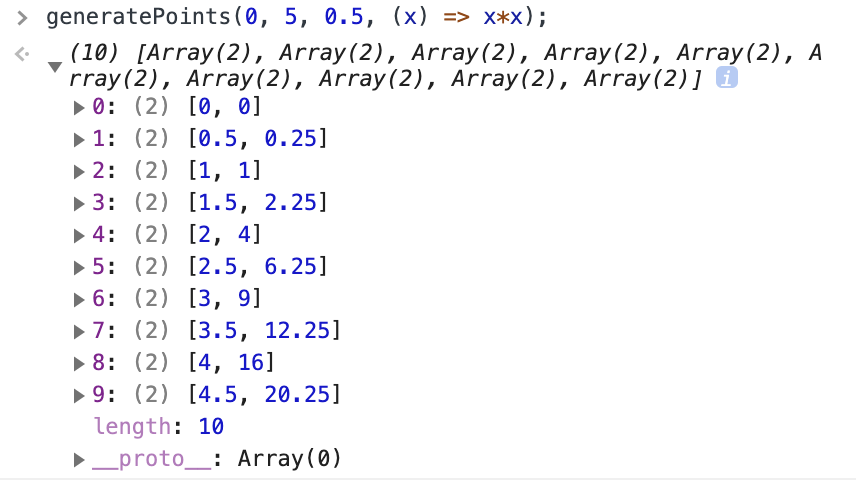

これをupdate関数の引数に指定すれば、グラフが描画されます。

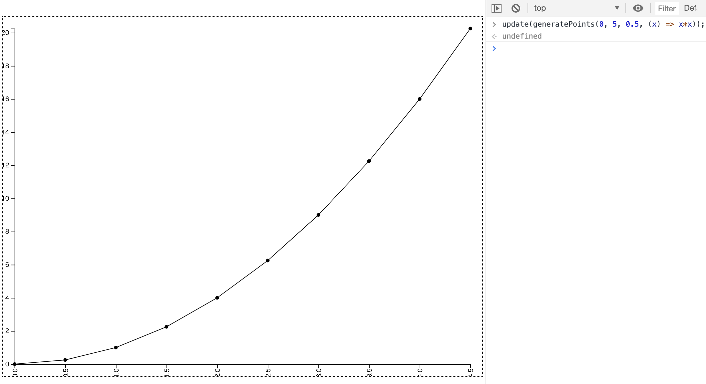

### d3.range

Python使っている人はおなじみrange関数です。

使っていない人向けに説明すると、例えば「&#x5b;0, 5)まで0.5刻みの列」は次のように書けます。

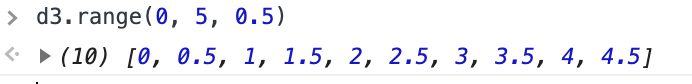

### sinc関数の描画

sinc関数を描画してみましょう。

sinc関数は$f(x) = \displaystyle \frac{\sin x}{x}$で定義される関数ですが、これは$x=0$で定義されないことに注意してください。

ただし$x \rightarrow 0$の極限は存在してその値は$1$なので、$x=0$か否かで場合分けします。

script.jsに以下の記述を追加します。

```js
const sinc = x => x === 0 ? 1 : Math.sin(x)/x;
```

index.htmlを開き直し、`update(generatePoints(-20, 20, 0.5, sinc)`を呼び出すと次のように描画されます。綺麗ですね。

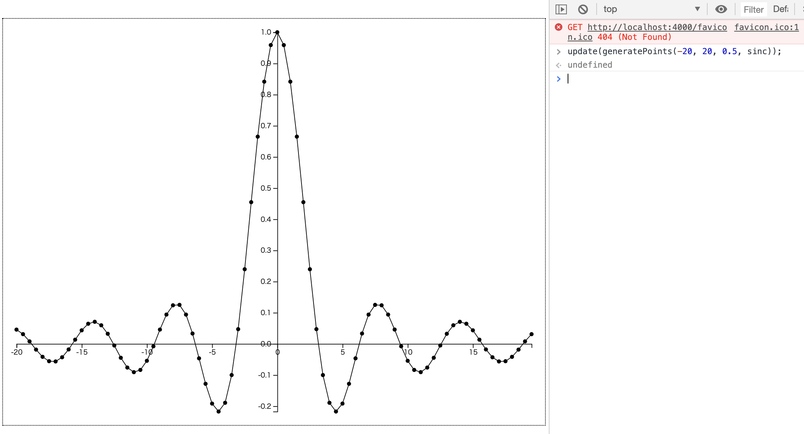

### Snuke Numbersで出てきた関数の描画

<a href="https://atcoder.jp/contests/arc099/tasks/arc099_b?lang=ja" target="_blank">ARC099 - Snuke Numbers</a>
で出てきた関数$f(n) = \frac{n}{S(n)}$を描画してみましょう。ただし$S(n)$とは$n$の桁和です。

離散の関数なので折れ線が適切かは微妙ですが、ここではそういうことは気にせずとにかく描画してみます。

script.jsに以下の記述を追加します。桁和を求める関数をdigSum、目的の関数をsumDivとします。
digSumは、一旦数字を各桁ごとの文字の配列に変換した後、reduceで和を取っています。

```js
const digSum = n => String(n).split('')
  .reduce((acc, e) => acc + Number(e), 0);
const sumDiv = n => n / digSum(n);
```

index.htmlを開き直し、`update(generatePoints(1, 100, 1, sumDiv)`を呼び出すと次のように描画されます。不思議なグラフですね。

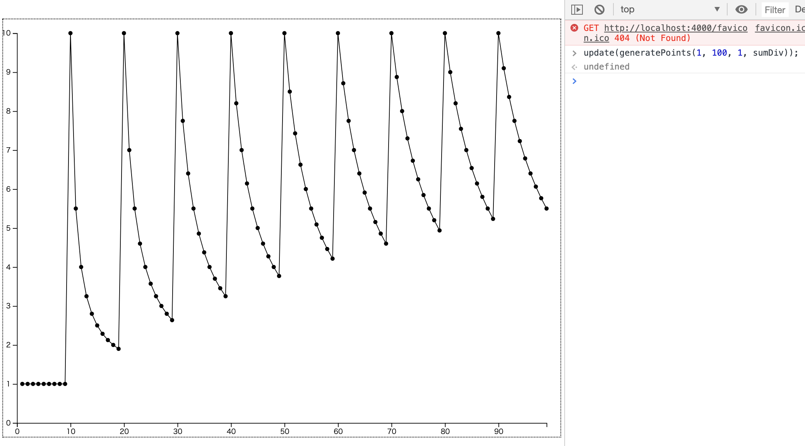

## 発展4: マウスが入ってきたときに座標を表示

点にマウスが乗ったときに、座標の情報を四角い枠で表示しましょう。
script.jsにおいて、yAxisGroupの直後にposInfoGroupとrectとtextを追加します。
これらは、座標情報を表示するための要素です。

```js
...
const xAxisGroup = svg.append('g');
const yAxisGroup = svg.append('g');
const posInfoGroup = svg.append('g');
const rect = posInfoGroup.append('rect')
  .attr('stroke', '#000')
  .attr('fill', 'white');
const text = posInfoGroup.append('text')
  .attr('text-anchor', 'middle')
  .attr('dominant-baseline', 'central');
```

続いて、update関数のcircle.enter()の部分に以下の文を追記します。
マウスが乗った/離れた時の処理をmouseover/mouseoutイベントで補足します。

- mouseoverの時、座標をtext要素のテキストに指定します。その要素の幅に合わせてrectを設定します。
- mouseoutの時、text要素のテキストを空にして、rectのwidthとheightを0にします。これで見かけ上は消えます。

```js
  ...
  circle.enter()
    ...
    .on('mouseover', d => {
      posInfoGroup.attr('transform', `translate(${d3.event.offsetX}, ${d3.event.offsetY})`);
      text.text(`(${d[0]},${d[1]})`);
      const bbox = text.node().getBBox();
      rect.attr('width', bbox.width)
        .attr('height', bbox.height)
        .attr('x', -bbox.width/2)
        .attr('y', -bbox.height/2);
    })
    .on('mouseout', () => {
      text.text('');
      rect.attr('width', 0)
        .attr('height', 0);
    });
  ...
```

#### selection.node

selectionに紐ついたDOMを取得するメソッドです。

#### element.getBBox

要素の位置やサイズを持ったObjectを返します。BBoxとはおそらくBouding Boxの略です。
例では、textにテキスト要素が入れられた後に、その要素のwidthとheightを調べ、それを元にrectのサイズを設定するために用いています。

さてindex.htmlを開いて適当なグラフを描画し、点にマウスを乗せると、座標の情報が描画されます。

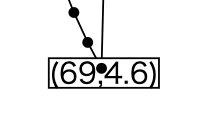

しかし点がボックスに重なっているのが気になります。
svgでは後ろに定義された要素ほど前面に描画されるので、これを解決するためには描画順序を変更しなくてはいけません。

#### d3.event

イベントに関する様々な情報を保存しているObjectです。JavaScriptのEventオブジェクトそのもののようです。
ここではoffsetXとoffsetYプロパティを利用して、svg領域の座標系におけるマウスの座標を取得しています。

### circleをボックスより後ろに配置する

これの解決策は案外簡単です。circleを集めるためのgタグをボックスより前に定義しておけば良いのです。

script.jsにおいて、svg変数の宣言直後にcircleGroupを追加します。

```js
const [svgWidth, svgHeight] = [800, 600];
const svg = d3.select('svg')
  .attr('width', svgWidth)
  .attr('height', svgHeight);
const circleGroup = svg.append('g');
```

update関数のcircle変数宣言の部分を以下のように修正します。

```js
update = (data) => {
  ...
  const circle = circleGroup.selectAll('circle')
    .data(data);
  ...
};
```

これでよし&hellip;かと思いきや、マウスを乗せるとすごい勢いで点滅します。

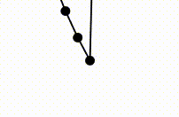

この理由は非常に単純です。
マウスが乗ると座標情報のための要素が描画されますが、その要素が邪魔してマウスが離れた判定になってしまうからです。

ということで要素を少し上にずらしましょう。update関数のmouseoverイベント内部において、
posInfoGroupのy座標を20px上にずらします。

```js
  ...
  circle.enter()
    ...
    .on('mouseover', d => {
      posInfoGroup.attr('transform', `translate(${d3.event.offsetX}, ${d3.event.offsetY-20})`);
      ...
    })
    .on('mouseout', () => {
      ...
    });
  ...
```

いい感じです。

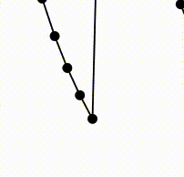

割り切れない数だと次のようにカッコ悪いことになってしまいます。
表示を綺麗にする解決策として、
例えばtextにテキスト要素に数字を指定する際に、小数以下2桁以下は切り捨てる、などの方法が考えられます。

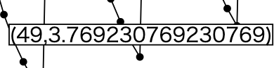

数字の表示形式をいい感じにしてくれるものに
<a href="https://github.com/d3/d3-format" target="_blank"><b>d3-format</b></a>というものがありますが、
詳しい話についてはここでは省略します。ぜひ自分で勉強してみてください。

## 最終的なコード

script.jsの内容を最後に挙げます。コード量が案外多いですね。

```js
const [svgWidth, svgHeight] = [800, 600];
const svg = d3.select('svg')
  .attr('width', svgWidth)
  .attr('height', svgHeight);
const circleGroup = svg.append('g');
const path = svg.append('path')
  .attr('stroke', '#000')
  .attr('fill', 'none');
const xAxisGroup = svg.append('g');
const yAxisGroup = svg.append('g');
const posInfoGroup = svg.append('g');
const rect = posInfoGroup.append('rect')
  .attr('stroke', '#000')
  .attr('fill', 'white');
const text = posInfoGroup.append('text')
  .attr('text-anchor', 'middle')
  .attr('dominant-baseline', 'central');
const pad = 20;

const testcase = [[0, 0], [1, 10], [2, 5], [3, 7], [4, 2], [5, 1]];

const update = (data) => {
  const dataWithO = [...data, [0, 0]];
  const xScale = d3.scaleLinear()
    .domain(d3.extent(dataWithO, d => d[0]))
    .range([pad, svgWidth-pad]);
  const yScale = d3.scaleLinear()
    .domain(d3.extent(dataWithO, d => d[1]))
    .range([svgHeight-pad, pad]);

  const circle = circleGroup.selectAll('circle')
    .data(data);
  circle.exit().remove();
  circle.enter()
    .append('circle')
    .merge(circle)
    .attr('fill', 'black')
    .attr('stroke', 'none')
    .attr('r', 3)
    .attr('cx', d => xScale(d[0]))
    .attr('cy', d => yScale(d[1]))
    .on('mouseover', d => {
      posInfoGroup.attr('transform', `translate(${d3.event.offsetX}, ${d3.event.offsetY-20})`);
      text.text(`(${d[0]},${d[1]})`);
      const bbox = text.node().getBBox();
      rect.attr('width', bbox.width)
        .attr('height', bbox.height)
        .attr('x', -bbox.width/2)
        .attr('y', -bbox.height/2);
    })
    .on('mouseout', () => {
      rect.attr('width', 0)
        .attr('height', 0);
      text.text('');
    });

  const line = d3.line()
    .x(d => xScale(d[0]))
    .y(d => yScale(d[1]));
  path.datum(data)
    .attr('d', line);

  const [xMax, xMin] = d3.extent(dataWithO, d => d[0]);
  const xAxis = d3.axisBottom()
    .scale(xScale)
  xAxisGroup.attr('transform', `translate(0, ${yScale(0)})`)
    .call(xAxis);

  const [yMax, yMin] = d3.extent(dataWithO, d => d[1]);
  const yAxis = d3.axisLeft()
    .scale(yScale)
  yAxisGroup.attr('transform', `translate(${xScale(0)}, 0)`)
    .call(yAxis);

}

const generatePoints = (start, end, step, f) =>
  d3.range(start, end, step)
    .map(d => [d, f(d)]);

const sinc = x => x === 0 ? 1 : Math.sin(x)/x;
const digSum = n => String(n).split('')
  .reduce((acc, e) => acc + Number(e), 0);
const sumDiv = n => n / digSum(n);
```

## まとめ

折れ線グラフを作るという行為を通して、軸(d3.axis)や折れ線(d3.line)の描画方法を学びました。
また発展として、関数を描画したり、座標の情報を描画したりしました。

さてここでもしかしたら、「グラフ描くなんて、matplotlibとかgnuplotとかの方がもっと簡単に描けるだろ」と思った人がいるかもしれません。実際そうです。単にグラフを描くだけならPythonのmatplotlibとかを利用した方が良いです。グラフが数行で書けます。またJSには、グラフを描くことに特化したライブラリ「Chart.js」があります。 

D3.jsはあくまで、グラフを描画するために必要な基本要素を提供してくれるだけなので、
実際に点を描画したり、軸を描画したりなどの処理はプログラマがやらなくてはいけません。
**自分で書かなければいけない部分が多い**のです。

しかし、D3.jsは「グラフ描画のためだけのライブラリ」でないことに注意してください。
実際、<a href="https://d3js.org" target="_blank">公式サイト</a>にも

<blockquote>
D3.js is a JavaScript library for manipulating documents based on data.
</blockquote>

と書いてあります。D3.jsは確かにグラフ作成も可能ですが、それ以外の可視化の可能性も秘めているのです。
例えばPart02で学んだ迷路可視化が良い例です。

手っ取り早くグラフを描きたいだけならD3.js以外の選択肢を選ぶべきです。しかしそれ以上の可視化を望むなら、
D3.jsを学ぶ価値は大いにあります。

