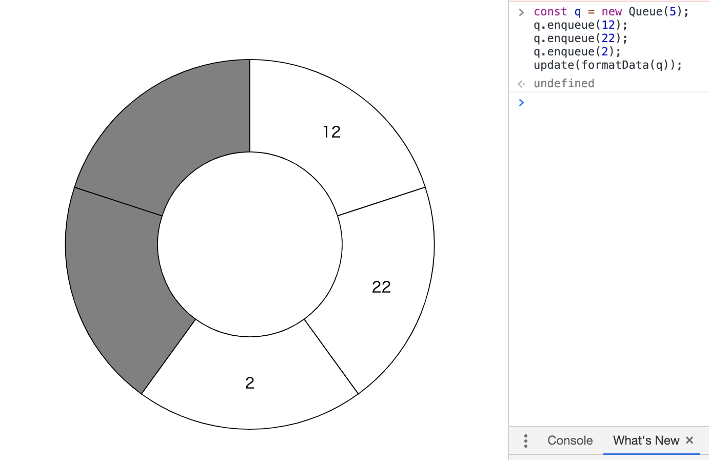

<script src="https://d3js.org/d3.v5.min.js"></script>

# D3.js Part04 Pie Chart

## どんなものを作る?

Queueを可視化しましょう。Queueの実装はリングバッファとし、リングバッファの動きが見えるようにしましょう。

## テンプレ作成

どんなインターフェースを作るかですが、とりあえず次のようにします。

- データを読み込むためのtextarea
- データを読み込むためのloadボタン
- 読み込まれたデータをクリアするためのclearボタン
- 読み込まれたデータを表示するエリア
- 読み込まれたデータをQueueにenqueueするボタン
- Queueからデータをdequeueするボタン

index.htmlを作成し、内容を以下のようにします。
読み込まれたデータを表示するエリアはulのli要素として管理することにします。

```html
<!DOCTYPE html>
<html lang="ja">
  <head>
    <meta charset="utf-8">
    <link rel="stylesheet" href="style.css">
    <title>Queue Vizualizer</title>
  </head>
  <body>
    <div class="main-container">
      <div class="menu">
        <textarea></textarea>
        <input id="load_btn" type="button" value="load">
        <input id="clear_btn" type="button" value="clear">
        <div class="queue_button">
          <input id="enqueue_btn" type="button" value="enqueue">
          <input id="dequeue_btn" type="button" value="dequeue">
        </div>
        <ul id="loaded_data">
        </ul>
      </div>
      <div class="main">
        <svg></svg>
      </div>
    </div>
    <script src="https://d3js.org/d3.v5.min.js"></script>
    <script src="script.js"></script>
  </body>
</html>

```

style.cssを作成し、内容を以下のようにします。

```css
@charset "utf-8";

.main-container {
  display: flex;
  flex-direction: row;
}

.menu {
  width: 150px;
  display: flex;
  flex-direction: column;
  padding-top: 50px;
}

.queue_button {
  width: 100%;
  display: flex;
  flex-direction: row;
}

#push_btn, #pop_btn {
  width: 50%;
}

textarea {
  resize: none;
  height: 300px;
}

ul {
  list-style-type: none;
  padding: 0;
  margin: 10px 0;
}

svg {
  margin: 50px 20px;
  border: 1px dotted #000;
}

```

script.jsを作成し、内容を以下のようにします。

```js
const [svgWidth, svgHeight] = [800, 600];
const svg = d3.select('svg')
  .attr('width', svgWidth)
  .attr('height', svgHeight);
```

index.htmlを開くと以下のようになります。


## データ表現

### Queueのデータ表現

リングバッファで実装されたQueueです。
一般的な実装では以下のようなデータを持っていると思います。

- バッファ用の固定長配列
- データの先頭位置head
- データの末尾位置tail

また、これが必要かは実装によりそうですが、
データが空なのか満タンなのかを確認するために、次のデータを持たせます。

- 入っているデータの個数length

### 出力系のデータ表現

円形でデータが並べられている図を作りたいです。
この図は**円グラフに見立てて作る**と良さそうです。

円グラフを作るためにd3.pieとd3.arcが使えます。
d3.pieは、元データを円グラフ用のデータに変換してくれます。
d3.arcは、データからpathのd要素を生成してくれます。

円グラフの半径や各要素の幅などはd3.pieの計算に任せるとして、他の要素を考えます。
Queueとして持つべきは以下の2つの情報です

- その位置にデータが入っているかどうか。
  入っていたら白、入っていなかったら灰色で表す
- データが入っていた場合、そのデータは何かを文字列で表す
  入っていなかった場合は表示しない

データが入っていなかった場合は空文字、そうでない場合はデータを文字列にする、という
処理を書くよりは、textのopacity属性を使って透明度を制御した方が実装が少し楽です。
よって、次のデータを持っていれば良いです。

```js
{ text: 文字列, color: 色, opacity: 文字列の透明度 }
```

## Queueの実装

Queue.jsを作成し、内容は以下の通りとします。
リングバッファを用いた自然なQueueの実装だと思います。

後で使うことになるので、fullとemptyを定義しています。

```js
class Queue {
  constructor(queueSize) {
    this.buf = new Array(queueSize).fill(0);
    this.head = 0;
    this.tail = 0;
    this.length = 0;
  }
  enqueue(datum) {
    if (this.full()) {
      console.error('Queue is full.');
      return;
    }
    this.buf[this.tail] = datum;
    this.tail = (this.tail + 1) % this.buf.length;
    this.length++;
  }
  dequeue() {
    if (this.empty()) {
      console.error('Queue is empty.');
      return undefined;
    }
    const ret = this.buf[this.head];
    this.head = (this.head + 1) % this.buf.length;
    this.length--;
    return ret;
  }
  full() {
    return this.length >= this.buf.length; 
  }
  empty() {
    return this.length === 0; 
  }
  toArray() {
    return this.buf.slice();
  }
}
```

index.htmlのscriptタグの部分にQueue.jsを追加します。
```html
<!DOCTYPE html>
<html lang="ja">
  <head>
  ...
  </head>
  <body>
    ...
    <script src="https://d3js.org/d3.v5.min.js"></script>
    <script src="Queue.js"></script>
    <script src="script.js"></script>
  </body>
</html>

```

## 出力変換器の作成

Queueから出力用データに変換する関数を作成しましょう。
script.jsに以下の記述を追加します。

```js
const formatData = (queue) => {
  const ret = queue.toArray()
    .map(d => Object({ text: String(d), color: 'gray', opacity: 0 }));
  const { head, length, buf} = queue;
  for (let i = 0; i < length; i++) {
    const k = (head + i) % ret.length;
    ret[k].color = 'white';
    ret[k].opacity = 1;
  }
  return ret;
}
```

index.htmlを開き直し、Console上でテストしてみましょう。


<div class="note">
  <h4>Objectコンストラクタ</h4>
  <p>はじめの文は次のように書きたいかもしれません。</p>
  const ret = queue.toArray()
    .map(d => { text: String(d), color: 'gray' });
  <p>しかしこの記法だと、<code>{}</code>は単なるブロックと解釈されてしまします。</p>
  <p>そのため、Objectコンストラクタで包むことで<code>{}</code>をObjectに解釈させています。</p>
</div>

## d3.pieとd3.arcの基本

本題から少し外れて、Queueの可視化で利用する円グラフの基本について説明します。

script.jsに以下の内容を追加します。

```js
const update = (data) => {
  const pie = d3.pie()
    .value(d => d.value)
    .sort(null);
  const arc = d3.arc()
    .outerRadius(200)
    .innerRadius(100);

  const pieGroup = pieChart.selectAll('g')
    .data(pie(data));

  pieGroup.exit().remove();
  
  const pieGroupEnter = pieGroup.enter()
    .append('g');
  pieGroupEnter.append('path');
  pieGroupEnter.append('text');

  const pieGroupMerge = pieGroupEnter.merge(pieGroup);
  pieGroupMerge.select('path')
    .attr('d', arc)
    .attr('fill', 'white')
    .attr('stroke', 'black');
  pieGroupMerge.select('text')
    .attr('transform', d => `translate(${arc.centroid(d)})`)
    .attr('text-anchor', 'middle')
    .attr('dominant-baseline', 'central')
    .text(d => d.data.label);
};

update([
  {label: 'Hello', value: 1},
  {label: 'World', value: 4},
  {label: 'Apple', value: 2},
  {label: 'Meron', value: 3},
  {label: 'Suika', value: 6}
]);
```

index.htmlを開きなおすと、以下のような円グラフが出力されます。


### 分業

新たにd3.pieとd3.arcが出てきましたが、これは次のような処理を行なっています。

- d3.pie: 円グラフを描くための、角度情報を持ったデータを作成するための関数を作る
- d3.arc: 角度の情報から、「扇型を描くためのpath要素のd属性」を作成するための関数を作る

### d3.pie

以下の文をコピペしてConsoleに貼り付けてみると、pieがどんなデータを作成するのかが分かります。

```js
const pie = d3.pie()
  .value(d => d.value)
  .sort(null);
pie([
  {label: 'Hello', value: 1},
  {label: 'World', value: 4},
  {label: 'Apple', value: 2},
  {label: 'Meron', value: 3},
  {label: 'Suika', value: 6}
])
```

どうやら、元のデータはdataというプロパティに保存されているようです。
value/index/padAngle/startAngle/endAngleなどのプロパティが追加されています。


#### valueメソッド

円グラフの扇型の開きを決めるための値を指定します。
ここでは元データのvalueを設定しています。
このvalueの値が大きいほど扇型の開きも大きくなるので、例ではSuikaが最も大きな開きとなります。

#### sortメソッド

値をどんな順に並べるかを指定します。
引数には比較関数を指定します。比較関数の指定方法については<a href="https://developer.mozilla.org/ja/docs/Web/JavaScript/Reference/Global_Objects/Array/sort" target="_blank">sort関数の説明</a>を参照してください。

nullを指定すると、そのままの順番で並べられます。

d3.pieでは、他にも様々なカスタマイズが可能です。興味があれば<a href="https://github.com/d3/d3-shape#pies" target="_blank">Pies - d3-shape</a>を参照してください。

### d3.arc

扇型を描くための関数を作成する関数です。arcに適当なプロパティを持つObjectを与えることで、それに応じたd要素を文字列として返します。例えば次のようにConsoleに貼り付けてみると、arcがどんな値を返すのかが分かります。
startAngleは開始角度、endAngledは終了角度なので、以下では半円を作成するためのd属性を返します。

```js
const arc = d3.arc()
  .outerRadius(200)
  .innerRadius(100);
const d = arc({
  startAngle: 0,
  endAngle: 3.14
});
console.log(d);
```


path要素を追加して、そこに先のd要素を指定してみましょう。
次のように、Console上に以下の内容をコピペしましょう。

```js
svg.append('path')
  .attr('transform', `translate(${svgWidth/2}, ${svgHeight/2})`)
  .attr('fill', 'steelblue')
  .attr('stroke', 'black')
  .attr('d', d);
```

半円が実際に描画されます。


#### inner/outerRadius

扇型の外半径/内半径を指定します。

#### arc.centroid

与えられたデータの中心位置を`[x座標,y座標]`の形式の配列として返します。
Console上で以下の内容を貼り付けてみましょう。

```js
arc.centroid({
  startAngle: 0,
  endAngle: 3.14
});
```


今回の例では、HelloやAppleなどのラベルの位置を指定するために用いています。

<div class="note">
  <h4>配列から文字列への型変換</h4>
  <p>例えば<code>[1,2,3]</code>の配列を文字列に変換すると、<code>'1,2,3'</code>となります。</p>
  <p>このことを利用して、例ではテンプレートリテラルの中に直接配列を埋め込んで使っています。</p>
  ...
  .attr('transform', d => `translate(${arc.centroid(d)})`)
</div>

## 出力系の実装

さて長い前置きはここまでにして、ようやく本題に入ります。

script.jsにおいて、**前項で書いた部分をして**、新たにupdate関数を作成します。

```js
const update = (data) => {
  const pie = d3.pie()
    .value(d => 1)
    .sort(null);
  const arc = d3.arc()
    .outerRadius(200)
    .innerRadius(100);

  const pieGroup = pieChart.selectAll('g')
    .data(pie(data));
  pieGroup.exit().remove();
  const pieGroupEnter = pieGroup.enter()
    .append('g');
  pieGroupEnter.append('path');
  pieGroupEnter.append('text');

  const pieGroupMerge = pieGroupEnter.merge(pieGroup);
  pieGroupMerge.select('path')
    .attr('d', arc)
    .attr('fill', d => d.data.color)
    .attr('stroke', 'black');
  pieGroupMerge.select('text')
    .attr('transform', d => `translate(${arc.centroid(d)})`)
    .attr('text-anchor', 'middle')
    .attr('dominant-baseline', 'central')
    .text(d => d.data.text);
};
```

### 前項との変更点

細かい変更点はありますが、特に注目べきは最初のpie関数の、valueメソッドです。
valueメソッドは常に1を返すようにしています。
こうすることで、**全ての扇型の開きは同じになります。**

```js
const pie = d3.pie()
  .value(d => 1)
  .sort(null);
```

さてindex.htmlを開き直して、Console上に以下の内容を打ってみます。

```js
const q = new Queue(5);
q.enqueue(12);
q.enqueue(22);
q.enqueue(2);
update(formatData(q));
```

いい感じに表示されます。



## 入力部分の作成

### 読み込まれたデータの管理方法

loadボタンが押されたらデータが読まれるようにします。
またenqueueが押される度に、まだenqueueされていない先頭のデータをQueueに入れることにします。

ここでは簡単のため、読み込まれたデータは配列で管理することにします。
ただしenqueueボタンの処理の都合で、配列はIteratorクラスでラッピングします。

Iterator.jsを作成し、内容を以下の通りにします。remainder関数は、まだenqueueされていないデータを返す関数で、
データを描画する際に利用します。

```js
class Iterator {
  constructor(array) {
    this.buf = array;
    this.cnt = 0;
  }
  hasNext() {
    return this.cnt < this.buf.length;
  }
  next() {
    this.cnt++;
  }
  now() {
    return this.buf[this.cnt];
  }
  remainder() {
    return this.buf.slice(this.cnt);
  }
}
```

残ったデータをulのli要素として描画する関数updateInfoを作っておきます。
script.jsに以下の内容を追加します。

```js
const ul = d3.select('#loaded_data');
const updateInfo = (data) => {
  const li = ul.selectAll('li')
    .data(data);
  li.exit().remove();
  li.enter()
    .append('li')
    .merge(li)
    .text(d => d);
};
```

loadボタンの処理を書きます。textareaから複数行読み取って、値に変換して配列にした後、Iteratorで包みます。
同じようなことをPart01のCase10でもやりました。
script.jsに以下の記述を追加します。

```js
let itr;
d3.select('#load_btn')
  .on('click', () => {
    const input = d3.select('textarea')
      .property('value')
      .split('\n')
      .map(d => d.split(' '));
    const data = d3.merge(input)
      .map(d => Number(d));
    itr = new Iterator(data);
    updateInfo(itr.remainder());
  });
```

clearボタンを実装します。空配列をIteratorで包むだけです。
script.jsに以下の記述を追加します。

```js
d3.select('#clear_btn')
  .on('click', () => {
    itr = new Iterator([]);
    updateInfo(itr.remainder());
  });
```

続いてenqueueボタンとdequeueボタンを作ります。Queueクラスをグローバル空間に宣言しておきます。
script.jsに以下の記述を追加します。

```js
const q = new Queue(20);
d3.select('#enqueue_btn')
  .on('click', () => {
    if (itr.hasNext() && !q.full()) {
      q.enqueue(itr.now());
      update(formatData(q));
      itr.next();
      updateInfo(itr.remainder());
    }
  });
d3.select('#dequeue_btn')
  .on('click', () => {
    if (!q.empty()) {
      q.dequeue(itr.now());
      update(formatData(q));
    }
  });
```

テストのため、最初からtextareaに乱数が入っているものとします。
script.jsに以下の記述を追加します。

```js
const randomInt = (m, M) => {
    const randUniform = d3.randomUniform(m, M);
    return () => Math.floor(randUniform());
  };
const rand = randomInt(0, 100);
const testcase = [...Array(20)].map(() => rand());
d3.select('textarea').property('value', testcase.join(' '));
```


さてこれで、index.htmlを開き直します。loadボタンを押すとデータが読み込まれ、enqueue/dequeueボタンを押すと
キューの状態が変化します。これでほぼ完成です!


目的は達成されました。ここからは、少し発展的な機能を追加していきたいと思います。

## アニメーションしよう(1)

d3.transitionを利用しましょう。
update関数の`pieGroupEnter.append('text');`以降の部分を以下のように修正します。

```js
...
pieGroupEnter.append('path');
pieGroupEnter.append('text');

const t = d3.transition()
  .duration(500);
const pieGroupMerge = pieGroupEnter.merge(pieGroup);
pieGroupMerge.select('path')
  .attr('d', arc)
  .transition(t)
  .attr('fill', d => d.data.color)
  .attr('stroke', 'black');
pieGroupMerge.select('text')
  .attr('transform', d => `translate(${arc.centroid(d)})`)
  .attr('text-anchor', 'middle')
  .attr('dominant-baseline', 'central')
  .transition(t)
  .attr('opacity', d => d.data.opacity)
  .text(d => d.data.text);
...
```


## 一列のキューの描画

リングバッファとしてのQueueは分かりました。しかし概念的なQueueは一列に並んだ配列です。


「Queueのイメージは待ち行列なんだけど、リングバッファの実装はこんな感じで動くんだよ」
みたいなことを伝えるためには、円だけでなくデータが一列に並んだ図もあった方が良いです。

### どんなデータにするか

左から要素が入ってきて、右から要素が出て行くようにしたいです。
見やすさのために、キューに入っているデータは右詰めにします。

&hellip;ということを考えて行くと、円グラフで利用したデータは使いまわせそうにありません。
新たなデータの形を作ってあげる必要があります。

### rectLenの定義

配列の各要素はrectで描画します。rectは正方形とします。一辺の長さはこのあといくつかの計算で利用するので、
定数としてあらかじめ宣言しておきましょう。

script.jsの先頭の、`const [svgWidth, svgHeight] = ...`の行の直後に、以下の記述を追加します。

```js
const [svgWidth, svgHeight] = [800, 600];
const rectLen = 30;
```

### 出力変換器の追加

formatDataの内容を以下の通りにします。

- pieData: 円グラフ作成用のデータ
- alignedData: 配列のように並べる用のデータ

と分けて、その2つを持ったObjectを返すように変更します。

```js
const formatData = (queue) => {
  const pieData = queue.toArray()
    .map(d => Object({ text: String(d), color: 'gray', opacity: 0 }));
  const { head, length, buf} = queue;
  for (let i = 0; i < length; i++) {
    const k = (head + i) % buf.length;
    pieData[k].color = 'white';
    pieData[k].opacity = 1;
  }
  const alignedData = [];
  for (let i = buf.length - 1; i >= 0; i--) {
    const k = (head + i) % buf.length;
    alignedData.push(pieData[k]);
  }
  return {pieData, alignedData};
}
```

alignedDataについて補足しておきます。headから初めてその結果を順に配列に格納する処理は次のように書けます。

```js
const alignedData = [];
for (let i = 0; i < buf.length; i++) {
  const k = (head + i) % buf.length;
  alignedData.push(pieData[k]);
}
```

しかしこれだと、データが左詰めになってしまうため、実際の例ではループを逆に回しています。

### 配列の描画

script.jsの先頭の、`const pieChart = ...`の行の直後に、以下の記述を追加します。
配列の要素をひとまとめにしたg要素です。

```js
const pieChart = svg.append('g')
  .attr('transform', `translate(${svgWidth/2}, ${svgHeight/2})`);
const arrGroup = svg.append('g')
  .attr('transform', `translate(${svgWidth/2}, ${svgHeight - rectLen})`);
```

formatDataの返す値が変わりましたので、それに合わせて受け取り方法も変えなくてはなりません。
update関数の先頭に以下の記述を追加します。

```js
const update = (data) => {
  const { pieData, alignedData } = data;
  ...
}
```

また、update関数において、pieGroupのdataメソッドを次のように修正します。

```js
const update = (data) => {
  ...
  const pieGroup = pieChart.selectAll('g')
    .data(pie(pieData));
  ...
};
```

実際に配列を描画します。
update関数の末尾に以下の記述を追加します。
rectの位置を決定するためにscaleLinearを利用しています。
```js
const update = (data) => {
  const arrLen = alignedData.length * rectLen;
  const xScale = d3.scaleLinear()
    .domain([0, alignedData.length])
    .range([-arrLen/2, arrLen/2]);
  const arrElemMerge = arrElemEnter.merge(arrElem);
  arrElemMerge.attr('transform', (d, i) => `translate(${xScale(i)}, 0)`);
  arrElemMerge.select('rect')
    .attr('fill', d => d.color)
    .attr('stroke', 'black')
    .attr('width', rectLen)
    .attr('height', rectLen);
  arrElemMerge.select('text')
    .attr('text-anchor', 'middle')
    .attr('dominant-baseline', 'central')
    .attr('x', rectLen/2)
    .attr('y', rectLen/2)
    .attr('opacity', d => d.opacity)
    .text(d => d.text);
};
```

index.htmlを開き直して、loadボタンを押してenqueue/dequeueボタンを押すと、いい感じに配列が描画されます。


## アニメーションしよう(2)

単純に色の変化をアニメーションしたいなら、
arrElemMergeにtransitionメソッドをくっつけるだけで解決します。

```js
const update = (data) => {
  ...
  const arrElemMerge = arrElemEnter.merge(arrElem)
    .transition(t);
  ...
};
```


## アニメーションしよう(3)

「dequeueボタンを押すと、先頭の要素が後ろに回る」というアニメーションをすると、データが出て行くイメージが持てて良さそうです。
その場合、「どのDOMにどのデータを結びつけるか」が制御できないといけません。Part01のCase09の1th Methodでちらっと出てきた、
「dataメソッドにキーを指定する」ことで解決できます。

### indexの追加

まず、配列になる前のデータが元データで何番目であったかをidxというプロパティに保存しておこうと思います。
formatDataのalignedData処理部分を次のように修正します。

```js
const formatData = (data) => {
  ...
  const alignedData = [];
  for (let i = buf.length - 1; i >= 0; i--) {
    const k = (head + i) % buf.length;
    alignedData.push({...pieData[k], idx: k});
  }
  ...
};
```

### dataメソッドにキーを指定

updateメソッドで、arrElemの記述を以下のように変更します。
dataメソッドに第2引数を指定しています。
こうすることで、もし再度データが結ばれた場合、idxプロパティと合う要素とデータ同士が結びつきます。

```js
update = (data) => {
  ...
  const arrElem = arrGroup.selectAll('g')
    .data(alignedData, d => d.idx);
  ...
};
```

すると、dequeueボタンを押した時のアニメーションが以下のようになります。


<div class="note">
<h4>dataメソッドの第2引数</h4>

<p>dataメソッドについて、もう少し具体的に説明します。</p>
<p>例えば、「circle要素に<code>{name, r}</code>の書式のデータを結びつける」ことを考えます。
はじめは、以下のようにしてデータとDOMを追加しました。</p>

svg.selectAll('circle')
  .data([ {name: 'A', r: 10}, {name: 'B', r: 15}, {name: 'C', r: 5} ])
  .enter()
  .append('circle')
  .attr('cx', (d, i) => (i + 1) * 40)
  .attr('cy', svgHeight/2)
  .attr('r', d => d.r);

<p>これにより、次のような図が生成されます。</p>

<svg id="circle01" width="150" height="200">
  <circle cx="40" cy="100" r="10"></circle>
  <circle cx="80" cy="100" r="15"></circle>
  <circle cx="120" cy="100" r="5"></circle>
</svg>

<p>ここで、続けて以下のように、要素の順番を変えて再びDOMに結びつけたらどうなるでしょうか。</p>

svg.selectAll('circle')
  .data([ {name: 'A', r: 10}, {name: 'B', r: 15}, {name: 'C', r: 5} ])
  .enter()
  .append('circle')
  .attr('cx', (d, i) => (i + 1) * 40)
  .attr('cy', svgHeight/2)
  .attr('r', d => d.r);
svg.selectAll('circle')
  .data([ {name: 'B', r: 15}, {name: 'A', r: 10}, {name: 'C', r: 5} ])
  .attr('r', d => d.r);

<p>circleの順番にデータが結び直されるので、半径が変わります。</p>

<svg id="circle02" width="150" height="200">
  <circle cx="40" cy="100" r="15"></circle>
  <circle cx="80" cy="100" r="10"></circle>
  <circle cx="120" cy="100" r="5"></circle>
</svg>

<p>nameをキーとしてdataを結び直すと、「すでにDOM内にnameが同じ値のものがあれば、それを対象にして結び直す」処理になります。</p>

svg.selectAll('circle')
  .data([ {name: 'A', r: 10}, {name: 'B', r: 15}, {name: 'C', r: 5} ], d => d.name)
  .enter()
  .append('circle')
  .attr('cx', (d, i) => (i + 1) * 40)
  .attr('cy', svgHeight/2)
  .attr('r', d => d.r);
svg.selectAll('circle')
  .data([ {name: 'B', r: 15}, {name: 'A', r: 10}, {name: 'C', r: 5} ], d => d.name)
  .attr('r', d => d.r);

<p>nameがAだったデータはnameがAだった要素、BだったデータはBだった要素、CだったデータはCだった要素に結びつくので、
配列の順番を入れ替えても結びつくデータは変わりません。結果は初めのものと同じです。</p>

<svg id="circle03" width="150" height="200">
  <circle cx="40" cy="100" r="10"></circle>
  <circle cx="80" cy="100" r="15"></circle>
  <circle cx="120" cy="100" r="5"></circle>
</svg>

<p>より詳しい話は、Part01でも紹介しました
<a href="https://github.com/d3/d3-selection/blob/v1.4.0/README.md#selection_data" target="_blank">
How Selections WorkのThe Key to Enligntenment</a>
や
<a href="https://bl.ocks.org/mbostock/3808221" target="_blank">Genera Update Pattern, II</a>
<a href="https://github.com/d3/d3-selection/blob/v1.4.0/README.md#selection_data" target="_blank">selection.data</a>
を参照してください。</p>

</div>

## まとめ

リングバッファを用いたQueueの可視化という課題を通して、d3.pie、d3.arcの使い方を学びました。
また、data関数にキーを指定する使い道も学びました。
