# D3.js Part05 - Tree

## どんなものを作る?

構文解析によって作られる構文木を描画しましょう。今回の構文解析は「括弧のある四則演算」とします。<a href="http://judge.u-aizu.ac.jp/onlinejudge/description.jsp?id=0109&lang=jp" target="_blank">AOJ0109 - Smart Calculator</a>と同じ文法です。

## データの表現

### 構文木

木構造であればどんな形でも良いです。これは構文解析の最中に作っていきます。

### 出力用のデータ

**d3.hierarchyの関係で、一つのノードは以下のような形式にする必要があります**
ノードにchildrenプロパティを設定し、その中に子ノードの配列を準備します。
もしもchildrenがいなければ省略できます。

```js
{
  ...(諸々の必要なプロパティ)
  children: [ 子01, 子02, ... ]
}
```

この構造は、構文解析の最中に作ることが可能です。なので今回は出力変換器をわざわざ作りません。

諸々の必要なプロパティについては、出力方法によって変わってきますが、
今回は次のようにしましょう。

- kind = 文法の種類: expr/term/fact/number
- value = その文法の計算結果
- str = 文法範囲の文字列 
- range = 文法全体の範囲 

例えば`5+(1+2+3)*4`の`(1+2+3)`の部分について、
- kind = `'fact'`
- value = `6`
- str = `(1+2+3)`
- range = `[2, 8]`
で与えられます。

## テンプレ作成

index.htmlを以下のようにします。
入力部分には数式の入力エリアと構文解析ボタンを用意しておきます。
scriptタグにはあらかじめParser.jsを読み込ませておきます。

```html
<!DOCTYPE html>
<html lang="ja">
  <head>
    <meta charset="utf-8">
    <link rel="stylesheet" href="style.css">
  </head>
  <body>
    <div class="main-container">
      <div class="menu">
        <textarea></textarea>
        <input id="gen_btn" type="button" value="generate">
      </div>
      <div class="main">
        <svg>
        </svg>
      </div>
    </div>
    <script src="https://d3js.org/d3.v5.min.js"></script>
    <script src="Parser.js"></script>
    <script src="script.js"></script>
  </body>
</html>
```

style.cssを以下のようにします。

```css
@charset "utf-8";

.main-container {
  display: flex;
  flex-direction: row;
}

.menu {
  display: flex;
  flex-direction: column;
  margin: 50px 0 0 0;
}

textarea {
  resize: none;
  height: 200px;
}

svg {
  border: 1px dotted #000;
  margin: 50px 0 0 50px;
}
```

script.jsを以下のようにします。

```js
const [svgWidth, svgHeight] = [800, 1000];
const svg = d3.select('svg')
  .attr('width', svgWidth)
  .attr('height', svgHeight);
```

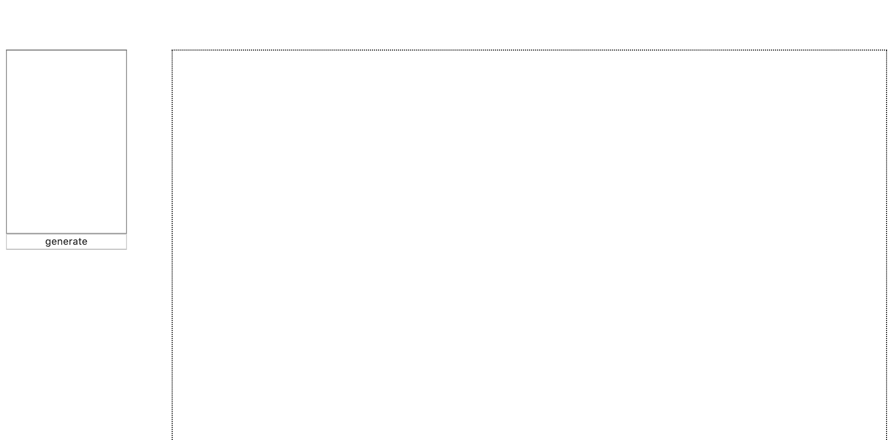


## Parserの作成

頑張ってParserを作ります。いわゆるLL(1)法をやります。
構文解析自体の処理には悩みませんが、データの作り方で少し考えます。

### まずは基本形

まずは構文木を一切作らずに、値を返すだけのParserを作ります。
<a href="https://gist.github.com/draftcode/1357281" target="_blank">構文解析 Howto</a>を参考にしながら作ります。

Parser.jsを作成し、内容を以下のようにします。

```js
class State {
  constructor(str) {
    this.str = str;
    this.i = 0;
  }
  hasNext() {
    return this.i < this.str.length;
  }
  next() {
    this.i++;
  }
  now() {
    return this.str[this.i];
  }
}
 
class Parser {
  constructor() { }
  parse(str) {
    return this.expr(new State(str));
  }
  expr(s) {
    let ret = this.term(s);
    while (s.hasNext()) {
      if (s.now() === '+') {
        s.next();
        ret += this.term(s);
      } else if (s.now() === '-') {
        s.next();
        ret -= this.term(s);
      } else {
        break;
      }
    }
    return ret;
  }
  term(s) {
    let ret = this.fact(s);
    while (s.hasNext()) {
      if (s.now() === '*') {
        s.next();
        ret *= this.fact(s);
      } else if (s.now() === '/') {
        s.next();
        ret /= this.fact(s);
      } else {
        break;
      }
    }
    return ret;
  }
  fact(s) {
    if (s.now() === '(') {
      s.next();
      const ret = this.expr(s);
      s.next();
      return ret;
    } else {
      const ret = this.number(s);
      return ret;
    }
  }
  number(s) {
    let ret = 0;
    while (s.hasNext() && this.isDigit(s.now())) {
      ret *= 10;
      ret += Number(s.now());
      s.next();
    }
    return ret;
  }
  isDigit(c) {
    return !isNaN(c);
  }
}
```

Console上で試して見ましょう。

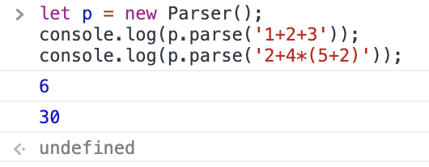

### Parserの改良

木のノードを単なるObjectとして定義してコードを書こうとすると、やりづらいことが分かります(試しに書こうとして見てください)。

木のノードについては、以下の操作をメソッドとして定義すると実装しやすいです。

- ノードに子ノードを追加するメソッド
- ノードにrangeプロパティをセットするメソッド
- ノードにstrプロパティをセットするメソッド

そこで、TreeNodeというクラスをあらかじめ作っておきます。
Parser.jsの内容を以下のようにします。

補足ですが、strはrangeの情報を用いて作成します。rangeはStateの情報を用いて作成します。
文法規則の開始地点を`range[0]`に格納して、文法規則の終了地点を`range[1]`に格納します。
そこで、rangeに関する処理を、TreeNodeのコンストラクタおよびsetStrFromメソッドで行なっています。

また、今回は`+-*/`の演算子や`()`などの記号も木のノードとして追加します。それを簡単に処理するために、新たにopというメソッドを作成しています。

```js
class State {
  constructor(str) {
    this.str = str;
    this.i = 0;
  }
  hasNext() {
    return this.i < this.str.length;
  }
  next() {
    this.i++;
  }
  now() {
    return this.str[this.i];
  }
  substr(s, t) {
    return this.str.slice(s, t);
  }
}

class TreeNode {
  constructor(kind, s) {
    this.kind = kind
    this.value = 0;
    this.str = '';
    this.range = [s.i, -1];
    this.children = [];
  }
  pushChild(child, update) {
    update(this, child);
    this.children.push(child);
  }
  setStrFrom(s) {
    this.range[1] = s.i;
    this.str = s.substr(...this.range);
  }
}


class Parser {
  constructor() { }
  parse(str) {
    return this.expr(new State(str));
  }
  expr(s) {
    const ret = new TreeNode('expr', s);

    ret.pushChild(this.term(s), (ret, child) => {
      ret.value = child.value;
    });
    
    while (s.hasNext()) {
      if (s.now() === '+') {
        ret.pushChild(this.op(s), () => {});
        s.next();
        ret.pushChild(this.term(s), (ret, child) => {
          ret.value += child.value;
        });
      } else if (s.now() === '-') {
        ret.pushChild(this.op(s), () => {});
        s.next();
        ret.pushChild(this.term(s), (ret, child) => {
          ret.value -= child.value;
        });
      } else {
        break;
      }
    }
    ret.setStrFrom(s);
    return ret;
  }
  term(s) {
    const ret = new TreeNode('term', s);

    ret.pushChild(this.fact(s), (ret, child) => {
      ret.value = child.value;
    });

    while (s.hasNext()) {
      if (s.now() === '*') {
        ret.pushChild(this.op(s), () => {});
        s.next();
        ret.pushChild(this.fact(s), (ret, child) => {
          ret.value *= child.value;
        });
      } else if (s.now() === '/') {
        ret.pushChild(this.op(s), () => {});
        s.next();
        ret.pushChild(this.fact(s), (ret, child) => {
          ret.value /= child.value;
        });
      } else {
        break;
      }
    }
    ret.setStrFrom(s);
    return ret;
  }
  fact(s) {
    const ret = new TreeNode('fact', s);

    if (s.now() === '(') {
      ret.pushChild(this.op(s), () => {});
      s.next();
      ret.pushChild(this.expr(s), (ret, child) => {
        ret.value = child.value;
      });
      ret.pushChild(this.op(s), () => {});
      s.next();
      ret.setStrFrom(s);
      return ret;
    } else {
      ret.pushChild(this.number(s), (ret, child) => {
        ret.value = child.value;
      });
      ret.setStrFrom(s);
      return ret;
    }
  }
  number(s) {
    const ret = new TreeNode('number', s);

    while (s.hasNext() && this.isDigit(s.now())) {
      ret.value *= 10;
      ret.value += Number(s.now());
      s.next();
    }
    ret.setStrFrom(s);
    return ret;
  }
  isDigit(c) {
    return !isNaN(c);
  }
  op(s) {
    const ret = new TreeNode('op', s);
    ret.range = [s.i, s.i + 1];
    ret.str = s.now();
    return ret;
  }
}
```

Console上で試して見ましょう。

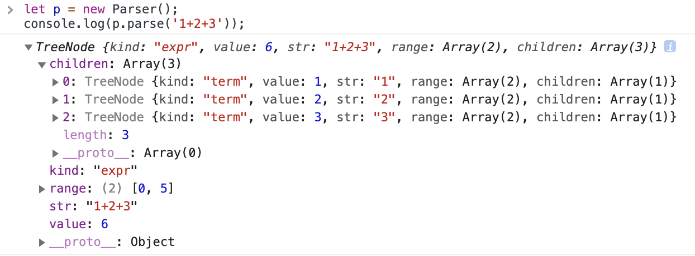

## 寄り道:d3.hierarchyの基本

出力系作成のために、まずd3.hierarchyを学びましょう。
d3.hierarchyは、木構造のデータを扱いやすくするための様々なプロパティ/メソッドを与えてくれます。
d3.treeを使うためには、一旦d3.hierarchyでデータを変換する必要があります。

例えばこんなデータを考えます。

```js
const data =
{ name: 'A',
  children: [
    { name: 'B', children: [ { name: 'D' }, { name: 'E' } ] },
    { name: 'C', children: [ { name: 'F' } ]},
    { name: 'D' }
  ]
}
```

これをd3.hierarchyに投げると、いい感じのデータを返してくれます。
以下の文をscript.jsに追加します。

<div class="note">
補足: d3.hierarchyが返す値は根ノードなので、変数名をrootにしています
</div>

```js
const data =
{ name: 'A',
  children: [
    { name: 'B', children: [ { name: 'D' }, { name: 'E' } ] },
    { name: 'C', children: [ { name: 'F' } ]},
    { name: 'D' }
  ]
}
const root = d3.hierarchy(data)
console.log(root);
```

次のように出力されます。
元データのプロパティはdataプロパティに格納されています。
他にも様々なプロパティが追加されていることが分かります。

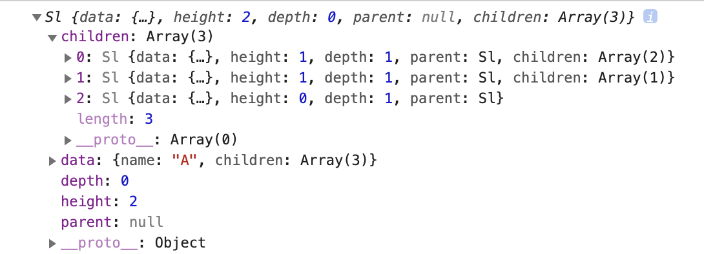

これにより、「今見ているノードがどの深さなのか」「親/子は誰なのか」などの情報が得られるようになります。
他にも、子孫全てのノードを配列の形式で返したり、現在のノードからあるノードまでの最短経路を求めたりできます。
このように様々な便利機能があるのですが、より詳しい情報については<a href="https://github.com/d3/d3-hierarchy" target="_blank">d3-hierarchy</a>を参照してください。

d3.hierarchyによって変換されたデータは、さらに他の変換を経て、様々な図の作成に使われます。
どんな図が作成できるかについても、先のリンクを参照してください。次に紹介するd3.treeもその一つです。

<div class="note">
<h4>d3.stratify</h4>

<p>先ほどのデータ形式は親&rarr;子の関係でしたが、場合によっては親&larr;子の関係で元データが構成されている時もあります。例えば、よく使われるUnionFind木の実装では、</p>

parent[i] = 頂点iの親は誰か 

<p>のようにデータを表現します。またCSVなどの表形式のデータで階層を表現したい場合、「親は誰か」という列を各行に持たせることで実現します。そのようなデータについてはd3.hierarchyでは変換できません。代わりにd3.stratifyを用います。</p>
<p>詳細については<a href="https://github.com/d3/d3-hierarchy#stratify" target="_blank">d3-stratify</a>を参照してください。</p>
</div>

## 寄り道:d3.treeの基本

d3.treeは、木構造データを木として描画するための、様々な情報を与えてくれます。
前項で作成したd3.hierarchyデータを利用して例を挙げます。

script.jsにおいて、前項で書いた文を以下のように変更します。
`const root = ...`の文と`console.log(root)`の間にtreeに関する文を追加します。

```js
const data =
{ name: 'A',
  children: [
    { name: 'B', children: [ { name: 'D' }, { name: 'E' } ] },
    { name: 'C', children: [ { name: 'F' } ]},
    { name: 'D' }
  ]
}
const root = d3.hierarchy(data)

const tree = d3.tree()
  .size([svgWidth, svgHeight]);
tree(root);
console.log(root);
```

root変数にx/yプロパティが追加されていることが確認できます。
これは木のノードの位置を示しています。この情報を用いて、svg領域上に要素を配置していきます。

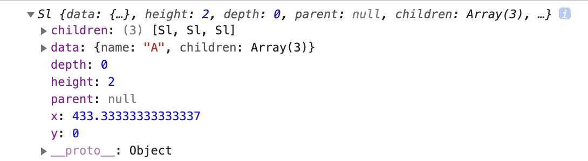

#### tree.size

木の描画領域のサイズを指定します。例では`[svgWidth, svgHeight]`が指定されているので、
svgの描画領域ぴったりに収まるように木が描画されます。

### ノードの描画

試しにこの情報を用いて木のノードを描画して見ましょう。
script.jsに以下の文を追加します。

<div class="note">
<p>この項だけのために書くコードなので、update/enter/exitのことは一切考えず、enterの処理のみで済ませています。</p>
</div>

```js
const g = svg.selectAll('g')
  .data(root.descendants())
  .enter()
  .append('g')
  .attr('transform', d => `translate(${d.x}, ${d.y})`);
g.append('circle')
  .attr('r', 10)
  .attr('fill', 'white')
  .attr('stroke', 'black');
g.append('text')
  .attr('text-anchor', 'middle')
  .attr('dominant-baseline', 'central')
  .text(d => d.data.name);
```

次のように描画されます。円が外にはみ出ていますが、これはtreeのsizeメソッドにおいてぴったり`[svgWidth, svgHeight]`
を設定していたことが原因です。余白padを設定して`[svgWidth-pad, svgHeight-pad]`みたいに設定すれば良いのですが、
そのような細かい設定についてはひとまず省略します。

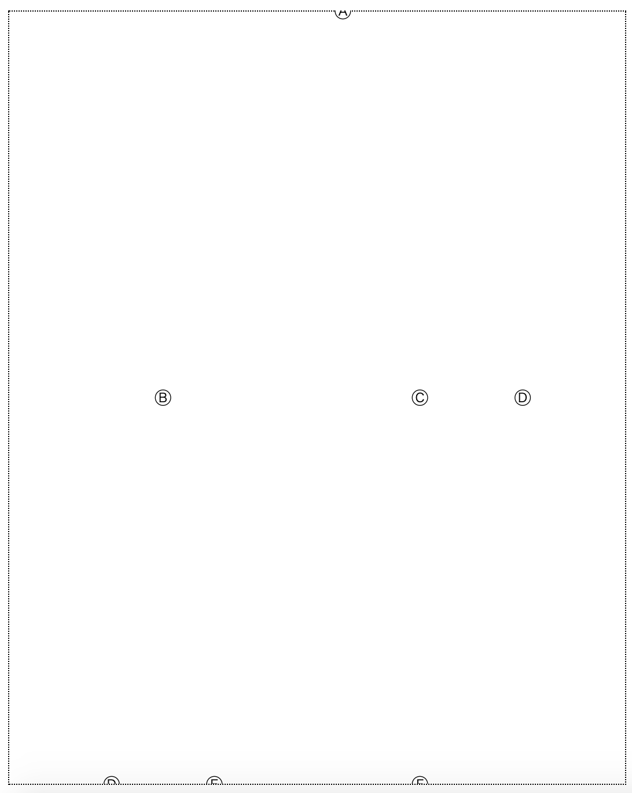

#### hierarchy.descendants

子孫および自分自身のノードを、配列の形式で返します。
Console上で`root.descendants()`を実行してみると、どんな形なのかがわかります。

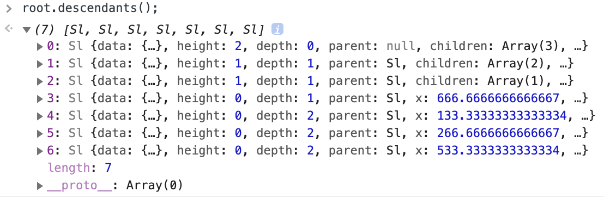

dataメソッドはデータを配列の形で渡さなければならないため、
このような変換が必要になります。

### 辺の描画

script.jsにおいて、変数gの宣言の前に以下の文を追加します。

```js
const path = svg.selectAll('path')
  .data(root.links()) 
  .enter()
  .append('path')
  .attr('fill', 'none')
  .attr('stroke', 'black')
  .attr('d', d => {
    const [sx, sy] = [d.source.x, d.source.y];
    const [tx, ty] = [d.target.x, d.target.y];
    return `M${sx},${sy} L${tx},${ty}`;
  });

const g = svg.selectAll('g')
...
```

次のように描画されます。

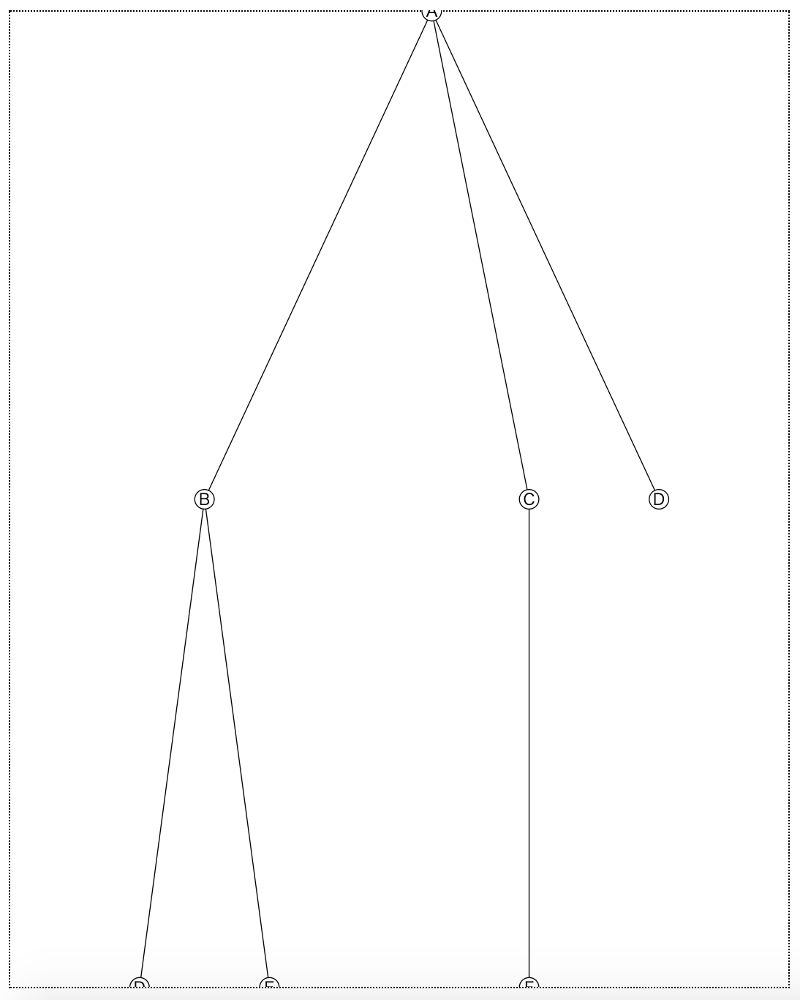

#### hierarchy.links

辺の接続関係を、配列の形式で返します。
Console上で`root.links()`を実行してみると、どんな形なのかがわかります。
sourceとtargetの間に接続関係があることを示しています。

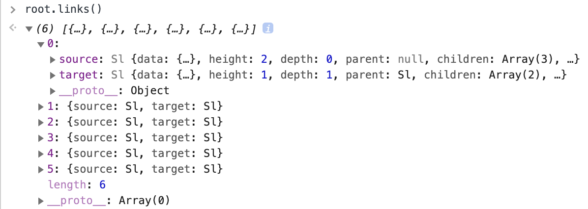

### 辺を曲線にする

d3.linkVerticalという関数を利用すると、辺を曲線にすることができます。
script.jsにおいて、path要素の前にlinkの文を新たに追加します。
さらに、path変数のattrメソッドにおいて、d属性の値をlink関数に任せています。

```js
const link = d3.linkVertical()
  .x(d => d.x)
  .y(d => d.y);
const path = svg.selectAll('path')
  .data(root.links()) 
  .enter()
  .append('path')
  .attr('fill', 'none')
  .attr('stroke', 'black')
  .attr('d', link)
```

次のように描画されます。

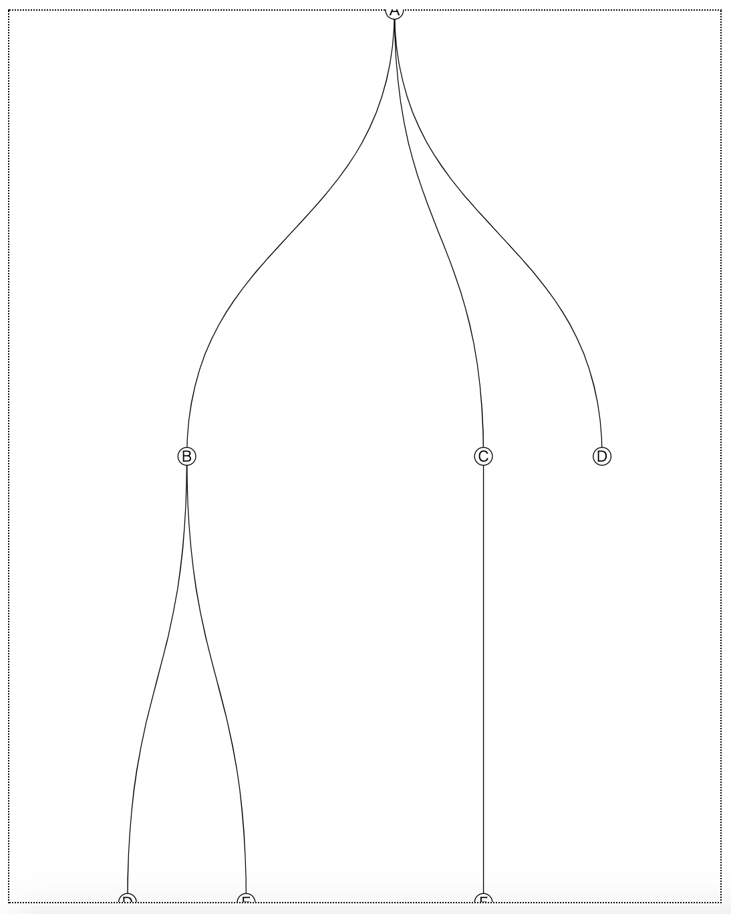

#### d3.linkVertical

辺を曲線で描くための関数を返します。 x/yメソッドにはデータのx/y座標の場所を指定します。また、source/targetメソッドでsource/targetの場所が指定できますが、これはデフォルトで「source/targetプロパティを探す」ことになっているので、ここでは指定しません。

こうしてできたlink関数の接続関係のデータを与えると、pathのd要素を文字列として返してきます。

<div class="note">
<h4>横向きの木を描画したい場合</h4>
<p>d3.treeは縦向きの木の位置座標を返します。なのでもし横向きに描画したいなら、xをyとして、yをxとみなしてコードを書きます。曲線の辺を描きたいなら、d3.linkVerticalの代わりに<b>d3.linkHorizontal</b>を用います。</p>
</div>

## 出力系の作成

さてscript.jsにおいて、**今まで書いてきた内容は全て無くします**。

script.jsの先頭を以下の内容にします。
- 木構造の描画範囲の余白をsvgPadとします。
- ノードは四角形で表示し、その領域の余白をrectPadとします。

```js
const [svgWidth, svgHeight] = [800, 1000];
const svg = d3.select('svg')
  .attr('width', svgWidth)
  .attr('height', svgHeight);
const svgPad = 50;
const rectPad = 10;
const linksGroup = svg.append('g')
  .attr('transform', `translate(${svgPad}, ${svgPad})`);
const nodesGroup = svg.append('g')
  .attr('transform', `translate(${svgPad}, ${svgPad})`);
```

さらに木構造を描画する関数updateを追加します。
- テキスト要素が改行されるように、少し巧妙な工夫をします(後で説明します)。

```js
const update = (data) => {
  const root = d3.hierarchy(data);
  const tree = d3.tree()
    .size([svgWidth-2*svgPad, svgHeight-2*svgPad]);
  tree(root);

  const node = nodesGroup.selectAll('g')
    .data(root.descendants());
  node.exit().remove();
  const nodeEnter = node.enter()
    .append('g');
  nodeEnter.append('rect');
  nodeEnter.append('text');
  
  const nodeMerge = nodeEnter.merge(node)
    .attr('transform', d => `translate(${d.x}, ${d.y})`);
  nodeMerge.select('rect')
    .attr('fill', d => d.data.kind === 'op' ? 'lightgray' : 'white')
    .attr('stroke', 'black');

  const tspan = nodeMerge.select('text')
    .selectAll('tspan')
    .data(d => {
      if (d.data.kind === 'op') return  [d.data.kind, d.data.str]
      else return [d.data.kind, d.data.str, d.data.value];
    });
  tspan.exit().remove();
  tspan.enter()
    .append('tspan')
    .merge(tspan)
    .attr('text-anchor', 'middle')
    .attr('x', 0)
    .attr('dy', '1em')
    .attr('y', (d, i) => `${1.5*i}em`)
    .text(d => d);

  nodeMerge.each((d, i, node) => {
    const bbox = d3.select(node[i])
      .select('text')
      .node()
      .getBBox();
    const width = bbox.width + 2*rectPad;
    const height = bbox.height + 2*rectPad;
    d3.select(node[i])
      .select('text')
      .attr('transform', `translate(0, ${-bbox.height/2})`);
    d3.select(node[i])
      .select('rect')
      .attr('x', -width/2)
      .attr('y', -height/2)
      .attr('width', width)
      .attr('height', height);
  });

  const link = linksGroup.selectAll('path')
    .data(root.links());
  link.exit().remove()
  const linkEnter = link.enter()
    .append('path');
  const linkMerge = linkEnter.merge(link);
  linkMerge.attr('fill', 'none')
    .attr('stroke', 'black')
    .attr('d', d3.linkVertical()
      .x(d => d.x)
      .y(d => d.y));
};
```

さらに、テスト用の処理をupdate関数の直後に書きます。

```js
const p = new Parser();
console.log(p.parse('(12/3)+4*(5+2)'));
update(p.parse('(12/3)+4*(5+2)'));
```

index.htmlを開くと、次のように表示されます。

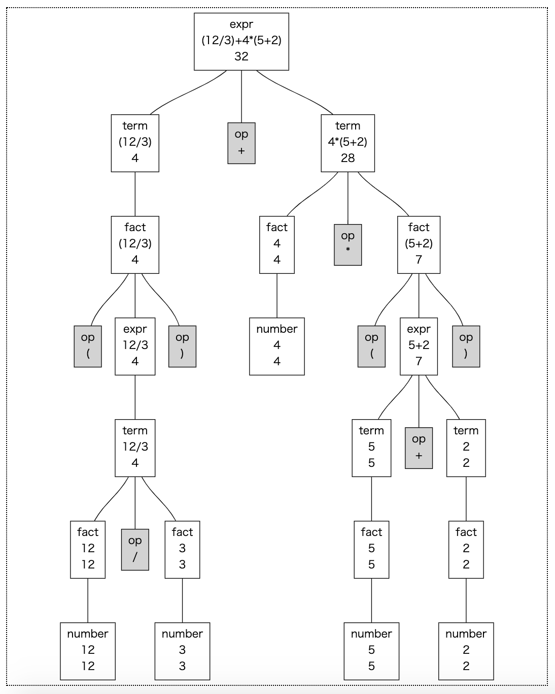

#### テキストの改行

テキストを改行する仕組みはsvgに備わっていません。改行しているように見せるためには、テキストのy属性をうまく調整します。その処理は以下の部分で行なっています。

tspanはtext要素の内部に書く要素です。tspanを用いて、「1つ目のtspanのy座標は0em、2つ目のtspanのy座標は1em、&hellip;」のように設定すると、改行しているように見せることができます。ただし1em単位だと文字が詰まりすぎるので、1.5em単位にすることで行同士に余白を持たせています。

dy属性は中央配置のための微調整です。

```js
const tspan = nodeMerge.select('text')
  .selectAll('tspan')
  .data(d => {
    if (d.data.kind === 'op') return  [d.data.kind, d.data.str]
    else return [d.data.kind, d.data.str, d.data.value];
  });
tspan.enter()
  .append('tspan')
  .merge(tspan)
  .attr('text-anchor', 'middle')
  .attr('x', 0)
  .attr('dy', '1em')
  .attr('y', (d, i) => `${1.5*i}em`)
  .text(d => d);
```

#### rectのサイズと位置

rectのサイズと位置は以下のコードで行なっています。
getBBoxについてはPart03で出てきました。要素のサイズを取得するメソッドです。
このbboxで得られた幅/高さに余白を加えたものをwitdh/heightとし、rect属性に指定しています。

selection.eachメソッドは、ArrayのforEachメソッドのselection版です。

```js
nodeMerge.each((d, i, node) => {
  const bbox = d3.select(node[i])
    .select('text')
    .node()
    .getBBox();
  const width = bbox.width + 2*rectPad;
  const height = bbox.height + 2*rectPad;
  d3.select(node[i])
    .select('text')
    .attr('transform', `translate(0, ${-bbox.height/2})`);
  d3.select(node[i])
    .select('rect')
    .attr('x', -width/2)
    .attr('y', -height/2)
    .attr('width', width)
    .attr('height', height);
});
```

## 入力部分の作成

続いて入力部分を作成します。
script.jsのに以下の記述を追加します。

```js
d3.select('#gen_btn')
  .on('click', () => {
    const input = d3.select('textarea').property('value');
    update(p.parse(input));
  });
```

index.htmlにて、textareaに数式を入力してgenerateボタンを押すと、その数式通りの木が描画されます。

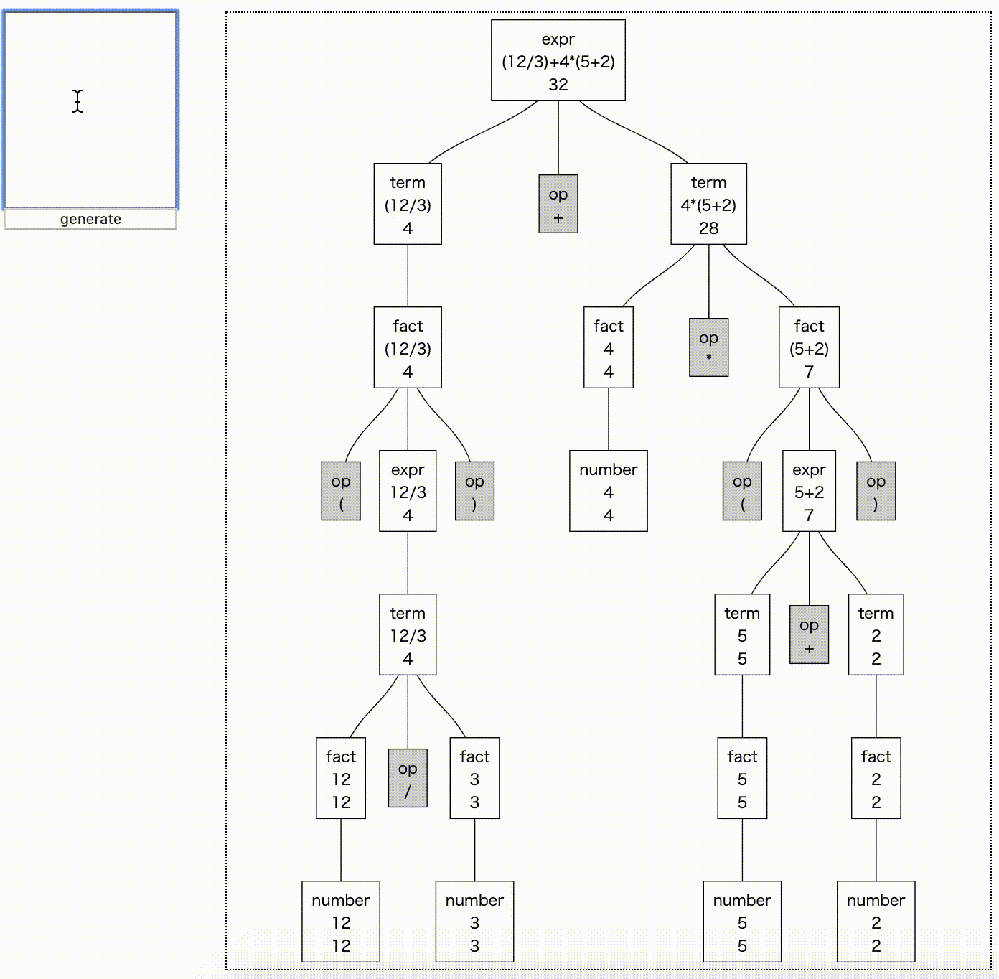

## まとめ

d3.hierarchyとd3.treeの使い方を学び、構文解析木の可視化を行いました。
構文木の作り方、またrectとtext要素の扱いが少し難しかったと思います。
