# D3.js Part06 Force Simulation

d3.forceSimulationを用いると、グラフをぬるぬる動かすことができます。このチュートリアルでは、d3.forceSimulationの使い方を学んだ後、UnionFind木の可視化を行います。

## テンプレ作成

index.htmlを作成し、内容を以下の通りにします。

```html
<!DOCTYPE html>
<html lang="ja">
  <head>
    <meta charset="utf-8">
    <link rel="stylesheet" href="style.css">
  </head>
  <body>
    <div class="main-container">
      <div class="menu">
      </div>
      <div class="main">
        <svg>
        </svg>
      </div>
    </div>
    <script src="https://d3js.org/d3.v5.min.js"></script>
    <script src="Parser.js"></script>
    <script src="script.js"></script>
  </body>
</html>
```

style.cssを作成し、内容を以下の通りにします。

```css
@charset "utf-8";

.main-container {
  display: flex;
  flex-direction: row;
}

.menu {
  display: flex;
  flex-direction: column;
  margin: 50px 0 0 0;
}

svg {
  border: 1px dotted #000;
  margin: 50px 0 0 50px;
}
```

script.jsを作成し、内容は以下のようにします。

```js
const [svgWidth, svgHeight] = [300, 300];
const svg = d3.select('svg')
  .attr('width', svgWidth)
  .attr('height', svgHeight);
```

## 基本01: d3.forceSimulationの基本

d3.forceSimulationは、力学モデルというアルゴリズムでグラフを描画します。力学モデルでは、点を電荷、辺をバネに見立てて、その運動をシミュレートします。電荷とばねの力をいい感じに設定することで、いい感じのグラフが描画できます。

d3.forceSimulationでやることは、大まかに分けると次の3つです。
こちらが用意するデータは**node(点)**と**link(辺)**です。

- d3.forceSimulation作成し力の設定をする
- nodeをd3.forceSimulationに結びつける
- nodeとlinkの情報をもとにsvg描画

### データ用意

script.jsに以下の内容を追加します。
nodesとlinksを用意します。nodesのプロパティはどんな形でも良いですが、何かしらの識別子をプロパティに設定した方が良いと思います。今回の場合idを識別子にしています。
<div class="note">
<p>d3.forceSimulationで結びつけられた際に勝手にindexプロパティが付加されるので、それを識別子とみなすことも可能です。</p>
</div>

sourceとtargetにはノードの識別子を指定します。もし有向辺を描きたいなら、sourceには始点、targetには終点を指定するのが普通です。無向辺ならどっちでもいいです。

```js
const nodes = [
  { id: 'A' },
  { id: 'B' },
  { id: 'C' },
];

const links = [
  { source: 'A', target: 'B' },
  { source: 'B', target: 'C' },
  { source: 'C', target: 'A' },
];
```

### d3.forceSimulation作成

まずはd3.forceSimulationを作成し、それにnodeとlinkの情報を結びつけます。
script.jsに以下の内容を追加します。

```js
const simulation = d3.forceSimulation(nodes)
  .force('link', d3.forceLink(links).id(d => d.id));
```

この時点でindex.htmlを開き、Console上でnodesとlinksの値を確認してみましょう。

nodesについては、以下のプロパティが追加されています。
- index: nodeが配列で何番目なのか
- x/y: x/y座標
- vx/vy: x方向/y方向の速度
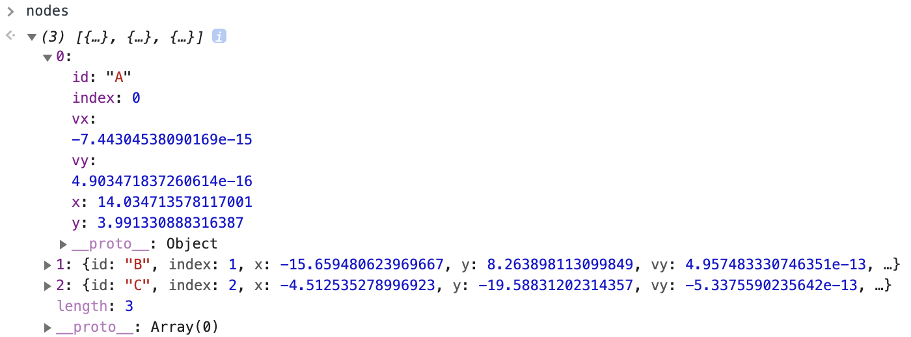

linksについては、以下のプロパティが追加されています。
- index: linksが配列で何番目なのか

また、**sourceとtargetがnodeの識別子名ではなくnodeそのものに置き換わっています。**

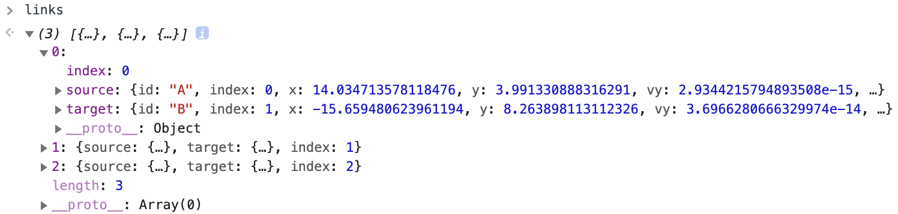

#### d3.forceSimulation

力学モデルによるシミュレーションを管理するためのObjectを返します。
この中にある様々なメソッドを利用して、シミュレーションの設定を行います。
forceSimulationの引数にノードの配列を指定すると、これらがsimulationの対象となります。

<div class="note">
<h4>ノードの設定</h4>
<p>ノードの設定は次のように、simulation.nodesというメソッドで行うこともできます。</p>
simulation.nodes(nodes)
<p>このメソッドは、ノードの追加や削除をした場合に呼び出します。</p>
</div>

#### simulation.force

力の設定をするメソッドです。第1引数には力の名前を、第2引数には力を指定します。力の名前は単なる識別子なので、なんでも構いません。D3.jsにおいて、力は「座標や速度を更新するための関数」として定義されています。力には様々なものがありますが、その一部について後で紹介します。

#### d3.linkForce

辺で繋がった物体同士の力を返します。いわゆるバネの力を設定します。引数には辺の配列を指定します。

辺の配列の各要素は`{ source, target }`である必要があります。もしsource/targetがObjectでない場合はその部分を識別子とみなし、勝手に対応するノードへの参照に置き換えます。

idというメソッドを利用して、ノードの識別子の場所を伝えます。

distanceというメソッドを設定すると、バネの自然長を設定できます。distanceのデフォルトは30です。例えば次のように設定します。

```js
const simulation = d3.simulation(nodes)
  .force('link', d3.forceLink(links).id(d => d.id).distance(20));
```

<div class="note">
<h4>辺の設定</h4>
<p>辺の設定は次のように、forceLink.linksというメソッドで行うこともできます。</p>
const forceLink = d3.forceLink();
forceLink.links(links);
<p>このメソッドは、辺の追加や削除をした場合に呼び出します。</p>
</div>

### 描画する

描画のための様々な処理を書きます。関数名は以下のようにします。

- init: 点と辺をそれぞれcircle、pathとして、とりあえず配置だけ行う
- tick: 点と辺の位置を設定する。後でsimulationのイベントリスナーとして指定する

script.jsにおいて、simulationの宣言前にlinkGroup/nodeGroup/init/tickを指定します。
さらにsimulationについて新たにonメソッドを指定します。

```js
const linksGroup = svg.append('g');
const nodesGroup = svg.append('g');
const init = () => {
  const nodeGroup = nodesGroup.selectAll('g')
    .data(nodes)
    .enter()
    .append('g');
  nodeGroup.append('circle')
    .attr('r', 10)
    .attr('fill', 'white')
    .attr('stroke', 'black');
  nodeGroup.append('text')
    .attr('text-anchor', 'middle')
    .attr('dominant-baseline', 'central')
    .text(d => d.id);

  const linkGroup = linksGroup.selectAll('path')
    .data(links)
    .enter()
    .append('path');
  linkGroup.attr('fill', 'none')
    .attr('stroke', 'black')
}
const ticked = () => {
  nodesGroup.selectAll('g')
    .attr('transform', d => `translate(${d.x}, ${d.y})`);
  linksGroup.selectAll('path')
    .attr('d', d => {
      return `M${d.source.x},${d.source.y} L${d.target.x},${d.target.y}`;
    });
};

const simulation = d3.forceSimulation(nodes)
  .force('link', d3.forceLink(links).id(d => d.id))
  .on('tick', ticked);
init();
```

#### simulation.on

simulationのイベントリスナーを指定します。以下の2つの値が設定できます。

- tick: 1単位時間が経過した時に呼び出される
- end: ある程度状態が収束し、simulationが停止した時に呼び出される(厳密には、simulationの内部変数alphaが0になった時)

さて実際にindex.htmlを開き直してみますが、一瞬動くだけでほとんど変化はありません。

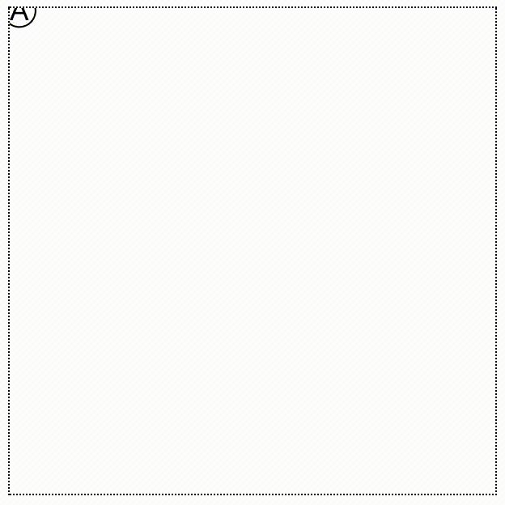

### 中央配置

とりあえず物体を中央に配置します。
script.jsにおいて、simulationの定義を以下のようにします。

```js
const simulation = d3.forceSimulation(nodes)
  .force('link', d3.forceLink(links).id(d => d.id))
  .force('center', d3.forceCenter(svgWidth/2, svgHeight/2))
  .on('tick', ticked);
```

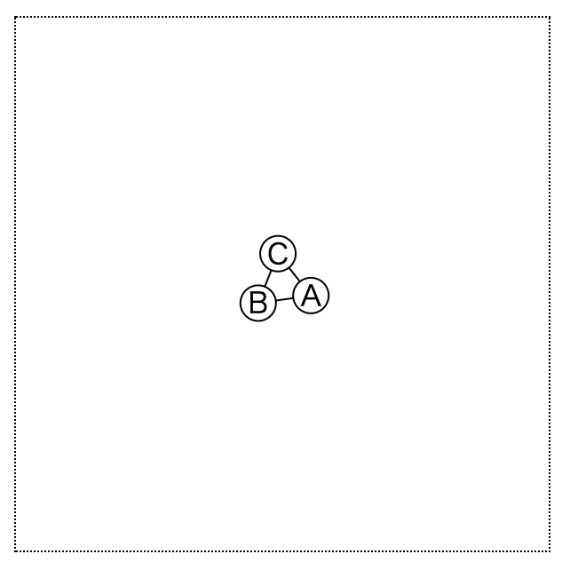

#### d3.forceCenter

第1引数、第2引数にはそれぞれx座標、y座標を指定します。厳密には力ではなく、「全ノードの重心が指定された(x,y)になるように座標変換を行う関数」のようです(<a href="https://github.com/d3/d3-force#centering" target="_blank">Centering - d3-force</a>を参照)

### 中央に力を入れる

script.jsにおいて、simulationの定義を以下のようにします。

```js
const simulation = d3.forceSimulation(nodes)
  .force('link', d3.forceLink(links).id(d => d.id))
  .force('forceX', d3.forceX(svgWidth/2))
  .force('forceY', d3.forceY(svgHeight/2))
  .on('tick', ticked);
```

ノードは初め原点にありましたが、中央に力が働いて移動します。

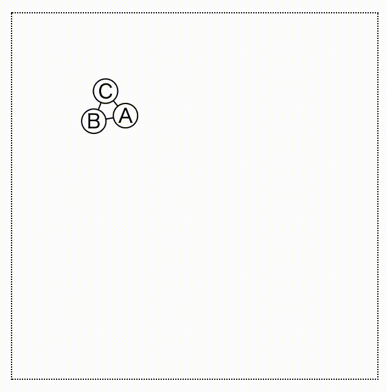

#### d3.forceX/forceY

- d3.forceX: 引数に指定されたx座標に向けて力が働くようになります。
- d3.forceY: 引数に指定されたy座標に向けて力が働くようになります。

### 反発力の設定

ノード同士に働く力を設定しましょう。script.jsにおいて、simulationの定義を以下のようにします。

```js
const simulation = d3.forceSimulation(nodes)
  .force('link', d3.forceLink(links).id(d => d.id))
  .force('forceX', d3.forceX(svgWidth/2))
  .force('forceY', d3.forceY(svgHeight/2))
  .force('charge', d3.forceManyBody().strength(-200))
  .on('tick', ticked);
```

ノード同士の間隔が少しだけ広くなります。

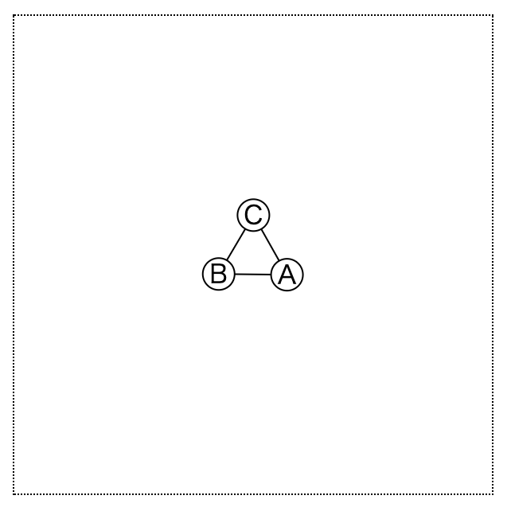

#### d3.forceManyBody

ノード同士に働く力を返します。

strengthメソッドで力を調整します。strengthのデフォルトは-30で、負数だとノード同士には斥力が働きます。正数だとノード同士に引力が働きます。

### タイマーとalpha

d3.forceSimulationでは、内部タイマーが設定されています。このタイマーは常に動作しているわけではなく、ある程度の時間が経過すると停止するようになっています。これらは、alpha/alphaTarget/alphaDecay/alphaMinという4つの値で制御されています。

d3.forceSimulationは次の処理を行います。
- タイマーのステップごとに、以下の更新処理を行います。
```js
alpha += (alphaTarget - alpha) * alphaDecay;
```
alphaDecayは、alphaの減衰の程度を設定する係数です。
alphaTargetは、alphaが最終的に収束する値です。
(alphaTarget - alpha)とは、alphaからalphaTargetへのベクトルと捉えるとわかりやすいかもしれません。
このベクトルの方向に進むわけですから、徐々にalphaTargetという値に近づいていくわけですね。
- もしalpha &lt; alphaMinなら、タイマーは停止します。
  従って、もしalphaTargetの値がalphaMinより大きかったら、タイマーは停止しません(このことを後の項で利用します)。

初期値は以下の通りです。これらの値はsimulation.alpha、simulation.alphaTarget、などのメソッドで変更できます。
- alpha = 1
- alphaTarget = 0
- alphaMin = 0.001
- alphaDecay = 0.0228... (300ステップでタイマーが停止するような値らしいです)

「なぜこんな小難しい式を使うんだ」と思うかもしれません。これは恐らく、このalphaを力の関数で利用しているためです。実際、<a href="https://github.com/d3/d3-force/blob/master/src/x.js" target="_blank">d3.forceXのソースコード</a>の13行目で、alphaをノードの速度制御のために利用しています。

## 基本02: グラフのドラッグ

### node.fx/node.fy

ドラッグに必要となる概念です。ノードにfx,fyプロパティが設定され、その値がnullでなければ、そのノードは座標は(fx, fy)に固定されます。

script.jsにおいて、simulationとinitの間に記述を追加します。

```js
const simulation = d3.forceSimulation(nodes)
  ...
  .on('tick', ticked);
nodes[0].fx = svgWidth;
nodes[0].fy = svgHeight;
init();
```

node[0]の座標が右下に固定されます。

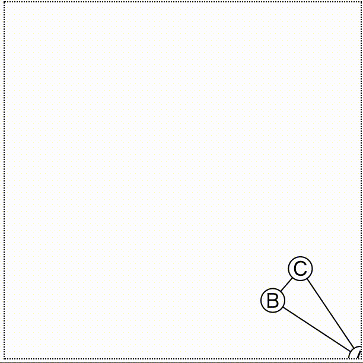

### d3.drag

script.jsにおいて、nodesとlinksの宣言の後の記述を以下の通りにします。

init関数において、nodeGroup.callというメソッドの記述を追加します。
さらに、dragstarted/dragged/dragendedという関数を追加します。

```js
const linksGroup = svg.append('g');
const nodesGroup = svg.append('g');
const init = () => {
  ...
  nodeGroup.append('text')
    ...
    .text(d => d.id);
  nodeGroup.call(d3.drag()
      .on('start', dragstarted)
      .on('drag', dragged)
      .on('end', dragended));
  ...
}

const dragstarted = (d) => {
  if (!d3.event.active) simulation.alphaTarget(0.3).restart();
  d.fx = d.x;
  d.fy = d.y;
};
const dragged = (d) => {
  d.fx = d3.event.x;
  d.fy = d3.event.y;
};
const dragended = (d) => {
  if (!d3.event.active) simulation.alphaTarget(0);
  d.x = d.fx;
  d.y = d.fy;
  d.fx = null
  d.fy = null;
};

const ticked = () => {
  ...
};

const simulation = d3.forceSimulation(nodes)
...
```

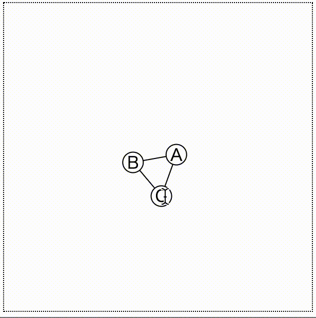

### d3.drag

ドラッグを制御するための便利な機能を提供してくれる関数です。PCだけでなくスマホやタブレット端末の操作にも対応しています。

onメソッドを用いてイベントリスナーを指定します。
- start: ドラッグが開始された時に呼ばれるイベント
- drag: ドラッグ中に呼ばれるイベント
- end: ドラッグ終了時に呼ばれるイベント

#### dragstarted関数の処理

(fx,fy) = (x,y)を指定することで、固定座標を現在の座標に初期化しています。

最初の行のd3.event.activeは、現在ドラッグされている要素の数を返します(マウスだと1つしかありませんが、スマホやタブレットだと2個以上の可能性があります)。それが0だった場合にif文の中身が実行されます。

simulation.restart()とは、停止されたタイマーを再稼働させるメソッドです。alphaTargetを0.3にしているため、ドラッグが開始したらタイマーは停止しません(なぜならalphaMinは0.01だからです)。

```js
const dragstarted = (d) => {
  if (!d3.event.active) simulation.alphaTarget(0.3).restart();
  d.fx = d.x;
  d.fy = d.y;
};
```

#### dragged関数の処理

マウスの座標を(fx,fy)に設定することで、ノードをマウスに追従させます。

```js
const dragged = (d) => {
  d.fx = d3.event.x;
  d.fy = d3.event.y;
};
```

#### dragended関数の処理

alphaTargetの値を0に戻します。そして(x,y)を(fx,fy)に変更します。(fx,fy)にnullを指定することで、固定を解除します。

```js
const dragended = (d) => {
  if (!d3.event.active) simulation.alphaTarget(0);
  d.x = d.fx;
  d.y = d.fy;
  d.fx = null
  d.fy = null;
};
```

## 基本03: グラフデータの結び直し

ここでは、「新たにノードDを足して、AとBをそれにつなげる」ことを考えてみましょう。以下の記述をConsole上に入力します。

```js
nodes.push({ id: 'D' });
links.push({ source: 'A', target: 'D' });
links.push({ source: 'B', target: 'D' });
simulation.nodes(nodes);
simulation.force('link').links(links);
init();
simulation.alpha(1).restart();
```

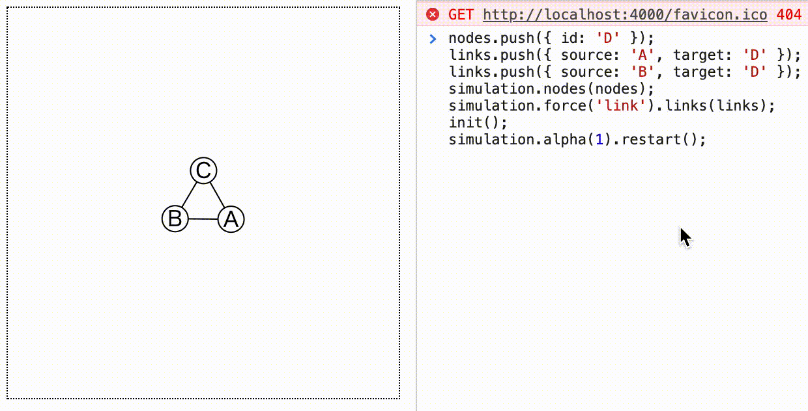

#### simulation.nodes

simulationにノードの配列を割り当てるメソッドです。d3.forceSimulationの引数からも指定できます。
このように、ノードが追加されたり削除されたりする時に呼び出します。

#### forceLink.links

simulationに辺の配列を割り当てるメソッドです。d3.forceLinkの引数からも指定できます。
このように、辺が追加されたり削除されたりする時に呼び出します。

またsimulation.forceは、第2引数を指定しなかった場合、第1引数で割り当てられた名前の力自身を返す仕様になっています。よって、`simulation('link')`はforceLinkを返します。

#### simulation.alpha

alphaの値をセットします。今回の場合は1をセットしているため、alphaを初期値に戻してからタイマーを再稼働させていることになります。

### データの削除への対応

init関数では、selectionのenterのみにしか対応していませんでした。データが削除された場合に対応するためには、当然exitのことも考えなければなりません。

以下のようにinit関数を書き換えればよいです。

```js
const init = () => {
  const nodeGroup = nodesGroup.selectAll('g')
    .data(nodes);
  nodeGroup.exit().remove();
  const nodeGroupEnter = nodeGroup.enter()
    .append('g');
  nodeGroupEnter.append('circle')
    .attr('r', 10)
    .attr('fill', 'white')
    .attr('stroke', 'black');
  nodeGroupEnter.append('text')
    .attr('text-anchor', 'middle')
    .attr('dominant-baseline', 'central')
    .text(d => d.id);
  nodeGroupEnter.call(d3.drag()
      .on('start', dragstarted)
      .on('drag', dragged)
      .on('end', dragended));

  const linkGroup = linksGroup.selectAll('path')
    .data(links);
  linkGroup.exit().remove();
  linkGroup.enter()
    .append('path')
    .attr('fill', 'none')
    .attr('stroke', 'black')
}
```

## 基本04: 有向グラフにする

有向グラフを描くためには、以下の2つを考えなければなりません。

1. marker要素の作成
2. markerとノードの重なり対策

### marker要素の作成

<a href="http://localhost:4000/lec_svg/#step07-矢印">SVGチュートリアルのStep07</a>を元に要素を作成します。

svg変数宣言の直後に以下の内容を追加します。
defs要素、marker要素、path要素を作成しています。

```js
const svg = d3.select('svg')
  .attr('width', svgWidth)
  .attr('height', svgHeight);
svg.append('defs')
  .append('marker')
  .attr('id', 'arr')
  .attr('markerUnits', 'strokeWidth')
  .attr('markerWidth', 10)
  .attr('markerHeight', 10)
  .attr('orient', 'auto')
  .attr('refX', 2)
  .attr('refY', 0.5)
  .attr('viewBox', '0 0 1 1')
  .append('path')
  .attr('stroke', 'none')
  .attr('fill', '#000')
  .attr('d', 'M0,0 L1,0.5 0,1');
```

### 重なり防止

<a href="http://localhost:4000/lec_svg/#step08-重なりを解決">SVGチュートリアルのStep08</a>の2つ目の方法を採用します。

tickedメソッドを以下のように変更します。path要素にmarker-endとstroke-dasharray属性を追加しています。stroke-dasharrayでは、先のリンク先の計算を行っています。

```js
const ticked = () => {
  nodesGroup.selectAll('g')
    .attr('transform', d => `translate(${d.x}, ${d.y})`);
  linksGroup.selectAll('path')
    .attr('d', d => {
      return `M${d.source.x},${d.source.y} L${d.target.x},${d.target.y}`;
    })
    .attr('marker-end', 'url(#arr)')
    .attr('stroke-dasharray', d => {
      const R = 10;
      const W = 10;
      const [sx, sy] = [d.source.x, d.source.y];
      const [tx, ty] = [d.target.x, d.target.y];
      const D = Math.sqrt((tx-sx)*(tx-sx) + (ty-sy)*(ty-sy));
      const DD = D - 2*R - W;
      return `0 ${R} ${DD} ${W + R}`;
    });
};
```

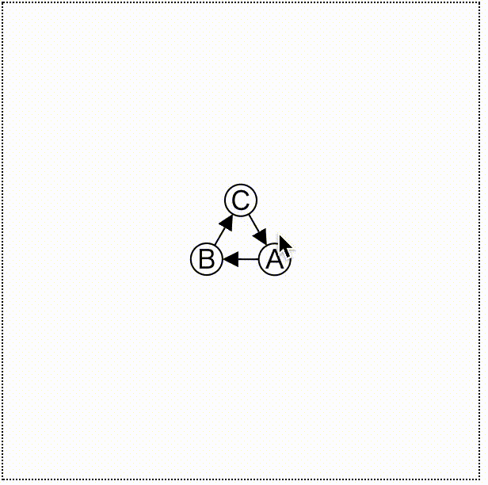

「重なり防止だけじゃなく、辺とノードにもう少し間隔を空けたいんだけど&hellip;」という場合、refXとstroke-dasharrayを若干修正します。例えば、refXを2.2、stroke-dasharrayを`0 ${R+3} ${DD-6} ${3+W+R}`とすると、次のように間隔が空きます。

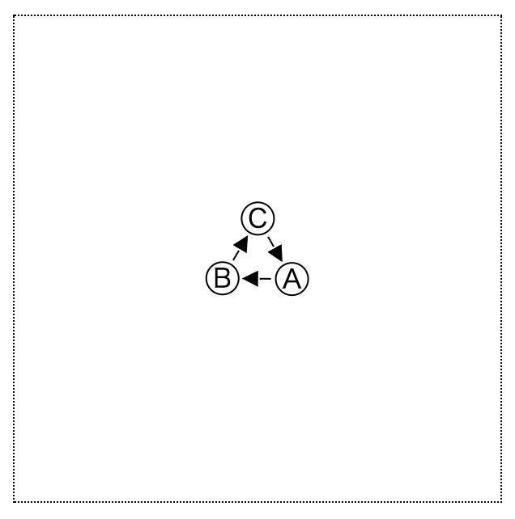

## ここまでのscript.js

```js
const [svgWidth, svgHeight] = [300, 300];
const svg = d3.select('svg')
  .attr('width', svgWidth)
  .attr('height', svgHeight);
svg.append('defs')
  .append('marker')
  .attr('id', 'arr')
  .attr('markerUnits', 'strokeWidth')
  .attr('markerWidth', 10)
  .attr('markerHeight', 10)
  .attr('orient', 'auto')
  .attr('refX', 2.2)
  .attr('refY', 0.5)
  .attr('viewBox', '0 0 1 1')
  .append('path')
  .attr('stroke', 'none')
  .attr('fill', '#000')
  .attr('d', 'M0,0 L1,0.5 0,1');

const nodes = [
  { id: 'A' },
  { id: 'B' },
  { id: 'C' },
];

const links = [
  { source: 'A', target: 'B' },
  { source: 'B', target: 'C' },
  { source: 'C', target: 'A' },
];

const linksGroup = svg.append('g');
const nodesGroup = svg.append('g');
const init = () => {
  const nodeGroup = nodesGroup.selectAll('g')
    .data(nodes);
  nodeGroup.exit().remove();
  const nodeGroupEnter = nodeGroup.enter()
    .append('g');
  nodeGroupEnter.append('circle')
    .attr('r', 10)
    .attr('fill', 'white')
    .attr('stroke', 'black');
  nodeGroupEnter.append('text')
    .attr('text-anchor', 'middle')
    .attr('dominant-baseline', 'central')
    .text(d => d.id);
  nodeGroupEnter.call(d3.drag()
      .on('start', dragstarted)
      .on('drag', dragged)
      .on('end', dragended));

  const linkGroup = linksGroup.selectAll('path')
    .data(links);
  linkGroup.exit().remove();
  linkGroup.enter()
    .append('path')
    .attr('fill', 'none')
    .attr('stroke', 'black')
}

const dragstarted = (d) => {
  if (!d3.event.active) simulation.alphaTarget(0.3).restart();
  d.fx = d.x;
  d.fy = d.y;
};
const dragged = (d) => {
  d.fx = d3.event.x;
  d.fy = d3.event.y;
};
const dragended = (d) => {
  if (!d3.event.active) simulation.alphaTarget(0).restart();
  d.x = d.fx;
  d.y = d.fy;
  d.fx = null
  d.fy = null;
};

const ticked = () => {
  nodesGroup.selectAll('g')
    .attr('transform', d => `translate(${d.x}, ${d.y})`);
  linksGroup.selectAll('path')
    .attr('d', d => {
      return `M${d.source.x},${d.source.y} L${d.target.x},${d.target.y}`;
    })
    .attr('marker-end', 'url(#arr)')
    .attr('stroke-dasharray', d => {
      const R = 10;
      const W = 10;
      const [sx, sy] = [d.source.x, d.source.y];
      const [tx, ty] = [d.target.x, d.target.y];
      const D = Math.sqrt((tx-sx)*(tx-sx) + (ty-sy)*(ty-sy));
      const DD = D - 2*R - W;
      return `0 ${R+3} ${DD-6} ${3+W+R}`;
    });
};

const simulation = d3.forceSimulation(nodes)
  .force('link', d3.forceLink(links).id(d => d.id))
  .force('forceX', d3.forceX(svgWidth/2))
  .force('forceY', d3.forceY(svgHeight/2))
  .force('charge', d3.forceManyBody().strength(-200))
  .on('tick', ticked)
init();js
```

## どんなものを作る?

ようやく本題に参ります。作るものはUnionFind木の可視化です。

- テキストエリアに命令列を入力します。書式は<a href="http://judge.u-aizu.ac.jp/onlinejudge/description.jsp?id=DSL_1_A&lang=jp" target="_blank">AOJDSL_1_A</a>に従うものとします。
- loadボタンを押すと命令列が取り込まれ、stepボタンを押すと命令を順に実行し、画面上のUnionFind木が変化します。
- same命令の実行結果などを返すメッセージエリアを作ります。
- 命令を一定間隔で実行するボタンplayと、停止ボタンstopを作ります。

## HTML/CSSの作成

index.htmlを以下のようにします。ボタンやtextareaを作成します。コマンド列の表じはulで管理します。
命令列の管理のために、Iterator.jsをscriptタグに追加します。

```html
<!DOCTYPE html>
<html lang="ja">
  <head>
    <meta charset="utf-8">
    <link rel="stylesheet" href="style.css">
  </head>
  <body>
    <div class="main-container">
      <div class="menu">
        <textarea></textarea>
        <input id="load_btn" type="button" value="load">
        <input id="step_btn" type="button" value="step">
        <div class="player">
          <input id="play_btn" type="button" value="play">
          <input id="stop_btn" type="button" value="stop">
        </div>
        <p id="cmd_msg">Message</p>
        <ul id="cmd_info">
        </ul>
      </div>
      <div class="main">
        <svg>
        </svg>
      </div>
    </div>
    <script src="https://d3js.org/d3.v5.min.js"></script>
    <script src="UnionFind.js"></script>
    <script src="script.js"></script>
  </body>
</html>
```

style.cssを以下のようにします。

```css
@charset "utf-8";

.main-container {
  display: flex;
  flex-direction: row;
}

.menu {
  display: flex;
  flex-direction: column;
  margin: 50px 0 0 0;
}

.player {
  display: flex;
  flex-direction: row;
}
.player input {
  width: 50%;
}
textarea {
  resize: none;
  height: 200px;
}

p {
  margin: 10px 0 0 0;
  padding: 0;
}
ul {
  margin: 0;
  padding: 0;
  list-style-type: none;
}
li {
  text-align: center;
}

svg {
  border: 1px dotted #000;
  margin: 50px 0 0 50px;
}

```

## データの表現

### UnionFind木のデータ表現

ランクを用いたUnionFind木を実装します。データは次の2点です。

- `par[i] = iの親は誰か`
- `rank[i] = iのランク`


### 出力系のデータ表現

今まで見てきた通り、必要なのはnodeの配列とlinkの配列です。

### 出力変換器の作成

script.jsに以下の記述を追加します。
UnionFind木の情報を元に、グラフのnodeとlinkを作成する関数は次のように書けます。

```js
const formatData = (uf) => {
  const nodes = [...Array(uf.par.length)].map((_, i) => Object({ id: i }));
  const links = uf.par.map((p, i) => Object({ source: i, target: p }));
  return { nodes, links };
}
```

## UnionFind木の実装

UnionFind.jsを作成し、内容を以下の通りにします。

```js
class UnionFind {
  constructor(length) {
    this.par = [...Array(length)].map((d, i) => i);
    this.rank = [...Array(length)].fill(1);
    this.length = length;
  }
  find(i) {
    if (this.par[i] === i) return i;
    return this.par[i] = this.find(this.par[i]);
  }
  unite(i, j) {
    i = this.find(i);
    j = this.find(j);
    if (i === j) return;
    if (this.rank[i] < this.rank[j]) {
      this.par[i] = j;
    } else {
      this.par[j] = i;
      if (this.rank[i] === this.rank[j]) this.rank[i]++;
    }
  }
  same(i, j) {
    return this.find(i) === this.find(j);
  }
}
```

AOJで指定された書式で命令を実行するための関数を作成します。script.jsに以下の記述を追加します。

```js
const executeCmd = (c, i, j) => {
  if (c === 0) uf.unite(i, j);
  else uf.same(i, j);
};
```

## グラフデータ結び直しのための準備

### nodes/linksの削除

nodesとlinksはformatDataから生成します。よって、以前作っていた**nodesとlinksはscript.jsから削除しておきます**。

### データ削除への対応

辺のつなぎ直しが起こるため、exitの処理を考えなければなりません。また、この処理は何度も起こるので、initという関数名は適しません。**initという関数名をadjustElementsに修正し**、内容を以下の通りにします。

```js
const adjustElements = (nodes, links) => {
  const nodeGroup = nodesGroup.selectAll('g')
    .data(nodes);
  nodeGroup.exit().remove();
  const nodeGroupEnter = nodeGroup.enter()
    .append('g');
  nodeGroupEnter.append('circle')
    .attr('r', 10)
    .attr('fill', 'white')
    .attr('stroke', 'black');
  nodeGroupEnter.append('text')
    .attr('text-anchor', 'middle')
    .attr('dominant-baseline', 'central')
    .text(d => d.id);
  nodeGroupEnter.call(d3.drag()
      .on('start', dragstarted)
      .on('drag', dragged)
      .on('end', dragended));

  const linkGroup = linksGroup.selectAll('path')
    .data(links);
  linkGroup.exit().remove();
  linkGroup.enter()
    .append('path')
    .attr('fill', 'none')
    .attr('stroke', 'black')
}
```

### グラフデータ結び直しのための関数

script.jsに以下の記述を追加します。
グラフデータをsimulationに結び直すための関数bindToSimulationを作成します。

```js
const bindToSimulation = (simulation, nodes, links) => {
  simulation.nodes(nodes);
  simulation.force('link').links(links);
  simulation.alpha(1).restart();
};
```


### simulationの調整

script.jsにおいて、simulationの宣言を以下のようにします。forceLinkにdistanceメソッドを追加します。

```js
const simulation = d3.forceSimulation()
  .force('link', d3.forceLink().id(d => d.id).distance(70))
  .force('forceX', d3.forceX(svgWidth/2))
  .force('forceY', d3.forceY(svgHeight/2))
  .force('charge', d3.forceManyBody().strength(-200))
  .on('tick', ticked);
```

さて、試しにConsole上で以下のように入力しましょう。

```js
let uf = new UnionFind(5);
executeCmd(0, 0, 1);
executeCmd(0, 1, 2);
executeCmd(0, 2, 3);
const { nodes, links } = formatData(uf);
bindToSimulation(simulation, nodes, links);
adjustElements(nodes, links);
```

頂点0,1,2,3が結ばれます。

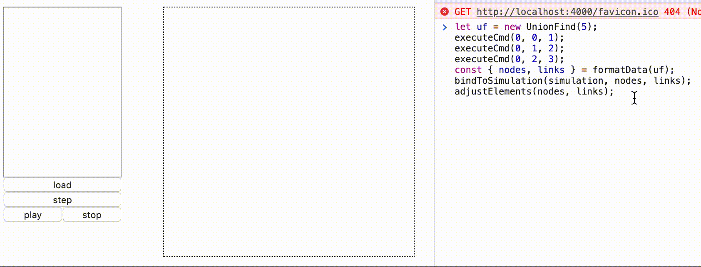

## 入力部分の作成

### Iteratorの作成

命令列を管理するためのクラスIteratorを作成します。
Itrator.jsを作成し、内容を以下のようにします。

```js
class Iterator {
  constructor(data) {
    this.buf = data;
    this.cnt = 0;
  }
  hasNext() {
    return this.cnt < this.buf.length;
  }
  next() {
    this.cnt++;
  }
  now() {
    return this.buf[this.cnt];
  }
  rest() {
    return this.buf.slice(this.cnt);
  }
}
```

index.htmlにおいて、script要素を追加します。srcはIterator.jsとします。

```html
<!DOCTYPE html>
<html lang="ja">
  <head>
    ...
  </head>
  <body>
    ...
    <script src="https://d3js.org/d3.v5.min.js"></script>
    <script src="UnionFind.js"></script>
    <script src="Iterator.js"></script>
    <script src="script.js"></script>
  </body>
</html>
```

### 命令の出力

script.jsにおいて、以下の記述を追加します。これは命令列をliとして描画する関数です。

```js
const updateCmdInfo = (data) => {
  const li = d3.select('ul')
    .selectAll('li')
    .data(data);
  li.exit().remove();
  li.enter()
    .append('li')
    .merge(li)
    .text(d => d);
};
```

また、executeCmd関数を以下のように修正します。
```js
const executeCmd = (c, i, j) => {
  const cmdMsg = d3.select('#cmd_msg');
  if (c === 0) {
    uf.unite(i, j);
    cmdMsg.text(`unite(${i}, ${j})`);
  } else {
    const res = uf.same(i, j);
    cmdMsg.text(`same(${i}, ${j}): ${res}`);
  }
};
```

### 出力処理をまとめる

script.jsにおいて、以下の記述を追加します。nodesとlinksをformatDataで生成し、これをsimulationに結びつけ、要素の個数の調整を一連の処理としてまとめます。

```js
const displayUnionFind = (uf) => {
    const { nodes, links } = formatData(uf);
    bindToSimulation(simulation, nodes, links);
    adjustElements(nodes, links);
};
```

### loadボタンの作成

script.jsにおいて、以下の記述を追加します。ufとitrはグローバル空間に宣言して、初期値を設定しておきます。textareaの1行目はノードの個数、それ以降は命令列となります。

```js
let itr = new Iterator([]);
let uf = new UnionFind(0);
d3.select('#load_btn')
  .on('click', () => {
    const input = d3.select('textarea')
      .property('value')
      .split('\n')
      .map(d => d.split(' '))
      .map(d => d.map(e => Number(e)));
    uf = new UnionFind(input[0][0]);
    itr = new Iterator(input.slice(1));

    displayUnionFind(uf);
    updateCmdInfo(itr.rest());
  });
```

### stepボタンの作成

script.jsにおいて、以下の記述を追加します。

```js
d3.select('#step_btn')
  .on('click', () => {
    if (itr.hasNext()) {
      executeCmd(...itr.now());
      itr.next();
      displayUnionFind(uf);
      updateCmdInfo(itr.rest());
    }
  });
```

### play/stopボタン作成

script.jsにおいて、以下の記述を追加します。

```js
let timer;
const playBtn = d3.select('#play_btn');
const stopBtn = d3.select('#stop_btn')
  .property('disabled', true);
playBtn.on('click', () => {
    playBtn.property('disabled', true);
    stopBtn.property('disabled', false);
    timer = d3.interval(() => {
      if (itr.hasNext()) {
        executeCmd(...itr.now());
        itr.next();
        displayUnionFind(uf);
        updateCmdInfo(itr.rest());
      } else {
        timer.stop();
        playBtn.property('disabled', false);
        stopBtn.property('disabled', true);
      }
    }, 500);
  });
stopBtn.on('click', () => {
  timer.stop();
  playBtn.property('disabled', false);
  stopBtn.property('disabled', true);
});
```

これで全ての機能は揃いました。

### テストケースの作成

script.jsに以下の記述を追加します。

```js
const testcase = `5 12
0 1 4
0 2 3
1 1 2
1 3 4
1 1 4
1 3 2
0 1 3
1 2 4
1 3 0
0 0 4
1 0 2
1 3 0`;
d3.select('textarea')
  .property('value', testcase);
```

さてindex.htmlを開き直し、loadボタンを押してplayボタンを押すと、命令の実行が始まります。

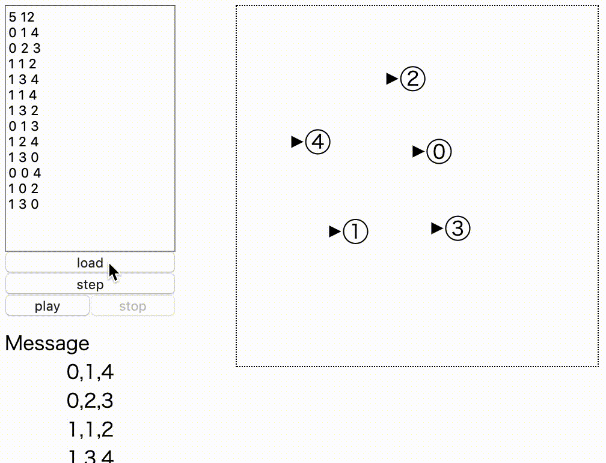
