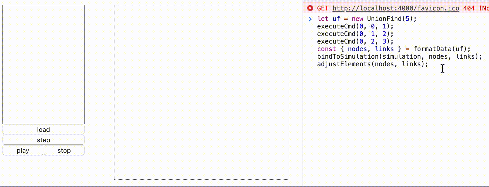
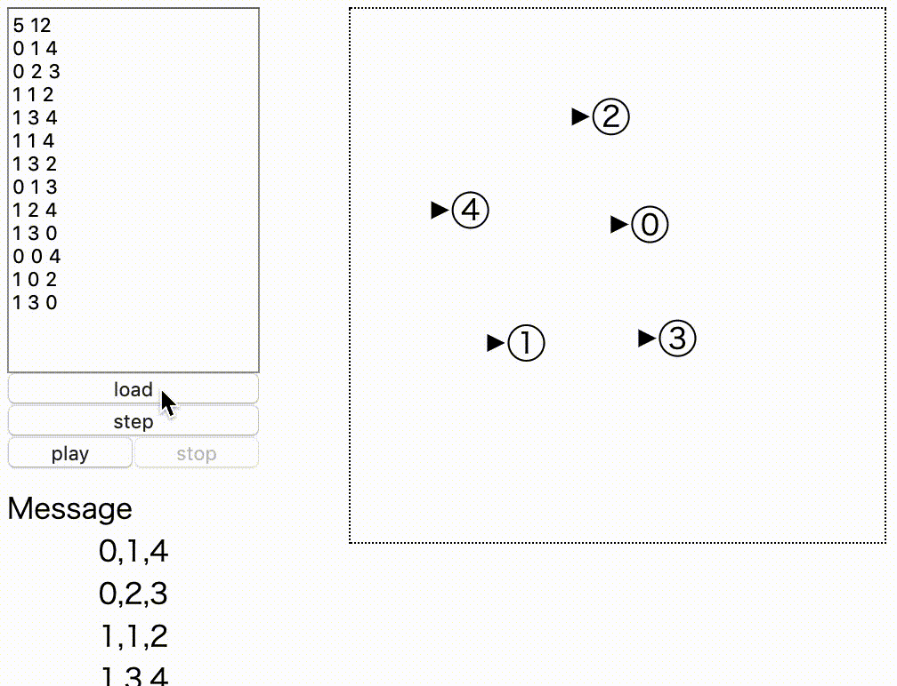
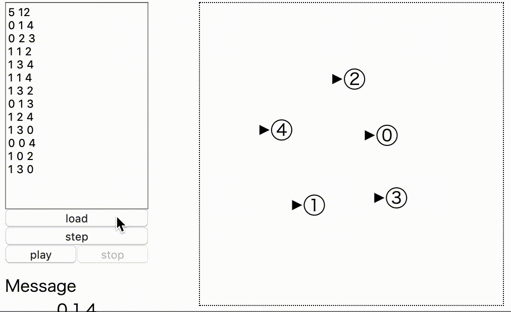
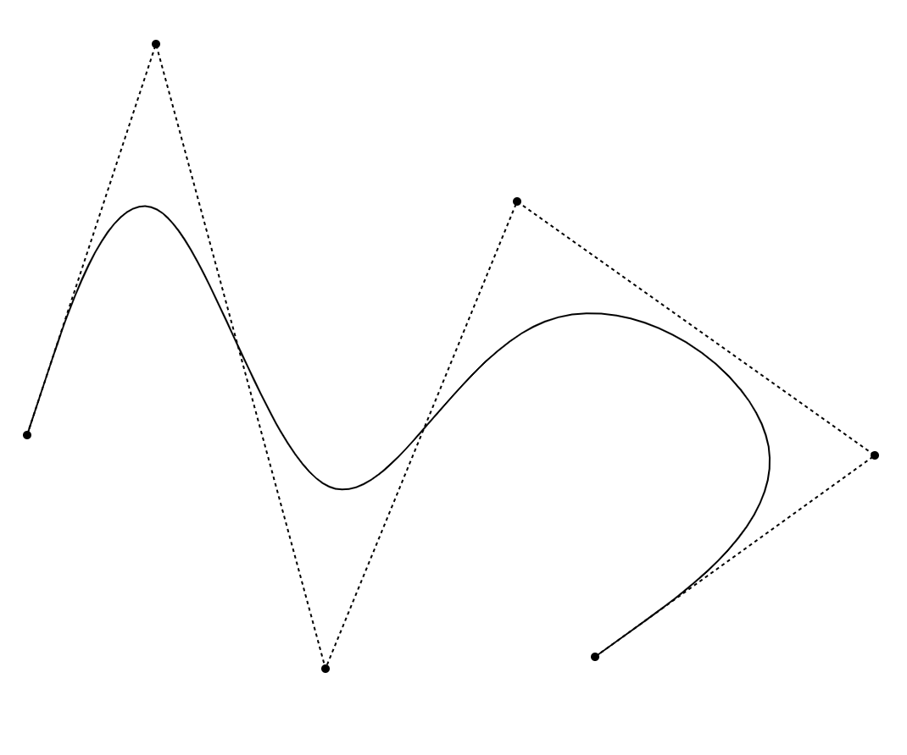
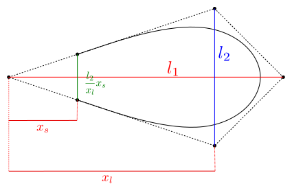
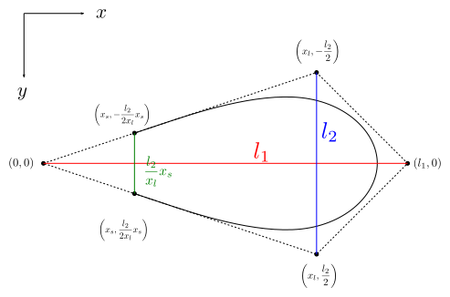
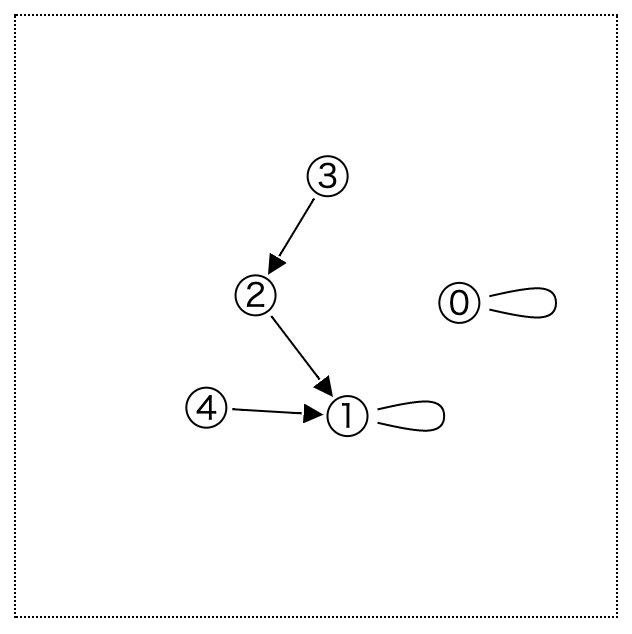
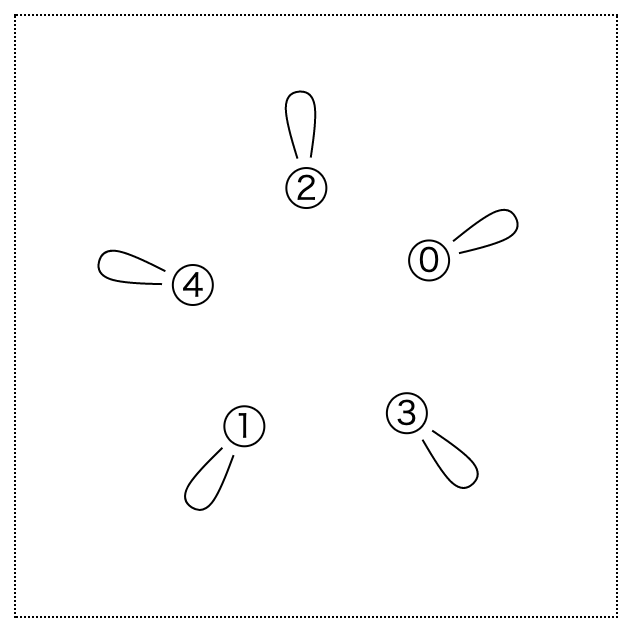
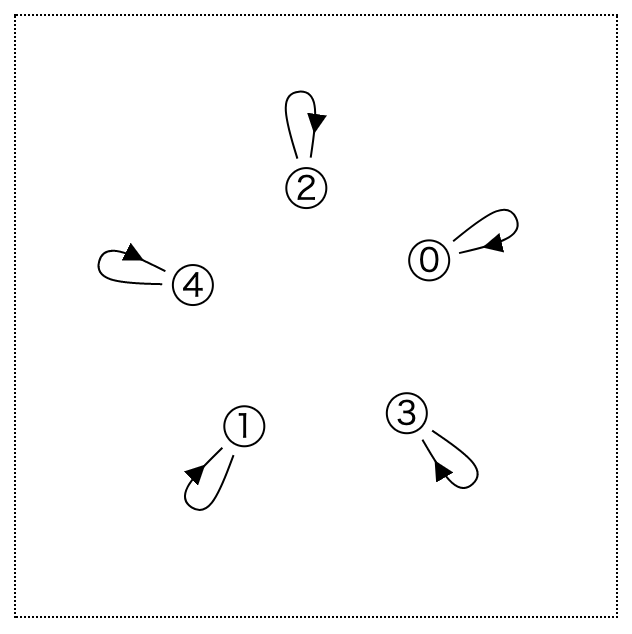
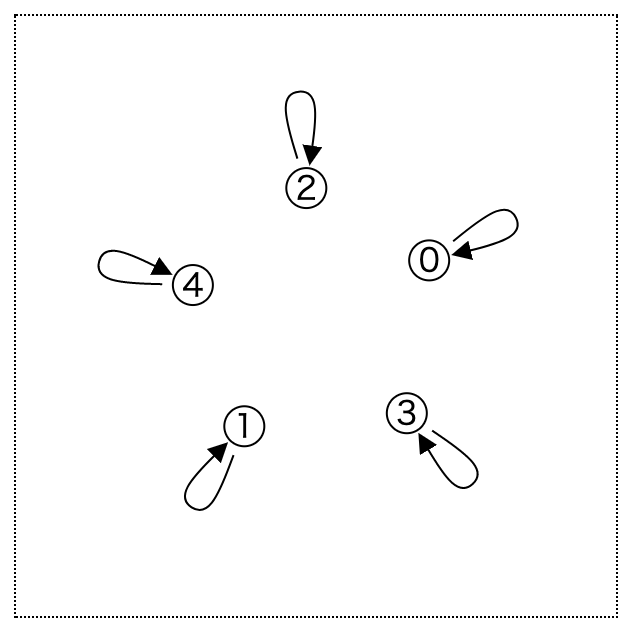

# D3.js Part06 Force Simulation Section02

d3.forceSimulationを用いると、グラフをぬるぬる動かすことができます。このチュートリアルでは、d3.forceSimulationの使い方を学んだ後、UnionFind木の可視化を行います。

このページは[Section01](../Part06_01)からの続きです。Section01をまだ読んでいない方はそちらから読んでください。

## どんなものを作る?

ようやく本題に参ります。作るものはUnionFind木の可視化です。

- テキストエリアに命令列を入力します。書式は<a href="http://judge.u-aizu.ac.jp/onlinejudge/description.jsp?id=DSL_1_A&lang=jp" target="_blank">AOJDSL_1_A</a>に従うものとします。
- loadボタンを押すと命令列が取り込まれ、stepボタンを押すと命令を順に実行し、画面上のUnionFind木が変化します。
- same命令の実行結果などを返すメッセージエリアを作ります。
- 命令を一定間隔で実行するボタンplayと、停止ボタンstopを作ります。

## HTML/CSSの作成

index.htmlを以下のようにします。ボタンやtextareaを作成します。コマンド列の表じはulで管理します。
命令列の管理のために、Iterator.jsをscriptタグに追加します。

```html
<!DOCTYPE html>
<html lang="ja">
  <head>
    <meta charset="utf-8">
    <link rel="stylesheet" href="style.css">
  </head>
  <body>
    <div class="main-container">
      <div class="menu">
        <textarea></textarea>
        <input id="load_btn" type="button" value="load">
        <input id="step_btn" type="button" value="step">
        <div class="player">
          <input id="play_btn" type="button" value="play">
          <input id="stop_btn" type="button" value="stop">
        </div>
        <p id="cmd_msg">Message</p>
        <ul id="cmd_info">
        </ul>
      </div>
      <div class="main">
        <svg>
        </svg>
      </div>
    </div>
    <script src="https://d3js.org/d3.v5.min.js"></script>
    <script src="UnionFind.js"></script>
    <script src="script.js"></script>
  </body>
</html>
```

style.cssを以下のようにします。

```css
@charset "utf-8";

.main-container {
  display: flex;
  flex-direction: row;
}

.menu {
  display: flex;
  flex-direction: column;
  margin: 50px 0 0 0;
}

.player {
  display: flex;
  flex-direction: row;
}
.player input {
  width: 50%;
}
textarea {
  resize: none;
  height: 200px;
}

p {
  margin: 10px 0 0 0;
  padding: 0;
}
ul {
  margin: 0;
  padding: 0;
  list-style-type: none;
}
li {
  text-align: center;
}

svg {
  border: 1px dotted #000;
  margin: 50px 0 0 50px;
}

```

## データの表現

### UnionFind木のデータ表現

ランクを用いたUnionFind木を実装します。データは次の2点です。

- `par[i] = iの親は誰か`
- `rank[i] = iのランク`


### 出力系のデータ表現

今まで見てきた通り、必要なのはnodeの配列とlinkの配列です。

### 出力変換器の作成

script.jsに以下の記述を追加します。
UnionFind木の情報を元に、グラフのnodeとlinkを作成する関数は次のように書けます。

```js
const formatData = (uf) => {
  const nodes = [...Array(uf.par.length)].map((_, i) => Object({ id: i }));
  const links = uf.par.map((p, i) => Object({ source: i, target: p }));
  return { nodes, links };
}
```

## UnionFind木の実装

UnionFind.jsを作成し、内容を以下の通りにします。

```js
class UnionFind {
  constructor(length) {
    this.par = [...Array(length)].map((d, i) => i);
    this.rank = [...Array(length)].fill(1);
    this.length = length;
  }
  find(i) {
    if (this.par[i] === i) return i;
    return this.par[i] = this.find(this.par[i]);
  }
  unite(i, j) {
    i = this.find(i);
    j = this.find(j);
    if (i === j) return;
    if (this.rank[i] < this.rank[j]) {
      this.par[i] = j;
    } else {
      this.par[j] = i;
      if (this.rank[i] === this.rank[j]) this.rank[i]++;
    }
  }
  same(i, j) {
    return this.find(i) === this.find(j);
  }
}
```

AOJで指定された書式で命令を実行するための関数を作成します。script.jsに以下の記述を追加します。

```js
const executeCmd = (c, i, j) => {
  if (c === 0) uf.unite(i, j);
  else uf.same(i, j);
};
```

## グラフデータ結び直しのための準備

### nodes/linksの削除

nodesとlinksはformatDataから生成します。よって、以前作っていた**nodesとlinksはscript.jsから削除しておきます**。

### データ削除への対応

辺のつなぎ直しが起こるため、exitの処理を考えなければなりません。また、この処理は何度も起こるので、initという関数名は適しません。**initという関数名をadjustElementsに修正し**、内容を以下の通りにします。

```js
const adjustElements = (nodes, links) => {
  const nodeGroup = nodesGroup.selectAll('g')
    .data(nodes);
  nodeGroup.exit().remove();
  const nodeGroupEnter = nodeGroup.enter()
    .append('g');
  nodeGroupEnter.append('circle')
    .attr('r', 10)
    .attr('fill', 'white')
    .attr('stroke', 'black');
  nodeGroupEnter.append('text')
    .attr('text-anchor', 'middle')
    .attr('dominant-baseline', 'central')
    .text(d => d.id);
  nodeGroupEnter.call(d3.drag()
      .on('start', dragstarted)
      .on('drag', dragged)
      .on('end', dragended));

  const linkGroup = linksGroup.selectAll('path')
    .data(links);
  linkGroup.exit().remove();
  linkGroup.enter()
    .append('path')
    .attr('fill', 'none')
    .attr('stroke', 'black')
}
```

### グラフデータ結び直しのための関数

script.jsに以下の記述を追加します。
グラフデータをsimulationに結び直すための関数bindToSimulationを作成します。

```js
const bindToSimulation = (simulation, nodes, links) => {
  simulation.nodes(nodes);
  simulation.force('link').links(links);
  simulation.alpha(1).restart();
};
```


### simulationの調整

script.jsにおいて、simulationの宣言を以下のようにします。forceLinkにdistanceメソッドを追加します。

```js
const simulation = d3.forceSimulation()
  .force('link', d3.forceLink().id(d => d.id).distance(70))
  .force('forceX', d3.forceX(svgWidth/2))
  .force('forceY', d3.forceY(svgHeight/2))
  .force('charge', d3.forceManyBody().strength(-200))
  .on('tick', ticked);
```

さて、試しにConsole上で以下のように入力しましょう。

```js
let uf = new UnionFind(5);
executeCmd(0, 0, 1);
executeCmd(0, 1, 2);
executeCmd(0, 2, 3);
const { nodes, links } = formatData(uf);
bindToSimulation(simulation, nodes, links);
adjustElements(nodes, links);
```

頂点0,1,2,3が結ばれます。



## 入力部分の作成

### Iteratorの作成

命令列を管理するためのクラスIteratorを作成します。
Itrator.jsを作成し、内容を以下のようにします。

```js
class Iterator {
  constructor(data) {
    this.buf = data;
    this.cnt = 0;
  }
  hasNext() {
    return this.cnt < this.buf.length;
  }
  next() {
    this.cnt++;
  }
  now() {
    return this.buf[this.cnt];
  }
  rest() {
    return this.buf.slice(this.cnt);
  }
}
```

index.htmlにおいて、script要素を追加します。srcはIterator.jsとします。

```html
<!DOCTYPE html>
<html lang="ja">
  <head>
    ...
  </head>
  <body>
    ...
    <script src="https://d3js.org/d3.v5.min.js"></script>
    <script src="UnionFind.js"></script>
    <script src="Iterator.js"></script>
    <script src="script.js"></script>
  </body>
</html>
```

### 命令の出力

script.jsにおいて、以下の記述を追加します。これは命令列をliとして描画する関数です。

```js
const updateCmdInfo = (data) => {
  const li = d3.select('ul')
    .selectAll('li')
    .data(data);
  li.exit().remove();
  li.enter()
    .append('li')
    .merge(li)
    .text(d => d);
};
```

また、executeCmd関数を以下のように修正します。
```js
const executeCmd = (c, i, j) => {
  const cmdMsg = d3.select('#cmd_msg');
  if (c === 0) {
    uf.unite(i, j);
    cmdMsg.text(`unite(${i}, ${j})`);
  } else {
    const res = uf.same(i, j);
    cmdMsg.text(`same(${i}, ${j}): ${res}`);
  }
};
```

### 出力処理をまとめる

script.jsにおいて、以下の記述を追加します。nodesとlinksをformatDataで生成し、これをsimulationに結びつけ、要素の個数の調整を一連の処理としてまとめます。

```js
const displayUnionFind = (uf) => {
    const { nodes, links } = formatData(uf);
    bindToSimulation(simulation, nodes, links);
    adjustElements(nodes, links);
};
```

### loadボタンの作成

script.jsにおいて、以下の記述を追加します。ufとitrはグローバル空間に宣言して、初期値を設定しておきます。AOJの入力形式を見ると、textareaの1行目はノードの個数、それ以降は命令列であることがわかります。

```js
let itr = new Iterator([]);
let uf = new UnionFind(0);
d3.select('#load_btn')
  .on('click', () => {
    const input = d3.select('textarea')
      .property('value')
      .split('\n')
      .map(d => d.split(' '))
      .map(d => d.map(e => Number(e)));
    uf = new UnionFind(input[0][0]);
    itr = new Iterator(input.slice(1));

    displayUnionFind(uf);
    updateCmdInfo(itr.rest());
  });
```

### stepボタンの作成

script.jsにおいて、以下の記述を追加します。

```js
d3.select('#step_btn')
  .on('click', () => {
    if (itr.hasNext()) {
      executeCmd(...itr.now());
      itr.next();
      displayUnionFind(uf);
      updateCmdInfo(itr.rest());
    }
  });
```

### play/stopボタン作成

script.jsにおいて、以下の記述を追加します。必要な時にだけplay/stopボタンが押せるようにdisabled属性を制御しています。

```js
let timer;
const playBtn = d3.select('#play_btn');
const stopBtn = d3.select('#stop_btn')
  .property('disabled', true);
playBtn.on('click', () => {
    playBtn.property('disabled', true);
    stopBtn.property('disabled', false);
    timer = d3.interval(() => {
      if (itr.hasNext()) {
        executeCmd(...itr.now());
        itr.next();
        displayUnionFind(uf);
        updateCmdInfo(itr.rest());
      } else {
        timer.stop();
        playBtn.property('disabled', false);
        stopBtn.property('disabled', true);
      }
    }, 500);
  });
stopBtn.on('click', () => {
  timer.stop();
  playBtn.property('disabled', false);
  stopBtn.property('disabled', true);
});
```

これで全ての機能は揃いました。

### テストケースの作成

最初からtextareaにサンプルが載っている状態にしましょう。script.jsに以下の記述を追加します。このテストケースはAOJのものです。

```js
const testcase = `5 12
0 1 4
0 2 3
1 1 2
1 3 4
1 1 4
1 3 2
0 1 3
1 2 4
1 3 0
0 0 4
1 0 2
1 3 0`;
d3.select('textarea')
  .property('value', testcase);
```

さてindex.htmlを開き直し、loadボタンを押してplayボタンを押すと、命令の実行が始まります。



### 位置の保存

1ステップごとに位置の情報が初期化されてしまうため、ノードは原点に戻ってしまいます。もっと自然な動きはできないものでしょうか。これを解決するためには、結び直す前のノードの位置情報を持っておけば良いです。

script.jsおいて、bindToSimulation関数の内容を以下のようにします。simulation.nodesは引数無しで呼び出すと、結びついたノードの配列を返します。これをoldNodesとし、位置情報をnodesの情報に渡しています。

```js
const bindToSimulation = (simulation, nodes, links) => {
  const oldNodes = simulation.nodes();
  for (let i = 0; i < nodes.length; i++) {
    if (i < oldNodes.length) {
      nodes[i].x = oldNodes[i].x;
      nodes[i].y = oldNodes[i].y;
    }
  }
  simulation.nodes(nodes);
  simulation.force('link').links(links);
  simulation.alpha(1).restart();
};
```

これで、ノードが原点に戻ることは無くなりました。若干動きが不自然な時がありますが、これはalphaの初期値が大きすぎるせいかもしれません(alphaは力に影響します)。気になる人はalphaを調整しましょう。



## ここまでのscript.js

```js
const [svgWidth, svgHeight] = [300, 300];
const svg = d3.select('svg')
  .attr('width', svgWidth)
  .attr('height', svgHeight);
svg.append('defs')
  .append('marker')
  .attr('id', 'arr')
  .attr('markerUnits', 'strokeWidth')
  .attr('markerWidth', 10)
  .attr('markerHeight', 10)
  .attr('orient', 'auto')
  .attr('refX', 2.2)
  .attr('refY', 0.5)
  .attr('viewBox', '0 0 1 1')
  .append('path')
  .attr('stroke', 'none')
  .attr('fill', '#000')
  .attr('d', 'M0,0 L1,0.5 0,1');


const linksGroup = svg.append('g');
const nodesGroup = svg.append('g');
const adjustElements = (nodes, links) => {
  const nodeGroup = nodesGroup.selectAll('g')
    .data(nodes);
  nodeGroup.exit().remove();
  const nodeGroupEnter = nodeGroup.enter()
    .append('g');
  nodeGroupEnter.append('circle')
    .attr('r', 10)
    .attr('fill', 'white')
    .attr('stroke', 'black');
  nodeGroupEnter.append('text')
    .attr('text-anchor', 'middle')
    .attr('dominant-baseline', 'central')
    .text(d => d.id);
  nodeGroupEnter.call(d3.drag()
      .on('start', dragstarted)
      .on('drag', dragged)
      .on('end', dragended));

  const linkGroup = linksGroup.selectAll('path')
    .data(links);
  linkGroup.exit().remove();
  linkGroup.enter()
    .append('path')
    .attr('fill', 'none')
    .attr('stroke', 'black')
}
const dragstarted = (d) => {
  if (!d3.event.active) simulation.alphaTarget(0.3).restart();
  d.fx = d.x;
  d.fy = d.y;
};
const dragged = (d) => {
  d.fx = d3.event.x;
  d.fy = d3.event.y;
};
const dragended = (d) => {
  if (!d3.event.active) simulation.alphaTarget(0).restart();
  d.x = d.fx;
  d.y = d.fy;
  d.fx = null
  d.fy = null;
};

const ticked = () => {
  nodesGroup.selectAll('g')
    .attr('transform', d => `translate(${d.x}, ${d.y})`);
  linksGroup.selectAll('path')
    .attr('d', d => {
      return `M${d.source.x},${d.source.y} L${d.target.x},${d.target.y}`;
    })
    .attr('marker-end', 'url(#arr)')
    .attr('stroke-dasharray', d => {
      const R = 10;
      const W = 10;
      const [sx, sy] = [d.source.x, d.source.y];
      const [tx, ty] = [d.target.x, d.target.y];
      const D = Math.sqrt((tx-sx)*(tx-sx) + (ty-sy)*(ty-sy));
      const DD = D - 2*R - W;
      return `0 ${R+3} ${DD-6} ${3+W+R}`;
    });
};
const simulation = d3.forceSimulation()
  .force('link', d3.forceLink().id(d => d.id).distance(70))
  .force('forceX', d3.forceX(svgWidth/2))
  .force('forceY', d3.forceY(svgHeight/2))
  .force('charge', d3.forceManyBody().strength(-200))
  .on('tick', ticked);

const executeCmd = (c, i, j) => {
  const cmdMsg = d3.select('#cmd_msg');
  if (c === 0) {
    uf.unite(i, j);
    cmdMsg.text(`unite(${i}, ${j})`);
  } else {
    const res = uf.same(i, j);
    cmdMsg.text(`same(${i}, ${j}): ${res}`);
  }
};

const formatData = (uf) => {
  const nodes = [...Array(uf.par.length)].map((_, i) => Object({ id: i }));
  const links = uf.par.map((p, i) => Object({ source: i, target: p }));
  return { nodes, links };
};

const bindToSimulation = (simulation, nodes, links) => {
  const oldNodes = simulation.nodes();
  for (let i = 0; i < nodes.length; i++) {
    if (i < oldNodes.length) {
      nodes[i].x = oldNodes[i].x;
      nodes[i].y = oldNodes[i].y;
    }
  }
  simulation.nodes(nodes);
  simulation.force('link').links(links);
  simulation.alpha(1).restart();
};

const updateCmdInfo = (data) => {
  const li = d3.select('ul')
    .selectAll('li')
    .data(data);
  li.exit().remove();
  li.enter()
    .append('li')
    .merge(li)
    .text(d => d);
};

const displayUnionFind = (uf) => {
    const { nodes, links } = formatData(uf);
    bindToSimulation(simulation, nodes, links);
    adjustElements(nodes, links);
};

let itr = new Iterator([]);
let uf = new UnionFind(0);
d3.select('#load_btn')
  .on('click', () => {
    const input = d3.select('textarea')
      .property('value')
      .split('\n')
      .map(d => d.split(' '))
      .map(d => d.map(e => Number(e)));
    itr = new Iterator(input.slice(1));
    uf = new UnionFind(input[0][0]);

    displayUnionFind(uf);
    updateCmdInfo(itr.rest());
  });


d3.select('#step_btn')
  .on('click', () => {
    if (itr.hasNext()) {
      executeCmd(...itr.now());
      itr.next();
      displayUnionFind(uf);
      updateCmdInfo(itr.rest());
    }
  });

let timer;
const playBtn = d3.select('#play_btn');
const stopBtn = d3.select('#stop_btn')
  .property('disabled', true);
playBtn.on('click', () => {
    playBtn.property('disabled', true);
    stopBtn.property('disabled', false);
    timer = d3.interval(() => {
      if (itr.hasNext()) {
        executeCmd(...itr.now());
        itr.next();
        displayUnionFind(uf);
        updateCmdInfo(itr.rest());
      } else {
        timer.stop();
        playBtn.property('disabled', false);
        stopBtn.property('disabled', true);
      }
    }, 500);
  });
stopBtn.on('click', () => {
  timer.stop();
  playBtn.property('disabled', false);
  stopBtn.property('disabled', true);
});

const testcase = `5 12
0 1 4
0 2 3
1 1 2
1 3 4
1 1 4
1 3 2
0 1 3
1 2 4
1 3 0
0 0 4
1 0 2
1 3 0`;
d3.select('textarea')
  .property('value', testcase);js
```

## (おまけ)自己ループ作成

以上で十分な出来なのですが、最後にグラフの自己ループを綺麗に描けるようにしたいと思います。

### どうやるか

自己ループか否かでpathの属性の設定を分ける必要があります。
また、綺麗な曲線を描くためには、何かしらの工夫が必要です。カーブ度合いとか、長さとかを計算しなければなりません。

### 自己ループか否かの場合分け

「自己ループを持つ場合は自己ループ専用の描画方法、そうでない場合は普通の描画方法」とpath要素の設定を分ける必要があります。
各属性の設定で、`d.source.id === d.target.id`のif-else文を書くのも手ですが、ここでは**selection.filter**というメソッドを利用して、もっと読みやすいコードにしましょう。

script.jsにおいて、ticked関数の内容を以下のように修正します。
`linkGroup.selectAll('path')`と`attr('d', ...)`の間にfilterメソッドを挿入します。

```js
const ticked = () => {
  nodesGroup.selectAll('g')
    .attr('transform', d => `translate(${d.x}, ${d.y})`);
  linksGroup.selectAll('path')
    .filter(d => d.source.id !== d.target.id)
    .attr('d', d =>`M${d.source.x},${d.source.y} L${d.target.x},${d.target.y}`)
    .attr('marker-end', 'url(#arr)')
    .attr('stroke-dasharray', d => {
      const R = 10;
      const W = 10;
      const [sx, sy] = [d.source.x, d.source.y];
      const [tx, ty] = [d.target.x, d.target.y];
      const D = Math.sqrt((tx-sx)*(tx-sx) + (ty-sy)*(ty-sy));
      const DD = D - 2*R - W;
      return `0 ${R+3} ${DD-6} ${3+W+R}`;
    });
};
```

#### selection.filter

引数に指定されたコールバック関数がtrueを返すようなものを集めたselectionsを返します。

以下の文では、「d.source.idとd.target.idが等しくないようなselections」を返します。つまり、以降の処理は、自己ループ以外のselecitonに対して属性が設定されることになります。
```js
  linksGroup.selectAll('path')
    .filter(d => d.source.id !== d.target.id)
    ...
```

### 自己ルーブの描画

ベジェ曲線をpathのd要素に手打ちするのもアリですが、ここではそれよりは少し楽な方法を採用します。d3.curveを利用します。

#### d3.curveBasis

d3.lineのcurveメソッドにこれを指定すると、曲線をいい感じに描画するためのd要素を返します。d3.lineについての詳細はPart03に任せるとして、例えば以下のようにします。

```js
const line = d3.line()
  .curve(d3.curveBasis);
path.datum([座標, 座標, ...])
  .attr('d', line);
```

下の図において、点線がcurve指定無し、実線がcurve指定ありです。


#### 自己ループの計算

下図の実線のような図を描画したい場合、必要な情報は$x_1, x_2, l_1, l_2$と向き情報の5つです。向きについては後で考えます。
とりあえず横向きの自己ループのみを考えましょう。



もっとも左の黒点を$(0,0)$とみなすと、他の点は以下のように表せます。



ただし、今原点とみなした点は、実際にはノードの座標です。よって、他の座標もノードに合わせて平行移動する必要があります。

これを元に、自己ループ用のd要素を作成します。script.jsにおいて、ticked関数の末尾に以下の記述を追加します。

```js
const ticked = () => {
  ...
  linksGroup.selectAll('path')
    .filter(d => d.source.id === d.target.id)
    .attr('d', d => {
      const {x, y} = d.source;
      const [xs, xl, l1, l2] = [15, 45, 50, 20];
      const points = [
        [xs, -l2/(2*xl)*xs], [xl, -l2/2], [l1, 0],
        [xl, l2/2], [xs, l2/(2*xl)*xs]
      ];
      const line = d3.line()
        .curve(d3.curveBasis);
      return line(points.map(d => [d[0]+x, d[1]+y]));
    });
};
```

とりあえず自己ループは描画されましたが、向きは常に右を向いています。




### 自己ループの向き

path要素のtransform属性にrotateを指定すれば、pathを回転できます。これを用いて向きを設定しましょう。ここではpath要素の向きを、「常にsvg領域の中心の逆方向を向く」と決めましょう。

script.jsにおいて、linksGroupに関する記述を以下のように修正します。

svg領域中心からノードへのベクトルを`[dx, dy]`とし、その偏角をMath.atan2を用いて計算します。そして、度数に変換したものrotateに指定します。rotateの第2、第3引数には、回転の中心を指定できます。

自己ループでない場合は、transform属性を無効にします。

```js
  linksGroup.selectAll('path')
    .filter(d => d.source.id !== d.target.id)
    ...
    .attr('transform', null);
  linksGroup.selectAll('path')
    .filter(d => d.source.id === d.target.id)
    ...
    .attr('transform', d => {
      const {x, y} = d.target;
      const [dx, dy] = [x - svgWidth/2, y - svgHeight/2];
      const theta = Math.atan2(dy, dx);
      return `rotate(${180*theta/Math.PI} ${x} ${y})`;
    })
```

ループが放射状に伸びていてとても綺麗ですね。



### 矢印の描画

以前指定したmarkerを指定してあげると、矢印がずれてしまっていることがわかります。結局、自己ループ用の別のマーカーを新たに作る必要が出てきます。



refXだけが異なるだけで、他が同じな記述を書くのは少し冗長だと思います。書く量を少し減らしましょう。script.jsの先頭部分について、markerの記述を以下のように書き換えます。callメソッドを有効利用しています。

callメソッドについては[Part03の基本3](../Part03/#基本3-軸を配置する)で触れました。callで呼び出される関数を自作する場合、、必ず第1引数をselectionにする必要があります。第2引数以降はcallメソッドの第2引数以降で指定できます。

```js
const [svgWidth, svgHeight] = [300, 300];
const svg = d3.select('svg')
...
const setUpArrow = (selection, refX, refY) => {
  selection.attr('markerUnits', 'strokeWidth')
    .attr('markerWidth', 10)
    .attr('markerHeight', 10)
    .attr('orient', 'auto')
    .attr('refX', refX)
    .attr('refY', refY)
    .attr('viewBox', '0 0 1 1')
    .append('path')
    .attr('stroke', 'none')
    .attr('fill', '#000')
    .attr('d', 'M0,0 L1,0.5 0,1');
};
const defs = svg.append('defs');
defs.append('marker')
  .attr('id', 'arr')
  .call(setUpArrow, 2.2, 0.5);
defs.append('marker')
  .attr('id', 'self_arr')
  .call(setUpArrow, 0.6, 0.5);

const linksGroup = svg.append('g');
const nodesGroup = svg.append('g');
...
```

最後に、script.jsにおいて、tick関数の`d.source.id === d.target.id`に関する部分にmarker-end属性を追加します。

```js
  linksGroup.selectAll('path')
    .filter(d => d.source.id === d.target.id)
    ...
    .attr('marker-end', 'url(#self_arr)');
```

いい感じです!



## まとめ

d3.forceSimulationの基本的な使い方を見た後、その応用としてUnionFind木の可視化を行いました。実際にぬるぬる動いていて楽しかったのではないでしょうか。
