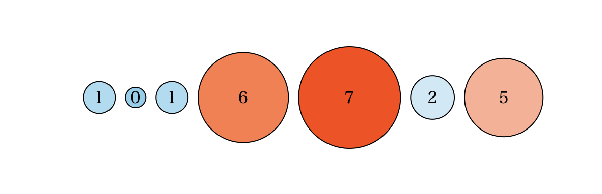
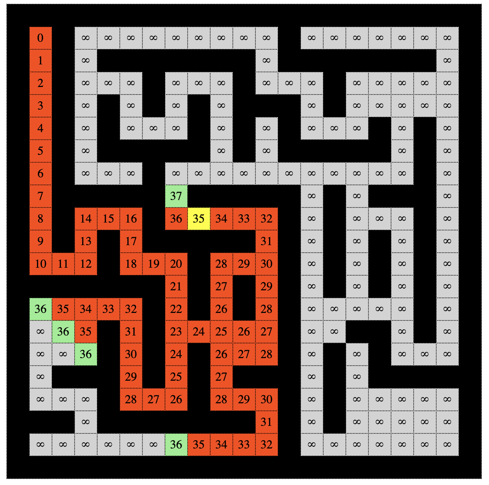
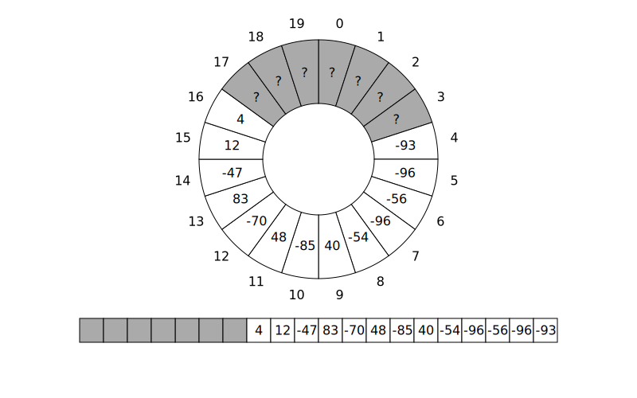
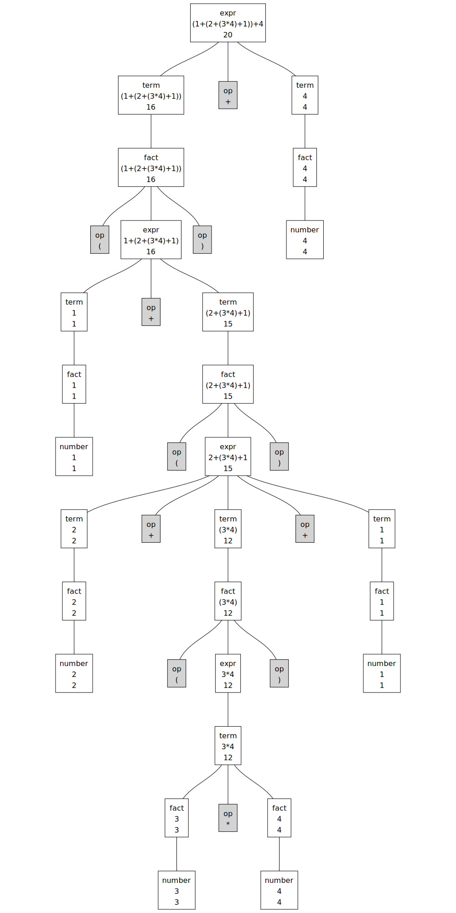

# D3.js による Data Visualization

## What is D3.js ?

D3.jsはデータ可視化のためのライブラリです。D3とは、**Data Driven Document**の略です。これはデータ中心でプログラミングすることを意味します。D3.jsでは、しばしばデータとDOMを結びつけ、データを用いてDOMの属性やスタイルを変えるということをします。

以下のチュートリアルはD3.js v5を想定しています。ブラウザはChromeとSafariでは動作確認済みです。Edge、Firefoxでは多分動きます。

## Index

1. [Understanding Concept](./Part01) - Circle Alignment.
2. [A Little Complex Example](./Part02) - Maze Solver.
3. [Line Chart](./Part03) - Function Visualizer.
4. [Pie Chart](./Part04) - Queue Visualizer.
5. Tree - Parsing to Syntax Tree.
6. Force Simulation - Union Find Tree.

### [Circle Alignment](./Part01)

「配列に入った数値データを円として可視化する」というケースを想定して、D3.jsの基本を学びましょう。

### [Maze Solver](./Part02)

迷路を探索する様子を可視化しましょう。データの形やその整形について学びます。

### [Function Vizualizer](./Part03)

折れ線グラフを描きましょう。軸や折れ線の描画方法だけでなく、ちょっとしたインタラクティブ要素も学びます。

### Queue Visualizer

### Parsing to Syntax Tree

### Union Find Tree

