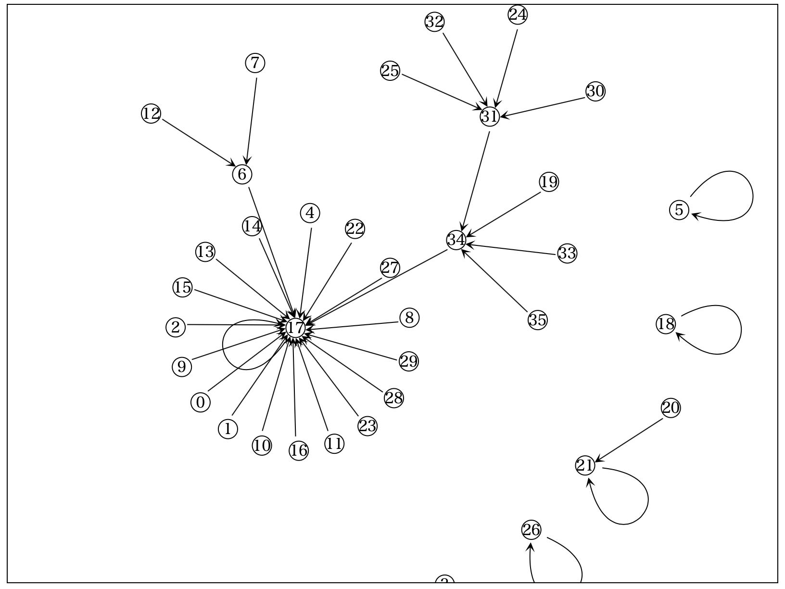

# D3.js による Data Visualization

## What is D3.js ?

D3とは、**Data Driven Document**の略です。**Data Driven**とは「データ駆動」という意味です。これはデータ中心でプログラミングすることを意味します。D3.jsでは、しばしばデータとDOMを結びつけ、データを用いてDOMの属性やスタイルを変えるということをします。このような使い方のおかげで、D3.jsはデータ可視化に向いています。

以下のチュートリアルはD3.js v5を想定しています。また、JavaScriptはES6を想定しています。Internet Explorerだと動かないかもしれません。

## Index

1. [Understanding Concept](./Part01) - Circle Alignment.
2. [A Little Complex Example](./Part02) - Maze Solver.
3. Line Chart - Function Visualizer.
4. Pie Chart - Queue Visualizer.
5. Tree - Parsing to Syntax Tree.
6. Force Simulation - Union Find Tree.

### Circle Alignment

「配列に入った数値データを円として可視化する」というケースを想定して、D3.jsの基本を学びましょう。

### Maze Solver

### Function Vizualizer

### Queue Visualizer

### Parsing to Syntax Tree

### Union Find Tree

