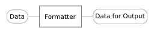

<!-- theme: uncover -->

# D3.js

---

## Introduction

---

### Hello

- みんな、データ可視化してる?
- 楽しいよね

---

### 競プロで見る可視化(1)

- xの値どうなってるんだろうな&hellip;

```cpp
cout << x << endl;
```

これも十分可視化です

---

### 競プロで見る可視化(2)

- DP配列の中身どうなってるんだろうな&hellip;
- とりあえず3桁で揃えとくか

```cpp
for (int i = 0; i < N; i++) {
  for (int j = 0; j < N; j++) {
    cout << setw(3) << fixed << dp[i][j] << ' ';
  }
  cout << endl;
}
```

これも十分可視化です

---

### 世の中の可視化

- 棒グラフ: 数値の配列
- 折れ線ぐラフ: 点(x, y)の配列
- 円グラフ: 数値の配列

---

### 可視化の意義

#### 知りたい
#### 伝えたい

ex) ナインチンゲールがクリミア戦争において「兵士の衛生状態の改善」を主張するために、変わったグラフを考えた

---

## D3.js

---

## What is D3.js ?

データを可視化するためのJSライブラリ

---

### <!-- fit --> Data

---

### <!-- fit --> Driven

---

### <!-- fit --> Documents

---

### 直訳「データ駆動文書?」

No.

Maybe Documents = DOM.

---

### (Supplement) What is DOM ?

#### Document Object Model 

HTMLをブラウザが解釈した姿

- Webページに変化を起こしたい
  - &#x1f645;&#x200d;&#x2642;&#xfe0f; HTMLファイルを直接書き換える
  - :ok_woman: DOMを書き換える

---

### データ至上主義

D3.jsでやること

- データを要素に結びつける
- 必要に応じて要素を追加/削除
- そのデータを使ってattr/styleを書き換える
- 場合によってはいい感じのデータに変換

データが大切になります

---

### データ至上主義

D3.jsでやること

- データを要素に結びつける
- 必要に応じて要素を追加/削除
- そのデータを使ってattr/styleを書き換える
- <span style="color:red">場合によってはいい感じのデータに変換</span>

データが大切になります

---

### Formatter

- 元データと「見せるデータ」は異なることが多い
  &rArr;いわゆる「出力変換器」が必要
- D3.jsが用意してくれるものもある



---

## Demo

https://bombrary.github.io/vizworks/

---

### Summary

- データ可視化は「伝える」ためにある
- D3.jsはデータ可視化のライブラリ
- 元データと出力用のデータは違う
  &rArr; 変換器を作成 or D3.jsに頼る
- 可視化楽しい
