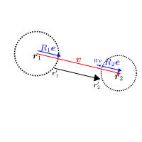
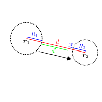
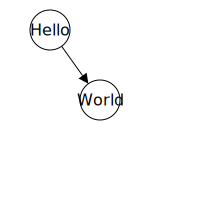

<link rel="stylesheet" href="style.css">

# SVG

SVGを学びましょう。基本はタグです。HTMLと少量のCSSの知識があればなんとかなります。

HTMLが不安な人は[HTMLチュートリアル](/lec_html/)を読んできてください。

CSSが不安な人は[CSSチュートリアル](/lec_css/)を読んできてください(このチュートリアルをやる範囲においては、
Step01まで読んでもらえれば十分です)。

## SVGとは

Scalable Vector Graphicsの略で、画像を描くための言語のひとつです。
HTMLに直接埋め込めます。またsvgで描ければ、多くのベクタ系ソフトでそれを開いて編集できます。

## ラスタ画像とベクタ画像

世の中の画像はラスタ画像とベクタ画像に大別されます。

ラスタ画像とは、画像を画素(pixel)の集合とみなした画像の事です。WindowsのペイントソフトとかGIMPとかはこの形式で保存します。
点のみで構成されているため、どれだけ滑らかな曲線でも拡大すればギザギザの点に見えてしまいます。

ベクタ画像とは、画像を点とその接続関係とみなした画像の事です。画素で表さないため、滑らかな曲線をどれだけ拡大してもギザギザは見えてきません。
ただし、ラスタ画像に比べて描き方が複雑になります。

SVGで作れる画像はベクタ画像です。以下はSVGで描いた円ですが、どれだけ拡大してもギザギザは見えてこないと思います。

<svg width="100px" height="100px">
  <g transform="translate(50, 50)">
    <circle fill="salmon" stroke="none" r="20px" />
    <text text-anchor="middle" dominant-baseline="central" fill="white">Hey!</text>
  </g>
</svg>

## 例その1

とりあえず円を出力させましょう。index.htmlを作成し、以下の記述をします。

```html
<!DOCTYPE html>
<html lang="ja">
  <head>
    <meta charset="utf-8">
    <link rel="stylesheet" href="style.css">
    <title>Hello Page</title>
  </head>
  <body>
    <svg>
    </svg>
  </body>
</html>
```

svgの領域がどこからどこまでなのかを確認するために、枠線を引いておきましょう。index.htmlと同じディレクトリに
style.cssを作成し、以下の記述をします。

```css
@charset "utf-8";

svg {
  width: 200px;
  height: 200px;
  border: 1px solid #000;
}
```

### svgタグ

SVGを描くための領域を表します。この中に色々書いていきます。

## Step01: 円

円を書きましょう。

```html
<!DOCTYPE html>
<html lang="ja">
  <head>
    <meta charset="utf-8">
    <link rel="stylesheet" href="style.css">
    <title>Hello Page</title>
  </head>
  <body>
    <svg>
      <circle cx="50px" cy="30px" fill="salmon" stroke="none" r="20px" />
    </svg>
  </body>
</html>
```

<div class="output">
  <svg width="200px" height="200px">
    <circle cx="50px" cy="30px" fill="salmon" stroke="none" r="20px" />
  </svg>
</div>

### 座標系

svgにおいて、座標系は次のルールとなっています。

- 要素の最も左上が原点
- 右に行くほどx座標が大きくなる
- 下に行くほどy座標が大きくなる


#### 終了タグの無い要素(空要素)について

**必ず末尾にスラッシュをつけます**。HTMLではつけてもつけなくても良かったのですが、
svgの場合は必ず必要です。

```html
<circle cx="50px" cy="30px" fill="salmon" stroke="none" r="20px" />
```

#### circle

円を描くための要素です。次の属性を指定できます。

- r: 半径
- cx, cy: それぞれ円の中心のx、y座標

色関係の属性として以下のものが利用できます。
これはcircleに限りません。

- fill: 塗りつぶしの色
- stroke: 外枠の色
- stroke-width: 外枠の太さ

fillとstrokeについては、noneを指定する事で無効にできます。

cxとcyがそれぞれ50px、30pxの場合は以下のようになります。
<div class="output">
  <svg width="200" height="200">
    <circle cx="50px" cy="30px" fill="salmon" stroke="none" r="20px" />
    <path stroke="#000" stroke-width="1px" fill="none" d="M0,30 L50,30" />
    <path stroke="#000" stroke-width="1px" fill="none" d="M50,0 L50,30" />
    <text text-anchor="middle" x="25" y="50">50px</text>
    <text dominant-baseline="central" x="60" y="15">30px</text>
  </svg>
</div>

## Step02: 長方形

長方形を描きましょう。

```html
<!DOCTYPE html>
<html lang="ja">
  <head>
    <meta charset="utf-8">
    <link rel="stylesheet" href="style.css">
    <title>Hello Page</title>
  </head>
  <body>
    <svg>
      <rect x="80px" y="80px" width="40px" height="40px" />
    </svg>
  </body>
</html>
```

<div class="output">
  <svg width="200px" height="200px">
    <rect x="80px" y="80px" width="40px" height="40px" />
  </svg>
</div>

### rect要素

長方形を描くための要素です。次の属性を指定できます。

- x,y: それぞれ長方形の**左上の**x座標、y座標を表します。
- width,height: それぞれ長方形の幅、高さを表します。

xとyがそれぞれ50px、30pxの場合は以下のようになります。
<div class="output">
  <svg width="200px" height="200px">
    <rect x="50px" y="30px" width="40px" height="40px" />
    <path stroke="#000" stroke-width="1px" fill="none" d="M0,30 L50,30" />
    <path stroke="#000" stroke-width="1px" fill="none" d="M50,0 L50,30" />
    <text text-anchor="middle" x="25" y="50">50px</text>
    <text dominant-baseline="central" x="60" y="15">30px</text>
  </svg>
</div>

## Step03: 文字を書く

```html
<!DOCTYPE html>
<html lang="ja">
  <head>
    <meta charset="utf-8">
    <link rel="stylesheet" href="style.css">
    <title>Hello Page</title>
  </head>
  <body>
    <svg>
      <text x="50px" y="30px">Hello</text>
    </svg>
  </body>
</html>
```
<div class="output">
  <svg width="200px" height="200px">
    <text x="50px" y="30px">Hello</text>
  </svg>
</div>

### text要素

文字を描画するための要素です。以下の属性が使用できます。

- x,y: テキストの基準位置のx座標、y座標を表します
  基準位置のデフォルトはテキストの左下でしたが、
  text-anchorとdominant-baselineでこれを変更できます。詳しくはStep04で説明します。
- dx,dy: テキストのx座標のずれ、y座標のずれを表します

文字関係の属性は色々あります。最低限以下の属性を覚えておけば良さそうです。

- font-size: 文字のサイズを表します。
- font-weight: 文字の太さを表します。

xとyがそれぞれ50px、30pxの場合は以下のようになります。

<div class="output">
  <svg width="200px" height="200px">
    <text x="50px" y="30px">Hello</text>
    <path stroke="#000" stroke-width="1px" fill="none" d="M0,30 L50,30" />
    <path stroke="#000" stroke-width="1px" fill="none" d="M50,0 L50,30" />
    <text text-anchor="middle" x="25" y="50">50px</text>
    <text dominant-baseline="central" x="60" y="15">30px</text>
  </svg>
</div>

## Step04: 円とテキスト

円の中にテキストを描画しましょう。
HTMLでいうdivタグのように、
「円とテキストで1つの塊」という意味をsvgで表現できないでしょうか。

できます。

```html
<!DOCTYPE html>
<html lang="ja">
  <head>
    <meta charset="utf-8">
    <link rel="stylesheet" href="style.css">
    <title>Hello Page</title>
  </head>
  <body>
    <svg>
      <g transform="translate(50, 30)">
        <circle r="20" fill="#fff" stroke="#000" />
        <text>Hello</text>
      </g>
    </svg>
  </body>
</html>
```
<div class="output">
  <svg width="200px" height="200px">
      <g transform="translate(50, 30)">
        <circle r="20" fill="#fff" stroke="#000" />
        <text>Hello</text>
      </g>
  </svg>
</div>

### g要素
グループとしてまとめるためのう要素です。重要なのはtransform要素です。
#### transform属性

移動、回転、拡大縮小などの座標変換をするための属性です。
他にも変換行列で座標変換できたりスキューができたりするらしいですが、
とりあえず次の変換を覚えておけば十分でしょう。

- translate(X, Y): x軸方向にX、y軸方向にYだけ進める
- size(X, Y): x軸方向にX、y軸方向にYだけ拡大する
- rotate(theta, X, Y): (X,Y)を中心にtheta度だけ回転させます。

変換後は、座標系がまるごと移動したイメージを持ってください。
例えば、translate(50,30)とcx=20、cy=40を指定すると、
(50,30)へと移動した後さらに(20,40)だけ移動します。

```html
<g transform="translate(50, 30)">
  <circle cx="20" cy="40" r="20" fill="#fff" stroke="#000" />
</g>
```


<div class="output">
  <svg width="200px" height="200px">
      <defs>
        <marker id="arr01" markerUnits="strokeWidth" markerWidth="5" markerHeight="5"
                viewBox="0 0 2 2" orient="auto" refX="1" refY="1">
          <path d="M0,0 L2,1 0,2 Z" fill="#000"/>
        </marker>
      </defs>
      <g transform="translate(50, 30)">
        <circle cx="20" cy="40" r="20" fill="#fff" stroke="#000" />
        <text>(50, 30)</text>
      </g>
      <text x="70" y="70">(70, 70)</text>
      <path stroke="#000" fill="none" d="M0,0 L50,30" marker-end="url(#arr01)" />
      <path stroke="#000" fill="none" d="M50,30 L70,70" marker-end="url(#arr01)" />
      <rect x="50" y="30" width="200" height="200" fill="none" stroke="#000" stroke-dasharray="2"/>
  </svg>
</div>

## Step05: 中央寄せ

円の真ん中にテキストを配置したいです。これはtext要素に属性を指定する事で解決します。

```html
<!DOCTYPE html>
<html lang="ja">
  <head>
    <meta charset="utf-8">
    <link rel="stylesheet" href="style.css">
    <title>Hello Page</title>
  </head>
  <body>
    <svg>
      <g transform="translate(50, 30)">
        <circle r="20" fill="#fff" stroke="#000"/>
        <text text-anchor="middle" dominant-baseline="central">Hello</text>
      </g>
    </svg>
  </body>
</html>
```
<div class="output">
  <svg width="200px" height="200px">
      <g transform="translate(50, 30)">
        <circle r="20" fill="#fff" stroke="#000" text-anchor="middle" dominant-baseline="central"/>
        <text text-anchor="middle" dominant-baseline="central">Hello</text>
      </g>
  </svg>
</div>

### text-anchor

テキストのx座標の基準位置を設定します。start/middle/endを指定できます。middleでテキストの中央が座標の基準になります。

下図において、1つ目がmiddle指定前、2つ目が指定後になります。

<div class="output">
  <svg width="200px" height="200px">
    <text x="50px" y="30px">Hello</text>
    <path stroke="#000" stroke-width="1px" fill="none" d="M0,30 L50,30" />
    <path stroke="#000" stroke-width="1px" fill="none" d="M50,0 L50,30" />
    <text text-anchor="middle" x="25" y="50">50px</text>
    <text dominant-baseline="central" x="60" y="15">30px</text>
  </svg>
  <svg width="200px" height="200px">
    <text text-anchor="middle" x="50px" y="30px">Hello</text>
    <path stroke="#000" stroke-width="1px" fill="none" d="M0,30 L50,30" />
    <path stroke="#000" stroke-width="1px" fill="none" d="M50,0 L50,30" />
    <text text-anchor="middle" x="25" y="50">50px</text>
    <text dominant-baseline="central" x="60" y="15">30px</text>
  </svg>
</div>

### dominant-baseline

テキストのy座標の基準位置を設定します。色々指定できますが、とりあえずcentralだけ覚えておけば十分です。
中央寄せにしてくれます。

下図において、1つ目がcentral指定前、2つ目が指定後になります。

<div class="output">
  <svg width="200px" height="200px">
    <text x="50px" y="30px">Hello</text>
    <path stroke="#000" stroke-width="1px" fill="none" d="M0,30 L50,30" />
    <path stroke="#000" stroke-width="1px" fill="none" d="M50,0 L50,30" />
    <text text-anchor="middle" x="25" y="50">50px</text>
    <text dominant-baseline="central" x="60" y="15">30px</text>
  </svg>
  <svg width="200px" height="200px">
    <text dominant-baseline="central" x="50px" y="30px">Hello</text>
    <path stroke="#000" stroke-width="1px" fill="none" d="M0,30 L50,30" />
    <path stroke="#000" stroke-width="1px" fill="none" d="M50,0 L50,30" />
    <text text-anchor="middle" x="25" y="50">50px</text>
    <text dominant-baseline="central" x="60" y="15">30px</text>
  </svg>
</div>

## Step06: 円と円とつなぐ

2つの円を作って、無向グラフっぽくしたいです。という事で線を引きましょう。

<div class="output">
  <svg width="200px" height="200px">
    <path stroke="#000" stroke-width="1px" fill="none" d="M50,30 L100,100" />
    <g transform="translate(50, 30)">
      <circle r="20" fill="#fff" stroke="#000" text-anchor="middle" dominant-baseline="central"/>
      <text text-anchor="middle" dominant-baseline="central">Hello</text>
    </g>
    <g transform="translate(100, 100)">
      <circle r="20" fill="#fff" stroke="#000" text-anchor="middle" dominant-baseline="central"/>
      <text text-anchor="middle" dominant-baseline="central">World</text>
    </g>
  </svg>
</div>

### path要素

直線/曲線を引くための要素です。
直線だけ引くための要素lineもあるにはあるのですが、ここでは扱いません。
特徴的なのはd属性です。

#### d属性

直線を引くための様々なコマンドをここに描きます。
コマンドも色々あるのですが主要そうなやつだけ紹介します。

- M: (Move to)線の開始地点を決めるコマンドです。
- L: (Line to)直線を引くためのコマンドです。
- C: (Curve to)曲線を引くためのコマンドです。
  ここでの曲線はベジェ曲線です。詳細は省略します。
- Z: 直近のMの位置まで直線を引いて図形を閉じます。

例えば、(30,30)から開始して、(100, 30)(65,140)と直線を引いた後、
最初の地点に戻って図形を閉じるコマンドは以下のd属性のようになります。
```html
<path stroke="#000" stroke-width="1px" fill="salmon" d="M30,30 L100,30 65,140 Z"/>
```

<div class="output">
  <svg width="200px" height="200px">
    <path stroke="#000" stroke-width="1px" fill="salmon" d="M30,30 L100,30 65,140 Z"/>
    <text x="30" y="30">(30,30)</text>
    <text x="100" y="30">(100,30)</text>
    <text x="65" y="140">(65,140)</text>
  </svg>
</div>

## Step07: 矢印

無向グラフがあるなら有向グラフも描きたいですよね?描きましょう。

```html
<!DOCTYPE html>
<html lang="ja">
  <head>
    <meta charset="utf-8">
    <link rel="stylesheet" href="style.css">
    <title>Hello Page</title>
  </head>
  <body>
    <svg>
      <defs>
        <marker id="arr02" markerUnits="strokeWidth" markerWidth="10" markerHeight="10"
                orient="auto" refX="2" refY="1" viewBox="0 0 2 2">
        <path stroke="none" fill="#000" d="M0,0 L2,1 0,2" />
        </marker>
      </defs>
      <g transform="translate(50, 30)">
        <circle r="20" fill="#fff" stroke="#000" text-anchor="middle" dominant-baseline="central"/>
        <text text-anchor="middle" dominant-baseline="central">Hello</text>
      </g>
      <g transform="translate(100, 100)">
        <circle r="20" fill="#fff" stroke="#000" text-anchor="middle" dominant-baseline="central"/>
        <text text-anchor="middle" dominant-baseline="central">World</text>
      </g>
      <path stroke="#000" stroke-width="1px" fill="none" d="M50,30 L100,100" marker-end="url(#arr02)"/>
    </svg>
  </body>
</html>
```

<div class="output">
  <svg width="200px" height="200px">
    <defs>
      <marker id="arr03" markerUnits="strokeWidth" markerWidth="10" markerHeight="10"
              orient="auto" refX="1" refY="0.5" viewBox="0 0 1 1">
      <path stroke="none" fill="#000" d="M0,0 L1,0.5 0,0.5" />
      </marker>
    </defs>
    <g transform="translate(50, 30)">
      <circle r="20" fill="#fff" stroke="#000" text-anchor="middle" dominant-baseline="central"/>
      <text text-anchor="middle" dominant-baseline="central">Hello</text>
    </g>
    <g transform="translate(100, 100)">
      <circle r="20" fill="#fff" stroke="#000" text-anchor="middle" dominant-baseline="central"/>
      <text text-anchor="middle" dominant-baseline="central">World</text>
    </g>
    <path stroke="#000" stroke-width="1px" fill="none" d="M50,30 L100,100" marker-end="url(#arr03)"/>
  </svg>
</div>

### defs要素

この中に、再利用をする要素を定義します。
次の2つの目的で使用されます。

- **この中で定義した要素をuse要素で参照する**
- **マーカーを定義する**

### use要素

例では扱っていませんが一応紹介しておきます。

defs要素で定義した内容を参照するための要素です。
使いまわしたい要素に適当なidをつけてdefsに書いておきます。
use要素の属性にxlink:hrefというものがあるので、そこに呼び出したい要素の#id名を指定します。

```html
<svg>
  <defs>
    <g id="hello_circle">
      <circle r="20" fill="#fff" stroke="#000" text-anchor="middle" dominant-baseline="central"/>
      <text text-anchor="middle" dominant-baseline="central">Hello</text>
    </g>
  </defs>
  <use xlink:href="#hello_circle" transform="translate(50, 30)"/>
  <use xlink:href="#hello_circle" transform="translate(100, 40)"/>
  <use xlink:href="#hello_circle" transform="translate(100, 100)"/>
</svg>
```

<div class="output">
  <svg>
    <defs>
      <g id="hello_circle">
        <circle r="20" fill="#fff" stroke="#000" text-anchor="middle" dominant-baseline="central"/>
        <text text-anchor="middle" dominant-baseline="central">Hello</text>
      </g>
    </defs>
    <use xlink:href="#hello_circle" transform="translate(50, 30)"/>
    <use xlink:href="#hello_circle" transform="translate(100, 40)"/>
    <use xlink:href="#hello_circle" transform="translate(100, 100)"/>
  </svg>
</div>

<div class="note">
<h4>xlink:hrefの値</h4>
<p>#id名ではなく、厳密にはURL#id名という書式で指定します。しかし#idが呼び出し元と同じページなら、URLは省略しても良いです。</p>
</div>


### marker要素

この要素の中にマーカーを定義します。マーカーにidをつけてあげます。マーカーを付けたいpath要素に対して、
marker-start/marker-mid/marker-end属性を指定すると、そのマーカーが付きます。属性の値は`url(#id名)`です。

- marker-start: 始点マーカー
- marker-mid: 中点マーカー
- marker-end: 終点マーカー

矢印を描きたいなら、marker-endにidを付与することになります。

<div class="note">
<h4>urlの値</h4>
<p>#id名ではなく、厳密にはURL#id名という書式で指定します。
xlink:hrefの時と同じ理由で、URLは省略しても良いです。</p>
</div>

```html
<svg width="200px" height="200px">
  <defs>
    <marker id="arr_sample" markerUnits="strokeWidth" markerWidth="10" markerHeight="10"
            orient="auto" refX="1" refY="0.5" viewBox="0 0 1 1">
        <path stroke="none" fill="#000" d="M0,0 L1,0.5 0,1" />
    </marker>
  </defs>
  <path stroke="#000" fill="none" d="M50,100 L150,100" marker-end="url(#arr_sample)"/>
</svg>
```

<div class="output">
  <svg width="200px" height="200px">
    <defs>
      <marker id="arr_sample" markerUnits="strokeWidth" markerWidth="10" markerHeight="10"
              orient="auto" refX="1" refY="0.5" viewBox="0 0 1 1">
          <path stroke="none" fill="#000" d="M0,0 L1,0.5 0,1" />
      </marker>
    </defs>
    <path stroke="#000" fill="none" d="M50,100 L150,100" marker-end="url(#arr_sample)"/>
  </svg>
</div>

さてmarkerに設定されている属性は以下の通りです。

- id: マーカーの識別子です。marker-endなどでマーカーを呼び出すときに使います。
- markerUnits: これをstrokeWidthに設定すると、呼び出し側のpathの太さ(stroke-width)によってmarkerが拡大縮小します。
- markerWidth: マーカーの幅です。
- markerHeight: マーカーの高さです。
- viewBox: マーカーの描画領域を設定します。細かい理解は置いておいて、とりあえず`0 0 幅 高さ`の順に指定すれば良いです。
  viewBoxに描かれた図は、 markerWidth &times; markerHeight の領域にはめ込まれるみたいです。
- orient: マーカーの向きを設定します。autoを設定するとpathの向きに合わせます。
- refX: マーカーのx方向のずれを設定します。
  どれだけずれるかは、viewBoxからmarkerWidth &times; markerHeight の領域にはめ込まれた時の倍率に依存します。
- refY: マーカーのy方向のずれを設定します。
  どれだけずれるかは、viewBoxからmarkerWidth &times; markerHeight の領域にはめ込まれた時の倍率に依存します。

markerの属性は結構ややこしいので、実際に属性の値を色々変えて遊んでみて、性質を掴んでいけば良いと思います。

## Step08: 重なりを解決

円の中に矢印が食い込んでしまっています。美しくありません。うまくpath要素を調整することで、これを修正します。

2通りの方法があります。いずれにせよちょっとした数学をやります。

1. 始点と終点をちゃんと半径の外側に設定する  
   参考: <a href="http://bl.ocks.org/rkirsling/5001347" target="_blank">Directed Graph Editor - bl.ocks.org</a>のソースコード
2. stroke-dasharrayを利用して半径周辺の線を消す  
   参考: <a href="https://qiita.com/daxanya1/items/734e65a7ca58bbe2a98c#９丸と線を矢印でつなげようpathの長さと矢印の位置をコントロールする" target="_blank">d3.js超初心者向け　①→②を表現してみるの第9項</a>

これらの直線の計算は、D3.jsで有向グラフを描画するときに利用します。

### 1の方法

さて2つの円の半径を$R_1, R_2$、中心の位置ベクトルを$\bvec{r}_1, \bvec{r}_2$とします。
$\bvec{r}_1$から$\bvec{r}_2$への方向ベクトルを$\bvec{v}=\bvec{r}_2 - \bvec{r}_1$とします。
その単位ベクトルを$\displaystyle\bvec{e}=\frac{\bvec{v}}{||\bvec{v}||}$とします。
すると、直線の始点$\bvec{r}_1',$ 終点$\bvec{r}_2'$ は以下のようになります。

\\[\bvec{r}_1' = \bvec{r}_1 + R_1\bvec{e}\\]
\\[\bvec{r}_2' = \bvec{r}_2 - R_2\bvec{e}\\]

マーカーの幅もきちんと計算に入れてあげましょう。幅を$W$とすれば、$\bvec{r}_2'$の値が以下のように修正されます。
\\[\bvec{r}_2' = \bvec{r}_2 - (R_2 + W)\bvec{e}\\]



#### 実際に計算する

面倒ですが我慢して計算しましょう。今回の例だと単位をピクセルとして、

- $R_1 = 20$
- $R_2 = 20$
- $\bvec{r}_1 = (50, 30)^T$
- $\bvec{r}_2 = (100, 100)^T$
- $W = 10$

でしたので、

\\[
\bvec{v} = (50, 70)^T
\\]
\\[
\bvec{e} = \frac{\bvec{v}}{||\bvec{v}||} = \displaystyle\frac{1}{\sqrt{74}}(5, 7)^T
\\]

$$
\begin{align*}
  \bvec{r}_1'
  &= \bvec{r}_1 + R_1\bvec{e} \\
  &= (50, 30)^T + \displaystyle\frac{1}{\sqrt{74}}(100, 140)^T\\
  &\simeq (62, 46)^T
\end{align*}
$$

$$
\begin{align*}
  \bvec{r}_2'
  &= \bvec{r}_2 - (R_2 + 10)\bvec{e} \\
  &= (100, 100)^T + \displaystyle\frac{1}{\sqrt{74}}(150, 210)^T\\
  &\simeq (83, 76)^T
\end{align*}
$$

となります。これらの値をpathのd属性に指定してあげます。
markerのrexX、refYはマーカーの大きさに応じて適当に調整しましょう。

```html
<!DOCTYPE html>
<html lang="ja">
  <head>
    <meta charset="utf-8">
    <link rel="stylesheet" href="style.css">
    <title>Hello Page</title>
  </head>
  <body>
    <svg width="200px" height="200px">
      <defs>
        <marker id="arr04" markerUnits="strokeWidth" markerWidth="10" markerHeight="10"
                 orient="auto" refX="0" refY="0.5" viewBox="0 0 1 1">
        <path stroke="none" fill="#000" d="M0,0 L1,0.5 0,1" />
        </marker>
      </defs>
      <g transform="translate(50, 30)">
        <circle r="20" fill="#fff" stroke="#000" text-anchor="middle" dominant-baseline="central"/>
        <text text-anchor="middle" dominant-baseline="central">Hello</text>
      </g>
      <g transform="translate(100, 100)">
        <circle r="20" fill="#fff" stroke="#000" text-anchor="middle" dominant-baseline="central"/>
        <text text-anchor="middle" dominant-baseline="central">World</text>
      </g>
      <path stroke="#000" stroke-width="1px" fill="none" d="M62,46 L83,76" marker-end="url(#arr04)"/>
    </svg>
  </body>
</html>
```

<div class="output">
  <svg width="200px" height="200px">
    <defs>
      <marker id="arr04" markerUnits="strokeWidth" markerWidth="10" markerHeight="10"
               orient="auto" refX="0" refY="0.5" viewBox="0 0 1 1">
      <path stroke="none" fill="#000" d="M0,0 L1,0.5 0,1" />
      </marker>
    </defs>
    <g transform="translate(50, 30)">
      <circle r="20" fill="#fff" stroke="#000" text-anchor="middle" dominant-baseline="central"/>
      <text text-anchor="middle" dominant-baseline="central">Hello</text>
    </g>
    <g transform="translate(100, 100)">
      <circle r="20" fill="#fff" stroke="#000" text-anchor="middle" dominant-baseline="central"/>
      <text text-anchor="middle" dominant-baseline="central">World</text>
    </g>
    <path stroke="#000" stroke-width="1px" fill="none" d="M62,46 L83,76" marker-end="url(#arr04)"/>
  </svg>
</div>

### 2の方法

#### stroke-dasharray属性

pathに指定する属性です。破線のパターンを制御します。
実線の長さから指定を始めて、実線と空白の長さを交互に指定します。

例えば、次のように指定すると、10px実線、3px空白、5px実線 10px空白の破線となります。
```html
<path stroke="#000" fill="none" stroke-dasharray="10 3 5 10" />
```
<div class="output">
  <svg width="200" height="200">
    <path stroke="#000" fill="none" stroke-width="5" stroke-dasharray="10 3 5 10" d="M0,100 L200 100"/>
  </svg>
</div>

ただし、もし奇数個しか指定されていなかった場合は、パターンが1周するごとに実線と空白の立場が入れ替わります。
つまり、もし`1 2 3`と指定されていた場合は、
1px実線、2px空白、3px実線、**1px空白、2px実線、3px空白**、1px実線&hellip;となります。

実線の長さから指定を始めるので、もしも10px**空白**、3px実線、5px空白 10px実線のように描きたかったら、
次のように先頭に0をくっつけて実線と空白の順番をずらします。パターンが1周するごとに実線と空白の立場が入れ替わるのを
防ぐために、さらに末尾に0をくっつけています。

```html
<path stroke="#000" fill="none" stroke-dasharray="0 10 3 5 10 0" />
```
<div class="output">
  <svg width="200" height="200">
    <path stroke="#000" fill="none" stroke-width="5" stroke-dasharray="0 10 3 5 10 0" d="M0,100 L200 100"/>
  </svg>
</div>

このstroke-dasharrayを利用すれば、「**円とマーカーに重なってしまう部分は空白で、他は実線にする**」ということを実現できます。
それでは具体的にどういう値を設定すれば良いのか、計算してみましょう。

#### 文字での計算

さて2つの円の半径を$R_1, R_2$、中心の位置ベクトルを$\bvec{r}_1, \bvec{r}_2$とします。
円と円の中心距離は$d=||\bvec{r}_2 - \bvec{r}_1||$と書けます。したがって、円の外周から外周の距離は
$d - R_1 - R_2$と書けます。さらに矢印の幅$W$の長さも引いてあげて、$d' = d - R_1 - R_2 - W$とおきます。



すると、stroke-dasharrayに指定してあげるべき値は$0\ R_1\ d'\ (W + R_2)$となります。

#### 実際に計算する

面倒ですが我慢して計算しましょう。今回の例だと単位をピクセルとして、

- $R_1 = 20$
- $R_2 = 20$
- $\bvec{r}_1 = (50, 30)^T$
- $\bvec{r}_2 = (100, 100)^T$
- $W = 10$

でしたので、

\\[ d = \sqrt{(100 - 50)^2 + (100 - 30)^2} \simeq 86\\]
\\[ d' = d - R_1 - R_2 - W = 36 \\]
\\[ W + R_2 = 30 \\]

となります。したがって、stroke-dasharrayは以下のように指定あげれば良いです。
```html
<path ... stroke-dasharray="0 20 36 30" />
```

となります。markerのrexX、refYはマーカーの大きさに応じて適当に調整しましょう。

```html
<!DOCTYPE html>
<html lang="ja">
  <head>
    <meta charset="utf-8">
    <link rel="stylesheet" href="style.css">
    <title>Hello Page</title>
  </head>
  <body>
    <svg width="200px" height="200px">
      <defs>
        <marker id="arr05" markerUnits="strokeWidth" markerWidth="10" markerHeight="10"
                orient="auto" refX="3" refY="0.5" viewBox="0 0 1 1">
        <path stroke="none" fill="#000" d="M0,0 L1,0.5 0,1" />
        </marker>
      </defs>
      <g transform="translate(50, 30)">
        <circle r="20" fill="#fff" stroke="#000" text-anchor="middle" dominant-baseline="central"/>
        <text text-anchor="middle" dominant-baseline="central">Hello</text>
      </g>
      <g transform="translate(100, 100)">
        <circle r="20" fill="#fff" stroke="#000" text-anchor="middle" dominant-baseline="central"/>
        <text text-anchor="middle" dominant-baseline="central">World</text>
      </g>
      <path stroke="#000" stroke-width="1px" stroke-dasharray="0 20 36 30"
            fill="none" d="M50,30 L100,100" marker-end="url(#arr05)"/>
    </svg>
  </body>
</html>
```

<div class="output">
  <svg width="200px" height="200px">
    <defs>
      <marker id="arr05" markerUnits="strokeWidth" markerWidth="10" markerHeight="10"
               orient="auto" refX="3" refY="0.5" viewBox="0 0 1 1">
      <path stroke="none" fill="#000" d="M0,0 L1,0.5 0,1" />
      </marker>
    </defs>
    <g transform="translate(50, 30)">
      <circle r="20" fill="#fff" stroke="#000" text-anchor="middle" dominant-baseline="central"/>
      <text text-anchor="middle" dominant-baseline="central">Hello</text>
    </g>
    <g transform="translate(100, 100)">
      <circle r="20" fill="#fff" stroke="#000" text-anchor="middle" dominant-baseline="central"/>
      <text text-anchor="middle" dominant-baseline="central">World</text>
    </g>
    <path stroke="#000" stroke-width="1px" stroke-dasharray="0 20 36 10 0 20"
          fill="none" d="M50,30 L100,100" marker-end="url(#arr05)"/>
  </svg>
</div>


## おまけ: svg形式で保存する(手動)

svg形式の画像で保存する方法を紹介します。
以下は、前項目で作ったコードからbody部だけ抜き出したものです。
これをテキストエディタに書いて、svg形式で保存するだけです。

```html
<svg xmlns="http://www.w3.org/2000/svg" xmlns:xlink="http://www.w3.org/1999/xlink"
     width="200px" height="200px" viewBox="0 0 200 200">
  <defs>
    <marker id="arr05" markerUnits="strokeWidth" markerWidth="10" markerHeight="10"
             orient="auto" refX="3" refY="0.5" viewBox="0 0 1 1">
    <path stroke="none" fill="#000" d="M0,0 L1,0.5 0,1" />
    </marker>
  </defs>
  <g transform="translate(50, 30)">
    <circle r="20" fill="#fff" stroke="#000" text-anchor="middle" dominant-baseline="central"/>
    <text text-anchor="middle" dominant-baseline="central">Hello</text>
  </g>
  <g transform="translate(100, 100)">
    <circle r="20" fill="#fff" stroke="#000" text-anchor="middle" dominant-baseline="central"/>
    <text text-anchor="middle" dominant-baseline="central">World</text>
  </g>
  <path stroke="#000" stroke-width="1px" stroke-dasharray="0 20 36 10 0 20"
        fill="none" d="M50,30 L100,100" marker-end="url(#arr05)"/>
</svg>
```

大事なのはsvgに指定した要素です。
```html
<svg xmlns="http://www.w3.org/2000/svg" xmlns:xlink="http://www.w3.org/1999/xlink"
     width="200px" height="200px" viewBox="0 0 200 200">
  ...
</svg>
```

例えばブラウザなどがsvgをsvg画像として
認識してもらうためには、**名前空間宣言**が必要になります。これを設定する属性がxmlns(XML NameSpace)、xmlns:xlinkなどの属性
になります。名前空間についてのより詳しい話については割愛します。

HTMLにsvg要素を埋め込んだ場合、名前空間宣言を書く必要はありません。
HTML5においては、自動で名前空間を認識してくれるからです。
(参考: <a href="https://infra.spec.whatwg.org/#namespaces" target="_blank">Namespaces - HTML</a>)

<div class="note">
<h4>XML</h4>
<p>SVGはXMLの派生言語です。XML(Extended Markup Language)とは、主にデータ記述のために利用されるマークアップ言語で、
記法はHTMLとほとんど同じです。HTMLとの違いは、タグや属性を自由に作っても良いことです。
例えば、「名前をnameタグ、住所をaddressタグにしよう」などと決められます。</p>
<p>このようにタグを自由に決められる反面、「異なる意味で使っているが名前が同じタグ」が生まれてしまう危険があります。
例えば、nameタグはもしかしたら「人名」を表しているのかもしれませんし、「本の名前」を表しているかもしれません。
そのような名前の衝突を解決するために名前空間という仕組みがあります。</p>
</div>

また、svg画像の幅と高さは属性として指定します。またviewBox属性も指定します。viewBox属性について詳しい話は省略しますが、
とりあえず`0 0 幅 高さ`と設定しておけば普通の画像になります。

以下は、上のコードをhello.svgとして保存して、imgタグで出力した結果です。

```html

```



## まとめ

SVGについて、いくつかの要素や属性を紹介してきました。

実際、このように素手でSVGを書くケースはほとんどありませんが、D3.jsでSVGを操作する上で、SVG要素にどんなものがあり、また
どんな属性を持っているのかを知っていなければなりません。

他にも紹介していない様々なSVG要素やその属性があるので、ぜひ自分で調べてみてください。図形描画の幅が広がると思います。

最後まで読んでいただきありがとうございました。
