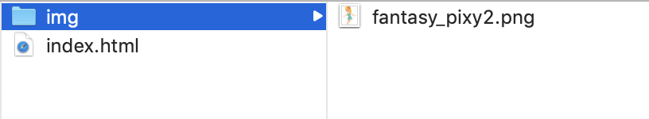

<link rel="stylesheet" href="style.css">

# CSS

CSSを学びましょう。HTMLを学んでいる人が前提知識となるので、不安な方は[HTMLチュートリアル](/lec_html/)を読みましょう。
CSSとHTMLについての説明、使い分けについてもそちらで説明しています。

## CSSを含めたテンプレ

まずはindex.htmlを作成し、以下の内容を書きます。

```html
<!DOCTYPE html>
<html lang="ja">
  <head>
    <meta charset="utf-8">
    <link rel="stylesheet" href="style.css">
    <title>Hello Page</title>
  </head>
  <body>
  </body>
</html>
```

## style.css?

CSSファイルを読み込むのは以下のlinkタグです。
linkタグとは、外部の文書ファイルを読み込むタグです。
rel属性はrelationの略で、読み込むファイルがどんな種類なのかを指定しています。
ここではstylesheetを指定していて、これは読み込みファイルがCSSファイルであることを示しています。
href属性で読み込みファイルを指定しています。

```html
<link rel="stylesheet" href="style.css">
```

### style.cssを作ろう

style.cssを作っておきます。index.htmlと同じディレクトリにファイルを作成し、これをstyle.cssという名前のファイルで保存しておきます。
ファイルの内容は以下のようにしておきます。

```css
@charset "utf-8";
```

cssファイルでは、先頭にcharsetいう文をつけて、ファイルの文字コードを設定します。
これより下に色々な文を書いていきます。

## 例
実際にCSSがどんな風に書かれるのかを見ていきましょう。
まずindex.htmlで適当に文章を作成します。body要素については、
HTMLチュートリアルの時と同じコードを用います。

```html
<!DOCTYPE html>
<html lang="ja">
  <head>
    <meta charset="utf-8">
    <link rel="stylesheet" href="style.css">
    <title>Hello Page</title>
  </head>
  <body>
    <h1>テーブル</h1>

    <p></p>

    <p>私はテーブルの妖精です。テーブルを作るのが仕事です。以下は私が作ったテーブルです。見納めください。</p>
    <table>
      <thead>
        <tr><th>商品名</th><th>値段</th><th>産地</th></tr>
      </thead>
      <tbody>
        <tr><td>りんご</td><td>1000円</td><td>りんご王国</td></tr>
        <tr><td>みかん</td><td>2300円</td><td>みかん王国</td></tr>
        <tr><td>バナナ</td><td>13200円</td><td>南国</td></tr>
      </tbody>
    </table>

    <h2>特徴</h2>
    <p>私が作ったテーブルには以下の特徴があります。</p>
    <ul>
      <li>商品名が書かれている</li>
      <li>値段が結構高い</li>
    </ul>

    <h2>感想などはこちらから</h2>
    <p>気に入ってくれた人は以下のフォームに感想を記入してください。</p>
      <form>
        <textarea></textarea>
        <p><input type="button" value="提出"></p>
        <p><label for="fav_check">面白かった: </label><input id="fav_check" type="checkbox"></p>
      </form>

    <p>サンプルなので<span style="color: red;">クリック</span>しても何も起こりません。</p>
    <p>Googleに飛びましょう、<a href="https://www.google.com">Let's Go!</a></p>
  </body>
</html>
```

画像表示のために、[こちらの「いらすとや」](https://www.irasutoya.com/2013/05/blog-post.html)から、妖精の画像をダウンロードしましょう。
画像を右クリックして、「画像を保存」「画像をダウンロード」のような文面のボタンを選択します。
画像ファイル名はデフォルトで「fantasy_pixy2.png」になっていると思います。ダウンロードした画像ですが、
index.htmlファイルと同じディレクトリにimgディレクトリを新たに作成し、その中に入れます。
ディレクトリ構成は以下の通りになります。



結果は以下のようになります。

<div class="output">

</div>

## Step01: 枠線

さてお待ちかね、CSSを書いていきます。style.cssに以下の文を書き足します。

```css
h1 {
  border-left: 5px solid #1E88E5;
  border-bottom: 2px dotted #1E88E5;
}
```

h1タグが以下のような見出しで描画されます。


<div class="output">
  <h1 style="border-left: 5px solid #1E88E5; border-bottom: 2px dotted #1E88E5;">テーブル</h1>
</div>

### CSSの方法
CSSの基本は、「要素を**選択**して**装飾**」することです。

- どの要素を選択するかを決める文法を**セレクタ**と言います。
- 装飾するための文法のことを**プロパティ**と言います。

次のような書式で書きます。

```text
セレクタ {
  プロパティ名: 値;
  プロパティ名: 値;
  ...
}
```

なので、次のような書き方で、「h1要素に対して2つのプロパティを設定している」ことがわかります。
```css
h1 {
  border-left: 5px solid #1E88E5;
  border-bottom: 2px dotted #1E88E5;
}
```

### セレクタ
セレクタとして単にh1と書くだけで、h1要素を選択することができることが、先ほどの例でわかりました。
要素名で指定するセレクタを「**要素セレクタ**」と呼びますが、もちろんこれ以外にもセレクタはたくさんあります。
セレクタを覚えることで、より柔軟に要素を選択することができるようになります。

また、JavaScriptやそのライブラリであるJQueryやD3.jsにおいても、同じような文法を用いて要素を選択することがあります。

最低限、以下のセレクタを覚えておきましょう。

- 要素セレクタ(今やった)
- クラスセレクタ(後でやる)
- 子孫セレクタ(後でやる)

### プロパティ

余白、色、枠線などの様々な装飾要素はプロパティで指定します。
プロパティはセレクタ以上に大量にあります。また、どんなプロパティが適用できるのかは要素によります。
経験を重ねて、様々なスタイルを覚えていきましょう。

### borderプロパティ

枠線を設定するプロパティです。
必ず「線の太さ 線のスタイル 線の色」という順で指定します。
線のスタイルとしてどんなものが指定できるのかについては
<a href="http://www.htmq.com/style/border.shtml" target="_blank">border - スタイルシートリファレンス</a>
を参照してください。以下はsolidを指定しているので、実線が引かれます。

色設定については後で補足します。

```html
<p>Hello</p>
```

```css
p {
  border: 1px solid #000;
}
```

<div class="output">
<p style="border: 1px solid #000">Hello</p>
</div>

#### border-&#x25cb;&#x25cb;&#x25cb;プロパティ

borderプロパティは四方の枠線を指定します。
しかし、それだと例えば「左だけ枠線を追加したい」などの要求に答えられません。
そんな人のために、個別で設定できるborder-left/border-right/border-bottom/border-topプロパティがあります。

```html
<p>Hello</p>
```

```css
p {
  border-left: 3px double #1E88E5;
  border-bottom: 3px double #1E88E5;
}
```

<div class="output">
  <p style="border-left: 3px double #1e88e5; border-bottom: 3px double #1e88e5;">Hello</p>
</div>


#### 補足: 色指定

色を指定する方法にはいくつかありますが、ここでは「カラーコードで指定する方法」と「色名で指定する方法」があります。

##### カラーコードで指定する方法  
カラーコードは必ず#で始まり、その後16進数の数字が6つ続きます。
先頭の2桁が赤、次の2桁が緑、最後の2桁が青を表します。RGBという順番で覚えておきましょう。
数字が大きいほどその色の成分が強くなり、例えば`#00ff00`は緑色を表したり、`#ffff00`は黄色を表したりします。
また簡便記法として**3桁のみで記述する方法**があります。例えば`#0f0`は`#00ff00`と同義であり、`#ff0`は`#ffff00`と同義です。

```html
<p>Hello</p>
```
```css
p {
  border: 1px solid #00ff00;
}
```
<div class="output">
<p style="border: 1px solid #00ff00;">Hello</p>
</div>

いい感じの色を探したいなら
<a href="https://flatuicolors.com" target="_blank">Flat UI Colors</a>
をお勧めします。フラットデザインに適した色を集めたサイトです。

##### 色名で指定する方法  
CSSであらかじめ用意された色名で指定する方法があります。どんなものがあるかは
<a href="https://developer.mozilla.org/ja/docs/Web/CSS/color_value" target="_blank">color - MDN</a>で確認できます。

```html
<p>Hello</p>
```
```css
p {
  border: 1px solid orangered;
}
```
<div class="output">
<p style="border: 1px solid orangered;">Hello</p>
</div>

### style.cssの修正

h2にも同じスタイルを指定しましょう。
style.cssを次のように修正します。

```css
h1, h2 {
  border-left: 5px solid #1E88E5;
  border-bottom: 2px dotted #1E88E5;
}
```

**カンマで区切ることで、複数要素を選択することができます**。これで、h1とh2に同じプロパティを設定することができました。


## Step02: 背景色と文字色

style.cssに以下の文を書き足します。

```css
thead tr {
  background-color: #2196f3;
  color: white;
}

tbody tr:nth-child(odd) {
  background-color: #e3f2fd;
}

ul {
  border: 1px solid #888;
  background-color: #eee;
}
```

これだけでいい感じの装飾になります。

<div class="output css-sample02">

</div>

新しいプロパティとセレクタが出てきましたので、紹介します。

### background-colorプロパティ

要素の背景色を指定するプロパティです。

```html
<p>Hello</p>
```
```css
p {
  background-color: skyblue;
}
```
<div class="output">
  <p style="background-color: skyblue">Hello</p>
</div>

### colorプロパティ

文字色を指定するプロパティです。
```html
<p>Hello</p>
```
```css
p {
  color: skyblue;
}
```
<div class="output">
  <p style="color: skyblue;">Hello</p>
</div>

### 子孫セレクタ

**A B Cのようにスペースキーで区切って要素を指定すると、「Aの要素に含まれるBを選択し、さらにBに含まれるCを選択する」という意味になります**。
この記法を「**子孫セレクタ**」と呼びます。

次のようなhtmlファイルがあったとします。

```html
<p>Hello</p>
<ul>
  <li><p>Taro</p></li>
  <li><p>Jiro</p></li>
  <li>
    <p>Saburo</p>
    <p>Shiro</p>
  </li>
</ul>
```

以下は、「liの中のpに対してborder-bottomプロパティを指定する」という意味になります。

```css
li p {
  border-bottom: 3px double #000;
}
```

liに包まれたpには下線が引かれ、liの外にあるp(Helloという文字列)は下線が引かれていないことがわかります。

<div class="output css-sample02-02">
  <p>Hello</p>
  <ul>
    <li><p>Taro</p></li>
    <li><p>Jiro</p></li>
    <li>
      <p>Saburo</p>
      <p>Shiro</p>
    </li>
  </ul>
</div>

### クラスセレクタ

例えば、「ある特定のリストのみ装飾したい」というケースがあるかもしれません。
そんな時に、クラスセレクタが威力を発揮します。

まずは、**装飾したい特定の要素にclass属性**を指定します。
今回は、「果物リストは赤枠線で、人々リストは青枠線で囲みたい」というケースを想定します。

```html
<ul class="fruit">
  <li>Apple</li>
  <li>Orange</li>
  <li>Banana</li>
</ul>

<ul class="people">
  <li>Taro</li>
  <li>Jiro</li>
  <li>Saburo</li>
</ul>
```

CSSは以下のように設定します。
この`.クラス名`という書式がクラスセレクタです。
クラス名とclass属性が合致する要素が選択されます。
```css
.fruit {
  border: 1px solid salmon;
}
.people {
  border: 1px solid steelblue;
}
```

<div class="output css-sample02-03">
  <ul class="fruit">
    <li>Apple</li>
    <li>Orange</li>
    <li>Banana</li>
  </ul>

  <ul class="people">
    <li>Taro</li>
    <li>Jiro</li>
    <li>Saburo</li>
  </ul>
</div>

もし「ulのうち、あるクラスに属するもの」という風に要素を絞りたい場合は次のように書きます。

```css
ul.fruit {
  border: 1px solid salmon;
}
ul.people {
  border: 1px solid steelblue;
}
```

### 擬似クラスセレクタ

**特定の状態を表すクラスを擬似クラス(pseudo-class)と呼びます**。ある要素の擬似クラスを指定したいときは、`要素:擬似クラス`と書きます。
擬似クラスにも色々ありますが、とりあえずfirst-child、last-childとnth-childを初めに紹介します。

#### first-child/last-child

first-childは選択された要素のうち最初の要素を表す擬似クラスです。
last-childは選択された要素のうち最後の要素を表す擬似クラスです。

```html
<ul>
  <li>Apple</li>
  <li>Orange</li>
  <li>Banana</li>
</ul>
```

```css
ul li:first-child {
  color: red;
}
```

<div class="output css-sample02-04">
  <ul>
    <li>Apple</li>
    <li>Orange</li>
    <li>Banana</li>
  </ul>
</div>

#### nth-child()

first-child/last-childよりも柔軟な指定ができる擬似クラスです。

- nth-child(An+B): AとBには整数値を指定する。An+Bで表せる番号の色が変化します。番号は1から始まります。  
  例: nth-child(4)で4番めの要素を選択
- nth-child(odd): 奇数番目の要素を指定する
- nth-child(even): 偶数番目の要素を指定する

```html
<ul>
  <li>Apple</li>
  <li>Orange</li>
  <li>Banana</li>
</ul>
```

```css
ul li:nth-child(odd) {
  color: orange;
}
```

<div class="output css-sample02-05">
  <ul class="fruit">
    <li>Apple</li>
    <li>Orange</li>
    <li>Banana</li>
  </ul>
</div>


## Step03: padding

<div class="output">
<h1 style="border-left:5px solid #1e88e5; border-bottom:2px dotted #1e88e5;">テーブル</h1>
</div>

なんか左側が詰まってる感じがありません？余白を開けましょう。

style.cssのh1,h2要素について、プロパティを追加します。

```css
h1, h2 {
  border-left: 5px solid #1E88E5;
  border-bottom: 2px dotted #1E88E5;
  padding-left: 10px;
}
```

いい感じになりました。

<div class="output">
<h1 style="padding-left: 10px; border-left:5px solid #1e88e5; border-bottom:2px dotted #1e88e5;">テーブル</h1>
</div>

### paddingプロパティ

**要素内部の余白(padding)**を指定するプロパティです。
borderの時と同様、padding-left/padding-right/padding-bottom/padding-topプロパティがあります。
それだけでなく、paddingプロパティ単体でも様々な書式を持っています。

```css
/* 上下左右のpaddingを10pxにする */
padding: 10px; 
/* 上下のpaddingを10px、左右のpaddingを5pxにする */
padding: 10px 5px; 
/* 上、左右、下の順に指定 */
padding: 5px 10px 5px; 
/* 上右下左(上から初めて時計回り)の順に指定 */
padding: 5px 10px 5px 10px; 
```

単位としてpxを設定していますが、0の場合は単位は必要ありません。

## Step04: margin

<div class="output css-sample02">
<ul >
<li>商品名が書かれている</li>
<li>値段が結構高い</li>
</ul>
</div>

なんか詰まっている感じがしませんか? 二つのliとの間隔を空けたいです。

style.cssに以下の文を追記します。

```css
li {
  margin: 5px 0;
}
```

いい感じですね。

<div class="output css-sample04">
<ul>
<li>商品名が書かれている</li>
<li>値段が結構高い</li>
</ul>
</div>

### marginプロパティ

**要素外部の余白(margin)**を指定するプロパティです。
書式についてはpaddingと同様です。
paddingとの違いをちゃんと意識しましょう。

#### paddingとmargin

念のため比較用のコードを書いてみます。
背景色と枠線を設定しておきます。

```html
<ul>
  <li>Apple</li>
  <li>Orange</li>
  <li>Banana</li>
</ul>
```

```css
li {
  border: 1px solid #333;
  background-color: #ccc;
}
```
<div class="output css-sample04-02">
  <ul>
    <li>Apple</li>
    <li>Orange</li>
    <li>Banana</li>
  </ul>
</div>

paddingとmarginの指定の違いを以下に見せます。

##### paddingの場合
```css
li {
  border: 1px solid #333;
  background-color: #ccc;
  padding: 10px 0;
}
```

要素内部の余白が上下方向に10px空きます。
<div class="output css-sample04-03">
  <ul>
    <li>Apple</li>
    <li>Orange</li>
    <li>Banana</li>
  </ul>
</div>

##### marginの場合

```css
li {
  border: 1px solid #333;
  background-color: #ccc;
  margin: 10px 0;
}
```

要素外部の余白が上下方向に10px空きます。
<div class="output css-sample04-04">
  <ul>
    <li>Apple</li>
    <li>Orange</li>
    <li>Banana</li>
  </ul>
</div>


画像とテーブルが中央寄せになりました。

## ここまでのstyle.css

paddingとmarginを少しいじった結果を記しておきます。

```css
@charset "utf-8";

h1, h2 {
  border-left: 5px solid #1E88E5;
  border-bottom: 2px dotted #1E88E5;
  padding-left: 10px;
}

th, td {
  padding: 5px;
}

thead tr {
  background-color: #2196F3;
  color: white;
}

tbody tr:nth-child(odd) {
  background-color: #E3F2FD;
}

ul {
  border: 1px solid #888;
  background-color: #eee;
  color: #000;
  margin: 0 0 0 20px;
  padding: 10px 20px;
}

li {
  margin-top: 5px;
}
```

<div class="css-sample04-05 output">

</div>

## Step05: 要素の表示形式

以下の灰色領域が横に伸びてしまい、右側の空白が気になります。
これをなんとか解決できないでしょうか。

<div class="css-sample04-05 output">
  <ul>
    <li>商品名が書かれている</li>
    <li>値段が結構高い</li>
  </ul>
</div>

できます。以下のように、ulのプロパティとしてdisplayを追加します。

```css
ul {
  display: inline-block;
  border: 1px solid #888;
  background-color: #eee;
  color: #000;
  margin: 0 0 0 20px;
  padding: 10px 20px;
}
```

<div class="css-sample05 output">
  <ul>
    <li>商品名が書かれている</li>
    <li>値段が結構高い</li>
  </ul>
</div>

### displayプロパティ

要素の表示形式を指定するプロパティです。指定できる形式は様々ですが、ここではひとまず

- inline
- block
- inline-block

の3点について説明します。

#### inline

inlineが指定された要素は、テキストの一部のように扱われます。
大きな特徴は次の2点です。

- **ある要素があった場合、その横に配置される**
- **widthやheightを指定することができず、自動で要素の大きさを変える**

デフォルトでinlineである要素はaやspanです。またテキストそのものもinline要素です。
```html
<p>
  <span style="border: 1px solid red;">Hello</span>,
  <span style="border: 1px solid blue;">World</span>
</p>
```

<div class="output">
<p>
  <span style="border: 1px solid red;">Hello</span>,
  <span style="border: 1px solid blue;">World</span>
</p>
</div>

#### block

blockが指定された要素は、文書のあるひとかたまりのように扱われます。
大きな特徴は次の2点です。

- **ある要素があった場合、改行されて次の行に配置される**
- **widthやheightを指定して、自由に大きさを変えられる**

デフォルトでblockである要素はliやdivです。

```html
<ul>
  <li style="border: 1px solid red;">Hello</li>
  <li style="border: 1px solid blue;">World</li>
</ul>
```

<div class="output">
<ul>
  <li style="border: 1px solid red;">Hello</li>
  <li style="border: 1px solid blue;">World</li>
</ul>
</div>

#### inline-block

inlineとblockの特徴を混ぜたような表示形式です。

- **ある要素があった場合、その横に配置される**
- **widthやheightを指定して、自由に大きさを変えられる**
  ただし、**width/heightを指定しない場合は自動伸縮する**

ということで、ul要素に`display:inline-block`を指定すると、以下のようになります。
```html
<ul style="display: inline-block;">
  <li style="border: 1px solid red;">Hello</li>
  <li style="border: 1px solid blue;">World</li>
</ul>
```

<div class="output">
  <ul style="display: inline-block;">
    <li style="border: 1px solid red;">Hello</li>
    <li style="border: 1px solid blue;">World</li>
  </ul>
</div>

他に重要なdisplayの値として**flex**というものがあります。
これについては後で説明します。

## Step06: 色々寄せる

次のような要求を叶えましょう。

- 画像とテーブルを中央寄せしたい
- テーブルの見出しを中央寄せにしたい
- テーブルのコンテンツを右寄せにしたい

style.cssに以下の文を付け足します。

```css
img {
  display: block;
  margin: 0 auto;
}
table {
  margin: 0 auto;
}
th {
  text-align: center;
}
td {
  text-align: right;
}
```

<div class="css-sample06 output">

</div>


### block要素を中央寄せする

marginプロパティにautoをつけると、marginを自動計算してくれます。次のように書くと、「上下方向の余白は0、左右は適当に調整して」
という意味になり、コンテンツの中央寄せを実現できます。
ただし、**幅が固定されていないと要素が画面いっぱいに広がってしまうので注意しましょう**。

```html
<p>Hello, World</p>
```

```css
p {
  width: 200px;
  background-color: salmon;
  margin: 0 auto;
}
```

<div class="output">
  <p style="width: 200px; background-color: salmon; margin: 0 auto;">Hello, World</p>
</div>

#### width/heightプロパティ

ここで初めて出てきたプロパティなので紹介します。
名前から分かる通り、要素の幅/高さを指定するプロパティです。
タグの属性にもwidth/heightがありましたが、どちらから指定しても変わりません。
ただし、属性とCSSの両方において、width/heightの設定を書いた場合、CSSの設定が優先されるようです
(<a href="http://www.inqsite.net/weblog/737/" target="_blank">ソース</a>)。

### テキスト/inline要素の寄せ

**その要素の親要素にtext-alignを付けます。親要素はblock要素である必要があります。**

```html
<p>Hello, World</p>
```

```css
p {
  background-color: salmon;
  text-align: center;
}
```

<div class="output">
  <p style="background-color: salmon; text-align: center;">Hello, World</p>
</div>

### img要素の中央寄せ

img要素はデフォルトでinline要素です。それを包んでいるpタグに対してtext-alignを付与しても良いのですが、
img要素を包んでいるpタグのみを選択するための仕組みが必要です。
classやid属性をつけることでそれは実現できますが、方法として少し大げさです。
そこで、img要素をblock要素に変えて、margin属性を付与することにします。

```html
<p></p>
```

```css
img {
  width: 200px;
  display: block;
  margin: 0 auto;
}
```

<div class="output">
<p></p>
</div>

[例のhtmlファイル](#例)ではwidth属性によって幅を指定していましたが、今回の例のようにcssから幅を変更することも可能です。

中央寄せを実現する方法は他にもあります。例えばflexを利用する方法があります。flexについてはStep11で説明します。

## Step07: tableの色々なスタイル

テーブルのセル同士に間隔が空いています。間隔を詰めたいです。

<div class="css-sample06 output">
<table>
  <thead>
    <tr><th>商品名</th><th>値段</th><th>産地</th></tr>
  </thead>
  <tbody>
    <tr><td>りんご</td><td>1000円</td><td>りんご王国</td></tr>
    <tr><td>みかん</td><td>2300円</td><td>みかん王国</td></tr>
    <tr><td>バナナ</td><td>13200円</td><td>南国</td></tr>
  </tbody>
</table>
</div>

border-collapseプロパティを指定することで、テーブルの間隔が詰まります。

```css
table {
  border-collapse: collapse;
  margin: 0 auto;
}
```

<div class="css-sample07 output">
<table>
  <thead>
    <tr><th>商品名</th><th>値段</th><th>産地</th></tr>
  </thead>
  <tbody>
    <tr><td>りんご</td><td>1000円</td><td>りんご王国</td></tr>
    <tr><td>みかん</td><td>2300円</td><td>みかん王国</td></tr>
    <tr><td>バナナ</td><td>13200円</td><td>南国</td></tr>
  </tbody>
</table>
</div>

### border-collapseプロパティ

隣接するセルのボーダーの境界ついてのプロパティです。
次の2種類の値が設定できます。

- collapse: 境界を重ねます。
- separate: 境界を別々に持ちます。
  境界同士の間隔はborder-spacingという別のプロパティを用いて設定します。

### table-layoutプロパティ

テーブル幅を固定したい場合がたまにあるので、ここで紹介しておきます。
次の2種類の値が設定できます。

- auto: テーブル列幅を、コンテンツに応じて自動調整します。
- fixed: テーブル列幅を固定します。

以下は、市松模様を出力するコードです。tdタグの中には何もコンテンツを入れていません。

```html
<table>
  <tbody>
    <tr><td></td><td></td><td></td><td></td></tr>
    <tr><td></td><td></td><td></td><td></td></tr>
    <tr><td></td><td></td><td></td><td></td></tr>
    <tr><td></td><td></td><td></td><td></td></tr>
  </tbody>
</table>
```

その代わりに、テーブル幅を固定にした後サイズを50pxの正方形にします。
擬似クラスを用いて、黒マスと白マスを決定しています。

```css
table {
  border-collapse: collapse;
  margin: 0 auto;
  table-layout: fixed;
}
td {
  width: 50px;
  height: 50px;
  border: 1px solid #000;
}
tr:nth-child(odd) td:nth-child(odd) {
  background-color: #000;
}
tr:nth-child(even) td:nth-child(even) {
  background-color: #000;
}
```

<div class="output css-sample07-02">
<table>
  <tbody>
    <tr><td></td><td></td><td></td><td></td></tr>
    <tr><td></td><td></td><td></td><td></td></tr>
    <tr><td></td><td></td><td></td><td></td></tr>
    <tr><td></td><td></td><td></td><td></td></tr>
  </tbody>
</table>
</div>

## Step08: リストの様々なスタイル

リストというのは同じ分類のものを並べる際にしばしば用いられるタグです。
例えばサイドバーやナビゲーションバーの目次でも使われることがあります。
そのようなケースでは、リストの黒点が邪魔になります。

以下のケースでは別に消さなくても良い気がしますが、練習として消しましょう。

<div class="css-sample06 output">
<ul>
  <li>商品名が書かれている</li>
  <li>値段が結構高い</li>
</ul>
</div>  

style.cssのulについて、list-style-typeというプロパティを追加します。

```css
ul {
  display: inline-block;
  list-style-type: none;
  border: 1px solid #888;
  background-color: #eee;
  color: #000;
  margin: 0 0 0 20px;
  padding: 10px 20px;
}
```

### list-style-typeプロパティ

リストのマーカーを指定するプロパティです。数字やアルファベット、円形、四角形など様々なマーカーを指定できます。
どんなものがあるかは
<a href="https://developer.mozilla.org/ja/docs/Web/CSS/list-style-type" target="_blank">list-style-type - MDN</a>
を参照してください。
noneを指定すればマーカーが無くなります。

<div class="css-sample08 output">
<ul>
  <li>商品名が書かれている</li>
  <li>値段が結構高い</li>
</ul>
</div>

## Step 09: ボタンの装飾

ボタンを装飾しましょう。しかしボタンとチェックボックスの両方がinputタグという括りになってしまっているため、
これらをどうにかして区別しなくてはなりません。class属性やid属性をつけなくてはならないのでしょうか?

<div class="output">
  <form>
    <textarea></textarea>
    <p><input type="button" value="提出"></p>
    <p><label for="fav_check">面白かった: </label><input id="fav_check" type="checkbox"></p>
  </form>
</div>

いいえ、もっと単純な解決策があります。style.cssに以下の記述を追加しましょう。

```css
form input[type="button"] {
  background-color: #2196f3; 
  width: 50px;
  height: 25px;
  color: white;
  border: none;
}
form input[type="button"]:hover {
  color: #2196f3; 
  background-color: white;
}
```

ボタンの上にマウスを乗せると、色が変わります。

<div class="css-sample09 output">
  <form>
    <textarea></textarea>
    <p><input type="button" value="提出"></p>
    <p><label for="fav_check">面白かった: </label><input id="fav_check" type="checkbox"></p>
  </form>
</div>

### 属性セレクタ

属性を用いて要素を絞るためのセレクタです。属性セレクタにもいくつか種類がありますが、
次のように書くと、「type属性がbuttonであるようなinput要素」と選択できます。

```text
input[type="button"] {
  ...  
}
```

### 擬似クラス (2)

hoverはマウスに乗った要素を指定する擬似クラスです。
マウス関係の擬似クラスは他にもあって、以下のようなものがあります。

- link: 未訪問のリンク(a要素に使用)
- visited: 訪問済のリンク(a要素に使用)
- hover: マウスが乗った状態
- active: クリックされたから離されるまでの状態

## Step10: 文字の設定(完成)

formのpタグの余白を調整して、文字の太さとかサイズとかを変えます。
textareaが狭いので広げるようにプロパティを指定してあげましょう。

ここでしか出てこないのでちゃんとは説明しませんが、textareaに指定した`resize:none`というプロパティで、
textareaのサイズをユーザーが変えられないようにしています。

完成したstyle.cssは以下のようになります。

```css
@charset "utf-8";

h1, h2 {
  border-left: 5px solid #1E88E5;
  border-bottom: 2px dotted #1E88E5;
  padding-left: 10px;
}
th, td {
  padding: 5px;
  font-size: 18px;
}
thead tr {
  background-color: #2196F3;
  color: white;
}
tbody tr:nth-child(odd) {
  background-color: #E3F2FD;
}
ul {
  display: inline-block;
  list-style-type: none;
  border: 1px solid #888;
  background-color: #eee;
  color: #000;
  margin: 0 0 0 20px;
  padding: 10px 20px;
  font-weight: bold;
}
li {
  margin-top: 5px;
}
img {
  display: block;
  margin: 0 auto;
}
table {
  border-collapse: collapse;
  margin: 0 auto;
}
th {
  text-align: center;
}
td {
  text-align: right;
}
form input[type="button"] {
  background-color: #2196f3; 
  width: 50px;
  height: 25px;
  color: white;
  border: none;
  font-weight: bold;
  font-size: 12px;
}
form input[type="button"]:hover {
  color: #2196f3; 
  background-color: white;
}
form p {
  padding: 0;
  margin: 0;
}

textarea {
  resize: none;
  width: 300px;
  height: 200px;
}
```
<div class="css-sample output">

</div>

### font-sizeプロパティ

文字サイズを指定します。

### font-weightプロパティ

文字の太さを指定します。boldで太字になります。数値で太さを指定することもできるようです。

### font-familyプロパティ

フォントを指定します。どんな値が指定できるかについては
<a href="https://developer.mozilla.org/ja/docs/Web/CSS/font-family" target="_blank">font-family - MDN</a>
を参照してください。最低限以下の値は覚えておきましょう。

- serif: PCが標準で持っている明朝体
- sans-serif: PCが標準で持っているゴシック体
- フォント名で指定: 使っているPCにそのフォントが入っていない場合は無効になる

また、カンマで区切って複数の値を設定できます。
「フォントAAAを優先し、もしそれがなければフォントBBBを優先し、それでもなければ標準のゴシック体にする」
という場合は以下のように書きます。

```css
font-family: "AAA", "BBB", sans-serif;
```

綺麗なWebサイトを作る上でフォント選びはかなり重要です。

さて、「一つのページを装飾する」というケースを想定して、CSSを学んできました。ここで一区切りをつけたいと思います。

しかしまだ説明し足りないことがあるので、チュートリアルは続きます。

## 新たな例

今までと同じようにindex.html、style.cssを用意して、画像も同じように用意します。
index.htmlには以下のように書きます。

```html
<html lang="ja">
  <head>
    <meta charset="utf-8">
    <link rel="stylesheet" href="style.css">
    <title>Hello Page</title>
  </head>
  <body>
    <div class="wrapper">
      <div class="description">
        <p>私は妖精です。テーブルを作るのが趣味です。</p>
        <p></p>
      </div>
      <div class="alphabet">
        <p style="background-color: #F44336;">A</p>
        <p style="background-color: #2196F3;">B</p>
        <p style="background-color: #FFEB3B;">C</p>
        <p style="background-color: #4CAF50;">D</p>
        <p style="background-color: #9C27B0;">E</p>
      </div>
    </div>
  </body>
</html>
```

style.cssに、最低限のCSSを設定しておきます。
line-heightについては説明していませんでしたが、これは行の高さを設定するプロパティです。文字を縦方向中央寄せするために用いています。

```css
@charset "utf-8";

.wrapper {
  width: 800px;
  border: 6px double #aaa;
}
img{
  width: 200px;
}
.description p:first-child{
  width: 200px;
  border: 1px dotted #888;
  padding: 10px;
}
.alphabet p{
  width: 100px;
  height: 100px;
  text-align: center;
  line-height: 100px;
  font-size: 32px;
  color: white;
}
.description {
  border: 2px dotted salmon;
}
.alphabet {
  margin-top: 10px;
  border: 2px dotted skyblue;
}
```

<div class="css-sample-new output">

</div>

## Step11: 横に並べる

次の要求を叶えましょう。

- 「私は妖精です」の文章の横に、画像が配置されるようにしたいです
- ABCDEを横に並べたいです。等間隔で並べられるようにしたいです

style.cssの.descriptionと.alphabetを修正します。

```css
.wrapper {
  width: 800px;
  border: 6px double #aaa;
  display: flex;
  flex-direction: column;
  align-items: center;
}
.description {
  border: 2px dotted salmon;
  display: flex;
  flex-direction: row;
}
.alphabet {
  margin-top: 10px;
  border: 2px dotted skyblue;
  display: flex;
  flex-direction: row;
}
```

<div class="css-sample11 output">

</div>

### display: flex

display:flexは要素を並べるのに非常に有用なプロパティです。
次のように指定すると、**その子要素の並び**を容易に操作できるようになります。

```css
display: flex;
```

display:flexが指定された親要素をflexコンテナ、その子要素をflexアイテムと呼びます。

### flex-directionプロパティ

flexアイテムの並び方向を制御します。以下の2つの値が指定できます。

- row: 横並び
- column: 縦並び

### justify-contentプロパティ

flexアイテムの水平方向の並び位置を制御します。どんな値が指定できるかは
<a href="https://www.webcreatorbox.com/tech/css-flexbox-cheat-sheet#flexbox5" target="_blank">justify-content - Flexboxチートシート</a>
で指定できます。**水平方向がどの方向なのかについては、flex-directionの値によって変わるので注意しましょう。**
rowなら横方向、columnなら縦方向の並び位置を制御することになります。

例では`space-between`というプロパティを指定しています。これはアイテムを均等に配置する設定です。

### align-itemsプロパティ

flexアイテムの垂直方向の並び位置を制御します。rowだったら縦並び、columnだったら横並びを制御します。
<a href="https://www.webcreatorbox.com/tech/css-flexbox-cheat-sheet#flexbox6" target="_blank">align-items - Flexboxチートシート</a>
で指定できます。**垂直方向がどの方向なのかについては、flex-directionの値によって変わるので注意しましょう。**
rowなら縦方向、columnなら横方向の並び位置を制御することになります。

例では`center`というプロパティを指定しています。これはアイテムを中央寄せにする設定です。

flexについての詳しい話は
<a href="https://www.webcreatorbox.com/tech/css-flexbox-cheat-sheet" target="_blank">Flexboxチートシート</a>
が詳しいです。

## Step12: サイドバーっぽくする

ABCDEを左端に縦に並べてサイドバーっぽく表示しましょう。

style.cssを以下のようにします。

```css
@charset "utf-8";

.wrapper {
  width: 800px;
  border: 6px double #aaa;
  display: flex;
  flex-direction: row;
  align-items: center;
}
img{
  width: 200px;
}
.description p:first-child{
  width: 200px;
  border: 1px dotted #888;
  padding: 10px;
}
.alphabet p{
  width: 100px;
  height: 100px;
  text-align: center;
  line-height: 100px;
  font-size: 32px;
  color: white;
  margin: 0;
  padding: 0;
}
.description {
  order: 1;
  border: 2px dotted salmon;
  display: flex;
  flex-direction: row;
  margin-left: 100px;
}
.alphabet {
  order: 0;
  width: 150px;
  margin-top: 10px;
  border: 2px dotted skyblue;
  display: flex;
  flex-direction: column;
  justify-content: flex-start;
  align-items: center;
}
```

<div class="output css-sample12">
  
</div>

### orderプロパティ

flexアイテムの並び順を制御するプロパティです。
数字の小さいものほど最初に並べられるようになります。

例では以下のようになっていることから、ABCDEの塊が最初に並べられることになります。

```css
.description {
  order: 1;
  ...
}
.alphabet {
  order: 0;
  ...
}
```

## まとめ

いかがだったでしょうか。CSSの基本はセレクタとプロパティだけで、あとはそれらを使いながら覚えていくだけです。

これからはみなさんが実際にWebページを作りながら学んでいってください。
「こんなことをやりたいんだけどなー」と思い、ググってみると案外情報は見つかります。
そのようにたくさんググると、自然と知識は身についているものです。

最後まで読んでいただき、ありがとうございました。
