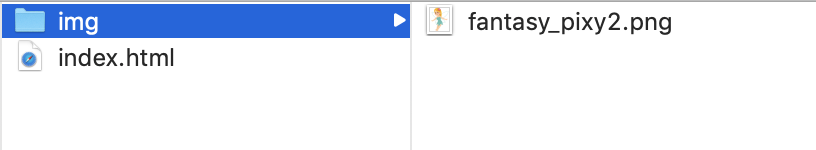

# HTMLとCSS
## HTMLとは
HTMLとは、**Hyper Text Markup Language**の略で、**Webページ上の文書の構造を記述するための言語**です。

## CSSとは
CSSとは、**Cascading Style Sheet**の略で、**Webページの見た目を記述するための言語**です。

## 分業を心がける
**HTMLは「文章の意味」をまとめる**、**CSSは文章を飾る**ということを必ず心に留めておきましょう。

HTMLで「文章の意味」をまとめる、の例:
- ここは見出しにしたい
- ここは段落にしたい
- ここはコンテンツを並べたい

CSSで文章を飾る、の例:
- この見出しの文字サイズを小さめに
- 余白をもう少しとったほうがよいな
- 背景色を変えよう

## テンプレ(不完全)
とりあえず骨組みだけ書きます。テキストエディタを開いて、以下のように書いたら、index.htmlというファイル名で適当な場所に保存しましょう。

```html
<html>
  <head>
  </head>
  <body>
  </body>
</html>
```

出来上がったファイルをダブルクリックすると、ブラウザが起動して真っ白のページが表示されます。

今回、ファイル名をindex.htmlにしましたが、
このチュートリアルにおいてはindex.html以外の名前でも構いません。
実際にWebページを作る場合、トップページをindex.htmlにするのが普通です。
なぜなら、ほとんどのWebサーバーにおいて、URLが以下のように変換されるからです。

「http://XXX.com/」 &rArr; 「http://XXX.com/index.html」

### タグ(tag)

&lt;と&gt;で囲まれた文を**タグ**と呼びます。**タグは意味をまとめる**という役割を担います。
例えば、「ここはひとつの段落でまとめたいな」と思ったら、文章をpタグで囲みます。
「ここは記事全体を表したい」と思ったら、その領域をarticleタグで囲みます。
文章の意味をまとめるための様々なタグが用意されているわけですが、それらについては後で見ていきます。

多くのタグは以下のような文法を持ちます。**「開始タグ」と「終了タグ」で囲まなければならない**、というルールがあります。
終了タグには、タグ名の先頭にスラッシュ記号をつけます。
念のため注意しておきますが、**タグの記述に全角を用いることはできません**。
```html
文法:
<タグ名>内容</タグ名>

例:
<body>内容</body>
<p>内容</p>

だめな例(全角になっている):
＜p＞内容＜/p＞
```

**終了タグを持たないタグもいくつかあります**。Webページ作成でよく使うのはimgタグです。

さて、index.htmlにおいて、html、head、bodyタグが現れました。これらのタグについて軽く解説します。

### htmlタグ

「ここがhtmlの中身であるよ」という意味を表すタグです。htmlタグの外側に何かを書くことはありません。

### headタグ

タイトルとか文字コードなどの、本文章でないところを書くためのタグです。

### bodyタグ

本文章を書くためのタグです。

### 要素(element)

タグと似たようなものとして、**要素(element)**という概念があります。**これはタグとそれで囲まれた全体を指す言葉**です。
例えば、
```html
<p>内容</p>
```
という文があった場合、

- pタグ: `<p>`と`</p>`を指す
- p要素: `<p>`と`</p>`をで囲まれた全体`<p>内容</p>`を指す。

と区別されます。

## テンプレ(ほぼ完全)

先ほど挙げたindex.htmlファイルは不完全です。以下のように修正します。

```html
<!DOCTYPE html>
<html lang="ja">
  <head>
    <meta charset="utf-8">
    <title>Hello Page</title>
  </head>
  <body>
  </body>
</html>
```

### DOCTYPE宣言
これはHTMLファイルの先頭に必ず書かれます。
このHTML文書がどのバージョンのHTMLなのかを識別するための宣言です。
とりあえず以下のように書いておけば、現在最新のHTML5を利用できます。
```html
<!DOCTYPE html>
```

### 属性(attribute)
htmlタグの横にlang="ja"という記述がりますが、このようにタグの後に続けて入力される付加情報を**属性(attribute)**と呼びます。
どんなタグにどんな属性を設定できるかは、タグによってまちまちです。

html属性にはlangという属性が設定できます。langというのはlanguageの略ですね。このhtml文書がどんな言語で書かれているのかを識別するための属性です。

### titleタグ
このタグの内部で書いた文が、Webページのタイトルになります。実際、Webブラウザでindex.htmlを開いてみると、ページのタイトルがHello Pageとなっています。

### metaタグ
付ける属性によって様々な設定を行えるタグです。ここではcharsetを指定しています。これは文字コードを設定するための属性で、utf-8を設定しているので文字コードがutf-8となります。

## タグ覚えゲー？

この時点で、覚えるタグ多くないですか？と思うかもれません。でもタグは英単語ほど多くありません。
どんなタグがあるのかについては[HTML5リファレンス](http://www.htmq.com/html5/)を参照してみればよいと思います。
このチュートリアルでは、そのうちよく使われるタグを紹介します。

### 例

```html
<!DOCTYPE html>
<html lang="ja">
  <head>
    <meta charset="utf-8">
    <title>Table World</title>
  </head>
  <body>
    <h1>テーブル</h1>

    

    <p>私はテーブルの妖精です。テーブルを作るのが仕事です。以下は私が作ったテーブルです。見納めください。</p>
    <table>
      <thead>
        <tr><th>商品名</th><th>値段</th><th>産地</th></tr>
      </thead>
      <tbody>
        <tr><td>りんご</td><td>1000円</td><td>りんご王国</td></tr>
        <tr><td>みかん</td><td>2300円</td><td>みかん王国</td></tr>
        <tr><td>バナナ</td><td>13200円</td><td>南国</td></tr>
      </tbody>
    </table>

    <h2>特徴</h2>
    <p>私が作ったテーブルには以下の特徴があります。</p>
    <ul>
      <li>商品名が書かれている</li>
      <li>値段が結構高い</li>
    </ul>

    <h2>感想などはこちらから</h2>
    <p>気に入ってくれた人は以下のフォームに感想を記入してください。</p>
      <form>
        <textarea></textarea>
        <p><input type="button" value="提出"></p>
        <p><label for="fav_check">面白かった: </label><input id="fav_check" type="checkbox"></p>
      </form>

    <p>サンプルなので<span style="color: red;">クリック</span>しても何も起こりません。</p>
    <p>Googleに飛びましょう、<a href="https://www.google.com">Let's Go!</a></p>
  </body>
</html>
```

なんとも頭の悪い内容のWebページですが、サンプルなので気にしないでください。
index.htmlを開くと、以下のようなWebページが表示されます。
ただし、画像だけは正しく表示されないと思います。これについてはimgタグの項で説明します。

<div class="output">
  <h1>テーブル</h1>

  

  <p>私はテーブルの妖精です。テーブルを作るのが仕事です。以下は私が作ったテーブルです。見納めください。</p>
  <table>
    <thead>
      <tr><th>商品名</th><th>値段</th><th>産地</th></tr>
    </thead>
    <tbody>
      <tr><td>りんご</td><td>1000円</td><td>りんご王国</td></tr>
      <tr><td>みかん</td><td>2300円</td><td>みかん王国</td></tr>
      <tr><td>バナナ</td><td>13200円</td><td>南国</td></tr>
    </tbody>
  </table>

  <h2>特徴</h2>
  <p>私が作ったテーブルには以下の特徴があります。</p>
  <ul>
    <li>商品名が書かれている</li>
    <li>値段が結構高い</li>
  </ul>

  <h2>感想などはこちらから</h2>
  <p>気に入ってくれた人は以下のフォームに感想を記入してください。</p>
    <form>
      <textarea></textarea>
      <p><input type="button" value="提出"></p>
      <p><label for="fav_check">面白かった: </label><input id="fav_check" type="checkbox"></p>
    </form>

  <p>サンプルなので<span style="color: red;">クリック</span>しても何も起こりません。</p>
  <p>Googleに飛びましょう、<a href="https://www.google.com">Let's Go!</a></p>
</div>

様々なタグが出てきましたね。それぞれ説明していきます。


### h1/h2/.../h6

見出し(heading)を表すタグ
h1は大見出し、h2はそれより小さい見出し、というように、数字が増えるたびに見出しが小さくなります。

### img

画像を表すタグです。終了タグが要らないタグの一つです。

src属性によって画像の場所を指定しています。width、height属性で画像の幅と高さを指定します。

#### 画像を表示する

[こちらの「いらすとや」](https://www.irasutoya.com/2013/05/blog-post.html)から、妖精の画像をダウンロードしましょう。
画像を右クリックして、「画像を保存」「画像をダウンロード」のような文面のボタンを選択します。
画像ファイル名はデフォルトで「fantasy_pixy2.png」になっていると思います。ダウンロードした画像ですが、
index.htmlファイルと同じディレクトリにimgディレクトリを新たに作成し、その中に入れます。
ディレクトリ構成は以下の通りになります。



これで、imgディレクトリにfantasy_pixi2.pngが存在しているから、以下のようにsrc属性を指定すれば、画像がめでたく表示されます。

```html

```


### p

段落(paragraph)を記述するタグ。段落なのでタグごとに改行されます。
例えば以下のように入力したとします。

```html
<p>Hello</p>
<p>World</p>
```

その結果、以下のようにHelloとWorldが別の行に出力されます。

<div style="border: 1px dotted #333; padding: 0 20px;">
  <p>Hello</p>
  <p>World</p>
</div>

### table

テーブルを表すタグ。theadとtbodyタグで構成されます。

#### thead

テーブルのヘッダ(table header)を表すタグです。trタグとthタグで構成されます。

#### tbody

テーブルの実際の要素(table body)を表すタグです。trタグとtdタグで構成されます。

これらの中に、さらに階層的に以下のタグを記述します。
tdとthをまとめてセルと呼ぶことがあります。

- **tr**  
  テーブルの列(table row)を意味するタグです。中にtdまたはthを入れ子にします。
- **td**  
  テーブルの要素(table data)を意味するタグです。
- **th**  
  テーブルのヘッダ(table header)要素を意味するタグです。

### ul

順序無しリスト(unorderd list)を表すタグです。リストの要素はliでくくられます。

#### li

リストの要素を表すタグです。

### ol
例では登場していませんでしたが紹介します。これは順序付きリスト(orderd list)を表すタグです。
ulと同じく、liを入れ子にします。例えば、先ほどの例を以下のように、olに書き換えます。

```html
<ol>
  <li>商品名が書かれている</li>
  <li>値段が結構高い</li>
</ol>
```

結果は以下のように出力されます。

<div class="output">
  <ol>
    <li>商品名が書かれている</li>
    <li>値段が結構高い</li>
  </ol>
</div>

### span

何かの「範囲(span)」を表すタグです。
spanそのものは「範囲」という意味しかありません。より詳しくは、ソースコードの書き手が意味を決めます。
属性やCSSを付加することで意味を持ちます。

```html
<span style="color: red;">Hello</span>,<span style="color: blue;">World</span>
```

styleはCSSスタイルを設定する属性です。CSSの文法についてはCSSチュートリアルの方で説明します。ひとまず、
```CSS
color: red;
```
という書くと、文字の色を指定できることを覚えておきましょう。次のような結果になります。

<div class="output">
<span style="color: red;">Hello</span>,<span style="color: blue;">World</span>
</div>


### div

spanと同じく、「区切り(division)」を表すタグです。
divそのものには「区切り」という意味しかありません。より詳しくは、ソースコードの書き手が決めます。
属性やCSSを付加することで意味を持ちます。

例えば、「ここは説明文を含む領域である」と意味を分けたいなら、次のように書きます。

```html
<div class="description">
  <p>私が作ったテーブルには以下の特徴があります。</p>
  <ul>
    <li>商品名が書かれている</li>
    <li>値段が結構高い</li>
  </ul>
</div>
```

divタグやspanタグに、しばしば**class属性**を付けます。class属性には任意の文字列を設定できます。
とりあえず今回は適当にdescriptionという名前にしました。

classはCSSでスタイルを変更する際に基本となる概念です。これについてはCSSのチュートリアルで説明します。

### spanとdivの違い

spanもdivもある範囲や領域を表すタグですが、これらの違いは何でしょうか?

結論から言うと、**spanはデフォルトでインライン要素**であり、**divはデフォルトでブロック要素**という違いがあります。


インラインとブロックについてはCSSのチュートリアルの方で説明しますが、とりあえず
- spanは文章中のある範囲に意味を付けるタグ
- divは構造の塊に意味を付けるタグ

という使い方をすることを覚えておきましょう。

### textarea

文字を入力するエリアを定義します。

### form

フォームを定義するエリアです。
フォームとは「登録フォーム」とか「入力フォーム」とか言うあれです。
入力内容をどこかに送信するための領域を指します。


### input

様々なフォーム部品を定義します。終了タグがないのが一つの特徴です。
フォーム部品としてボタンや入力エリアやチェックボックスなど様々なものがありますが、
とりあえず今回はボタンだけ紹介します。

```html
<input type="button" value="Hello">
<input type="checkbox">
```

type属性に、どんなフォーム部品にするかを指定します。buttonを指定するとボタンになり、
checkboxを指定するとチェックボックスになります。
その他については[&lt;input&gt;-HTML5リファレンス](http://www.htmq.com/html5/input.shtml)を見ていただければ良いと思います。
value属性にはボタンのラベルを指定しています。

<div class="output">
<input type="button" value="Hello">
<input type="checkbox">
</div>

また、フォーム部品をフォームのために使わず、単なるボタンやチェックボックスとしての使い方もできます。
その場合はこれらをformタグで括る必要はありません。
実際D3.jsのチュートリアルでは、ボタンが押された時の情報をサーバーに送らず、JavaScriptでイベント発火としての目的で使っています。

### label

フォーム部品の名前を表示するために用いられる要素です。
inputにid属性とlabelのfor属性を合わせると、labelをクリックしたらそれに対応するinputも反応するようになります。
例えば、以下のように書いたとします。

```html
<label for="abc">Hello</label><input id="abc" type="checkbox">
```

すると、チェックボタンではなくHelloというラベルをクリックしても、チェックボタンが反応するようになります。

<div class="output">
  <label for="abc">Hello</label><input id="abc" type="checkbox">
</div>

今回id属性というものが出てきましたが、これはlabelだけに用いられる属性ではありません。
CSSやJavaScriptで重要な概念です。

### a

anchorの略で、これはページへのリンクを表すタグです。href属性で飛び先のページを指定します。
以下のように書くと、Linkという文字をクリックするとURLが「https://www.google.com」 のページに飛びます。
「https://www.google.com」 はGoogleのページなので、Googleに飛びます。


```html
<a href="https://www.google.com">Link</a>
```

#### 補足: Hypertext

hrefとは「hypertext reference」の略です。hypertextとは複数の文書を相互に繋げる仕組みのことを指します。
aタグの場合は、別ベージの文書をhrefで繋げているわけですね。

## 注意

文法エラーについては、外部ツールを使わない限りわかりません。
もし文法エラーがあった場合はブラウザ側が適当に補ってくれますが、意図しない結果になりがちです。注意しましょう。

## Developper Toolsを使おう

ページ内の様々な情報を収集するのに**Developper Tools**が便利です。
Chromeだったら、WindowsならF12、Macならcommand + option + iキーで起動できます。
Chrome以外のブラウザでも、名前は違えと同様の機能を持っているはずです。
Elementsタブにて、ブラウザがhtmlファイルをどう解釈しているかを知ることができます。

## そしてCSSへ

例では以下のページを作成しました。

<div class="output">
  <h1>テーブル</h1>

  

  <p>私はテーブルの妖精です。テーブルを作るのが仕事です。以下は私が作ったテーブルです。見納めください。</p>
  <table>
    <thead>
      <tr><th>商品名</th><th>値段</th><th>産地</th></tr>
    </thead>
    <tbody>
      <tr><td>りんご</td><td>1000円</td><td>りんご王国</td></tr>
      <tr><td>みかん</td><td>2300円</td><td>みかん王国</td></tr>
      <tr><td>バナナ</td><td>13200円</td><td>南国</td></tr>
    </tbody>
  </table>

  <h2>特徴</h2>
  <p>私が作ったテーブルには以下の特徴があります。</p>
  <ul>
    <li>商品名が書かれている</li>
    <li>値段が結構高い</li>
  </ul>

  <h2>感想などはこちらから</h2>
  <p>気に入ってくれた人は以下のフォームに感想を記入してください。</p>
    <form>
      <textarea></textarea>
      <p><input type="button" value="提出"></p>
      <p><label for="fav_check">面白かった: </label><input id="fav_check" type="checkbox"></p>
    </form>

  <p>サンプルなので<span style="color: red;">クリック</span>しても何も起こりません。</p>
  <p>Googleに飛びましょう、<a href="https://www.google.com">Let's Go!</a></p>
</div>

しかしあまりにもさっぱりしすぎではありませんか？色をつけたり、余白を並べたいかもしれません。
それらの要望を解決するためにCSSがあります。CSSを使うと、例えば以下のようにWebページを装飾できます。

<link rel="stylesheet" href="style.css">
<div class="css-sample output">
  <h1>テーブル</h1>

  

  <p>私はテーブルの妖精です。テーブルを作るのが仕事です。以下は私が作ったテーブルです。見納めください。</p>
  <table>
    <thead>
      <tr><th>商品名</th><th>値段</th><th>産地</th></tr>
    </thead>
    <tbody>
      <tr><td>りんご</td><td>1000円</td><td>りんご王国</td></tr>
      <tr><td>みかん</td><td>2300円</td><td>みかん王国</td></tr>
      <tr><td>バナナ</td><td>13200円</td><td>南国</td></tr>
    </tbody>
  </table>

  <h2>特徴</h2>
  <p>私が作ったテーブルには以下の特徴があります。</p>
  <ul>
    <li>商品名が書かれている</li>
    <li>値段が結構高い</li>
  </ul>

  <h2>感想などはこちらから</h2>
  <p>気に入ってくれた人は以下のフォームに感想を記入してください。</p>
    <form>
      <textarea></textarea>
      <p><input type="button" value="提出"></p>
      <p><label for="fav_check">面白かった: </label><input id="fav_check" type="checkbox"></p>
    </form>

  <p>サンプルなので<span style="color: red;">クリック</span>しても何も起こりません。</p>
  <p>Googleに飛びましょう、<a href="https://www.google.com">Let's Go!</a></p>
</div>

<a href="{{ "/lec_css/" | prepend: site.github.url }}">CSSチュートリアル</a>を行なって、CSSについて学びましょう。

## まとめ

HTMLの基本的な文法を見ていきました。HTMLはタグの組み合わせで文書の構造を記述する言語です。
タグとその組み合わせ方さえ覚えるだけで、難しいことはほとんど無かったと思います。

最後まで読んでいただき、ありがとうございました。
