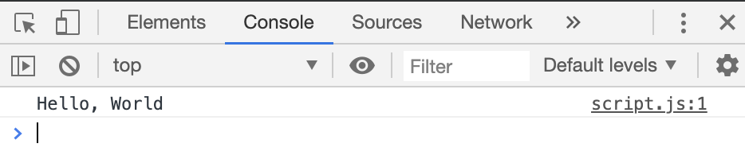
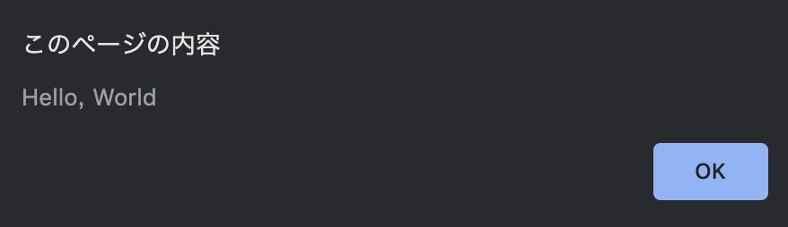
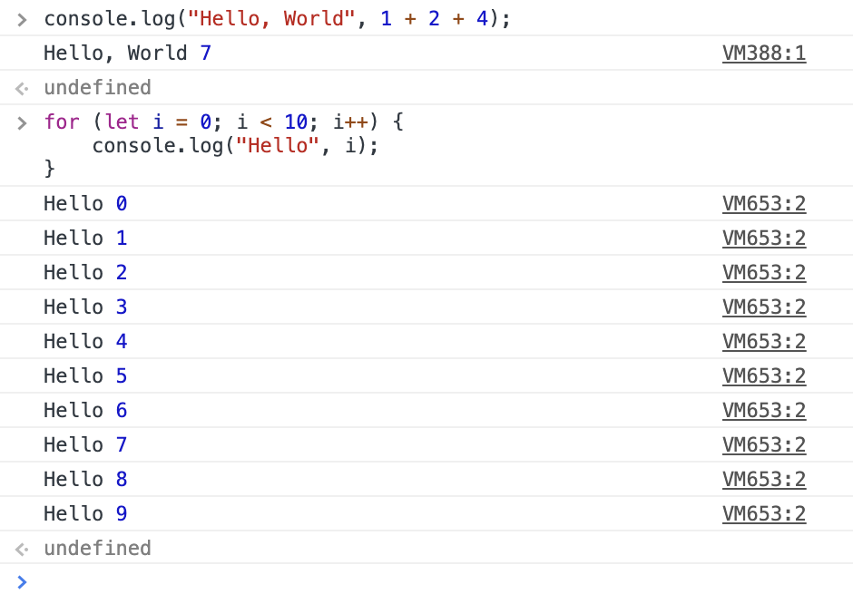
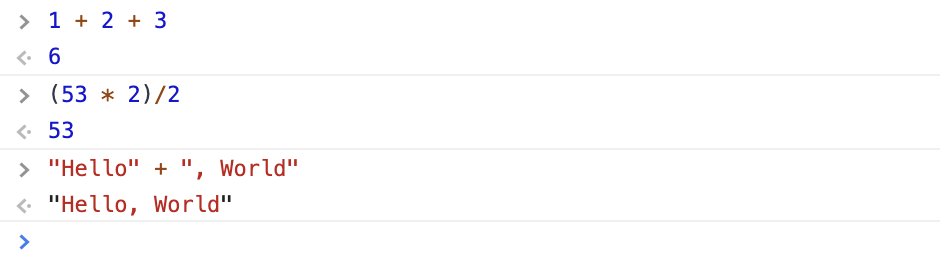
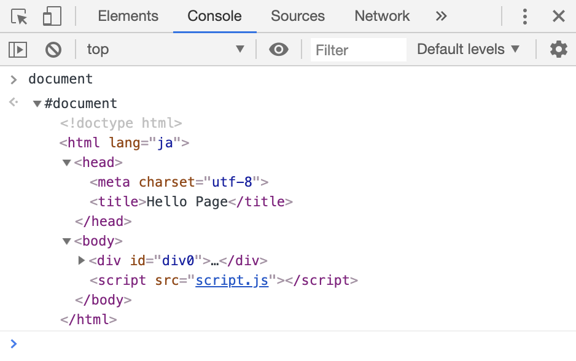

<link rel="stylesheet" href="style.css">

# Cと比較するJavaScript

弊サークルは入部直後にC言語を学びます。
そこで、C言語の基本的な文法を理解したことを前提条件として、JavaScriptを学んでいきたいと思います。

C言語の知識無しで入門したい人は<a href="https://jsprimer.net" target="_blank">JavaScript Primer</a>がおすすめです。
とりあえず第一部読めばなんとかなります。

## 前提知識

### JavaScriptとは

ブラウザに組み込まれているプログラミング言語です。
Webページを動的にいじるためにしばしば利用されます。
**名前がJavaと似ていますが、全く別の言語です**。当時のJava人気にあやかって名付けられた歴史があります。

### ECMAScript

JavaScriptについて調べていると、ES6だとかES2015だとかう単語が出てきます。

JavaScriptの基本機能についてまとめている規格として、**ECMAScript(ES)**というものがあります。
このECMAScriptの内容をもとにして、Chrome、Edge、Safari、FireFoxなど様々なブラウザが、
それぞれJavaScriptを実装しています。

ES6の6というのはESMAScriptのバージョンの一つで、2015に発行されたことからES2015とも呼ばれます。

<div class="note">
  <h4>ECMA</h4>
  <p>ECMAとは「Europian Computer Manufaturec Association」の略で、ISOとかANSIとかと同じような標準化団体の一種です。</p>
</div>

### ブラウザ対応問題

JavaScriptはブラウザごとに実装されています。それゆえ、JavaScriptがちゃんとECMAScriptの内容通りに実装されているかは
ブラウザによります。ES6は多くのブラウザで多くの機能が実装されているようです。
<a href="https://kangax.github.io/compat-table/es6/" target="_blank">ECMAScript 6 compatibility table</a>

### 本チュートリアルで想定するブラウザ

ChromeとSafariは動作確認済みです。EdgeやFirefoxは多分動くと思います。
しかし**Internet Explorer11ではいくつかのコードが動きません。**IE利用者は他のブラウザを使ってください。

## Hello, World(1)

### HTMLファイルからJavaScriptを呼び出す

名前はなんでも良いですがとりあえず今回はindex.htmlというファイル名にします。
内容は以下の通りです。

```html
<!DOCTYPE html>
<html lang="ja">
  <head>
    <meta charset="utf-8">
    <title>Hello Page</title>
  </head>
  <body>
    <script src="script.js"></script>
  </body>
</head>
```

#### script要素

この中にJavaScriptを書いていきます。
しかし今回はsrc属性を使って、外部からJavaScriptのファイルを読み込みます。
実際のコードはscript.jsに書いていきます。
その場合でもscriptの終了タグは必要なので注意してください。

<div class="note">
  <h4>script要素の書く位置</h4>
  <p>bead要素に書く場合とbody要素に書く場合の2通り考えられます。今回はbody要素に書いています。
  それぞれ、以下のようなケースで使い分けます。</p>
  <ul>
    <li>head要素: HTMLの内容が表示される<b>前に</b>JavaScriptを実行したい</li>
    <li>body要素: HTMLの内容が表示された<b>後に</b>avaScriptを実行したい</li>
  </ul>
</div>

### script.jsの作成

index.htmlと同じディレクトリにscript.jsを作成します。内容は以下の通りです。

```js
console.log("Hello, World");
```

### DevToolsで確認

index.htmlを起動しても、画面は真っ白で何も起こりません。
そこで、CSSチュートリアルで紹介したDevToolsを起動します。

DevToolsはChromeだったら、WindowsならF12、Macならcommand + option + iキーで起動できます。
Chrome以外のブラウザでも、名前は違えと同様の機能を持っているはずです。

DevToolsのConsoleタブを開くと、Hello, Worldが出力されています。



### console.log

Console上に様々な情報を出力する関数です。
表示できる情報は文字列とも限りませんが、これについては使いながら覚えていきましょう。
プログラムのデバッグの際にお世話になります。

カンマ区切りで複数の情報を出力できます。

```js
console.log("Hello", 1+2+3);
```

<div class="output">
  <p>Hello 6</p>
</div>

## Hello, World(2)

別のHello, Worldを書いてみましょう。
script.jsを以下のように書き換えます。

```js
alert("Hello, World");
```

index.htmlを開き直すか、ページを更新すると以下のようなポップアップが表示されます。



### alert

アラート文を出力する関数です。ユーザーに何かしらのメッセージを読ませる目的で利用されます。

## Consoleタブからの入力

実はDevToolsのConsoleタブからプログラムを実行できます。
Enterを押すと式を実行、Shift+Enterで改行になります。



Consoleタブ上なら、console.logを使わなくても式の評価結果を出力できます。



## Cとの比較

### Cと同じところ

- セミコロン
- forやif
- 演算子

#### セミコロン

式の末尾にはセミコロンをつけます。
ある文脈においてはセミコロンをつけなくても正常に動作しますが、
とりあえず「式の末尾にセミコロン」と覚えておくのが無難だと思います。

#### forやifが同じ
forやifの文法は全く同じです。orは`||`、andは`&&`で表します。
ただし、forに関しては異なる書き方があります。

#### 演算子
変数の代入や四則演算など、Cの演算子のほとんどはJavaScriptでも利用できます。  

ただし、整数値と実数値の区別がなく、同じNumberという型で括られています。
このため、割り算の結果によっては小数部分が現れます。
もし整数値で扱いたいならMath.floor関数で切り捨てます。

### Cと違うところ

以下をこれから解説していきます。

- 変数と型
- forの複数の書き方
- 関数の書き方
- オブジェクトという概念
- 文字列の扱い

## 変数

変数の宣言にはletまたはconstを用います。

```js
let a = "Hello";
let b = 1 + 2 + 3;
const c = 124;
const d = ["Hello", 10, [1, 2, 3]];
```

角括弧で括られた領域は配列を表します。これについては別の項で説明します。

### let, const

letは普通の変数を表します。

constは再代入不能な変数を表します。

### 型を明示しない

letは「普通の変数」、constは「再代入不能な変数」と説明しました。
Cから来た人なら、「**あれ、型は?**」と思ってしまうでしょう。intやchar、doubleなどの型宣言を行わずに、
全てletまたはconstで済ませています。**Cと違って型宣言を行う必要はありません**。

### 暗黙の型変換

Cでも暗黙の型変換がありましたが、JavaScriptではそれがよりパワーアップしています。
これはあまり良くない結果をもたらしがちです。
例えば以下のように、整数+文字列、整数+配列、の場合もエラーを起こしません。

Consoleで以下のように入力してみましょう。

```js
123 + "Hello"
[1, 2, 3] + "aaa"
[1, 2, 3] + 32
[1, 2, 3] + [4, 5, 6]
```

これらの結果は全て文字列になります。

<div class="output">
  <p>"123Hello"</p>
  <p>"1,2,3aaa"</p>
  <p>"1,2,332"</p>
  <p>"1,2,34,5,6"</p>
</div>

この勝手に型変換をする性質のせいで、バグに気付きにくくなりがちです。

### 等値比較は===で行おう

比較演算子に等価演算子`==`があるのですが、これは「もし右辺と左辺の型が一致していなかった場合は型変換が行われる」
という内部処理が行われます。

一方厳密等価演算子`===`は、比較の前に型変換を行いません。型の異なる値同士を比較するケースは稀なので、
**特に理由が無い限りは===を使いましょう。**

### スコープ

スコープについての扱いはCのときと同じです。

<div class="note">
<h4>他の変数宣言</h4>
<p>以前のJavaScriptにはletやconstがなく、次の2パターンの宣言がありました。</p>
<ul>
  <li>何もつけないで変数宣言</li>
  <li>varをつけて宣言</li>
</ul>


x = 1;
var y = 0

<p>これらの挙動については省略しますが、スコープの扱いが奇妙なので利用すべきではありません</p>
</div>

<div class="note">
  <h4>letとconstの使い分け</h4>
  <p>
  constで宣言されていれば値が変わらないので、デバッグの時に変数の変化を追う必要がなくなります。
  このようにデバッグを容易にしてくれることから、<b>出来るだけconstで宣言することを心がけましょう。</b>
  ただし、どうしても変数の値を変えなくてはいけないケース(例: forループのカウンタ)があります。その時は
  letを使います。
  </p>
</div>

## for文

とりあえず以下の2つの書き方ができることを覚えておくだけでよいです。


1つ目はCでよく書くような方法です。配列の添字についてのforループを回します。
```js
const a = [1,2,4,8];
for (let i = 0; i < a.length; i++){
  console.log(a[i]);
}
```

<div class="note">
  <p>配列名.lengthで配列の長さを取得できます。配列について詳しい話は、配列の項で説明します。</p>
</div>

2つ目は配列の各要素についてのループを回す方法です。
`for (let e of a)`とは、「配列aの中の各要素をeとして、a全ての要素についてループする」という意味です。
Pythonを触ったことがある人なら馴染み深いと思います。

```js
const a = [1,2,4,8];
for (let e of a) {
  console.log(e);
}
```

## 分割代入(配列)

配列の値を順に取り出して、変数に代入する便利機能です。
Pythonを触ったことがある人なら、「アンパックとほぼ同じ機能」と言えばわかると思います。

例えば、配列[3, 4]の内容をそれぞれ変数a、bに代入するプログラムは以下のように書けます。
```js
const [a, b] = [3, "Hello"];
console.log(a, b);
```

<div class="output">
  <p>3 Hello</p>
</div>

要素のスワップ(入れ替え)処理は次のように簡単に書けます。

```js
let [a, b] = [1, 2];
[a, b] = [b, a] // swap
console.log(a, b);
```

<div class="output">
  <p>2 1</p>
</div>


## 関数の書き方

「足し算する関数」を作ることを想定して、3種類の関数の書き方を学びます。
いずれも**戻り値の型を書く必要はない**点が、Cとの違いです。

### function(1)

`function 関数名(引数)`という書き方で関数を定義します。

```js
function add(a,b){
  return a + b;
}
```

### function(2)

`function (引数)`という書き方で関数を定義します。

```js
const add = function(a,b){
  return a + b;
};
```

ここで、`function(a, b){ ... }`という**関数を変数に代入している**ことが見て取れます。
function自体には名前はなく、これをaddという変数に代入しています。このことから、
functionは**無名関数**と呼ばれます。

### アロー関数

`(引数) => { ... }`という書き方で関数を定義します。

```js
const add = (a, b) => {
  return a + b;
};
```

return文しか書かない場合は、次のようにもっと省略できます。

```js
const add = (a, b) => a + b;
```

とりあえず無名関数の簡便記法だと思ってもらえれば良いと思います。

<div class="note">
  <h4>this</h4>
  <p>厳密には、function文とアロー関数には単なる簡便記法という違いだけでなく、<b>thisの扱いの違い</b>
  があります。</p>
  <p>thisというのはJavaScriptで重要な概念で、thisが何を指すかはその呼び出し位置に依存します。
  これについては新たにthisという項を用意してお話します。</p>
</div>


### 関数呼び出し

Cと同じく、`関数名(引数)`で呼び出せます。

```js
const add = (a, b) => {
  return a + b;
};
console.log(add(1, 2));
```

<div class="output">
  <p>3</p>
</div>

## 型

Cに比べて型が豊富です。具体的には、以下の6種類のプリミティブデータ型と呼ばれるもの:

- Boolean
- Null
- Undefined
- Number
- String
- Symbol

と、

- Object

に分かれます。さらにObject型の一種として、また別の型があらかじめ用意されています(Date、Map、Setなど)。

### 配列と関数は?

驚くかもしれませんが、**配列と関数はObject型の一種です**。JavaScriptにおいて、配列はArray、関数はFunctionと呼ばれる型です。

### 主要なもの

結局よく使う型は以下のものだけです。
必要になったら他のも覚えましょう。

- Boolean: 真偽値。trueとfalseの2値のみ取りうる。
- Number: 実数。整数型というのは無い。
- String: 文字列
- Object: オブジェクト
  - Array: 配列
  - (Function: 関数)

### immutableなオブジェクト

Object以外の型は**プリミティブ(primitive)型**と呼ばれます。primitiveとは「原始的」という意味です。JavaScriptを構成する基本的な
型で、Objectは内部にプリミティブ型を入れて構成されます(Objectの利用方法については後で見ていきます)。

プリミティブ型は自身の値を変更することができません。このことを、「値は不変(immutable)である」と表現します。

もしかすると、「いや、次の文では値が0から1に変わるじゃ無いか。どこが不変なんだ」と思うかもしれません。
```js
let a = 0;
a += 1;
```

しかしa += 1の意味を考えてみると、単にa + 1の計算結果をaに再代入しただけです。0という値が1という値に変わったわけではありません。
```js
let a = 0
a = a + 1;
```

Stringがimmutableであるということは、次のように文字の値を変えることはできません。
これはCとの大きな違いの1つです。
```js
let s = "Hello";
s[0] = "P";
console.log(s);
```
sの0番目の値に"P"を代入して"Pello"となると思う人がいるかもしれませんが、結果は何も変わりません。
これはStringがimmutableであるからです。
<div class="output">
  <p>Hello</p>
</div>

対して、Object型は自身の値を変更することが可能です。これについてはObjectの項で見ていきましょう。

## Numberと数学系関数

### 初期化

単純に数値を書くだけで初期化になります。`1.2e9`は1.2&times;10<sup>-9</sup>と同じ意味です。

```js
let a = 10;
let b = 1.234;
let c = 1.2e-9;
```

文字列を数値に変換したい場合は`Number(文字列)`と書きます。
ただし、もし文字列が変換できなかった場合、**NaN(Not a Number)**という特殊な値を返します。

```js
let a = Number('1234');
let b = Number('aaa');
console.log(a, b);
```

<div class="output">
  <p>1234 NaN</p>
</div>

Infinityという特殊な値があります。これはどんな数よりも大きな数を意味します。

```js
console.log(100000000 < Infinity);
```

<div class="output">
  <p>true</p>
</div>

### 数学系関数/定数

数学関係の関数/定数はMathクラスの静的プロパティ/静的メソッドとして定義されています。
これらについての詳しい話は省略しますが、とりあえず`Math.XXX`で呼び出せることを覚えておけば、今のところ問題ありません。

```js
const a = Math.sqrt(2);
const b = Math.abs(-123);
const c = Math.floor(23.114);
const d = Math.pow(2, 10);
const e = Math.PI;
const f = Math.E;
console.log(a, b, c, d, e, f);
```

<div class="output">
<p>1.4142135623730951 123 23 1024 3.141592653589793 2.718281828459045</p>
</div>


## Objectの基本

### Objectとは

Cで例えるなら、「関数もメンバにできる構造体変数」です。
実態は構造体とは異なりますが、使い方は構造体とほとんど同じです。

**オブジェクトとはプロパティの集合です。プロパティとは、キーと値のペアです。**
何がなんだかわからないと思うのでもう少し詳しく説明します。

<div class="note">
  <h4>分かる人には分かるObjectの実態</h4>
  <p>Objectの実態はハッシュマップです。C++だとunorderd_map、PythonだとDictionary型に該当するものです。
  C++やPythonでいうオブジェクトとは異なる概念だということが分かると思います。</p>
</div>

プロパティ(property)とは「特性」と訳される単語です。プロパティはObject自身の性質を表します。

例えば「リンゴ」というObjectには「色が赤い」というプロパティがあります。この時、「色」をキー、「赤い」を値と呼びます。

関数もオブジェクトの一種なので、当然プロパティの値に関数を設定できます。この時のプロパティは特別に**メソッド**と呼ばれます。

### 作ってみる

実際にObjectを作ってみましょう。

#### 点

点はx座標とy座標で構成されます。Objectを使わない形で書くと以下のようになります。

```js
let x = 1;
let y = 3;
```

Objectを使って書くと以下のようになります。pというObjectがxとyというプロパティを持っていることになり、
「点が座標を持っている」という意味を表現することができます。

```js
let p = {
  x:1,
  y:3
};
```

オブジェクトの初期化は波括弧で括ります。プロパティは`プロパティ名(キー): 値`で指定します。

```js
{
  キー1: 値1,
  キー2: 値2,
  ...
}
```

プロパティとメソッドにアクセスするための方法として、ドット記法とブラケット記法の2種類の方法があります。
以下はドット記法を用いたアクセス方法です。ブラケット記法については後で説明します。

```js
console.log(p.x, p.y);
```

<div class="output">
  <p>1 3</p>
</div>


#### 線分

線分は2点で構成されます。次のように、ObjectのプロパティとしてObjectを指定することも可能です。

```js
let l={
  ps:{ x:1, y:3 },
  pt:{ x:5, y:6 }
};
```


#### 距離を求める関数

2点間の距離を求める関数distをメソッドとして指定してあげましょう。
`l.dist()`と呼び出すことで、lの長さを取得できます。

名前から推測できると思いますが、Math.sqrtという関数は平方根を計算する関数です。

おや、thisが出てきましたね。
`this`はこの文脈では「l自身」を表しています。
したがって、例えば`this.ps.x`は`l.ps.x`と同義です。

```js
let l = {
  ps: { x:1, y:3 },
  pt: { x:5, y:6 },
  dist: function(){
    const dx = this.ps.x - this.pt.x;
    const dy = this.ps.y - this.pt.y;
    return Math.sqrt(dx*dx + dy*dy);
  }
};
console.log(l.dist());
```

<div class="note">
  <h4>function文とアロー関数</h4>
  <p>次のように、function文をアロー関数に置き換えても良いのでしょうか?</p>

let l = {
  ps: { x:1, y:3 },
  pt: { x:5, y:6 },
  dist: () => {
    const dx = this.ps.x - this.pt.x;
    const dy = this.ps.y - this.pt.y;
    return Math.sqrt(dx*dx + dy*dy);
  }
};

  <p>実は<b>これはエラーになります</b>。なぜなら、アロー関数内におけるthisはlを指さないからです。
  このようにthisは呼び出し元によって何を指すのかが変わります。</p>
</div>

#### もっとつくりたい

もしかしたら「線分をたくさん集めた配列」を作りたい時があるかもしれません。
そうしたら次のように書くのでしょうか?

```js
const la=[
  {
    ps:{ x:1, y:3 },
    pt:{ x:5, y:6 },
    dist: function(){
      const dx=this.ps.x-this.pt.x;
      const dy=this.ps.y-this.pt.y;
      return Math.sqrt(dx*dx+dy*dy);
    }
  },
  {
    ps:{ x:1, y:3 },
    pt:{ x:4, y:2 },
    dist: function(){
      const dx=this.ps.x-this.pt.x;
      const dy=this.ps.y-this.pt.y;
      return Math.sqrt(dx*dx+dy*dy);
    }
  },
  ...
};
```

分量が多すぎるし、同じようなことを書いていて冗長です。流石にこれは書きたくないです。

線分の配列のためだけに限らず、何かしらの設計図を作っておけば、その設計図を利用してObjectを作ることができます。
設計図さえ作っておけば、様々な場面でそれを使い回せるので便利です。
その設計図に当たるものがクラスと呼ばれるものです。これについては後で説明します。

## Object

Objectの文法についてもう少し説明します。

### オブジェクト初期化

初期化の時は波括弧で括ります。
`プロパティ名: 値名`の書式で書きます。

```js
let obj = {
  a: 10,
  b: 2,
  c: 'Hello'
};
```

上のコードは以下のように省略することが可能です。
変数名がそのままプロパティ名になります。

```js
let a = 10, b = 2, c = 'Hello';
let obj = { a, b, c };
```

次のように、プロパティ名に文字列や数値を指定することも可能です。

```js
let obj = {
  'a': 10,
  b: 2,
  0: 'Hello'
};
```

### プロパティアクセス方法

#### ドット記法

Cにおける構造体メンバにアクセスするのと同じ文法ですね。
以下の`obj.c`のように、元々存在しないプロパティにアクセスすることも可能です。

```js
let obj = {
  a: 0,
  b: 1
};
obj.a++;
obj.b *= 10;
obc.c = 232;
```

#### ブラケット記法

Cにおける配列と同じ文法ですね。ただし普通の配列とは違って数値以外の値が指定できます。
このような配列は一般に**連想配列**と呼ばれます。

ブラケット記法の場合、プロパティとして様々な値を利用できます。
厳密には、ブラケット記法で利用できる名前は文字列またはシンボルです。
しかしこれ以外の値が指定された場合、自動的に文字列に変換されます。

```js
let obj = { };
obj['prop'] = 123;
obj[1] = 'Hello'; // obj['1']と同義
obj[[1, 2, 3]] = 'World'; // obj['1,2,3']と同義
```

またプロパティ名でクォーテーションでくくっていなかった場合でも、ブラケット記法の場合はクォーテーションでくくらなければなりません。
つまり、以下のようにobjが宣言されていたとします。
```js
let obj = { prop: 'AAA' };
```
この時、ブラケット記法でpropにアクセスする場合は`'prop'`とクォーテーションでくくらなければなりません。
```js
obj['prop'] = 'BBB';
```


### 分割代入

配列の時と同じように、Objectでも分割代入ができます。
プロパティと同名の変数を用意して利用します。

```js
let obj = {
  a: 123,
  b: [1, 3, 2],
  c: 'Hello'
};
let { a, b, c } = obj;
console.log(a, b, c);
```

順番はどうでもよく、例えば次のように書いても同じ出力をします。

```js
let { b, a, c } = obj;
console.log(a, b, c);
```

<div class="output">
  <p>123 [1, 3, 2] Hello </p>
</div>

### constなObject

**constは再代入が不可能なだけ**です。
なのでObjectのプロパティを変更することは可能です。

```js
const a = { x: 0, y: 2, z: 12 };
a.x = 1;
a.y = 53;
```

ただし再代入が不可能なので、次のようなことはできません。

```js
const a = { x: 0, y: 2, z: 12 };
a = { x: 1, y: 53, z: 12 };
```

### 参照

実はあらゆる変数やプロパティは、データそのものではなく、
「そのデータの場所」を持っています。
この概念は参照(Reference)と呼ばれています。

参照が目に見える場面を見てみましょう。

```js
const obj1 = { a: 1, b: 2, c: 3 };
const obj2 = obj1;
console.log(obj1, obj2);

obj2.a = 'Hello';
console.log(obj1, obj2);
```

obj2の値を変更しただけなのに、それに同期してobj1の値も変わっています。

<div class="output">
  <p>{a: 1, b: 2, c: 3} {a: 1, b: 2, c: 3}</p>
  <p>{a: "Hello", b: 2, c: 3} {a: "Hello", b: 2, c: 3}</p>
</div>

これは、obj1やobj2は`{ a: 1, b: 2, c: 3 }`という値そのものを持っているわけではなく、
その参照を持っているからです。

<div class="note">
  <h4>参照が目に見えないケース</h4>
  <p>参照のことを気にしなければいけないのはObjectやArrayを扱うケースですが、他の場合でも参照は現れています。</p>
  <p>次の場合は、bの右辺にaが含まれているので、これはaの参照として解釈されるはずです。</p>
  const a = 2;
const b = a + 1; 
  <p>しかしaの参照と1の足し算はできないので、参照から値へと解釈され、<code>2 + 1</code>として計算されます。</p>
  <p>また、次のようなケースを考えてみましょう。</p>
  const a = 2;
const b = a;
console.log(a, b);
b = 1;
console.log(a, b);
  <p>出力結果は次のようになります。aとbの値が同期することはありません。</p>
  <div class="output" style="margin: 0 40px">
    <p>2 2</p>
    <p>2 1</p>
  </div>
  <p>はじめ、aは2という値の参照を持っていて、bも同じ2の参照を持っていました。
  <code>b = 1</code>という式によって、bは1という値の参照を持つことになります。
  bが持つ参照が変わっただけで、aが持つ値が2の参照であることは変わりませんので、当然の結果と言えます。</p>
</div>


## クラス

クラスはCでいうと構造体宣言のようなものです。
クラスを実際に書いていきながら、その文法を覚えていきましょう。

### 書き直してみる

点と線分のクラスを作っていきましょう。

#### 点

クラスは`class クラス名 { ... }`という書式で書きます。
中にはメソッドを書いていきます。
プロパティ名を宣言することはなく、単に`this.プロパティ名`と書けば値が入れられます。
ただし、constructorという名前のメソッドは特別にコンストラクタと呼ばれます。
ここには初期化用の処理を書いてあげます。

```js
class Point {
  constructor(x,y){
    this.x = x;
    this.y = y;
  }
}
```

さてPointというクラスを宣言しました。これはまだ設計図に過ぎないので、実際にこれを元にオブジェクトを作成します。
new演算子でオブジェクトが生成されます。

```js
let p = new Point(2, 3);
console.log(p.x, p.y);
```

`new Point(2, 3)`が呼び出された時、まずconstructor(2, 3)が実行されます。
よって、実行結果は以下のようになります。

<div class="output">
  <p>2 3</p>
</div>


#### 線分

先ほど作ったPointクラスを使いまわします。
メソッドを宣言する際、function文をつける必要はありません。

```js
class Line{
  constructor(xs, ys, xt, yt){
    this.ps = new Point(xs, ys);
    this.pt = new Point(xt, yt);
  }
  dist(){
    const dx = this.ps.x - this.pt.x;
    const dy = this.ps.y - this.pt.y;
    return Math.sqrt(dx*dx + dy*dy);
  }
}

const l = new Line(1,3,5,4);
console.log(l.dist());
```

<div class="output">
  <p>4.123105625617661</p>
</div>

もし線分を持った配列を作りたいなら、次のように書けます。

```js
let la = [ 
  new Line(1,3,4,5),
  new Line(1,2,4,3),
  new Line(6,3,4,-1),
  new Line(5,3,4,0),
];
```

## Array

さてObject型の一種であるArrayを学びましょう。
ArrayはCでいう配列です。Cの配列との違いとして挙げられるのは以下の2点です。

- 一つの配列に様々な型を入れることができる
- 配列が必ずしもメモリ上で連続していない  
  これはArrayがObjectとして実装されていることが理由です
- 配列の要素数は可変

### 初期化

ブラケットで囲むだけでArrayになります。非常に単純です。

```js
const a = [];
const b = [1, 2, 'Hello', 1.234];
```
### 指定された要素数、値で初期化

もっとも単純なのは、pushというメソッドを用いる方法です。
pushは、配列の末尾に要素を追加するメソッドです。引数には追加する値を指定します。

例えば、長さ5の配列を値0で初期化するコードは以下のように書けます。

```js
const a = [];
for(let i=0; i<5; i++){
  a.push(0);
}
```

二次元配列の場合は次のように書けます。
```js
const a = [];
for(let i=0; i<5; i++){
  a.push([]);
  for(let j=0; j<5; j++){
    a[i].push(0);
  }
}
```

### 指定された要素数、値で初期化 (2)

一文で初期化する方法を紹介します。

`new Array(5)`で要素数5の配列を生成し、それをfillメソッドで0埋めします。
こっちの方がシンプルですね。

```js
let a = new Array(5).fill(0)
```

2次元配列の書き方は色々ありますが、以下の2通りがシンプルな気がします。
文法についての詳細は省略しますが、map関数は後でまた出てきます。

- Array.fromメソッドを用いる方法
```js
let a = Array.from(new Array(5), () => new Array(5).fill(0));
```
- スプレッド構文を用いる方法
```js
let b = [...Array(5)].map(() => new Array(5).fill(0));
```

<div class="note">
<h4>ブラウザ対応の話</h4>
<p>Array.fromもスプレッド構文も<b>Internet Exploerer11ではサポートされていません</b>。この後文字列の項で紹介する
テンプレートリテラルも、IEにはありません。このようにIEはES2015に対応していない便利機能がいくつかあるので、
IEではなくEdge/Chrome/Safari/Firefoxなどのブラウザを使ってください。</p>
<p>個人でJSプログラミングを楽しむ分には、わざわざ他ブラウザに対応するように書く必要なんてありません。
しかし大人数が利用するようなWebサイトやWebアプリを作る場合、多くのブラウザに対応したコードを書かなければいけません。</p>
<p>JSの最新記法や機能を、古いJSの書き方に直すツールにBabelがあります。</p>
</div>

<div class="note">
  <h4>2次元配列作成のNG例</h4>
  <p>2次元配列は次のようにしてできそうです。</p>
  let a = new Array(5).fill(new Array(5).fill(0));
  <p>これは残念ながら期待通りに動作しません。試しに<code>a[0][0]</code>に値を代入してみましょう。</p>
let a = new Array(5).fill(new Array(5).fill(0));
console.log(a);
a[0][0] = 1;
console.log(a);
  <p><code>a[0][0]</code>のみを変更したはずなのに、<code>a[1][0],a[2][0],...</code>も1になっています。</p>
  <div class="output" style="margin: 0 40px">
    <p>[[0, 0, 0, 0, 0], [0, 0, 0, 0, 0], [0, 0, 0, 0, 0], [0, 0, 0, 0, 0], [0, 0, 0, 0, 0]]</p>
    <p>[[1, 0, 0, 0, 0], [1, 0, 0, 0, 0], [1, 0, 0, 0, 0], [1, 0, 0, 0, 0], [1, 0, 0, 0, 0]]</p>
  </div>
  <p>これは、<code>a[0],a[1],...,a[4]</code>が同じ配列<code>[1,0,0,0,0]</code>の参照を持っていることが原因です。
  (参照についてはObjectの項で説明しました)
  このように、fillだと<code>a[0],a[1],...,a[4]</code>に全く同じ配列を結びつけてしまいます。それぞれに対して新しく
  配列を作ってあげる処理が必要になります。これをmapメソッドで行なっています。
  </p>
</div>


### アクセス

Cと同じように、`配列名[添字]`の書式でアクセスします。

```js
let a = [1, 2, 3];
a[0] = 1;
a[2] = 12;
```

## String

Cの文字列との違いとして以下の3点があげられます。

- JavaScriptにおいて文字型と文字列型の区別はありません。
- immutableです。つまり、文字列を直接書き換えることはできません。  
  直接書き換えるのではなく、例えば「文字列のある部分を変えた新しい文字列を作る」ということをします。
- シングルクォーテーションとダブルクォーテーションの違いはありません。

### 基本的な使い方

各文字について、配列のようにアクセスできます。
ただしimmutableなので値を書き換えることはできません。
試しに`s[0] = 'C'`としても、何も変化はありません。

```js
const s = "Apple Banana";
console.log(s[0], s[6]);
s[0] = 'C';
console.log(s[0], s[6]);
```

<div class="output">
  <p>A B</p>
  <p>A B</p>
</div>

文字列同士は+で連結することができます。

```js
let h = 'Hello';
let w = 'world';
console.log(w + h + 'Taro');
```

<div class="output">
<p>HelloworldTaro</p>
</div>

もし数値などをStringに変換したい場合は、`String(数値)`と書きます。

```js
const s = 'Hello' + String(123);
console.log(s);
```

<div class="output">
  <p>Hello123</p>
</div>

### split


指定された文字で文字列を分割して配列にするメソッドです。
以下は、カンマで文字列を分割して配列にする例です。

```js
const str = 'Hello,world,Taro!';
const a = str.split(',');
console.log(a); 
```

<div class="output">
  <p>["Hello", "world", "Taro!"]</p>
</div>

他にも、例えば「スペース区切りの文字列からデータを抽出したい」ときに利用します。

### join

splitの逆バージョンです。指定された文字で配列を連結し、文字列に変換するメソッドです。

```js
const a = ['Hello', 'world', 'Taro!'];
const str = a.join(',');
console.log(str);
```

<div class="output">
  <p>Hello,world,Taro!</p>
</div>

### テンプレートリテラル

値を直接文字列に埋め込むための方法です。**バッククォート**で囲んで用います。
埋め込む値は`${値}`という形で記述します。

テンプレートリテラルを用いない方法では、+演算子を使う必要があります。
```js
const t='Taro';
const str='Hello'+String(1234)+', '+t+'!';
```

テンプレートリテラルを用いると次のようにすっきりとした形で書けます。
```js
const t='Taro';
const str=`Hello${1234}, ${t}!`;
```

## 関数の応用

JavaScriptでは関数もまたObjectです。
ということは関数に引数をとる関数を定義できるだろうし、また関数を返す関数だって作れるはずです。

### コールバック関数

ある関数の引数に指定された関数のことを**コールバック(callback)関数**と言います。

実際にコールバック関数を利用したプログラムを作ってみましょう。
以下は、2つの引数の和に対して関数fを適用した値を返す関数です。

```js
function fadd(a, b, f){
  return f(a + b);
}
```

例えば次のように書くと、(1 + 2)の結果を2乗して返します。

```js
const res = fadd(1, 2, function(x) {
  return x * x;
});
console.log(res);
```

<div class="output">
  <p>9</p>
</div>

アロー関数を使って、コールバック関数を簡潔に書くことができます。

```js
const rest = fadd(1, 2, x => x * x);
```

### map

配列の各要素に対して関数fを適用した結果の配列を返す関数です。
例えば`[1, 2, 4, 3, 5]`という配列にmapメソッドを適用すると、`[f(1), f(2), f(4), f(3), f(5)]`という値が返ります。
```
```js
const a = [1, 2, 4, 3, 5];
const b = a.map(x => x * x);
console.log(b);
```

<div class="output">
<p>[1, 4, 16, 9, 25]</p>
</div>

第2引数には配列の添字が入っており、第3引数には配列そのものが入っています。
これらは使わなければ省略しても構いません。
例えば、各iに対して`i * a[i]`の値を返す処理は以下のように書けます。

```js
const a = [1, 3, 5, 7, 9];
const b = a.map((x, i) => i * x);
console.log(b);
```

<div class="output">
<p>[0, 3, 10, 21, 36]</p>
</div>

### forEach

配列の各要素に対して何かしらの処理をするメソッドです。
for-of文の関数版だと思ってもらえれば良いです。

```js
const a = [1, 3, 5, 7, 9];
a.forEach((e, i) => {
  console.log(`a[${i}]=${a[i]}`);
});
```

<div class="output">
  <p>a[0]=1</p>
  <p>a[1]=3</p>
  <p>a[2]=5</p>
  <p>a[3]=7</p>
  <p>a[4]=9</p>
</div>

### reduce

配列の各要素に対して関数を適用し、単一の値にする関数です。
reduceの第1引数にはコールバック関数を、第2引数にはaccumulatorの初期値を指定します。
第2引数が指定されなかった場合は0が入ります。

accumulatorとは、配列に関数を適用していった結果を蓄積しておくための変数です。

コールバック関数の第1引数にはaccumulatorを指定し、
第2引数には要素、第3引数に添字、第4引数に配列自身を指定します。

例えば、配列の総和を求める処理は次のように書けます。

```js
const a = [1, 3, 5, 7, 9];
const sum = a.reduce((acc, e) => acc + e);
console.log(sum)
```

これは以下の操作と同義です。accという変数に配列の要素を足し込んでいます。

```js
let acc = 0;
for (e of a){
  acc = acc + e;
}
return acc;
```

<div class="output">
  <p>25</p>
</div>


分散は次のように書けます。

```js
const a = [1, 3, 5, 7, 9];
const ave = a.reduce((acc, e) => acc + e) / a.length;
const vari = a.reduce((acc, e) => acc + (e - ave)*(e - ave)) / a.length;
console.log(vari);
```

<div class="output">
  <p>5</p>
</div>

### filter

filterメソッドは、条件を満たす要素だけ取り出して返します。
引数にはbool値を返すコールバック関数を指定します。

以下は、配列から奇数の要素だけを取り出す関数です。
コールバック関数には、奇数の時にtrueになるような関数を指定しています。

```js
const a = [1, 3, 4, 9, 8, 0, 5, 5];
const b = a.filter(e => e % 2 == 1);
console.log(b);
```

<div class="output">
  <p>1 3 9 5 5</p>
</div>

## Webページを操作する

今までJavaScriptの基本的な言語機能に触れてきました。
しかしJavaScriptは本来Webページのための言語であったことを忘れないでください。
Webページを操作する上で必要なことをここで学びます。

### DOM

私たちはWebページを操作する際に、HTML文書を直接書き換えるようなことをしません。
代わりに**DOM(Document Object Model)**を操作します。DOMとは、ブラウザが解釈したWebコンテンツのデータです。
HTML文書として書かれたファイルは、実際にはブラウザがDOMへと解釈して、画面上に描画します。

#### DOMの構成要素

HTML文書を書くときは、要素を階層的に定義していました。例えば、htmlタグの中にheadタグとbodyタグを含み、
さらにbodyタグの中に様々なタグを入れて&hellip;のようにです。この階層構造は一つの木として表せそうです。

実際、DOMはたくさん集まって一つの木を作ります。ひとつひとつのDOMを**ノード(Node)**と呼び、
ノード同士が繋がった木構造を**ノードツリー(Node Tree)**と言います。

ノードツリーから目的の要素を検索したり、要素の属性やスタイルを変更したり、またツリーに新しい要素を挿入したりして、Webページの
コンテンツを変化させることができます。

JavaScriptには、DOMにアクセスし操作するためのメソッドが用意されています。試しに触ってみましょう。

### divに要素を追加する

div要素の中に"Hello, World!"というテキストを追加するプログラムを作ってみましょう。

index.htmlを以下の内容にします。
divタグを追加し、id属性をdiv0にします。

```html
<!DOCTYPE html>
<html lang="ja">
  <head>
    <meta charset="utf-8">
    <title>Hello Page</title>
  </head>
  <body>
    <div id="div0"></div>
    <script src="script.js"></script>
  </body>
</head>
```

script.jsには以下のように記述します。

```js
const div0 = document.getElementById('div0');
const p = document.createElement('p');
p.textContent = 'Hello, World!';
div0.appendChild(p);

```

index.htmlを開くと、Hello,Worldの文字が追加されると思います。

#### Document

documentはWebページ上の最上位のノードです。つまり木構造の根に当たります。

試しにConsoleでdocumentと打ってみましょう。するとhtmlの構造が見えます。


#### Document.getElementById

documentより下位の要素検索するメソッドのひとつで、id属性が一致するものの要素を取得します。
以下の場合、「document下のすべてのノードから、id属性がdiv0のものを取得する」という意味になります。

```js
const div0 = document.getElementById('div0');
```

#### Document.createElement

要素を作成するメソッドです。例ではp要素を作成しています。

さらにp要素が持つtextContentプロパティ用いて、p要素が含むテキストを設定しています。

#### Element.appendChild

Element直下に要素を追加します。

### ボタン処理

非常に単純なカウンタを作ってみましょう。pタグに数字を出力するようにして、+ボタンと-ボタンで数字の増減ができるようにします。

index.htmlを以下のようにします。

```html
<!DOCTYPE html>
<html lang="ja">
  <head>
    <meta charset="utf-8">
    <title>Hello Page</title>
  </head>
  <body>
    <p id="num_display"></p>
    <input id="plus_btn" type="button" value="+">
    <input id="minus_btn" type="button" value="-">
    <script src="script.js"></script>
  </body>
</head>
```

script.jsは以下のようにします。

```js
let cnt = 0;
const p = document.getElementById('num_display');
p.textContent = "0";

document.getElementById('plus_btn')
  .addEventListener('click', () => {
    cnt++;
    p.textContent = String(cnt);
  }, false);
document.getElementById('minus_btn')
  .addEventListener('click', () => {
    cnt--;
    p.textContent = String(cnt);
  }, false);
```

index.htmlを開くと、次のような画面になります。+ボタンを押すと数字が増え、-ボタンを押すと数字が減ります。

<div class="output-browser">
  <p id="num_display"></p>
  <input id="plus_btn" type="button" value="+">
  <input id="minus_btn" type="button" value="-">
  <script>
    let cnt = 0;
    const p = document.getElementById('num_display');
    p.textContent = "0";

    document.getElementById('plus_btn')
      .addEventListener('click', () => {
        cnt++;
        p.textContent = String(cnt);
      }, false);
    document.getElementById('minus_btn')
      .addEventListener('click', () => {
        cnt--;
        p.textContent = String(cnt);
      }, false);
  </script>
</div>

#### EventTarget.addEventListener

EventTargetに対してイベントリスナーを設定します。
イベントリスナーとは、あるイベントが起こった時に実行されるコールバック関数のことです。
第1引数にイベントの種類、第2引数にイベントリスナーを指定します。第3引数に関してここでは説明を省略しますが、falseにしておきます。

イベントclickは、クリックが押された時に起こるイベントです。

以下では、クリックされた時にcntをインクリメントし、その値をpのテキストに設定する処理を書いています。

```js
document.getElementById('plus_btn')
  .addEventListener('click', () => {
    cnt++;
    p.textContent = String(cnt);
  }, false);
```


### D3.jsにおけるDOM

少しだけDOMの操作を見ていきましたが、実際はこれらのメソッドを直接使うことはありません。
なぜなら、JQueryやD3.jsなどのライブラリには、DOM操作をより快適に行うためのメソッドが用意されているからです。

## まとめ - まだまだありますJavaScriptの機能

本チュートリアルで学んできたJavaScriptの機能はほんの一部です。例えば扱いきれていなかった概念に以下のようなものがあります。

- 紹介していない型(Map、Set、Date、Symbolなど)
- promiseを利用した非同期通信
- クロージャ
- thisの扱い
- DOMの細かい操作

これらは興味があれば各自学んでみてください。

最後まで読んでいただきありがとうございました。

## 参考

<ul>
<li><a href="https://developer.mozilla.org/ja/docs/Glossary/JavaScript" target="_blank">
JavaScript - MDN</a>: リファレンスとして。</li>
<li><a href="https://jsprimer.net">JavaScript Primer</a>: JavaScript入門サイトとして。</li>
<li><a href="https://hayato.io/2017/dom/" target="_blank">
ブラウザのしくみ: データ構造とアルゴリズムと雰囲気で理解する DOM と Shadow DOM</a>
DOMについての理解の助けに。
</li>
</ul>

